# Technical Specification

# 1. Introduction

## 1.1 Executive Summary

### 1.1.1 Project Overview

GPXTrackMap 2 is an open-source Joomla content plugin designed to display GPX (GPS Exchange Format) tracks on interactive OpenStreetMap-based maps directly within Joomla articles. The project, currently at version **2.0.1**, is published by **DP informatica** and builds upon the original work of **Frank Ingermann**, who first released the plugin in December 2012. The current major release (V2.0.0/V2.0.1) represents a complete rewrite targeting **Joomla 5** and **PHP 8+**, modernizing the codebase while preserving the plugin's extensive feature set accumulated over more than a decade of development.

As defined in its extension manifest (`gpxtrackmap.xml`, line 12), GPXTrackMap 2 enables content editors to embed interactive map widgets into articles using a simple shortcode syntax: `{gpxtrackmap}track.gpx{/gpxtrackmap}`. The plugin intercepts Joomla's content rendering pipeline, parses the referenced GPX files, computes over 40 statistical metrics, and generates fully self-contained HTML/JavaScript output featuring OpenLayers-powered map displays, SVG elevation and speed diagrams, waypoint popups, and optional file downloads.

| Attribute | Detail |
|---|---|
| **Project Name** | GPXTrackMap 2 |
| **Version** | 2.0.1 |
| **License** | GNU General Public License v3 (GPLv3) |
| **Target Platform** | Joomla 5 / PHP 8+ |

### 1.1.2 Core Business Problem

Joomla-based websites focused on outdoor activities, travel, sports, and geographic content require a streamlined mechanism for embedding GPS track visualizations within article content. Without a dedicated plugin, site administrators would need to manually integrate mapping libraries, write custom JavaScript, parse GPX XML data, and compute track statistics — a workflow requiring significant programming expertise and ongoing maintenance effort.

GPXTrackMap 2 solves this problem by providing a zero-code integration path: content editors embed a simple shortcode tag, and the plugin handles the entire rendering pipeline — from GPX file parsing and geodesic distance calculations to interactive map generation with customizable layers, elevation profiles, and statistical readouts. As noted on the official Joomla Extension Directory, GPXTrackMap is a content plugin to display GPS tracks in the common GPX format on interactive maps in articles.

### 1.1.3 Key Stakeholders and Users

The plugin serves three distinct user groups within the Joomla ecosystem:

| Stakeholder Group | Role | Primary Interactions |
|---|---|---|
| **Joomla Site Administrators** | Configure the plugin via Joomla's admin panel | Manage 90+ parameters across 10 fieldsets; define presets, templates, and map layer settings |
| **Content Editors** | Embed GPX tracks in articles using shortcode syntax | Author `{gpxtrackmap}` tags with optional inline parameter overrides and preset references |
| **End Users / Site Visitors** | Interact with rendered map widgets | Pan, zoom, and explore tracks; view elevation/speed diagrams; download GPX files; interact with waypoint popups |

Typical deployment scenarios include outdoor activity blogs (hiking, cycling, running), nautical and sailing publications, travel documentation sites, and sports activity platforms where geographic route visualization enhances the content experience.

### 1.1.4 Value Proposition and Business Impact

GPXTrackMap 2 delivers measurable value across multiple dimensions:

- **Reduced Development Cost**: Eliminates the need for custom map integration code, providing a complete mapping solution configurable entirely through Joomla's admin interface.
- **Content Enrichment**: Transforms static article content into interactive geographic experiences with rich statistical metadata (distance, elevation, speed, timing), increasing user engagement and time-on-page.
- **Operational Simplicity**: The shortcode-based authoring model allows non-technical content editors to publish professional-grade track visualizations without developer involvement.
- **Platform Longevity**: With roots dating back to V1.0.0 (December 2012) and now fully modernized for Joomla 5, the plugin provides a stable, battle-tested solution with over a decade of iterative refinement as documented in `gpxtrackmap-release-notes.txt`.
- **Open-Source Freedom**: Licensed under GPLv3, the plugin ensures zero licensing cost and full transparency, aligning with the Joomla ecosystem's open-source philosophy.

---

## 1.2 System Overview

### 1.2.1 Project Context

#### Business Context and Market Positioning

GPXTrackMap 2 operates within the Joomla Extension ecosystem as a specialized content plugin. It displays GPS tracks in the common GPX format on maps, preferrably those from OpenStreetMap.org, by assembling Javascript code that uses the OpenLayers API. The plugin leverages the Joomla content plugin architecture, which follows the Observer design pattern. By hooking into Joomla's `onContentPrepare` event, the plugin integrates seamlessly into the CMS's article rendering lifecycle.

The GPX (GPS Exchange Format) is the universal interchange format for GPS data, making the plugin compatible with virtually all GPS devices, fitness trackers, and route-planning applications that export track data.

#### Evolution from Previous Versions

GPXTrackMap 2 (V2.0.0/V2.0.1) is a **complete rewrite** of the original GPXTrackMap plugin series (V1.x), which supported Joomla 2.5 and Joomla 3.x. Key migration changes include:

| Aspect | V1.x Series | V2.0.x Series |
|---|---|---|
| **Platform Target** | Joomla 2.5 / 3.x | Joomla 5 |
| **PHP Requirement** | PHP 5.x / 7.x | PHP 8+ |
| **Base Class** | Legacy `JPlugin` | `Joomla\CMS\Plugin\CMSPlugin` |
| **Map Layers** | OSM, Google Maps, Bing, MeMoMaps, Hike&Bike | OSM-only (Google/defunct layers removed) |

The V2.0.1 release specifically removed non-functional map layers — Google Maps layers (completely removed), MeMoMaps Public Transport layer, Hike & Bike layer, and MapQuest legacy layer — all due to discontinued or inaccessible tile servers, as documented in `gpxtrackmap-release-notes.txt` (lines 3–9).

#### Integration with the Joomla Ecosystem

The plugin integrates with the Joomla platform through the following framework APIs, as declared in `gpxtrackmap.php` (lines 27–34):

- **`Joomla\CMS\Plugin\CMSPlugin`** — Base plugin class providing event subscription
- **`Joomla\CMS\Factory`** — Application and language service access
- **`Joomla\CMS\Uri\Uri`** — URL construction for asset and file references
- **`Joomla\CMS\Document\HtmlDocument`** — JavaScript and CSS injection into the page head
- **`Joomla\CMS\Language\Text`** — Translation string resolution
- **`Joomla\CMS\Filesystem\File`** and **`Joomla\CMS\Filesystem\Path`** — File system operations
- **`Joomla\Archive\Archive`** — ZIP file creation for GPX downloads

### 1.2.2 High-Level Description

#### Primary System Capabilities

GPXTrackMap 2 delivers eight primary capabilities, each implemented as a cohesive functional module within the core plugin file (`gpxtrackmap.php`, 1,666 lines):

1. **Interactive Map Display** — Renders OpenLayers 2.13.2-based map widgets with 7 built-in tile layers, up to 3 custom layers, hill shading overlays, and 10 configurable map controls.
2. **Track Visualization** — Displays GPX tracks with customizable color, width, opacity, and line style; auto-zoom or fixed zoom level; and start/end markers with multiple icon sets.
3. **GPX Data Parsing & Statistics** — Parses GPX XML via PHP SimpleXML, computes 40+ statistical metrics (distance, elevation, speed, timing) using spherical law of cosines calculations.
4. **SVG Diagram Generation** — Produces elevation profile and speed profile diagrams as scalable SVG graphics with configurable appearance, fill modes, axis grids, and signal smoothing.
5. **Waypoint Support** — Renders waypoints with interactive popups (hover or click modes), BBCode-enabled descriptions, and custom symbol mapping per GPX `<sym>` tag.
6. **GPX File Download** — Provides download links or buttons for GPX files with optional ZIP compression via Joomla's Archive API.
7. **Template-Based Layout** — Offers 6 customizable HTML layout templates with 40+ placeholder tokens, supporting localized variants.
8. **Extensible Configuration** — Exposes 90+ parameters across 10 admin fieldsets with a parameter preset system for reusable named configurations.

#### Major System Components

The following diagram illustrates the high-level component architecture and data flow:

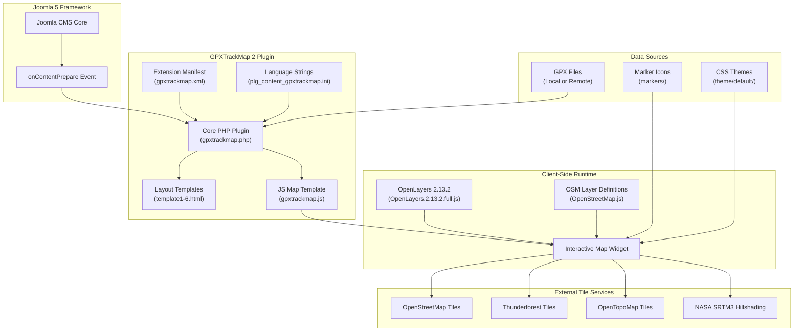

#### Core Technical Approach

The plugin employs a **server-side rendering pipeline with client-side map initialization** architecture:

1. **Event Interception**: The `PlgContentGPXTrackMap` class subscribes to Joomla's `onContentPrepare` event (`gpxtrackmap.php`, line 98), receiving article content before display.
2. **Shortcode Detection**: A regex pattern identifies `{gpxtrackmap}...{/gpxtrackmap}` tags within article HTML (`gpxtrackmap.php`, line 100).
3. **Parameter Resolution**: A three-tier merging strategy combines inline parameters, preset parameters, and admin defaults (`gpxtrackmap.php`, lines 668–744).
4. **GPX Processing**: PHP's SimpleXML parses the GPX file, extracting tracks, routes, and waypoints; geodesic calculations produce distance, elevation, and speed statistics (`gpxtrackmap.php`, lines 750–1093).
5. **Output Assembly**: HTML layout templates are populated with computed placeholders, JavaScript map initialization code is generated via token substitution, and SVG diagrams are rendered and cached.
6. **Client-Side Initialization**: The injected JavaScript creates `OpenLayers.Map` instances with a retry mechanism (polling every 100ms for DOM readiness), loads GPX vector layers, and attaches resize handlers with 200ms debounce.

### 1.2.3 Success Criteria

#### Measurable Objectives

| Objective | Metric | Target |
|---|---|---|
| Platform Compatibility | Joomla 5 / PHP 8+ operational verification | Full functional parity with V1.x features on the new platform |
| Feature Completeness | Statistical placeholders available in templates | 40+ metrics across distance, elevation, speed, and timing domains |
| Configurability | Admin-configurable parameters | 90+ parameters across 10 organized fieldsets |
| Multi-Instance Support | Concurrent maps per page | Unlimited (counter-based unique IDs: `map0`, `map1`, etc.) |

#### Critical Success Factors

- **Rendering Fidelity**: GPX tracks must render accurately on all 7 built-in map layers with correct geodesic distance calculations using the spherical law of cosines (Earth radius = 6,371.0 km), as implemented in `gpxtrackmap.php` (lines 750–1093).
- **Performance Efficiency**: SVG and ZIP file caching (configurable via the `cache` parameter) must prevent redundant regeneration of computed artifacts, as implemented in `gpxtrackmap.php` (lines 1409–1411, 1599–1600).
- **Shared Resource Loading**: JavaScript and CSS assets must be injected only once per page regardless of the number of maps present, as handled in `gpxtrackmap.php` (lines 137–161).
- **Backward-Compatible Syntax**: The `{gpxtrackmap}...{/gpxtrackmap}` shortcode syntax must remain unchanged from V1.x to ensure existing article content continues to function.

#### Key Performance Indicators

- **Map Load Reliability**: Successful map initialization via the retry mechanism (OpenLayers namespace + DOM element readiness checks at 100ms intervals) in `gpxtrackmap.js`.
- **Statistical Accuracy**: Correct computation of moving vs. paused time classification using the configurable moving speed threshold (default: 2 km/h).
- **Cross-Layer Compatibility**: Functional rendering across all 7 built-in tile layers plus up to 3 user-defined custom layers.

---

## 1.3 Scope

### 1.3.1 In-Scope: Core Features and Functionalities

#### Must-Have Capabilities

The following table enumerates the core capabilities included in GPXTrackMap 2, each grounded in the codebase evidence:

| Capability | Description | Source Reference |
|---|---|---|
| **Interactive Map Display** | OpenLayers 2.13.2-based map with 7 base layers, hill shading, and 10 map controls | `gpxtrackmap.php` lines 281–436 |
| **Track Rendering** | Customizable track color, width, opacity, and line style (6 styles) with start/end markers | `gpxtrackmap.xml` lines 43–80 |
| **GPX Parsing & Statistics** | SimpleXML-based parsing producing 40+ metrics in km, miles, nautical miles, m, ft, km/h, mph, knots | `gpxtrackmap.php` lines 750–1093 |
| **SVG Diagrams** | Elevation and speed profile SVGs with customizable appearance, fill modes, grids, and smoothing | `gpxtrackmap.php` lines 1388–1561 |
| **Waypoint Popups** | Interactive waypoints with hover/click popups, BBCode support, and custom symbol mapping | `gpxtrackmap.php` lines 806–1360 |
| **GPX Download** | Download links/buttons with optional ZIP compression | `gpxtrackmap.php` lines 614–633 |
| **Layout Templates** | 6 HTML templates with 40+ placeholder tokens and localized variant support | `template1.html` – `template6.html` |
| **Configuration System** | 90+ parameters in 10 fieldsets with named preset support | `gpxtrackmap.xml` lines 41–577 |

#### Primary User Workflows

The plugin supports three principal workflows, each corresponding to one of the identified stakeholder groups:

**Workflow 1 — Administrator Configuration**:
The Joomla site administrator accesses the plugin's configuration panel, which presents 10 organized fieldsets: GPX Track Settings, Map Controls, Map Layers, Waypoints, Track Information, Elevation Diagram, Speed Diagram, Markers, Download Settings, and Advanced Settings (including Presets and Templates). The administrator establishes global defaults and optionally defines named presets for frequently used parameter combinations (e.g., `minimap:mapwidth=200px,mapheight=200px`).

**Workflow 2 — Content Authoring**:
The content editor inserts a `{gpxtrackmap}track.gpx{/gpxtrackmap}` shortcode into an article body. The shortcode body may include the GPX file path along with optional comma-separated inline parameters (e.g., `track.gpx,mapwidth=600px,preset=hiking`) that override admin defaults for that specific map instance.

**Workflow 3 — End-User Interaction**:
Site visitors view the rendered article and interact with the embedded map widget — panning, zooming, switching map layers, entering fullscreen mode, viewing waypoint popups, examining elevation/speed diagrams, and optionally downloading the GPX file.

```mermaid
flowchart LR
    subgraph AdminWorkflow["Administrator Workflow"]
        A1["Configure Plugin<br/>Settings (90+ params)"]
        A2["Define Named<br/>Presets"]
        A3["Upload GPX Files<br/>to Server"]
    end

    subgraph EditorWorkflow["Content Editor Workflow"]
        E1["Create/Edit<br/>Joomla Article"]
        E2["Insert Shortcode<br/>{gpxtrackmap}...{/gpxtrackmap}"]
        E3["Specify Inline<br/>Parameters / Presets"]
    end

    subgraph VisitorWorkflow["Site Visitor Workflow"]
        V1["View Article<br/>with Embedded Map"]
        V2["Interact: Pan, Zoom,<br/>Layers, Fullscreen"]
        V3["View Statistics,<br/>Diagrams, Waypoints"]
        V4["Download GPX<br/>File (Optional)"]
    end

    A1 --> A2
    A2 --> A3
    A3 --> E1
    E1 --> E2
    E2 --> E3
    E3 --> V1
    V1 --> V2
    V2 --> V3
    V3 --> V4
```

#### Essential Integrations

| Integration Point | Technology | Purpose |
|---|---|---|
| **Joomla CMS Core** | `onContentPrepare` event hook | Article content interception and transformation |
| **OpenLayers 2.13.2** | Bundled JavaScript library | Client-side map rendering and interaction |
| **OpenStreetMap Tiles** | HTTP tile servers (`tile.openstreetmap.org`) | Default base map layer |
| **Thunderforest Tiles** | HTTP tile servers (API key required) | CycleMap, Transport, Landscape, Outdoors layers |
| **OpenTopoMap Tiles** | HTTP tile servers (`opentopomap.org`) | Topographic map layer for Europe |
| **NASA SRTM3 v2** | HTTP tile servers (`tiles.wmflabs.org`) | Hill shading overlay (single or double intensity) |

#### Key Technical Requirements

- **Server-Side**: PHP 8+ with SimpleXML extension, Joomla 5 runtime environment, write permissions in the GPX directory for SVG/ZIP cache files.
- **Client-Side**: Modern web browser with JavaScript enabled, network access to configured tile servers.
- **Data Format**: GPX 1.0 or 1.1 XML files containing `<trk>`, `<rte>`, and/or `<wpt>` elements.

### 1.3.2 Implementation Boundaries

#### System Boundaries

GPXTrackMap 2 operates exclusively within the Joomla content plugin lifecycle. Its processing boundary begins when Joomla dispatches the `onContentPrepare` event and ends when the transformed HTML (containing map widgets, statistics, and diagrams) is returned to the Joomla rendering pipeline. The plugin does not interact with Joomla's database layer, user management system, or access control mechanisms beyond inheriting the article-level permissions managed by Joomla core.

#### User Groups Covered

| User Group | Access Level | Capabilities |
|---|---|---|
| Super Administrators | Joomla admin backend | Full plugin configuration, preset management, template customization |
| Content Managers / Editors | Joomla article editor | Shortcode insertion with inline parameter overrides |
| Anonymous / Registered Visitors | Frontend article view | Map interaction, diagram viewing, GPX file download |

#### Data Domains Included

- **Geographic Track Data**: GPS coordinates (latitude, longitude, elevation), timestamps, track segments, routes
- **Waypoint Data**: Named points with coordinates, elevation, timestamps, descriptions, links, and symbol identifiers
- **Computed Statistics**: Distance (3 unit systems), elevation gain/loss, speed averages/maximums (3 unit systems), timing metrics
- **Configuration Data**: Plugin parameters stored in Joomla's extension configuration (no custom database tables)

### 1.3.3 Out-of-Scope

The following capabilities are explicitly excluded from GPXTrackMap 2:

| Excluded Capability | Rationale |
|---|---|
| **Database Interaction** | The plugin reads GPX files from the filesystem or remote URLs; no custom database tables are used |
| **User Authentication / Access Control** | Map visibility relies entirely on Joomla's native article-level permission system |
| **Real-Time Tracking / Live Location** | The plugin processes static GPX files only; no live GPS feed integration |
| **GPX File Editing / Creation** | The plugin is read-only; it visualizes existing GPX data but does not modify or create files |
| **3D Map Rendering** | All map visualization is 2D, using OpenLayers 2.x tile-based rendering |
| **Route Planning / Navigation** | No turn-by-turn directions, route calculation, or navigation functionality |
| **Native Mobile Application** | Browser-only rendering; no dedicated iOS/Android application |
| **OpenLayers 3+ / Alternative Libraries** | The plugin is built on OpenLayers 2.13.2 and does not support newer OpenLayers versions or alternative mapping libraries (Leaflet, Mapbox, etc.) |
| **Server-Side Tile Caching / Proxy** | Tile requests are made directly from the client browser to external tile servers |
| **Google Maps Layers** | Completely removed in V2.0.1 due to API changes and licensing requirements |
| **Defunct Third-Party Layers** | MeMoMaps Public Transport, Hike & Bike, and legacy MapQuest layers removed due to dead servers |

#### Future Phase Considerations

Based on the version history documented in `gpxtrackmap-release-notes.txt`, the plugin has followed an incremental feature expansion model. Potential future directions (not committed) may include migration to OpenLayers 3+ or alternative modern mapping libraries, Joomla 6 compatibility, and additional tile layer integrations as new providers become available.

---

## 1.4 Document Conventions and Version Information

### 1.4.1 Version History (Key Milestones)

The following table summarizes the most significant releases across the project's 13+ year history, as documented in `gpxtrackmap-release-notes.txt`:

| Version | Date | Milestone |
|---|---|---|
| V1.0.0 | 2012-12-12 | First stable release — basic map display with GPX track rendering |
| V1.1.0 | — | Layout templates, elevation diagram, and track statistics engine |
| V1.2.0 | — | Joomla 3 support, waypoint popups, moving speed threshold |
| V1.3.2 | 2014-12-22 | Thunderforest layers, OpenTopoMap, expanded layer catalog |
| V1.3.3 | 2014-12-30 | Fullscreen mode |
| V1.4.0 Beta | 2017-01-15 | HTTPS support via bundled OpenLayers/OSM libraries |
| V2.0.0 | 2026-03-06 | Complete rewrite for Joomla 5 + PHP 8+ |
| V2.0.1 | 2026-03-06 | Removal of defunct layers (Google, Hike&Bike, MapQuest, MeMoMaps) |

### 1.4.2 Repository Structure Overview

The plugin's repository follows a flat file structure characteristic of Joomla content plugins, with all primary source files at the root level and supporting assets organized in `markers/` and `theme/` subdirectories:

| Directory / File | Purpose |
|---|---|
| `gpxtrackmap.php` | Core plugin implementation (1,666 lines) |
| `gpxtrackmap.xml` | Joomla extension manifest with 90+ parameter definitions (579 lines) |
| `gpxtrackmap.js` | JavaScript map bootstrap template with server-side token substitution |
| `plg_content_gpxtrackmap.ini` | Language strings for frontend and backend (283 lines) |
| `OpenLayers.2.13.2.full.js` | Bundled OpenLayers library for HTTPS-compatible local serving |
| `OpenStreetMap.js` | OSM layer class definitions with Thunderforest API key support |
| `template1.html` – `template6.html` | 6 layout templates ranging from compact to comprehensive |
| `markers/` | Static icon assets for start/end markers and waypoint symbols |
| `theme/default/` | OpenLayers CSS theme (desktop, mobile, legacy IE6 variants) |

#### References

- `gpxtrackmap.php` — Core PHP plugin class (`PlgContentGPXTrackMap`); all server-side logic including event handling, GPX parsing, statistics computation, SVG generation, and output assembly (1,666 lines)
- `gpxtrackmap.xml` — Joomla extension manifest defining version metadata, file inventory, and 90+ configuration parameters across 10 fieldsets (579 lines)
- `gpxtrackmap.js` — JavaScript map initialization template with placeholder-based token substitution and retry mechanism
- `plg_content_gpxtrackmap.ini` — Single INI language file containing all 283 frontend and backend translation strings
- `gpxtrackmap-release-notes.txt` — Complete version history from V1.0.0 (2012) through V2.0.1 (2026)
- `LICENSE` — GNU General Public License v3 full text
- `template1.html` – `template6.html` — HTML layout templates with statistical placeholder tokens
- `fullscreencontrols_buttons.html` / `fullscreencontrols_navbar.html` — Fullscreen UI control variants
- `OpenLayers.2.13.2.full.js` — Bundled OpenLayers 2.13.2 full browser build
- `OpenStreetMap.js` — OSM layer constructors (Mapnik, CycleMap, TransportMap, Landscape, Outdoors, OpenTopoMap)
- `markers/` — Static marker and icon asset directory
- `theme/default/` — OpenLayers CSS theme files (8 files: 4 source + 4 minified variants)
- https://extensions.joomla.org/extension/gpxtrackmap/ — Joomla Extension Directory listing
- https://www.software.frankingermann.de/ — Original author's project homepage
- https://docs.joomla.org/plugin — Joomla plugin architecture documentation

# 2. Product Requirements

This section provides a complete, evidence-based catalog of GPXTrackMap 2's product features, their functional requirements, interdependencies, and implementation considerations. Each feature is derived from the codebase evidence documented in `gpxtrackmap.php` (1,666 lines), `gpxtrackmap.xml` (579 lines), `gpxtrackmap.js` (131 lines), and supporting template and asset files. All requirements are organized with unique identifiers to enable traceability from feature through implementation.

---

## 2.1 Feature Catalog

### 2.1.1 Feature Summary

GPXTrackMap 2 delivers eight discrete, testable feature areas that collectively enable end-to-end GPX track visualization within Joomla 5 articles. The following table provides a consolidated overview of all features.

| Feature ID | Feature Name | Category | Priority |
|---|---|---|---|
| F-001 | Interactive Map Display | Core Rendering | Critical |
| F-002 | Track Visualization | Core Rendering | Critical |
| F-003 | GPX Data Parsing & Statistics | Data Processing | Critical |
| F-004 | SVG Diagram Generation | Data Visualization | High |
| F-005 | Waypoint Support | Data Visualization | High |
| F-006 | GPX File Download | Content Delivery | Medium |
| F-007 | Template-Based Layout System | Presentation | High |
| F-008 | Extensible Configuration System | Administration | Critical |

All eight features have a status of **Completed** as of version 2.0.1, released 2026-03-06 per `gpxtrackmap-release-notes.txt`.

---

### 2.1.2 F-001: Interactive Map Display

#### Feature Metadata

| Attribute | Value |
|---|---|
| **Feature ID** | F-001 |
| **Feature Name** | Interactive Map Display |
| **Category** | Core Rendering |
| **Priority** | Critical |
| **Status** | Completed (V2.0.1) |

#### Description

**Overview:** Renders OpenLayers 2.13.2-based interactive map widgets within Joomla article content. The map container is generated server-side by `gpxtrackmap.php` (lines 275–436), with client-side initialization handled by `gpxtrackmap.js`. Each map instance is uniquely identified using a counter-based system (`map0`, `map1`, etc.) managed via `Factory::getApplication()->getUserState()`, enabling unlimited concurrent map widgets per page.

**Business Value:** Provides the foundational interactive geographic visualization that transforms static article content into engaging, explorable map experiences. Without this feature, no other visualization capability can function.

**User Benefits:** Site visitors can pan, zoom, switch between map tile layers, toggle fullscreen mode, and interact with an overview minimap — all within the article context without leaving the page.

**Technical Context:** The feature leverages the bundled `OpenLayers.2.13.2.full.js` library served locally for HTTPS compatibility, along with `OpenStreetMap.js` for tile layer definitions. Map projection uses EPSG:900913 (Spherical Mercator) with display projection EPSG:4326. The JavaScript initialization template (`gpxtrackmap.js`) employs a retry mechanism that polls every 100ms for both the OpenLayers namespace and DOM element readiness (lines 28–32), with a 200ms debounce on window resize events (lines 18–22).

**Tile Layer Support:**

| Layer ID | Layer Name | Tile Server |
|---|---|---|
| 0 (default) | OpenStreetMap Mapnik | `tile.openstreetmap.org` |
| 1 | OpenStreetMap CycleMap | Thunderforest (API key) |
| 2 | OpenStreetMap Mapnik DE | German tile server |
| 11 | Thunderforest Transport | Thunderforest (API key) |
| 12 | Thunderforest Landscape | Thunderforest (API key) |
| 13 | Thunderforest Outdoors | Thunderforest (API key) |
| 15 | OpenTopoMap EU | `opentopomap.org` |

Additionally, up to 3 custom map layers (values 8, 9, 10) can be loaded from external JavaScript files (`CustomMapLayer1.js`, `CustomMapLayer2.js`, `CustomMapLayer3.js`), and a hill shading overlay sourced from NASA SRTM3 v2 tiles is available in off, single, or double intensity modes (`gpxtrackmap.php`, lines 419–436).

**Map Controls (10 configurable):**

| Control | Parameter | Default |
|---|---|---|
| Navigation | `mapnav` | On |
| Mouse Wheel Zoom | `mapwheelzoom` | Off |
| Pan with PanZoomBar | `mappan` | Off |
| Zoom Buttons | `mapzoombtns` | On |
| Fullscreen Toggle | `mapfullscreen` | On |
| Scale Line (geodesic) | `mapscale` | On |
| Layer Switcher | `mapswitch` | On |
| Overview Map | `mapoverview` | Off |
| Mouse Position | `mapmousepos` | Off |
| Graticule | `mapgraticule` | Off |

#### Dependencies

| Dependency Type | Details |
|---|---|
| **System Dependencies** | Joomla 5 CMS (`onContentPrepare` event), PHP 8+ |
| **External Dependencies** | OpenLayers 2.13.2 (bundled), tile servers (OSM, Thunderforest, OpenTopoMap, NASA SRTM3) |
| **Client-Side** | JavaScript-enabled browser, network access to tile servers |
| **Integration** | Joomla `HtmlDocument` API for JS/CSS head injection; `Factory` for counter state management |

---

### 2.1.3 F-002: Track Visualization

#### Feature Metadata

| Attribute | Value |
|---|---|
| **Feature ID** | F-002 |
| **Feature Name** | Track Visualization |
| **Category** | Core Rendering |
| **Priority** | Critical |
| **Status** | Completed (V2.0.1) |

#### Description

**Overview:** Displays GPX track data as styled polyline overlays on the interactive map, with configurable appearance and automatic or manual zoom to track extent. The track rendering pipeline is defined in `gpxtrackmap.php` (lines 438–492), with appearance parameters declared in `gpxtrackmap.xml` (lines 43–80, 450–483).

**Business Value:** Converts raw GPS coordinate data into a visually compelling route visualization, making geographic journeys tangible and explorable for site visitors.

**User Benefits:** Visitors see a clearly rendered track on the map with start and end markers indicating the route's origin and destination. The track's visual style (color, width, line pattern) can be tuned per article by the content editor.

**Technical Context:** The GPX file is loaded as an `OpenLayers.Layer.GML` or `OpenLayers.Layer.Vector` layer. Track appearance is controlled by six parameters: `trackcolor` (default: "blue"), `trackwidth` (default: 6), `trackopacity` (default: 0.5), and `trackstyle` supporting 6 line dash patterns (solid, dots, dashes, dashdot, longdash, longdashdot). Auto-zoom uses `map.zoomToExtent(this.getDataExtent(), true)` with optional `zoomout` offset (-15 to +15) or fixed `zoomlevel` (1–20). GPX files are sourced from a configurable root directory (`gpxroot`, default: `/images/gpx`) or remote URLs (http/https) with space-to-`%20` encoding (`gpxtrackmap.php`, lines 186–203).

**Start/End Markers:**

| Parameter | Default | Description |
|---|---|---|
| `startmarker` | 3 (green) | Start point marker color |
| `endmarker` | 2 (red) | End point marker color |
| `markerset` | 1 | Icon set (1–4 available) |

Marker filenames follow the pattern `marker<set>-<color>.png` from the `markers/` directory, with 7 color options (none, blue, red, green, yellow, white, gray, black) and a fixed size of 21×25px.

#### Dependencies

| Dependency Type | Details |
|---|---|
| **Prerequisite Features** | F-001 (map container required) |
| **System Dependencies** | GPX file on local filesystem or accessible via HTTP/HTTPS |
| **External Dependencies** | None beyond F-001 tile servers |
| **Integration** | `markers/` asset directory for start/end icons |

---

### 2.1.4 F-003: GPX Data Parsing & Statistics

#### Feature Metadata

| Attribute | Value |
|---|---|
| **Feature ID** | F-003 |
| **Feature Name** | GPX Data Parsing & Statistics |
| **Category** | Data Processing |
| **Priority** | Critical |
| **Status** | Completed (V2.0.1) |

#### Description

**Overview:** Parses GPX XML files using PHP's `simplexml_load_file()` and computes 40+ statistical metrics across distance, elevation, speed, and timing domains. The complete parsing and computation engine resides in `gpxtrackmap.php` (lines 750–1093).

**Business Value:** Transforms raw GPS coordinate streams into meaningful, human-readable statistics (e.g., total distance, elevation gain, average speed), dramatically enriching article content without requiring manual data entry.

**User Benefits:** Visitors see professional-grade track statistics — distance in multiple unit systems, elevation profiles, average and maximum speeds, and detailed timing breakdowns — all computed automatically from the GPX data.

**Technical Context:** The parser iterates `<trk>` → `<trkseg>` → `<trkpt>` elements, extracting latitude, longitude, elevation, and timestamp for each trackpoint. Distance calculations use the spherical law of cosines with Earth radius = 6,371.0 km (`$r0 = 6371.0`, line 851). The formula `$c = $r0 * acos(min(1.0, cos($a)*cos($b) + sin($a)*sin($b)*cos($gamma)))` (line 864) computes great-circle distances between consecutive points. Unit conversions are applied: km→mi (÷1.609), km→nm (÷1.852), m→ft (÷0.3048). A moving speed threshold (`timovespeed`, default: 2 km/h, line 877) classifies segments as moving or paused for timing calculations. Signal smoothing via a moving average filter (`filterSignal` method, lines 1366–1382) is applied with configurable filter orders (`edfilterorder` and `spdfilterorder`, both default: 3).

**Statistical Placeholder Categories (40+):**

| Category | Placeholders |
|---|---|
| Distance | `%DISTANCE-KM%`, `%DISTANCE-MI%`, `%DISTANCE-NM%` |
| Elevation (m/ft) | `%ELE-UP-M%`, `%ELE-DOWN-M%`, `%ELE-MIN-M%`, `%ELE-MAX-M%`, `%ELE-DELTA-M%` (+ ft variants) |
| Time | `%STARTTIME%`, `%ENDTIME%`, `%DURATION%`, `%DURATIONMOVING%`, `%DURATIONPAUSED%` |
| Speed (avg/max) | `%AVGSPEED-KMH%`, `%AVGSPEED-MPH%`, `%AVGSPEED-KN%` (+ up/down/moving/max variants) |

**Time Handling:** ISO timestamps are parsed via the `getGPXTime` method (lines 1567–1584) using `substr()` extraction. PHP 8.1+ compatibility is ensured by replacing deprecated `strftime()` with custom `formatDateTime` and `formatDuration` methods (lines 1100–1132). The `titimeshift` parameter allows hour-based time zone adjustment, and `tidecimalsep` (default: ".") controls numeric formatting across all outputs (lines 1050–1068).

#### Dependencies

| Dependency Type | Details |
|---|---|
| **System Dependencies** | PHP 8+ with SimpleXML extension |
| **Data Dependencies** | GPX 1.0/1.1 XML files with `<trk>`, `<rte>`, or `<wpt>` elements |
| **Integration** | Outputs feed into F-004 (diagrams), F-005 (waypoints), and F-007 (templates) |

---

### 2.1.5 F-004: SVG Diagram Generation

#### Feature Metadata

| Attribute | Value |
|---|---|
| **Feature ID** | F-004 |
| **Feature Name** | SVG Diagram Generation |
| **Category** | Data Visualization |
| **Priority** | High |
| **Status** | Completed (V2.0.1) |

#### Description

**Overview:** Generates elevation profile and speed profile diagrams as scalable SVG 1.1 graphics. The rendering engine (`gpxtrackmap.php`, lines 1388–1561) produces 1000×500px viewport SVGs with a 10000×10000 viewBox and `preserveAspectRatio="none"`.

**Business Value:** Provides at-a-glance visual summaries of altitude changes and speed variations along a track, adding significant analytical depth to route presentations.

**User Benefits:** Visitors see clean, scalable vector graphics showing elevation or speed profiles with optional grid lines and color-coded fill areas (ascent in green, descent in red by default).

**Technical Context:** Each diagram is composed of SVG primitives: `<rect>` for background, `<polyline>` for the data curve, `<polygon>` for fill areas, `<line>` for grid lines, and `<text>` for axis labels. Two fill modes are available: delta mode (gradient-based up/down coloring) and absolute mode (height-based coloring). SVG files are cached alongside the GPX files when the `cache` parameter is enabled (default: on), with filenames `<gpxfilename>.svg` (elevation) and `<gpxfilename>_speed.svg` (speed). Cache validation is controlled at lines 1409–1411.

**Diagram Configuration:**

| Parameter Group | Elevation Diagram | Speed Diagram |
|---|---|---|
| Enable | `ed` (default: on) | `spd` (default: off) |
| Dimensions | `edwidth`/`edheight` | `spdwidth`/`spdheight` |
| Line | `edlinecolor`/`edlinewidth` | `spdlinecolor`/`spdlinewidth` |
| Fill Mode | `edfillmode` (0/1/2) | `spdfillmode` (0/1/2) |

#### Dependencies

| Dependency Type | Details |
|---|---|
| **Prerequisite Features** | F-003 (parsed distance, elevation, and speed arrays) |
| **System Dependencies** | Write permissions in GPX directory for SVG cache files |
| **Integration** | SVG referenced via `%ELEDIAGURL%` and `%SPDDIAGURL%` placeholders in F-007 templates |

---

### 2.1.6 F-005: Waypoint Support

#### Feature Metadata

| Attribute | Value |
|---|---|
| **Feature ID** | F-005 |
| **Feature Name** | Waypoint Support |
| **Category** | Data Visualization |
| **Priority** | High |
| **Status** | Completed (V2.0.1) |

#### Description

**Overview:** Renders GPX `<wpt>` elements as interactive point markers on the map, with configurable popups, BBCode-enabled descriptions, and custom symbol mapping. Implementation spans `gpxtrackmap.php` (lines 806–1360) with parameters declared in `gpxtrackmap.xml` (lines 181–246).

**Business Value:** Enables content editors to present points of interest, rest stops, landmarks, and other notable locations along a route, creating rich narrative geography within articles.

**User Benefits:** Visitors can explore waypoints on the map, view popup windows with descriptive text (including formatted content and images via BBCode), and see custom icons representing different waypoint types.

**Technical Context:** Waypoints are rendered either as `OpenLayers.Feature.Vector` circles (when symbols are disabled, controlled by `wpradius` default: 4, `wpcolor` default: blue) or as individual `OpenLayers.Icon` + `OpenLayers.Feature` markers (when `wpsymbols` is enabled). Popup modes include off (0), hover (1), and click-to-toggle (2). Popup dimensions are configurable via `wppopupwidth`/`wppopupheight` (default: 350×350).

**BBCode Support in Descriptions:**

| BBCode Tag | HTML Output |
|---|---|
| `[b]...[/b]` | `<strong>...</strong>` |
| `[i]...[/i]` | `<i>...</i>` |
| `[u]...[/u]` | `<u>...</u>` |
| `[url=...]...[/url]` | `<a href="..." target="_self">` |

Additional BBCode tags include `[br]`, `[code]`, `[quote]`, `[img]`, and numbered `[link1]` references to GPX `<link>` elements (lines 818–829).

**Custom Symbol Mapping:** The `wpsymbolmappings` parameter accepts a format of `symbol_name=icon_path,width,height[,offsetleft,offsettop]`, with wildcard `*` for default icons and pipe `|` for multiple symbols per mapping. The default mapping is `*=%PLUGINDIR%/markers/waypointmarker16.png,16,16`.

#### Dependencies

| Dependency Type | Details |
|---|---|
| **Prerequisite Features** | F-001 (map container), F-003 (GPX parsing for `<wpt>` extraction) |
| **System Dependencies** | Marker icon assets in `markers/` directory |
| **Integration** | Marker layer added to F-001 map instance; popup system renders within map viewport |

---

### 2.1.7 F-006: GPX File Download

#### Feature Metadata

| Attribute | Value |
|---|---|
| **Feature ID** | F-006 |
| **Feature Name** | GPX File Download |
| **Category** | Content Delivery |
| **Priority** | Medium |
| **Status** | Completed (V2.0.1) |

#### Description

**Overview:** Provides configurable download links or buttons for GPX source files, with optional ZIP compression. The download link generation resides in `gpxtrackmap.php` (lines 614–633) and the ZIP compression method (`ziptrackfile`) at lines 1586–1620, with parameters in `gpxtrackmap.xml` (lines 484–512).

**Business Value:** Enables visitors to take track data offline for use in their own GPS devices, fitness applications, or mapping tools — extending the content's utility beyond the website.

**User Benefits:** A single click downloads the GPX file (or a compressed ZIP variant), ready for import into navigation or fitness applications.

**Technical Context:** Two display modes are available: text link (`dltype=0`, using `<a>` with `type="application/gpx+xml"` and `download` attribute) and button (`dltype=1`, default, using `<button onclick="window.location.href=...">` in a styled `<div>`). The download text format is controlled by `dltext` (default: `"Download: %s"`, where `%s` is replaced with the filename). ZIP compression uses `Joomla\Archive\Archive` with the ZIP adapter, producing `<gpxfilename>.zip` in the same directory as the GPX file. ZIP files are cached when the `cache` parameter is enabled, and write permission is verified via the `isWritable` method before compression.

#### Dependencies

| Dependency Type | Details |
|---|---|
| **System Dependencies** | GPX file accessible on filesystem; write permissions for ZIP output |
| **External Dependencies** | `Joomla\Archive\Archive` API (ZIP adapter) |
| **Integration** | Output referenced via `%TRACKDOWNLOAD%` placeholder in F-007 templates |

---

### 2.1.8 F-007: Template-Based Layout System

#### Feature Metadata

| Attribute | Value |
|---|---|
| **Feature ID** | F-007 |
| **Feature Name** | Template-Based Layout System |
| **Category** | Presentation |
| **Priority** | High |
| **Status** | Completed (V2.0.1) |

#### Description

**Overview:** Provides 6 built-in HTML layout templates with a placeholder substitution engine that assembles the final article output from map widgets, diagrams, statistics, and download links. Template processing is handled in `gpxtrackmap.php` (lines 222–273), with template path configuration in `gpxtrackmap.xml` (lines 518–546).

**Business Value:** Decouples presentation from logic, enabling site administrators to customize output layouts without modifying plugin code. Content editors can select different templates per article instance.

**User Benefits:** Visitors receive a well-structured, visually organized presentation of map, statistics, diagrams, and downloads, with the layout chosen to best fit the article's context.

**Built-in Templates:**

| Template | Layout Description |
|---|---|
| Template 1 | Compact — download, map, distance+duration summary, elevation diagram |
| Template 2–5 | Intermediate layouts with varying metric combinations |
| Template 6 | Comprehensive — all statistics in 8 tables (distance, time, speed in 3 unit systems, elevation in 2 unit systems) |

**Template Resolution:** Template paths support three directory placeholders (`%PLUGINDIR%`, `%GPXDIR%`, `%TEMPLATEDIR%`) and attempt a localized variant lookup (`<dir>/<language_tag>/`) before falling back to the base directory. Non-numeric `tpl` values are treated as custom file paths. Up to 10 template slots (`tpl1`–`tpl10`) are available via the configuration manifest.

**Primary Layout Placeholders:**

| Placeholder | Source Feature |
|---|---|
| `%TRACKMAP%` | F-001 (map widget HTML + JavaScript) |
| `%TRACKDIAGRAM%` | F-004 (elevation SVG diagram) |
| `%SPEEDDIAGRAM%` | F-004 (speed SVG diagram) |
| `%TRACKDOWNLOAD%` | F-006 (download link/button) |

All 40+ statistical placeholders from F-003 are also available for substitution within any template.

#### Dependencies

| Dependency Type | Details |
|---|---|
| **Prerequisite Features** | F-001 through F-006 (all contribute placeholder data) |
| **System Dependencies** | Template HTML files accessible in plugin directory or custom paths |
| **Integration** | Placeholder substitution engine replaces tokens with output from all upstream features |

---

### 2.1.9 F-008: Extensible Configuration System

#### Feature Metadata

| Attribute | Value |
|---|---|
| **Feature ID** | F-008 |
| **Feature Name** | Extensible Configuration System |
| **Category** | Administration |
| **Priority** | Critical |
| **Status** | Completed (V2.0.1) |

#### Description

**Overview:** Exposes 90+ configurable parameters across 10 organized admin fieldsets, with a three-tier parameter merging strategy and a named preset system for reusable configurations. Configuration infrastructure is defined in `gpxtrackmap.xml` (lines 41–577) with runtime merging in `gpxtrackmap.php` (lines 668–744).

**Business Value:** Enables fine-grained customization of every aspect of the plugin's behavior without code modification, while the preset system reduces repetitive configuration for common use cases.

**User Benefits:** Administrators gain centralized control over plugin behavior; content editors can override settings per-article with minimal syntax; end users benefit from consistent, site-wide presentation standards.

**Configuration Fieldsets (10):**

| Fieldset | Purpose |
|---|---|
| GTM_SETTINGS | GPX root path, map dimensions, track appearance, zoom |
| GTM_MAPCONTROLS | 10 map control toggle parameters |
| GTM_MAPLAYERS | Base layer selection, layer set, hill shading |
| GTM_WAYPOINTS | Display, popups, symbols, BBCode settings |
| GTM_TRACKINFO | Statistics display, decimal separator, date/time formats |
| GTM_ELEDIA | Elevation diagram appearance and grid |
| GTM_SPDDIA | Speed diagram appearance and grid |
| GTM_MARKER | Start/end marker colors and icon sets |
| GTM_DOWNLOADSETTINGS | Download link/button and ZIP options |
| GTM_PRESETS | Named preset definitions |

**Three-Tier Parameter Merging** (`collectParams`, lines 668–692):

1. **Inline parameters** (highest priority) — from `{gpxtrackmap}file.gpx,param=value{/gpxtrackmap}`
2. **Preset parameters** — from named presets via `preset=name` or `ps=name`
3. **Admin defaults** (lowest priority) — from Joomla backend configuration

**Preset System** (`expandPresets`, lines 698–744): Presets use the format `presetname: param1=value1,param2=value2` and support chaining via dash notation (e.g., `preset=preset1-preset2`). Inline parameters always override preset values, and the system emits warnings on unknown presets or parameters when `showwarnings` is enabled.

#### Dependencies

| Dependency Type | Details |
|---|---|
| **System Dependencies** | Joomla 5 plugin parameter infrastructure |
| **Integration** | `collectParams()` feeds resolved parameters to all other features (F-001 through F-007) |

---

## 2.2 Functional Requirements

### 2.2.1 F-001: Interactive Map Display Requirements

#### Requirement Details

| Requirement ID | Description | Priority |
|---|---|---|
| F-001-RQ-001 | Render an OpenLayers 2.13.2 map in a uniquely identified DOM container within article content | Must-Have |
| F-001-RQ-002 | Support 7 built-in tile layers plus up to 3 custom layers loaded from external JS files | Must-Have |
| F-001-RQ-003 | Provide 10 independently toggleable map controls configurable via admin or inline parameters | Must-Have |
| F-001-RQ-004 | Support fullscreen mode with fixed-position overlay (z-index 1100) and background mask (z-index 1099) | Should-Have |
| F-001-RQ-005 | Support unlimited concurrent map instances per page via counter-based unique IDs | Must-Have |

#### F-001-RQ-001: Map Container Rendering

| Attribute | Specification |
|---|---|
| **Acceptance Criteria** | A `<div>` element with unique ID (`map0`, `map1`, etc.) is rendered; OpenLayers map initializes within the div using EPSG:900913 projection |
| **Complexity** | High |
| **Input Parameters** | `mapwidth` (default: 100%), `mapheight` (default: 400px) |
| **Output/Response** | Fully interactive map widget with configured tile layer |
| **Performance Criteria** | Map initializes via 100ms polling retry; JS/CSS injected only once per page (first article, `counterArticles === 0`) |
| **Data Validation** | Width/height accept CSS units; invalid dimensions fall back to defaults |
| **Security** | Tile URLs constructed from trusted server domains only; Thunderforest API key appended securely as query parameter |

#### F-001-RQ-002: Tile Layer Support

| Attribute | Specification |
|---|---|
| **Acceptance Criteria** | All 7 built-in layers render correctly; Thunderforest layers require valid `tfapikey`; custom layers load from `CustomMapLayer[1-3].js` |
| **Complexity** | Medium |
| **Input Parameters** | `maplayer` (0–15), `maplayers` (layer set), `tfapikey`, `hillshading` (off/single/double) |
| **Output/Response** | Selected base layer active; additional layers available via Layer Switcher; hill shading overlay when enabled |
| **Business Rules** | Thunderforest layers (1, 11, 12, 13) require API key; hill shading sourced from NASA SRTM3 v2 tiles |

#### F-001-RQ-003: Map Controls

| Attribute | Specification |
|---|---|
| **Acceptance Criteria** | Each of the 10 controls can be independently enabled/disabled; scale line renders geodesic distances (max 150px); graticule supports configurable intervals |
| **Complexity** | Medium |
| **Input Parameters** | `mapnav`, `mapwheelzoom`, `mappan`, `mapzoombtns`, `mapfullscreen`, `mapscale`, `mapswitch`, `mapoverview`, `mapmousepos`, `mapgraticule` |
| **Output/Response** | Only enabled controls appear on the map widget |

#### F-001-RQ-004: Fullscreen Mode

| Attribute | Specification |
|---|---|
| **Acceptance Criteria** | Fullscreen toggle expands map to fill viewport; two UI variants load based on PanZoomBar state (`fullscreencontrols_buttons.html` or `fullscreencontrols_navbar.html`) |
| **Complexity** | Medium |
| **Input Parameters** | `mapfullscreen` (on/off), `mappan` (determines UI variant) |
| **Output/Response** | `switch_map_fullscreen_%MAPVAR%` JavaScript function toggles fixed-position display |

#### F-001-RQ-005: Multi-Instance Support

| Attribute | Specification |
|---|---|
| **Acceptance Criteria** | Multiple `{gpxtrackmap}` shortcodes in a single article or across articles on the same page each produce independent, non-conflicting map instances |
| **Complexity** | High |
| **Input Parameters** | Automatic counter via `getCounter`/`setCounter` in Joomla user state |
| **Output/Response** | Unique DOM IDs (`map0`, `map1`, etc.) and separate JavaScript scopes per instance |
| **Performance Criteria** | OpenLayers library and CSS files injected into page head only once regardless of instance count |

---

### 2.2.2 F-002: Track Visualization Requirements

#### Requirement Details

| Requirement ID | Description | Priority |
|---|---|---|
| F-002-RQ-001 | Render GPX track as styled polyline overlay on the F-001 map container | Must-Have |
| F-002-RQ-002 | Support 6 line dash styles with configurable color, width, and opacity | Should-Have |
| F-002-RQ-003 | Auto-zoom map extent to fit track bounds, with configurable offset or fixed zoom level | Must-Have |
| F-002-RQ-004 | Display start and end markers with selectable colors and icon sets | Should-Have |
| F-002-RQ-005 | Accept GPX files from local filesystem or remote HTTP/HTTPS URLs | Must-Have |

#### F-002-RQ-001: Track Polyline Rendering

| Attribute | Specification |
|---|---|
| **Acceptance Criteria** | GPX `<trk>` data renders as a continuous polyline on the map; line is visible and follows GPS coordinates |
| **Complexity** | High |
| **Input Parameters** | GPX file path (first argument in shortcode body) |
| **Output/Response** | OpenLayers vector layer with styled polyline |

#### F-002-RQ-002: Track Styling

| Attribute | Specification |
|---|---|
| **Acceptance Criteria** | Track renders with specified color, width, opacity, and dash pattern; all 6 styles (solid=0, dots=1, dashes=2, dashdot=3, longdash=4, longdashdot=5) produce distinct visual patterns |
| **Complexity** | Low |
| **Input Parameters** | `trackcolor` (default: "blue"), `trackwidth` (default: 6), `trackopacity` (default: 0.5), `trackstyle` (0–5) |
| **Data Validation** | Color accepts named colors or hex values; width/opacity accept numeric values |

#### F-002-RQ-003: Zoom Behavior

| Attribute | Specification |
|---|---|
| **Acceptance Criteria** | When `zoomlevel=0`, map auto-zooms to track extent with optional `zoomout` offset; when `zoomlevel=1–20`, map uses fixed zoom level centered on track |
| **Complexity** | Medium |
| **Input Parameters** | `zoomlevel` (default: 13; 0=auto), `zoomout` (range: -15 to +15, default: 0) |

#### F-002-RQ-005: GPX File Source Resolution

| Attribute | Specification |
|---|---|
| **Acceptance Criteria** | Local files resolve relative to `gpxroot` directory (default: `/images/gpx`); URLs starting with `http://` or `https://` are used directly with space-to-%20 encoding |
| **Complexity** | Medium |
| **Input Parameters** | GPX file path or URL, `gpxroot` parameter |
| **Security** | Remote URLs are fetched directly by client browser; no server-side proxy; space encoding applied via `str_replace(' ', '%20', $gpx_path)` |

---

### 2.2.3 F-003: GPX Data Parsing & Statistics Requirements

#### Requirement Details

| Requirement ID | Description | Priority |
|---|---|---|
| F-003-RQ-001 | Parse GPX XML files and extract trackpoints with lat, lon, elevation, and timestamp | Must-Have |
| F-003-RQ-002 | Compute geodesic distances using spherical law of cosines with 3 unit systems (km, mi, nm) | Must-Have |
| F-003-RQ-003 | Calculate elevation statistics (gain, loss, min, max, delta) in meters and feet | Must-Have |
| F-003-RQ-004 | Compute speed metrics (average, max) across overall, uphill, downhill, and moving-only segments | Should-Have |
| F-003-RQ-005 | Calculate timing metrics with moving/paused classification based on configurable speed threshold | Should-Have |

#### F-003-RQ-001: GPX XML Parsing

| Attribute | Specification |
|---|---|
| **Acceptance Criteria** | `simplexml_load_file()` successfully parses GPX 1.0/1.1 files; all `<trk>` → `<trkseg>` → `<trkpt>` hierarchies traversed; waypoints extracted from `<wpt>` elements |
| **Complexity** | High |
| **Input Parameters** | GPX file path (local or remote URL) |
| **Output/Response** | Populated arrays of coordinates, elevations, timestamps, and waypoint data |
| **Data Validation** | Timezone forced to UTC (`date_default_timezone_set('UTC')`); ISO timestamps parsed via `getGPXTime` (lines 1567–1584) |

#### F-003-RQ-002: Distance Calculation

| Attribute | Specification |
|---|---|
| **Acceptance Criteria** | Cumulative distance matches expected values for known GPS tracks; spherical law of cosines formula produces accurate great-circle distances |
| **Complexity** | Medium |
| **Input Parameters** | Sequential latitude/longitude pairs from trackpoints |
| **Output/Response** | `%DISTANCE-KM%`, `%DISTANCE-MI%`, `%DISTANCE-NM%` placeholders populated |
| **Business Rules** | Earth radius = 6,371.0 km; clamping via `min(1.0, ...)` prevents `acos()` domain errors; unit conversions: mi=km÷1.609, nm=km÷1.852 |

#### F-003-RQ-005: Timing Classification

| Attribute | Specification |
|---|---|
| **Acceptance Criteria** | Segments below `timovespeed` threshold are classified as paused; total duration = moving + paused; all timing placeholders populated correctly |
| **Complexity** | Medium |
| **Input Parameters** | `timovespeed` (default: 2 km/h), `titimeshift` (hours offset) |
| **Output/Response** | `%DURATION%`, `%DURATIONMOVING%`, `%DURATIONPAUSED%`, `%STARTTIME%`, `%ENDTIME%` |
| **Data Validation** | Custom date format: `tidatefmt` (default: `%Y-%m-%d %H:%M:%S`); decimal separator: `tidecimalsep` (default: ".") |

---

### 2.2.4 F-004: SVG Diagram Generation Requirements

#### Requirement Details

| Requirement ID | Description | Priority |
|---|---|---|
| F-004-RQ-001 | Generate SVG 1.1 elevation profile from parsed trackpoint data | Must-Have |
| F-004-RQ-002 | Generate SVG 1.1 speed profile from computed speed data | Should-Have |
| F-004-RQ-003 | Support configurable fill modes (none, delta gradient, absolute height) | Should-Have |
| F-004-RQ-004 | Cache generated SVG files alongside GPX files to prevent redundant regeneration | Must-Have |

#### F-004-RQ-001: Elevation Profile SVG

| Attribute | Specification |
|---|---|
| **Acceptance Criteria** | SVG renders as 1000×500px viewport with 10000×10000 viewBox; data polyline accurately represents elevation changes along the track |
| **Complexity** | High |
| **Input Parameters** | Parsed elevation/distance arrays from F-003; `edwidth` (default: 100%), `edheight` (default: 200px), `edlinecolor` (default: black), `edlinewidth` (default: 2) |
| **Output/Response** | SVG file saved as `<gpxfilename>.svg`; `%ELEDIAGURL%` placeholder populated |
| **Performance Criteria** | Signal smoothing applied via `filterSignal` with order `edfilterorder` (default: 3) |

#### F-004-RQ-004: SVG Caching

| Attribute | Specification |
|---|---|
| **Acceptance Criteria** | When `cache=on`, existing SVG files are served without regeneration; cache bypassed when `cache=off` |
| **Complexity** | Low |
| **Input Parameters** | `cache` parameter (default: on) |
| **Business Rules** | Cache files stored in same directory as GPX source file; write permission required |

---

### 2.2.5 F-005: Waypoint Support Requirements

#### Requirement Details

| Requirement ID | Description | Priority |
|---|---|---|
| F-005-RQ-001 | Render GPX `<wpt>` elements as point markers on the map | Must-Have |
| F-005-RQ-002 | Display interactive popups with name, description, elevation, and timestamp | Should-Have |
| F-005-RQ-003 | Parse BBCode formatting in waypoint descriptions | Could-Have |
| F-005-RQ-004 | Support custom symbol mapping via `<sym>` tag values | Could-Have |

#### F-005-RQ-001: Waypoint Rendering

| Attribute | Specification |
|---|---|
| **Acceptance Criteria** | All `<wpt>` elements in the GPX file appear as point markers at correct geographic positions; markers styled with `wpcolor` (default: blue) and `wpradius` (default: 4) |
| **Complexity** | Medium |
| **Input Parameters** | `wpshow` (default: off), `wpcolor`, `wpradius` |
| **Output/Response** | Circle vectors or icon markers added to map's waypoint layer |

#### F-005-RQ-002: Popup Interaction

| Attribute | Specification |
|---|---|
| **Acceptance Criteria** | Hover mode (1) shows popup on mouseover/hides on mouseout; click mode (2) toggles popup visibility on click; popup dimensions match `wppopupwidth`/`wppopupheight` |
| **Complexity** | Medium |
| **Input Parameters** | `wppopups` (0/1/2), `wppopupwidth` (default: 350), `wppopupheight` (default: 350), `wppopupele` (off/m/ft), `wppopupdesc` (default: on) |

#### F-005-RQ-004: Custom Symbol Mapping

| Attribute | Specification |
|---|---|
| **Acceptance Criteria** | When `wpsymbols=on`, waypoint `<sym>` values are matched against `wpsymbolmappings` entries; matched symbols render with specified icon, size, and offset; unmatched symbols use wildcard `*` default |
| **Complexity** | High |
| **Input Parameters** | `wpsymbols` (default: off), `wpsymbolmappings` (format: `symbol_name=icon_path,width,height[,offsetleft,offsettop]`) |

---

### 2.2.6 F-006: GPX File Download Requirements

#### Requirement Details

| Requirement ID | Description | Priority |
|---|---|---|
| F-006-RQ-001 | Generate a download link or button for the source GPX file | Must-Have |
| F-006-RQ-002 | Support optional ZIP compression of GPX files | Could-Have |
| F-006-RQ-003 | Apply configurable CSS class and inline styles to download element | Could-Have |

#### F-006-RQ-001: Download Link Generation

| Attribute | Specification |
|---|---|
| **Acceptance Criteria** | Text mode produces `<a>` tag with `type="application/gpx+xml"` and `download` attribute; button mode produces `<button>` with `onclick` redirect; `%s` in `dltext` replaced with filename |
| **Complexity** | Low |
| **Input Parameters** | `dl` (default: on), `dltext` (default: "Download: %s"), `dltype` (0=text, 1=button), `dlclass` (default: "gpxtracklink"), `dlstyle` |

#### F-006-RQ-002: ZIP Compression

| Attribute | Specification |
|---|---|
| **Acceptance Criteria** | When `dlzip=on`, GPX file is compressed to `<gpxfilename>.zip` using `Joomla\Archive\Archive` ZIP adapter; cached ZIP served when available and `cache=on` |
| **Complexity** | Medium |
| **Input Parameters** | `dlzip` (default: off), `cache` (default: on) |
| **Business Rules** | Write permission verified via `isWritable` before ZIP creation; ZIP stored in same directory as GPX file |

---

### 2.2.7 F-007: Template-Based Layout System Requirements

#### Requirement Details

| Requirement ID | Description | Priority |
|---|---|---|
| F-007-RQ-001 | Load and render one of 6 built-in HTML templates or a custom template file | Must-Have |
| F-007-RQ-002 | Substitute all layout and statistical placeholders in the template with computed values | Must-Have |
| F-007-RQ-003 | Support localized template variants via language tag directory lookup | Could-Have |

#### F-007-RQ-001: Template Loading

| Attribute | Specification |
|---|---|
| **Acceptance Criteria** | Numeric `tpl` values (1–6) load corresponding `template<N>.html` from plugin directory; non-numeric values treated as custom file paths; directory placeholders (`%PLUGINDIR%`, `%GPXDIR%`, `%TEMPLATEDIR%`) resolved |
| **Complexity** | Medium |
| **Input Parameters** | `tpldefault` (admin default), `tpl` (inline override), `tpl1`–`tpl10` (template slot paths) |

#### F-007-RQ-002: Placeholder Substitution

| Attribute | Specification |
|---|---|
| **Acceptance Criteria** | All 4 primary layout placeholders and 40+ statistical placeholders are replaced with correct computed values; unreplaced placeholders produce no visible output artifacts |
| **Complexity** | High |
| **Input Parameters** | Template HTML string, computed values from F-001 through F-006 |
| **Output/Response** | Final HTML fragment inserted into article content |

---

### 2.2.8 F-008: Extensible Configuration System Requirements

#### Requirement Details

| Requirement ID | Description | Priority |
|---|---|---|
| F-008-RQ-001 | Merge parameters from inline, preset, and admin tiers with correct precedence | Must-Have |
| F-008-RQ-002 | Support named preset definitions with chained preset notation | Should-Have |
| F-008-RQ-003 | Expose 90+ parameters across 10 organized fieldsets in Joomla admin panel | Must-Have |
| F-008-RQ-004 | Emit warnings for unknown presets or unrecognized parameters when warnings are enabled | Should-Have |

#### F-008-RQ-001: Parameter Merging

| Attribute | Specification |
|---|---|
| **Acceptance Criteria** | Inline parameters override preset parameters; preset parameters override admin defaults; empty inline values do not override lower-tier values |
| **Complexity** | High |
| **Input Parameters** | Shortcode body (inline), `preset`/`ps` parameter (preset name), Joomla extension params (admin) |
| **Output/Response** | Fully resolved parameter set passed to all feature modules |

#### F-008-RQ-002: Preset System

| Attribute | Specification |
|---|---|
| **Acceptance Criteria** | Presets defined as `presetname: param1=value1,param2=value2` are correctly expanded; chained presets (e.g., `preset=a-b`) apply both preset `a` and preset `b`; inline params always win over preset params |
| **Complexity** | Medium |
| **Input Parameters** | Preset definitions from GTM_PRESETS fieldset, `preset`/`ps` inline parameter |
| **Business Rules** | Warning emitted on unknown preset name; warning emitted on unrecognized parameter name (when `showwarnings=on`) |

---

## 2.3 Feature Relationships

### 2.3.1 Feature Dependencies Map

The following diagram illustrates the directed dependency relationships between all eight features. An arrow from Feature A to Feature B indicates that Feature B requires Feature A's output to function.

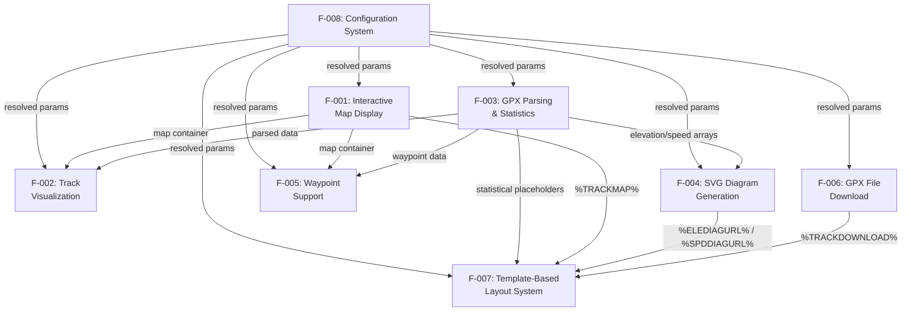

### 2.3.2 Integration Points

GPXTrackMap 2 interfaces with external systems at well-defined integration boundaries:

| Integration Point | Direction | Protocol | Features Affected |
|---|---|---|---|
| Joomla `onContentPrepare` Event | Inbound | PHP event dispatch | All (F-001–F-008) |
| Joomla `HtmlDocument` API | Outbound | PHP method calls | F-001 (JS/CSS injection) |
| Joomla `Archive` API | Outbound | PHP method calls | F-006 (ZIP compression) |
| Joomla `UserState` API | Internal | PHP state management | F-001 (counter system) |

**External Tile Services (Client-Side):**

| Service | URL Pattern | Features |
|---|---|---|
| OpenStreetMap | `tile.openstreetmap.org` | F-001 |
| Thunderforest | `tile.thunderforest.com` | F-001 (requires API key) |
| OpenTopoMap | `opentopomap.org` | F-001 |
| NASA SRTM3 Hillshading | `tiles.wmflabs.org/hillshading/` | F-001 |

### 2.3.3 Shared Components and Common Services

Several components are shared across multiple features, creating important coupling points:

| Shared Component | Used By | Purpose |
|---|---|---|
| GPX file path resolution | F-002, F-003, F-004, F-006 | Resolves local or remote GPX file location |
| `collectParams()` method | F-001–F-007 | Provides resolved parameters from three-tier merge |
| SVG/ZIP cache system | F-004, F-006 | Prevents redundant file generation |
| `markers/` asset directory | F-002, F-005 | Provides icon resources for track markers and waypoints |
| Counter state management | F-001 (all instances) | Ensures unique DOM IDs across multiple map widgets |
| Placeholder substitution engine | F-003, F-007 | Maps computed tokens to template positions |
| Language strings (`plg_content_gpxtrackmap.ini`) | F-001–F-008 | 283 localized strings for labels and messages |

---

## 2.4 Implementation Considerations

### 2.4.1 Technical Constraints

| Constraint | Impact | Affected Features |
|---|---|---|
| OpenLayers 2.13.2 locked version | No access to modern OL3+ features; 2D only | F-001, F-002, F-005 |
| PHP SimpleXML required | Server must have SimpleXML extension enabled | F-003 |
| No database interaction | All config in Joomla extension params; no custom tables | F-008 |
| Client-side tile fetching | No server-side tile caching or proxy capability | F-001 |
| GPX 1.0/1.1 format only | Other GPS formats (KML, FIT, TCX) not supported | F-003 |

### 2.4.2 Performance Requirements

| Requirement | Specification | Feature |
|---|---|---|
| JS/CSS single injection | Library files injected once per page (`counterArticles === 0`) | F-001 |
| Map initialization retry | 100ms polling for OpenLayers + DOM readiness | F-001 |
| Resize debounce | 200ms delay on window resize events | F-001 |
| SVG cache | Generated SVGs cached alongside GPX files when `cache=on` | F-004 |
| ZIP cache | Compressed files cached to avoid repeated compression | F-006 |
| Signal smoothing | Moving average filter reduces noise in elevation/speed data | F-003, F-004 |

### 2.4.3 Scalability Considerations

| Consideration | Details |
|---|---|
| **Multi-instance per page** | Counter-based unique ID system (`map0`, `map1`, etc.) scales to unlimited concurrent maps; each map maintains independent state |
| **Large GPX files** | All trackpoints are iterated in PHP memory; very large files (100k+ points) may impact server-side processing time and memory usage |
| **Concurrent page requests** | SVG/ZIP caching reduces per-request computation; cached files served without re-parsing |
| **Template flexibility** | Up to 10 template slots and custom file paths allow site-specific layouts without modifying plugin code |

### 2.4.4 Security Implications

| Area | Risk | Mitigation |
|---|---|---|
| **GPX file paths** | Path traversal via inline parameters | File path resolved relative to `gpxroot`; Joomla `Path` API used for validation |
| **Remote GPX URLs** | Loading from untrusted external sources | URL validation limited to http/https prefix check (`gpxtrackmap.php`, lines 186–203) |
| **BBCode parsing** | XSS via waypoint descriptions | BBCode whitelist approach (only 8 tags parsed); no raw HTML pass-through (`gpxtrackmap.php`, lines 818–829) |
| **Thunderforest API key** | Key exposure in client-side tile URLs | API key appended as query parameter (`?apikey=`); visible in browser network tab |
| **File write operations** | SVG/ZIP cache writes to filesystem | Write permission checked via `isWritable` before any write operation |
| **Image load errors** | Broken marker/icon references | Fallback to `markers/404.png` on image load error (`gpxtrackmap.js`, line 76) |

### 2.4.5 Maintenance Requirements

| Area | Requirement |
|---|---|
| **Tile server availability** | Monitor external tile server uptime; defunct servers require layer removal (as done in V2.0.1 for Google Maps, MeMoMaps, Hike & Bike, MapQuest) |
| **PHP version compatibility** | PHP 8.1+ required; `strftime()` replaced with custom formatting methods for forward compatibility |
| **Joomla platform updates** | Plugin extends `CMSPlugin`; Joomla 5 API changes require periodic validation |
| **OpenLayers library** | Bundled at 2.13.2 (final OL2 release); no upstream security patches available |
| **Language file updates** | 283 strings in single INI file; additions require corresponding entries in `plg_content_gpxtrackmap.ini` |
| **SVG/ZIP cache invalidation** | Cached files persist indefinitely; manual deletion required when GPX source data changes and cache is enabled |

---

## 2.5 Requirements Traceability Matrix

The following matrix maps each functional requirement to its parent feature, priority level, source file evidence, and verification method.

| Requirement ID | Feature | Priority | Source Evidence |
|---|---|---|---|
| F-001-RQ-001 | F-001: Map Display | Must-Have | `gpxtrackmap.php` L275–436, `gpxtrackmap.js` L1–131 |
| F-001-RQ-002 | F-001: Map Display | Must-Have | `gpxtrackmap.php` L419–436, `OpenStreetMap.js` |
| F-001-RQ-003 | F-001: Map Display | Must-Have | `gpxtrackmap.xml` L82–180 |
| F-001-RQ-004 | F-001: Map Display | Should-Have | `gpxtrackmap.js` L90–128, `fullscreencontrols_buttons.html` |
| F-001-RQ-005 | F-001: Map Display | Must-Have | `gpxtrackmap.php` L137–161 |
| F-002-RQ-001 | F-002: Track Viz | Must-Have | `gpxtrackmap.php` L438–492 |
| F-002-RQ-002 | F-002: Track Viz | Should-Have | `gpxtrackmap.xml` L43–80 |
| F-002-RQ-003 | F-002: Track Viz | Must-Have | `gpxtrackmap.xml` L450–483 |
| F-002-RQ-004 | F-002: Track Viz | Should-Have | `gpxtrackmap.xml` L450–483, `markers/` |
| F-002-RQ-005 | F-002: Track Viz | Must-Have | `gpxtrackmap.php` L186–203 |
| F-003-RQ-001 | F-003: Parsing | Must-Have | `gpxtrackmap.php` L750–848 |
| F-003-RQ-002 | F-003: Parsing | Must-Have | `gpxtrackmap.php` L851–864 |
| F-003-RQ-003 | F-003: Parsing | Must-Have | `gpxtrackmap.php` L750–1093 |
| F-003-RQ-004 | F-003: Parsing | Should-Have | `gpxtrackmap.php` L877–1050 |
| F-003-RQ-005 | F-003: Parsing | Should-Have | `gpxtrackmap.php` L877, L1567–1584 |
| F-004-RQ-001 | F-004: SVG Diagrams | Must-Have | `gpxtrackmap.php` L1388–1561 |
| F-004-RQ-002 | F-004: SVG Diagrams | Should-Have | `gpxtrackmap.php` L1388–1561 |
| F-004-RQ-003 | F-004: SVG Diagrams | Should-Have | `gpxtrackmap.php` L1388–1561 |
| F-004-RQ-004 | F-004: SVG Diagrams | Must-Have | `gpxtrackmap.php` L1409–1411 |
| F-005-RQ-001 | F-005: Waypoints | Must-Have | `gpxtrackmap.php` L806–1360 |
| F-005-RQ-002 | F-005: Waypoints | Should-Have | `gpxtrackmap.xml` L181–246 |
| F-005-RQ-003 | F-005: Waypoints | Could-Have | `gpxtrackmap.php` L818–829 |
| F-005-RQ-004 | F-005: Waypoints | Could-Have | `gpxtrackmap.php` L806–1360 |
| F-006-RQ-001 | F-006: Download | Must-Have | `gpxtrackmap.php` L614–633 |
| F-006-RQ-002 | F-006: Download | Could-Have | `gpxtrackmap.php` L1586–1620 |
| F-006-RQ-003 | F-006: Download | Could-Have | `gpxtrackmap.xml` L484–512 |
| F-007-RQ-001 | F-007: Templates | Must-Have | `gpxtrackmap.php` L222–273, `template1.html`–`template6.html` |
| F-007-RQ-002 | F-007: Templates | Must-Have | `gpxtrackmap.php` L222–273 |
| F-007-RQ-003 | F-007: Templates | Could-Have | `gpxtrackmap.php` L222–273 |
| F-008-RQ-001 | F-008: Config | Must-Have | `gpxtrackmap.php` L668–692 |
| F-008-RQ-002 | F-008: Config | Should-Have | `gpxtrackmap.php` L698–744 |
| F-008-RQ-003 | F-008: Config | Must-Have | `gpxtrackmap.xml` L41–577 |
| F-008-RQ-004 | F-008: Config | Should-Have | `gpxtrackmap.php` L698–744 |

**Priority Distribution Summary:**

| Priority | Count | Percentage |
|---|---|---|
| Must-Have | 19 | 56% |
| Should-Have | 11 | 32% |
| Could-Have | 4 | 12% |

---

## 2.6 Assumptions and Constraints

| ID | Type | Statement |
|---|---|---|
| A-001 | Assumption | The Joomla 5 hosting environment has PHP 8+ with the SimpleXML extension enabled |
| A-002 | Assumption | The web server has write permissions in the GPX file directory for SVG and ZIP cache files |
| A-003 | Assumption | External tile servers (OSM, Thunderforest, OpenTopoMap, NASA SRTM3) maintain current URL structures and availability |
| A-004 | Assumption | Site visitors have JavaScript enabled in their browsers |
| C-001 | Constraint | All map rendering is 2D; no 3D terrain or globe views are supported |
| C-002 | Constraint | Only GPX format is accepted; no KML, FIT, TCX, or other GPS formats |
| C-003 | Constraint | The plugin does not create or modify GPX files (read-only visualization) |
| C-004 | Constraint | No database tables are used; all configuration persists in Joomla extension params |
| C-005 | Constraint | OpenLayers 2.13.2 is the fixed mapping library version; no migration path to OL3+ is provided |

---

## 2.7 References

#### Source Files Examined

- `gpxtrackmap.php` (1,666 lines) — Core plugin class containing event handling, GPX parsing, statistics computation, SVG generation, ZIP compression, waypoint processing, template rendering, and parameter merging logic
- `gpxtrackmap.xml` (579 lines) — Joomla extension manifest defining 90+ configuration parameters across 10 fieldsets, file inventory, and version metadata
- `gpxtrackmap.js` (131 lines) — JavaScript map initialization template with OpenLayers bootstrap, retry mechanism, fullscreen toggle, and resize handling
- `plg_content_gpxtrackmap.ini` — Language file containing 283 frontend and backend translation strings
- `template1.html` — Compact layout template with download, map, summary, and elevation diagram
- `template6.html` — Comprehensive layout template with all statistical metrics across 8 tables
- `fullscreencontrols_buttons.html` — Fullscreen UI control variant with grow/shrink buttons
- `fullscreencontrols_navbar.html` — Fullscreen UI control variant with PanZoomBar navigation
- `gpxtrackmap-release-notes.txt` — Release history documenting V1.0.0 through V2.0.1
- `OpenLayers.2.13.2.full.js` — Bundled OpenLayers 2.13.2 mapping library
- `OpenStreetMap.js` — OSM layer class definitions with Thunderforest API key support
- `markers/` — Static icon assets for start/end markers and waypoint symbols
- `theme/default/` — OpenLayers CSS theme directory with desktop, mobile, and legacy variants

#### Technical Specification Cross-References

- Section 1.1 — Executive Summary: Project overview and value proposition
- Section 1.2 — System Overview: Architecture, capabilities, and success criteria
- Section 1.3 — Scope: In-scope features, boundaries, and out-of-scope items
- Section 1.4 — Document Conventions: Version history and repository structure

#### External References

- Joomla Content Plugin Events Documentation — `onContentPrepare` event specification
- OpenLayers 2 Controls Documentation — Map control classes and interaction patterns

# 3. Technology Stack

GPXTrackMap 2 is a self-contained Joomla CMS content plugin — not a modern multi-tier web application with separate frontend, backend, and infrastructure layers. Consequently, its technology stack diverges fundamentally from the default stack template (React, Flask, Docker, AWS, MongoDB, etc.), none of which are applicable to this system. The actual stack is a focused composition of PHP server-side logic, vanilla JavaScript client-side rendering via a bundled mapping library, and external tile services — all operating within the Joomla 5 CMS platform with zero external package dependencies or build tooling.

This section documents every technology component in the GPXTrackMap 2 stack, grounded exclusively in evidence from the codebase and extension manifest, with justifications for each selection and notes on security, compatibility, and integration requirements.

## 3.1 Stack Overview

### 3.1.1 Architectural Context

GPXTrackMap 2 employs a **server-side rendering pipeline with client-side map initialization** architecture, as defined in `gpxtrackmap.php` (1,666 lines) and the supporting JavaScript template `gpxtrackmap.js` (131 lines). The plugin intercepts Joomla's `onContentPrepare` event, processes GPX data server-side in PHP, assembles HTML output with injected JavaScript, and delegates interactive map rendering to the browser via the bundled OpenLayers 2.13.2 library. This architecture dictates a compact, two-tier technology stack — server-side PHP within Joomla, and client-side vanilla JavaScript — with no intermediate API layer, database backend, or build pipeline.

The technology stack is organized into five logical layers:

| Layer | Technologies | Execution Context |
|---|---|---|
| **Platform** | Joomla 5 CMS, PHP 8+ Runtime | Web Server |
| **Server-Side Logic** | PHP 8+ (core plugin), SimpleXML, SVG 1.1 generation | Web Server |
| **Client-Side Rendering** | OpenLayers 2.13.2, OpenStreetMap.js, gpxtrackmap.js | Browser |
| **External Services** | OpenStreetMap, Thunderforest, OpenTopoMap, NASA SRTM3 tile servers | Remote HTTP |
| **Data & Storage** | GPX XML files, SVG/ZIP file cache, Joomla extension parameters, INI language files | File System |

### 3.1.2 Technology Layer Diagram

The following diagram illustrates the technology stack layers and their integration relationships, from the platform foundation through external service consumption:

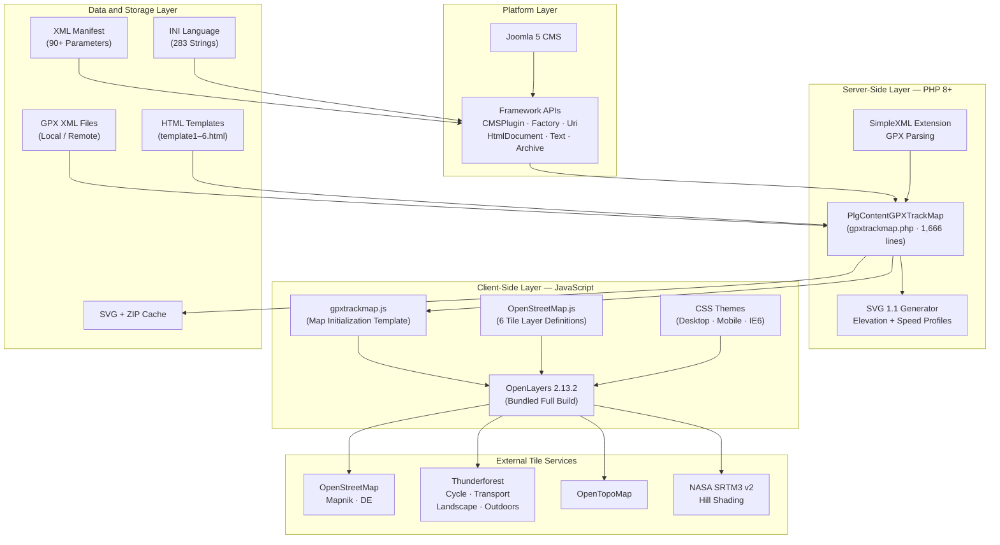

### 3.1.3 Stack Selection Rationale

The technology stack is entirely determined by the project's nature as a **Joomla content plugin**. The following overarching selection criteria govern all technology choices:

| Criterion | Rationale |
|---|---|
| **Joomla 5 Compatibility** | The plugin must operate within Joomla 5's content plugin lifecycle, requiring PHP 8+ and the `CMSPlugin` base class (`gpxtrackmap.php`, lines 27–34) |
| **Self-Containment** | All client-side dependencies are bundled locally to ensure HTTPS compatibility and eliminate external CDN reliance, as established in V1.4.0 Beta (`gpxtrackmap-release-notes.txt`) |
| **Zero External Dependencies** | No package manager, no build system, and no runtime dependency fetching — the plugin distribution ZIP is complete and self-sufficient |
| **Legacy Stability** | OpenLayers 2.13.2 is locked at its final release (constraint C-005 per Section 2.6), prioritizing proven stability over modern features |
| **Minimal Server Requirements** | Only PHP 8+ with the SimpleXML extension is required beyond a standard Joomla 5 installation (assumption A-001 per Section 2.6) |

---

## 3.2 Programming Languages

### 3.2.1 PHP 8+ — Primary Server-Side Language

#### Selection and Justification

PHP 8+ serves as the sole server-side programming language, mandated by the Joomla 5 CMS platform requirement. The entire server-side logic resides in a single monolithic file, `gpxtrackmap.php` (1,666 lines), implementing the `PlgContentGPXTrackMap` class that extends `Joomla\CMS\Plugin\CMSPlugin`.

| Attribute | Detail |
|---|---|
| **Language** | PHP |
| **Minimum Version** | 8.0 |
| **Recommended Version** | 8.1+ |
| **Source File** | `gpxtrackmap.php` (1,666 lines) |
| **Class** | `PlgContentGPXTrackMap` |

#### PHP 8+ Feature Utilization

The codebase actively leverages PHP 8+ language features, confirming the minimum version requirement declared in the file header (`@version 2.0.1 - Modernized for Joomla 5 + PHP 8+`, line 8):

| PHP 8+ Feature | Usage Location | Purpose |
|---|---|---|
| `match` expressions | Lines 229, 378, 1446, 1535 | Template resolution, map layer selection, unit conversions (km↔mi↔nm, m↔ft) |
| Union type declarations | Lines 1390, 1590 | `float\|string` parameter typing, `string\|false` return types |
| Typed properties | Class properties | `protected array $_params`, `protected string $_absolute_path` |
| `str_starts_with()` | Line 186 | URL prefix validation (`http://`, `https://`) for remote GPX files |
| Named parameters | Various | Improved readability in method invocations |

#### PHP 8.1+ Compatibility

PHP 8.1 deprecated the `strftime()` function, which the V1.x series relied upon for date/time formatting. The V2.0.x rewrite addresses this with custom replacement methods — `formatDateTime` and `formatDuration` — as documented in Section 2.4.5 of this specification, ensuring forward compatibility with PHP 8.1, 8.2, and 8.3.

#### Required PHP Extensions

| Extension | Purpose | Evidence |
|---|---|---|
| **SimpleXML** | GPX XML file parsing via `simplexml_load_file()` | `gpxtrackmap.php`, line 764 |
| **Standard Math** | Geodesic calculations: `deg2rad()`, `acos()`, `cos()`, `sin()` | `gpxtrackmap.php`, lines 851–864 |

SimpleXML is bundled with standard PHP installations but may be disabled on minimal server configurations, making it an explicit prerequisite (constraint per Section 2.4.1).

### 3.2.2 JavaScript ES5 — Client-Side Rendering

#### Selection and Justification

Vanilla JavaScript (ES5-compatible) handles all client-side interactivity, including map initialization, tile layer loading, fullscreen controls, and window resize handling. JavaScript is the necessary companion to the bundled OpenLayers 2.13.2 library, which predates modern ES6+ module systems.

| Attribute | Detail |
|---|---|
| **Language** | JavaScript (ES5) |
| **Source Files** | `gpxtrackmap.js` (131 lines), `OpenStreetMap.js` (200 lines) |
| **Bundled Library** | `OpenLayers.2.13.2.full.js` (monolithic build) |
| **Module System** | None — global namespace (`OpenLayers.*`) |
| **Toolchain** | None — no npm, webpack, Babel, or transpilation |

#### Execution Model

The JavaScript layer operates via a **server-side token substitution** model. The PHP plugin reads `gpxtrackmap.js` as a template and replaces placeholder tokens (e.g., `%MAPVAR%`, `%GPXPATH%`, `%MAPLAYERS%`, `%MAPCONTROLS%`) with instance-specific values before injecting the resulting script into the page head via Joomla's `HtmlDocument::addCustomTag()` API. This approach generates unique, self-contained JavaScript blocks for each map instance without requiring a client-side framework or data-binding layer.

#### No Modern JavaScript Toolchain

The project intentionally avoids modern JavaScript build tools. There is no `package.json`, no Node.js dependency, no webpack configuration, and no transpilation step. All JavaScript files are authored and served as-is, consistent with the project's self-containment philosophy and the OpenLayers 2.x-era development model.

### 3.2.3 Supporting Markup and Data Languages

Beyond the two primary programming languages, GPXTrackMap 2 employs five supporting languages for configuration, presentation, data interchange, and generated output:

| Language | Version/Standard | Files | Purpose |
|---|---|---|---|
| **XML** | XML 1.0 | `gpxtrackmap.xml` (577 lines) | Joomla extension manifest — defines plugin metadata (version 2.0.1), shipped file inventory, and 90+ admin parameters across 12 fieldsets |
| **HTML** | HTML5 | `template1.html`–`template6.html`, `fullscreencontrols_buttons.html`, `fullscreencontrols_navbar.html` | Layout templates containing placeholder tokens (`%TRACKMAP%`, `%DISTANCE-KM%`, `%DURATION%`, etc.) for assembled output |
| **CSS** | CSS 2.1 | `theme/default/style.css`, `style.tidy.css`, `style.mobile.css`, `style.mobile.tidy.css`, `google.css`, `ie6-style.css` + tidy variants | OpenLayers control theming — desktop, mobile, Google attribution, and IE6 legacy fallback stylesheets |
| **SVG** | SVG 1.1 | Generated at runtime (not shipped) | Elevation and speed profile diagrams rendered server-side by `gpxtrackmap.php` (lines 1388–1561) as 1000×500px viewport / 10000×10000 viewBox scalable vector graphics |
| **INI** | Joomla INI | `plg_content_gpxtrackmap.ini` | 283 localized language strings for admin UI labels and frontend output text |

#### CSS Architecture

The CSS layer provides theming for OpenLayers map controls and is organized into functional variants within the `theme/default/` directory:

| Stylesheet | Purpose | Minified Variant |
|---|---|---|
| `style.css` | Desktop OpenLayers control styles | `style.tidy.css` |
| `style.mobile.css` | Touch-optimized mobile control styles | `style.mobile.tidy.css` |
| `google.css` | Google Maps attribution styling (legacy) | `google.tidy.css` |
| `ie6-style.css` | Internet Explorer 6 fallback styles | `ie6-style.tidy.css` |

Additionally, inline CSS is injected by PHP into the page head (`gpxtrackmap.php`, lines 153–158) to set dimensions and styling for the map container and fullscreen controls.

---

## 3.3 Frameworks & Libraries

### 3.3.1 Joomla 5 CMS Framework

#### Role and Justification

Joomla 5 is the **target CMS platform** — not merely a dependency but the fundamental runtime environment within which the plugin operates. GPXTrackMap 2 exists solely as a Joomla content plugin and cannot function outside the Joomla lifecycle. The plugin declaration in `gpxtrackmap.xml` (line 2) specifies the integration point:

> Extension type: `plugin`, Group: `content`, Method: `upgrade`

| Attribute | Detail |
|---|---|
| **Framework** | Joomla CMS |
| **Target Version** | 5.x |
| **Plugin Type** | Content Plugin |
| **Base Class** | `Joomla\CMS\Plugin\CMSPlugin` |
| **Event Hook** | `onContentPrepare` (line 98 of `gpxtrackmap.php`) |
| **Design Pattern** | Observer — Joomla dispatches content events; plugin observes and transforms |

#### Joomla Framework API Utilization

The plugin integrates with seven distinct Joomla framework APIs, imported at lines 27–34 of `gpxtrackmap.php`:

| Joomla API | Namespace | Purpose in GPXTrackMap |
|---|---|---|
| **CMSPlugin** | `Joomla\CMS\Plugin\CMSPlugin` | Base class providing event subscription and parameter access |
| **Factory** | `Joomla\CMS\Factory` | Application instance access for `getUserState()`/`setUserState()` counter management and language service |
| **Uri** | `Joomla\CMS\Uri\Uri` | Constructs absolute URLs for plugin assets (`markers/`, `theme/`, JS/CSS files) |
| **HtmlDocument** | `Joomla\CMS\Document\HtmlDocument` | Injects JavaScript and CSS into the HTML `<head>` via `addCustomTag()` |
| **Text** | `Joomla\CMS\Language\Text` | Resolves translation strings from `plg_content_gpxtrackmap.ini` via `Text::_()` |
| **File / Path** | `Joomla\CMS\Filesystem\File`, `Joomla\CMS\Filesystem\Path` | File existence checks, deletion, path validation and security |
| **Archive** | `Joomla\Archive\Archive` | ZIP file creation for GPX download compression via `$archive->getAdapter('zip')` (line 1616) |

#### Compatibility Considerations

The V2.0.x rewrite migrated from the legacy `JPlugin` base class (Joomla 2.5/3.x) to the namespaced `Joomla\CMS\Plugin\CMSPlugin` class required by Joomla 5. This is a breaking change from the V1.x series, as documented in Section 1.2.1 of this specification. Future Joomla 6 releases may require periodic validation of the `CMSPlugin` API contract, as noted in Section 2.4.5.

### 3.3.2 OpenLayers 2.13.2 — Mapping Library

#### Role and Justification

OpenLayers 2.13.2 is the core client-side mapping library responsible for all interactive map rendering, tile management, vector layer display, and user interaction controls. It is **bundled locally** as a monolithic JavaScript file (`OpenLayers.2.13.2.full.js`) within the plugin distribution rather than loaded from a CDN.

| Attribute | Detail |
|---|---|
| **Library** | OpenLayers |
| **Version** | 2.13.2 (final OL2 release) |
| **License** | BSD-2-Clause |
| **Delivery** | Bundled locally — `OpenLayers.2.13.2.full.js` |
| **Configurable Path** | `gpxtrackmap.xml`, line 549 (default: `/plugins/content/gpxtrackmap/OpenLayers.2.13.2.full.js`) |

#### OpenLayers Component Utilization

The plugin leverages a substantial subset of the OpenLayers 2 API, organized by functional category:

| Category | OL2 Classes Used | Purpose |
|---|---|---|
| **Map Core** | `OpenLayers.Map` | Map container with EPSG:900913 projection and EPSG:4326 display projection |
| **Base Layers** | `OpenLayers.Layer.OSM` | OpenStreetMap-family tile layers (extended by `OpenStreetMap.js`) |
| **Overlay Layers** | `OpenLayers.Layer.TMS` | Hill shading tiles from NASA SRTM3 |
| **Vector Layers** | `OpenLayers.Layer.Vector` | GPX track polyline rendering |
| **Marker Layers** | `OpenLayers.Layer.Markers` | Waypoint and start/end marker icons |
| **Data Loading** | `OpenLayers.Strategy.Fixed`, `OpenLayers.Protocol.HTTP`, `OpenLayers.Format.GPX` | GPX file fetch and parse pipeline |
| **Features** | `OpenLayers.Feature`, `OpenLayers.Icon`, `OpenLayers.Popup.FramedCloud` | Waypoint features with interactive popup windows |
| **Controls (10)** | `Navigation`, `PanZoomBar`, `Zoom`, `LayerSwitcher`, `ScaleLine`, `OverviewMap`, `MousePosition`, `Graticule`, `Attribution` | Configurable map interaction and information controls |

#### Version Lock Constraint

OpenLayers 2.13.2 is the **final release** of the OL2 series. Constraint C-005 (Section 2.6) establishes that the version is locked with no migration path to OpenLayers 3+. This decision reflects the following trade-offs:

| Factor | Assessment |
|---|---|
| **Stability** | OL2.13.2 is a mature, battle-tested release with predictable behavior |
| **Self-Containment** | The monolithic build eliminates external dependency resolution at runtime |
| **HTTPS Compatibility** | Local bundling (introduced in V1.4.0 Beta) avoids mixed-content warnings |
| **Security Risk** | No upstream security patches are available — the final OL2 release receives no maintenance |
| **Feature Limitation** | Constraint C-001 — all map rendering is 2D only; no 3D terrain or globe views |

### 3.3.3 OpenStreetMap.js — Tile Layer Definitions

#### Role and Justification

`OpenStreetMap.js` (200 lines) is a custom companion library that extends `OpenLayers.Layer.OSM` with six named tile layer constructors. It bridges OpenLayers' generic tile layer API with specific tile server URL patterns and attribution requirements.

| Attribute | Detail |
|---|---|
| **File** | `OpenStreetMap.js` (200 lines) |
| **License** | GPLv3 (same as plugin) |
| **Extends** | `OpenLayers.Layer.OSM` |
| **API Key Support** | Thunderforest layers accept `options.apiKey` parameter |

#### Defined Layer Constructors

| Constructor | Tile Provider | API Key Required |
|---|---|---|
| `OpenLayers.Layer.OSM.Mapnik` | OpenStreetMap standard tiles | No |
| `OpenLayers.Layer.OSM.CycleMap` | Thunderforest Cycle | Yes |
| `OpenLayers.Layer.OSM.TransportMap` | Thunderforest Transport | Yes |
| `OpenLayers.Layer.OSM.Landscape` | Thunderforest Landscape | Yes |
| `OpenLayers.Layer.OSM.Outdoors` | Thunderforest Outdoors | Yes |
| `OpenLayers.Layer.OSM.OpenTopoMap` | OpenTopoMap topographic | No |

API key injection follows the pattern: `(options && options.apiKey) ? "?apikey=" + options.apiKey : ""`, appending the key as a query parameter on Thunderforest tile requests.

---

## 3.4 Open Source Dependencies

### 3.4.1 Dependency Management Strategy

GPXTrackMap 2 adopts a **zero-dependency-resolution** approach: no package manager, no dependency manifest, and no runtime fetching of external libraries. This strategy is evidenced by the complete absence of `composer.json`, `package.json`, `requirements.txt`, or any equivalent dependency specification file in the repository.

All runtime dependencies are either bundled directly within the plugin distribution or provided by the host Joomla 5 platform. This design choice delivers:

- **Installation Simplicity** — The plugin ZIP archive is fully self-contained; Joomla's extension installer processes it without network access
- **Version Determinism** — No dependency version drift or resolution conflicts can occur
- **Offline Capability** — Server-side functionality operates without outbound network access to package registries
- **Reduced Attack Surface** — No supply-chain exposure to compromised package repositories

### 3.4.2 Bundled Dependencies Inventory

The following open-source dependencies are bundled within the plugin distribution:

| Dependency | Version | License | File | Size | Purpose |
|---|---|---|---|---|---|
| **OpenLayers** | 2.13.2 | BSD-2-Clause | `OpenLayers.2.13.2.full.js` | Full monolithic build | Client-side interactive map rendering, tile management, vector layers, controls |
| **OpenStreetMap.js** | Custom (2024+) | GPLv3 | `OpenStreetMap.js` | 200 lines | Tile layer constructor definitions for 6 OSM/Thunderforest/OpenTopoMap providers |

Both dependencies are shipped as static JavaScript files requiring no compilation, transpilation, or post-install processing.

### 3.4.3 Platform Prerequisites

The following technologies must be pre-installed on the hosting environment and are **not bundled** with the plugin:

| Prerequisite | Minimum Version | Role | Installation Source |
|---|---|---|---|
| **Joomla CMS** | 5.x | Host CMS platform — provides event system, parameter storage, file system API, archive API, and document injection | [joomla.org](https://www.joomla.org/) |
| **PHP** | 8.0+ (8.1+ recommended) | Server-side runtime for all plugin logic | OS package manager or web host |
| **SimpleXML Extension** | (bundled with PHP) | GPX XML file parsing via `simplexml_load_file()` | Enabled in `php.ini` |
| **Web Server** | Apache / Nginx / IIS | HTTP request handling and static file serving | OS package manager or web host |

Assumption A-001 (Section 2.6) states: "The Joomla 5 hosting environment has PHP 8+ with the SimpleXML extension enabled." Assumption A-002 adds: "The web server has write permissions in the GPX file directory for SVG and ZIP cache files."

---

## 3.5 Third-Party Services

### 3.5.1 Tile Service Architecture

GPXTrackMap 2 relies on external HTTP tile services for map background imagery. All tile requests are made **client-side** by the visitor's browser — the plugin's PHP code generates JavaScript that instructs OpenLayers to fetch tiles directly from third-party servers. No server-side proxy, tile cache, or relay mechanism exists (constraint per Section 2.4.1: "No server-side tile caching or proxy capability").

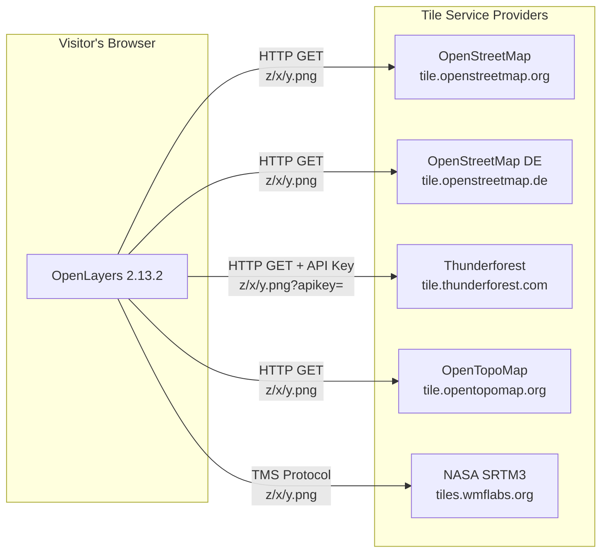

This architecture has important implications: tile server availability is a client-side runtime dependency (assumption A-003), and the plugin cannot function for map rendering without network access to at least one tile provider.

### 3.5.2 Tile Provider Catalog

#### OpenStreetMap Mapnik (Default Layer)

| Attribute | Detail |
|---|---|
| **Layer ID** | 0 (default) |
| **Tile URLs** | `//a.tile.openstreetmap.org/${z}/${x}/${y}.png`, `//b.tile.openstreetmap.org/...`, `//c.tile.openstreetmap.org/...` |
| **Authentication** | None required |
| **Protocol** | HTTPS (protocol-relative URLs) |
| **Evidence** | `OpenStreetMap.js`, lines 22–26 |

#### OpenStreetMap DE (German Tiles)

| Attribute | Detail |
|---|---|
| **Layer ID** | 2 |
| **Tile URLs** | `https://a.tile.openstreetmap.de/tiles/osmde/${z}/${x}/${y}.png` (a/b/c subdomains) |
| **Authentication** | None required |
| **Evidence** | `gpxtrackmap.php`, lines 316–321 |

#### Thunderforest Tile Services (4 Layers)

| Layer | Layer ID | URL Pattern |
|---|---|---|
| CycleMap | 1 | `//a.tile.thunderforest.com/cycle/${z}/${x}/${y}.png?apikey=<KEY>` |
| Transport | 11 | `//a.tile.thunderforest.com/transport/${z}/${x}/${y}.png?apikey=<KEY>` |
| Landscape | 12 | `//a.tile.thunderforest.com/landscape/${z}/${x}/${y}.png?apikey=<KEY>` |
| Outdoors | 13 | `//a.tile.thunderforest.com/outdoors/${z}/${x}/${y}.png?apikey=<KEY>` |

| Attribute | Detail |
|---|---|
| **Authentication** | Free API key from `https://www.thunderforest.com/` required |
| **Key Configuration** | Admin parameter `tfapikey` in `gpxtrackmap.xml`, line 555 |
| **Key Injection** | Client-side query parameter appended to all tile request URLs |
| **Evidence** | `OpenStreetMap.js`, lines 47–170; `gpxtrackmap.php`, line 306 |

#### OpenTopoMap (Topographic)

| Attribute | Detail |
|---|---|
| **Layer ID** | 15 |
| **Tile URLs** | `//a.tile.opentopomap.org/${z}/${x}/${y}.png` (a/b/c subdomains) |
| **Authentication** | None required |
| **Max Zoom** | 18 levels |
| **Evidence** | `OpenStreetMap.js`, lines 179–200 |

#### NASA SRTM3 v2 Hill Shading (Overlay)

| Attribute | Detail |
|---|---|
| **Type** | TMS overlay (not a base layer) |
| **Tile URL** | `https://a.tiles.wmflabs.org/hillshading/` |
| **Authentication** | None required |
| **Modes** | Off / Single intensity / Double intensity |
| **Max Zoom** | 16 levels |
| **Evidence** | `gpxtrackmap.php`, lines 419–436 |

### 3.5.3 Authentication and API Key Management

Only the Thunderforest tile services require authentication. The API key is managed through the following flow:

1. **Administrator** obtains a free API key from `https://www.thunderforest.com/`
2. **Configuration** — Key is stored in the `tfapikey` parameter via Joomla's admin panel (`gpxtrackmap.xml`, line 555)
3. **Injection** — PHP reads the key from plugin parameters and passes it to `OpenStreetMap.js` layer constructors at map initialization (`gpxtrackmap.php`, line 306)
4. **Transmission** — The key is appended as a `?apikey=` query parameter on every Thunderforest tile URL

**Security Implication:** The API key is exposed in client-side JavaScript and visible in the browser's network inspector for every Thunderforest tile request. This is documented as a known security consideration in Section 2.4.4. No server-side proxy mechanism exists to shield the key.

### 3.5.4 Custom Layer Extensibility

GPXTrackMap 2 supports up to three user-defined custom tile layers (Layer IDs 8, 9, 10) loaded from external JavaScript files:

| Slot | Expected File | Purpose |
|---|---|---|
| Custom Layer 1 | `CustomMapLayer1.js` | User-created OpenLayers layer definition |
| Custom Layer 2 | `CustomMapLayer2.js` | User-created OpenLayers layer definition |
| Custom Layer 3 | `CustomMapLayer3.js` | User-created OpenLayers layer definition |

These files are **not bundled** with the plugin and must be created by the site administrator. They are expected to define valid `OpenLayers.Layer` subclass constructors compatible with the OpenLayers 2.13.2 API. The custom layer paths are configured via the `maplayer` parameter and loaded conditionally by `gpxtrackmap.php` (lines 370–376).

---

## 3.6 Data Storage

### 3.6.1 Configuration Persistence

GPXTrackMap 2 does not create, read from, or write to any database tables. Constraint C-004 (Section 2.6) states: "No database tables are used; all configuration persists in Joomla extension params." This is verified by the complete absence of SQL statements, database connection code, or query builders in the 1,666-line `gpxtrackmap.php` source.

Plugin configuration is persisted through Joomla's built-in extension parameter system:

| Storage Mechanism | Managed By | Content |
|---|---|---|
| **Extension Parameters** | Joomla CMS core (`#__extensions` table) | 90+ admin-configured parameters across 12 fieldsets, defined in `gpxtrackmap.xml` |
| **Language Strings** | Joomla Language API | 283 translation strings in `plg_content_gpxtrackmap.ini` |

The plugin reads its parameters via the `CMSPlugin`-inherited `$this->params` object. Joomla internally stores these values in its `#__extensions` database table, but this storage is wholly managed by the CMS framework — the plugin has no direct database interaction.

### 3.6.2 File System Storage and Caching

The file system serves as the sole data storage and caching layer for GPXTrackMap 2. Three categories of file system interaction exist:

#### GPX File Access (Read-Only)

| Attribute | Detail |
|---|---|
| **Root Directory** | Configurable via `gpxroot` parameter (default: `/images/gpx/`) |
| **Remote Support** | HTTP and HTTPS URLs accepted with prefix validation (`gpxtrackmap.php`, lines 186–203) |
| **Format** | GPX 1.0 / 1.1 XML (constraint C-002) |
| **Access Pattern** | Read via `simplexml_load_file()` — no modification of GPX source files (constraint C-003) |

#### SVG Diagram Cache (Write)

| Attribute | Detail |
|---|---|
| **File Pattern** | `<gpxfilename>.svg` (elevation), `<gpxfilename>_speed.svg` (speed) |
| **Location** | Written alongside GPX source files in the same directory |
| **Cache Control** | Enabled when `cache=on` (default); disabled when `cache=off` |
| **Invalidation** | Manual deletion required — no automatic invalidation when GPX source data changes |
| **Write Safety** | `isWritable()` check before all write operations (`gpxtrackmap.php`, lines 1409–1411, 1552–1558) |

#### ZIP Archive Cache (Write)

| Attribute | Detail |
|---|---|
| **File Pattern** | `<gpxfilename>.zip` |
| **Location** | Written alongside GPX source files |
| **Compression** | Created via `Joomla\Archive\Archive` ZIP adapter (`gpxtrackmap.php`, lines 1586–1620) |
| **Cache Control** | Same behavior as SVG cache — persists indefinitely when `cache=on` |
| **Write Safety** | `isWritable()` check before compression |

#### Static Assets (Read-Only)

| Asset Category | Directory | Contents |
|---|---|---|
| **Marker Icons** | `markers/` | PNG files (21×25px): 4 icon sets × 7 colors, waypoint markers, and `404.png` fallback |
| **CSS Themes** | `theme/default/` | 8 CSS files (4 source + 4 minified variants) for desktop, mobile, Google, and IE6 |
| **HTML Templates** | Plugin root | `template1.html`–`template6.html`, fullscreen control templates |

### 3.6.3 Session State Management

The plugin uses Joomla's session-backed state API for per-request counter management, ensuring unique DOM element IDs across multiple map instances on a single page:

| State Key | Purpose | API |
|---|---|---|
| `gtmcount` | Global map counter — generates unique IDs (`map0`, `map1`, `map2`, ...) | `Factory::getApplication()->getUserState()` / `setUserState()` |
| `gtmcountarticles` | Article counter — ensures JS/CSS libraries are injected only once per page render | `Factory::getApplication()->getUserState()` / `setUserState()` |

These counters are initialized at `gpxtrackmap.php` lines 52–65 and incremented at lines 104–106 and 133–135 respectively. The state persists only for the duration of the page render request and does not require external session storage beyond Joomla's default session handler.

---

## 3.7 Development & Deployment

### 3.7.1 Distribution Model

GPXTrackMap 2 is distributed as a standard **Joomla extension package** — a ZIP archive processed by Joomla's built-in extension installer:

| Attribute | Detail |
|---|---|
| **Package Format** | ZIP archive |
| **Manifest** | `gpxtrackmap.xml` (line 2: `<extension type="plugin" group="content" method="upgrade">`) |
| **Installation Method** | Joomla Admin → Extensions → Install → Upload Package File |
| **Upgrade Support** | `method="upgrade"` attribute enables both fresh install and in-place upgrade |
| **Post-Install** | Plugin must be manually enabled in Joomla's Plugin Manager after first installation |

The `gpxtrackmap.xml` manifest declares the complete file inventory that Joomla's installer extracts to the target directory (`/plugins/content/gpxtrackmap/`), including all PHP, JavaScript, CSS, HTML, INI, and static asset files.

### 3.7.2 Build System

GPXTrackMap 2 has **no build system**. There is no webpack, gulp, grunt, npm scripts, Makefile, or any compilation step. All source files are authored and distributed in their final, executable form.

| Build Aspect | Status |
|---|---|
| **JavaScript Transpilation** | None — all JS served as-is (ES5) |
| **CSS Preprocessing** | None — no Sass, Less, or PostCSS |
| **CSS Minification** | Pre-generated `.tidy.css` variants exist alongside source CSS (e.g., `style.css` → `style.tidy.css`) |
| **PHP Compilation** | None — interpreted at runtime |
| **Asset Bundling** | None — OpenLayers shipped as pre-built monolithic file |
| **Linting / Static Analysis** | None — no `.eslintrc`, `.phpcs.xml`, or equivalent configuration found |

### 3.7.3 Development Tooling

The repository contains no development tooling configuration:

| Tool Category | Status | Files Present |
|---|---|---|
| **PHP Dependency Manager** | Not used | No `composer.json` |
| **JavaScript Package Manager** | Not used | No `package.json` |
| **Code Formatting** | Not configured | No `.editorconfig` |
| **Linting** | Not configured | No `.eslintrc`, `.phpcs.xml` |
| **Testing** | Not present | No PHPUnit, Jest, or test framework files |
| **CI/CD** | Not configured | No `.github/workflows/`, `.gitlab-ci.yml`, or `Jenkinsfile` |
| **Containerization** | Not applicable | No `Dockerfile` or `docker-compose.yml` |

Release management follows a manual process, with version history documented in `gpxtrackmap-release-notes.txt` (222 lines covering V1.0.0 through V2.0.1).

### 3.7.4 Version Control and Licensing

| Attribute | Detail |
|---|---|
| **Current Version** | 2.0.1 (declared in `gpxtrackmap.xml` line 11 and `gpxtrackmap.php` line 46: `$_gtmversion = 'V2.0.1'`) |
| **Release Date** | 2026-03-06 |
| **License** | GNU General Public License v3 (GPLv3) — `gpxtrackmap.php` lines 11–22, `LICENSE` file |
| **Author** | DP informatica (based on original work of Frank Ingermann) |
| **Website** | `https://dpinformatica.altervista.org/` |
| **Project Origin** | V1.0.0 released 2012-12-12 by Frank Ingermann |

The GPLv3 license is compatible with the Joomla CMS ecosystem's open-source licensing requirements and with the BSD-2-Clause license of the bundled OpenLayers 2.13.2 library.

---

## 3.8 Technology Security Considerations

Each technology choice in the stack carries specific security implications. The following matrix consolidates security-relevant aspects across all stack layers, cross-referenced with Section 2.4.4:

| Technology | Risk Area | Threat | Mitigation | Residual Risk |
|---|---|---|---|---|
| **PHP 8+ / File System** | GPX file path traversal | Malicious inline path parameters could access files outside `gpxroot` | File paths resolved relative to `gpxroot`; Joomla `Path` API used for validation | Limited — no comprehensive canonicalization |
| **PHP 8+ / HTTP** | Remote GPX from untrusted sources | External URLs may point to malicious or oversized content | `http://` / `https://` prefix validation (`gpxtrackmap.php`, lines 186–203) | Moderate — no content-type or size validation |
| **PHP 8+ / Regex** | XSS via waypoint descriptions | BBCode content in GPX `<desc>` elements could inject scripts | Whitelist approach — only 8 BBCode tags parsed; no raw HTML pass-through (`gpxtrackmap.php`, lines 818–829) | Low |
| **JavaScript / Thunderforest** | API key exposure | Key visible in browser network tab on all tile requests | No mitigation — architectural limitation of client-side tile fetching | Accepted risk |
| **PHP 8+ / File System** | Unauthorized file writes | SVG/ZIP cache writes to server filesystem | `isWritable()` check before all write operations | Low — depends on server permission configuration |
| **OpenLayers 2.13.2** | Unpatched vulnerabilities | Final OL2 release — no upstream security maintenance | Local bundling prevents CDN compromise; library operates in sandboxed browser context | Moderate — no path to remediation |
| **JavaScript / Assets** | Broken marker/icon references | Missing icon files cause rendering errors | Fallback to `markers/404.png` on image load error (`gpxtrackmap.js`, line 76) | Low |

---

## 3.9 Technology Integration Matrix

The following matrix documents the integration requirements between stack components, identifying the interfaces and protocols that bind the technology layers together:

| Source Component | Target Component | Integration Interface | Data Exchanged |
|---|---|---|---|
| Joomla CMS Core | Plugin PHP | `onContentPrepare` event dispatch | Article content body, context, params |
| Plugin PHP | Joomla HtmlDocument | `addCustomTag()` method | JavaScript blocks, CSS `<link>` tags |
| Plugin PHP | Joomla Archive API | `getAdapter('zip')` method | GPX file data → ZIP output |
| Plugin PHP | Joomla Factory | `getUserState()` / `setUserState()` | Counter values (`gtmcount`, `gtmcountarticles`) |
| Plugin PHP | SimpleXML | `simplexml_load_file()` | GPX file path → parsed XML object |
| Plugin PHP | gpxtrackmap.js | Token substitution (`%MAPVAR%`, `%GPXPATH%`, etc.) | Server-generated JavaScript with instance-specific configuration |
| gpxtrackmap.js | OpenLayers 2.13.2 | `new OpenLayers.Map()` constructor | Map configuration, layer definitions, control parameters |
| OpenStreetMap.js | OpenLayers 2.13.2 | `OpenLayers.Layer.OSM` class extension | 6 tile layer constructors with URL templates |
| OpenLayers 2.13.2 | Tile Servers | HTTP GET `/${z}/${x}/${y}.png` | Tile coordinates → PNG tile images |
| Plugin PHP | File System | `file_put_contents()` / `simplexml_load_file()` | SVG/ZIP cache writes, GPX file reads |
| Plugin PHP | HTML Templates | `file_get_contents()` + `str_replace()` | Template tokens → assembled HTML output |

---

## 3.10 References

#### Source Files

- `gpxtrackmap.php` — Core plugin implementation (1,666 lines): PHP 8+ features, Joomla API imports (lines 27–34), version declaration (line 46), counter state management (lines 52–65), `onContentPrepare` event hook (line 98), JS/CSS injection (lines 137–161), URL validation (lines 186–203), template resolution (line 229), map layer generation (lines 281–436), GPX parsing (lines 750–1093), BBCode parsing (lines 818–829), SVG generation (lines 1388–1561), ZIP compression (lines 1586–1620)
- `gpxtrackmap.xml` — Extension manifest (577 lines): plugin type declaration (line 2), version metadata (line 11), 90+ parameters across 12 fieldsets (lines 41–577), OpenLayers path configuration (line 549), Thunderforest API key parameter (line 555)
- `gpxtrackmap.js` — JavaScript map initialization template (131 lines): OpenLayers bootstrap, retry mechanism, fullscreen toggle, resize handling, 404 fallback (line 76)
- `OpenStreetMap.js` — Tile layer definitions (200 lines): 6 OSM/Thunderforest/OpenTopoMap layer constructors with API key support
- `OpenLayers.2.13.2.full.js` — Bundled OpenLayers 2.13.2 mapping library (monolithic full build)
- `plg_content_gpxtrackmap.ini` — Language file (283 translation strings)
- `template1.html`–`template6.html` — HTML layout templates with placeholder tokens
- `fullscreencontrols_buttons.html`, `fullscreencontrols_navbar.html` — Fullscreen UI control templates
- `gpxtrackmap-release-notes.txt` — Version history (222 lines, V1.0.0 through V2.0.1)
- `LICENSE` — GNU General Public License v3

#### Asset Directories

- `markers/` — Static PNG icon assets for start/end markers and waypoint symbols (21×25px, 4 sets × 7 colors)
- `theme/default/` — OpenLayers CSS theme directory (8 files: `style.css`, `style.tidy.css`, `style.mobile.css`, `style.mobile.tidy.css`, `google.css`, `google.tidy.css`, `ie6-style.css`, `ie6-style.tidy.css`)

#### Technical Specification Cross-References

- Section 1.1 — Executive Summary: Project version, platform targets, and licensing
- Section 1.2 — System Overview: Architecture context, Joomla API integration, component relationships
- Section 1.3 — Scope: In-scope features, integration points, excluded capabilities
- Section 1.4 — Document Conventions: Version history milestones, repository structure
- Section 2.1 — Feature Catalog: Feature-level technology dependencies
- Section 2.3 — Feature Relationships: Integration points and shared components
- Section 2.4 — Implementation Considerations: Technical constraints (C-001–C-005), performance requirements, security implications
- Section 2.6 — Assumptions and Constraints: Platform assumptions (A-001–A-004), system constraints (C-001–C-005)
- Section 2.7 — References: Source file inventory and external references

# 4. Process Flowchart

This section provides comprehensive process flow documentation for GPXTrackMap 2, detailing every significant workflow from the initial Joomla event interception through client-side map initialization. Each flow is documented with start/end points, decision diamonds, system boundaries, error states, and recovery paths, grounded in evidence from the core codebase files.

---

## 4.1 System Workflow Overview

### 4.1.1 High-Level Processing Pipeline

GPXTrackMap 2 employs a **server-side rendering pipeline with client-side map initialization** architecture. The end-to-end workflow spans five system boundaries — the Joomla CMS framework, the GPXTrackMap PHP plugin, the server filesystem, the user's browser, and external tile services. The following swim-lane diagram illustrates the complete data flow across these boundaries, from article rendering through interactive map delivery.

```mermaid
flowchart TB
    subgraph JoomlaLayer["Joomla 5 CMS Framework"]
        ArticleRender[Article Rendering Engine<br/>Fires onContentPrepare]
        DeliverHTML[Deliver Rendered HTML<br/>to Browser]
    end

    subgraph PluginLayer["GPXTrackMap Plugin — Server-Side PHP"]
        DetectShortcode{Shortcode Tags<br/>Detected?}
        InjectAssets[One-Time JS/CSS<br/>Head Injection]
        ResolveParams[Three-Tier<br/>Parameter Resolution]
        ParseGPXData[GPX Parsing and<br/>Statistics Computation]
        GenerateSVG[SVG Diagram<br/>Generation]
        AssembleOutput[Template Placeholder<br/>Substitution]
        ReplaceShortcode[Replace Shortcode<br/>with HTML Output]
    end

    subgraph FileLayer["Server File System"]
        GPXSource[(GPX XML Files)]
        SVGCacheStore[(SVG Cache)]
        ZIPCacheStore[(ZIP Cache)]
        TemplateStore[(HTML Templates)]
    end

    subgraph BrowserLayer["User Browser — Client-Side JavaScript"]
        DOMCheck[DOM Readiness Check]
        InitOLMap[OpenLayers Map<br/>Initialization]
        LoadGPXVector[Load GPX<br/>Vector Layer]
        InteractiveMap[Interactive Map<br/>Widget Ready]
    end

    subgraph TileServices["External Tile Services"]
        TileServers[OSM / Thunderforest<br/>OpenTopoMap / NASA SRTM3]
    end

    ArticleRender --> DetectShortcode
    DetectShortcode -->|No| DeliverHTML
    DetectShortcode -->|Yes| InjectAssets
    InjectAssets --> ResolveParams
    ResolveParams --> ParseGPXData
    GPXSource --> ParseGPXData
    ParseGPXData --> GenerateSVG
    GenerateSVG --> SVGCacheStore
    TemplateStore --> AssembleOutput
    GenerateSVG --> AssembleOutput
    AssembleOutput --> ReplaceShortcode
    ReplaceShortcode --> DeliverHTML
    DeliverHTML --> DOMCheck
    DOMCheck --> InitOLMap
    InitOLMap --> LoadGPXVector
    LoadGPXVector --> InteractiveMap
    InteractiveMap --> TileServers
end
```

The pipeline executes in two distinct phases:

1. **Server-Side Phase** — The `PlgContentGPXTrackMap` class in `gpxtrackmap.php` (1,666 lines) intercepts the Joomla `onContentPrepare` event, detects `{gpxtrackmap}...{/gpxtrackmap}` shortcode tags via regex, resolves parameters through a three-tier merge (inline → preset → admin defaults), parses GPX XML data to compute 40+ statistical metrics, generates cached SVG diagrams, and assembles final HTML output through template placeholder substitution.

2. **Client-Side Phase** — The injected JavaScript (`gpxtrackmap.js`, 131 lines) initializes OpenLayers 2.13.2 map instances with a 100ms polling retry mechanism, loads GPX track data as vector layers, places markers and waypoints, and establishes communication with external tile servers for base map imagery.

### 4.1.2 System Actors and Boundaries

The following actors and system boundaries participate in GPXTrackMap 2 workflows:

| Actor / System | Role | Boundary | Key Interactions |
|---|---|---|---|
| **Content Author** | Creates articles with `{gpxtrackmap}` shortcode syntax | External | Triggers all processing via article publication |
| **Joomla 5 CMS** | Fires `onContentPrepare` event; provides framework APIs | Platform | Event dispatch, `HtmlDocument`, `UserState`, `Archive` |
| **GPXTrackMap Plugin** | Core processing engine; all server-side logic | Plugin | Parameter resolution, GPX parsing, SVG/HTML generation |
| **Server File System** | Stores GPX files, SVG/ZIP caches, templates, assets | Storage | Read GPX/templates; write SVG/ZIP cache files |
| **User Browser** | Executes JavaScript; renders interactive maps | Client | OpenLayers initialization, tile requests, user interaction |
| **Tile Servers** | Provide map tile imagery (OSM, Thunderforest, OpenTopoMap, NASA) | External | HTTPS tile requests from browser; no server-side proxy |

### 4.1.3 Feature Execution Dependency Flow

The eight features of GPXTrackMap 2 (F-001 through F-008) execute in a defined dependency order during shortcode processing. The Configuration System (F-008) feeds resolved parameters to all other features, while GPX Data Parsing (F-003) provides data to multiple downstream consumers. The Template-Based Layout System (F-007) serves as the final aggregation point, assembling outputs from all upstream features.

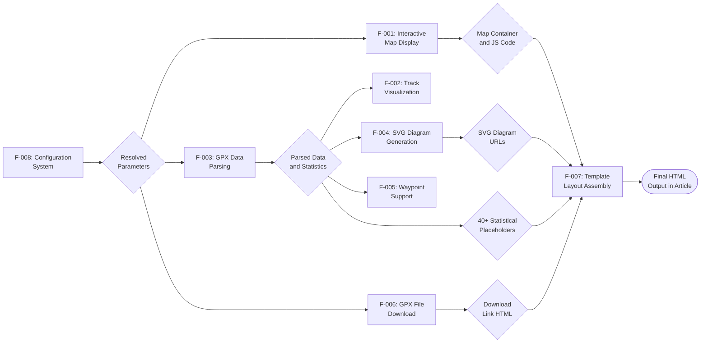

The execution dependency chain, as implemented in `gpxtrackmap.php` (lines 174–648), follows this sequence:

| Execution Order | Feature | Input Dependencies | Output |
|---|---|---|---|
| 1 | F-008: Configuration | Inline params, presets, admin defaults | Resolved parameter set |
| 2 | F-003: GPX Parsing | Resolved params, GPX file | Statistics, coordinate arrays, waypoints |
| 3 | F-004: SVG Diagrams | Elevation/speed arrays from F-003 | Cached SVG files, `%ELEDIAGURL%` / `%SPDDIAGURL%` |
| 4 | F-001: Map Display | Resolved params, map counter | Map container HTML, JavaScript initialization code |
| 5 | F-005: Waypoints | Waypoint data from F-003, map instance from F-001 | Waypoint layer JS code |
| 6 | F-002: Track Visualization | GPX path, map instance from F-001 | Track vector layer JS code |
| 7 | F-006: Download | GPX path, resolved params | Download link/button HTML, optional ZIP file |
| 8 | F-007: Template Layout | All upstream outputs | Final assembled HTML fragment |

---

## 4.2 Core Server-Side Process Flows

### 4.2.1 Plugin Initialization Flow

The plugin constructor (`gpxtrackmap.php`, lines 71–92) executes once when Joomla loads the plugin. This initialization sequence sets up language strings and resets the counter state to ensure a clean processing environment.

**Process Steps:**

1. **Parent Construction** — Calls `parent::__construct()` on `CMSPlugin`, registering the plugin with Joomla's event dispatcher.
2. **Language File Detection** — Locates the INI file at `JPATH_PLUGINS/content/gpxtrackmap/plg_content_gpxtrackmap.ini` (283 localized strings).
3. **String Injection** — If the INI file exists, parses it with `parse_ini_file()` and uses PHP `ReflectionClass` to inject strings directly into the Joomla Language object's protected `$strings` property, bypassing the standard Joomla language loading mechanism.
4. **Counter Reset** — Clears both `gtmcount` (map instance counter) and `gtmcountarticles` (article counter) via `unsetCounter()`, ensuring no stale state persists from previous page requests.

### 4.2.2 Content Interception Pipeline

The `onContentPrepare` method (`gpxtrackmap.php`, lines 98–652) is the primary entry point, invoked by Joomla for every article rendered on the page. The following flowchart documents the complete pipeline from event interception through the per-shortcode processing loop.

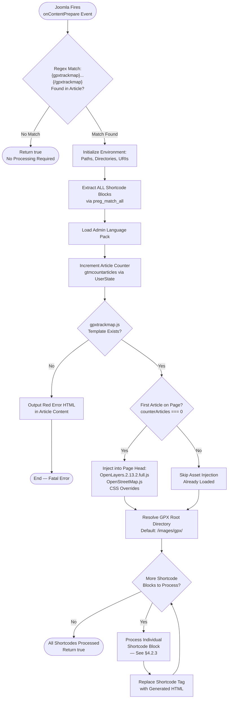

**Key Decision Points:**

| Decision | Location | True Path | False Path |
|---|---|---|---|
| Shortcode found? | Line 100 | Begin full processing pipeline | Return `true` immediately |
| JS template exists? | Lines 126–131 | Continue processing | Output fatal error HTML |
| First article on page? | Line 137 | Inject JS/CSS into `<head>` | Skip injection (already done) |

The one-time asset injection guard (lines 137–161) ensures that the OpenLayers library (280KB+ bundled at `OpenLayers.2.13.2.full.js`), tile layer definitions (`OpenStreetMap.js`), and CSS overrides are loaded exactly once per page, regardless of how many articles contain GPXTrackMap shortcodes. This is managed through the `gtmcountarticles` counter stored in Joomla's `UserState` API.

### 4.2.3 Per-Shortcode Processing Pipeline

For each matched `{gpxtrackmap}...{/gpxtrackmap}` block, the plugin executes a comprehensive processing pipeline (`gpxtrackmap.php`, lines 174–648). This is the core business process that transforms a shortcode specification into a complete interactive map widget.

```mermaid
flowchart TD
    Start([Begin Shortcode<br/>Block Processing]) --> LoadJSTPL[Load JS Template<br/>from gpxtrackmap.js File]
    LoadJSTPL --> IncrMap[Increment Map Counter<br/>gtmcount via UserState]
    IncrMap --> ParseShortcode["Parse Shortcode Body:<br/>GPX filename, inline params<br/>(key=value pairs)"]
    ParseShortcode --> ResolveGPX{GPX Path Starts<br/>with http or https?}
    ResolveGPX -->|Yes| RemotePaths[Set externalgpx = 1<br/>Resolve Remote Paths]
    ResolveGPX -->|No| LocalPaths[Set externalgpx = 0<br/>Resolve Local Paths<br/>Relative to gpxroot]
    RemotePaths --> ValidateFile{GPX File Exists<br/>on Filesystem?}
    LocalPaths --> ValidateFile
    ValidateFile -->|No| StoreWarning[Add File-Not-Found<br/>Warning to _warnings]
    ValidateFile -->|Yes| MergeParams[Three-Tier Parameter Merge<br/>collectParams Method]
    StoreWarning --> MergeParams
    MergeParams --> SelectTemplate[Resolve Template Path<br/>with Localization Lookup]
    SelectTemplate --> ConfigureMap[Configure Map: Controls,<br/>Layers, Markers, Track Style,<br/>Zoom, Fullscreen]
    ConfigureMap --> NeedParsing{ti=1 OR ed=1<br/>OR spd=1 OR<br/>wpshow!=0?}
    NeedParsing -->|Yes| InvokeParser[Invoke getGpxFileInfo<br/>Parse GPX and Compute Stats]
    NeedParsing -->|No| SkipParser[Skip GPX Parsing<br/>No Statistics Needed]
    InvokeParser --> CheckDiagram{SVG Diagrams<br/>Enabled?}
    SkipParser --> CheckDownload
    CheckDiagram -->|Yes| GenDiagram[Generate SVG Diagrams<br/>via renderDiagram<br/>with Cache Check]
    CheckDiagram -->|No| CheckDownload
    GenDiagram --> CheckDownload{Download<br/>Enabled? dl=1}
    CheckDownload -->|Yes| GenDownload[Generate Download Link<br/>with Optional ZIP]
    CheckDownload -->|No| AssembleHTML
    GenDownload --> AssembleHTML[Assemble Final HTML:<br/>Token Substitution in JS Template<br/>23 Map Placeholders]
    AssembleHTML --> StatSub["First Pass Substitution:<br/>40+ Statistical Placeholders"]
    StatSub --> LayoutSub["Second Pass Substitution:<br/>%TRACKMAP%, %TRACKDIAGRAM%<br/>%SPEEDDIAGRAM%, %TRACKDOWNLOAD%"]
    LayoutSub --> WrapOutput["Wrap in HTML Comments:<br/>GPXTrackmap V2.0.1 #N START/END"]
    WrapOutput --> ReturnHTML([Return Generated<br/>HTML Fragment])
```

**Processing Gate — GPX Parsing Decision (line 502):** The `getGpxFileInfo()` method is only invoked when at least one of the following features requires parsed GPX data: track info display (`ti=1`), elevation diagram (`ed=1`), speed diagram (`spd=1`), or waypoint display (`wpshow!=0`). This conditional invocation avoids unnecessary XML parsing and computation when only a basic map display is needed, directly supporting the performance requirements documented in Section 2.4.2.

### 4.2.4 Three-Tier Parameter Resolution

The `collectParams()` method (`gpxtrackmap.php`, lines 668–692) and `expandPresets()` method (lines 698–744) implement a three-tier parameter resolution strategy that governs the behavior of all eight features. This process resolves 90+ parameters organized across 10 admin fieldsets (`gpxtrackmap.xml`).

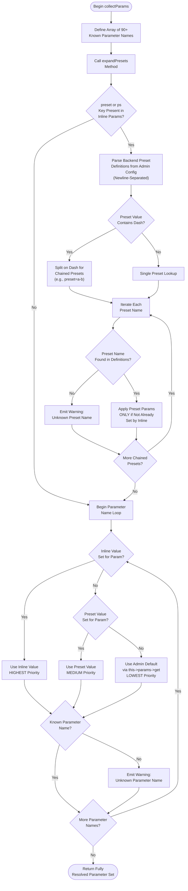

**Parameter Precedence Rules:**

| Priority | Source | Example | Override Behavior |
|---|---|---|---|
| **1 — Highest** | Inline parameters | `{gpxtrackmap}file.gpx,trackcolor=red{/gpxtrackmap}` | Always wins |
| **2 — Medium** | Preset parameters | `preset=hiking` expands to configured param set | Applied only if not set by inline |
| **3 — Lowest** | Admin defaults | Joomla backend configuration via `gpxtrackmap.xml` | Used when neither inline nor preset provides a value |

**Preset Chaining:** Content editors can combine multiple presets using dash notation (e.g., `preset=hiking-detailed`), which sequentially applies preset `hiking` then preset `detailed`. Later presets in the chain do not override values already set by earlier presets or inline parameters. This mechanism supports requirement F-008-RQ-002.

### 4.2.5 GPX File Resolution and Validation

The GPX file resolution process (`gpxtrackmap.php`, lines 186–207) determines whether a GPX source is local or remote and constructs the appropriate path variables for both server-side parsing and client-side fetching.

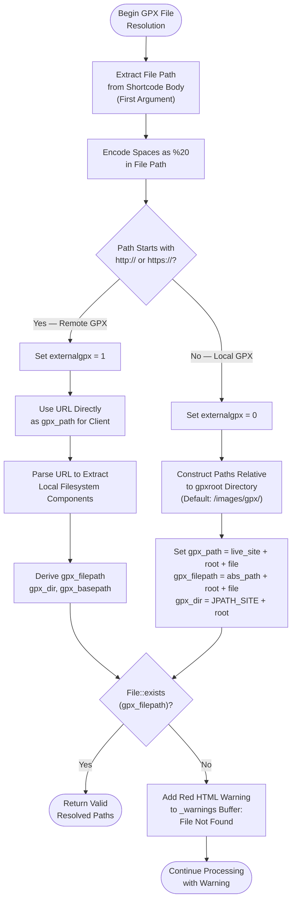

**Path Variable Outputs:**

| Variable | Local GPX | Remote GPX |
|---|---|---|
| `$gpx_path` | `{live_site}/{gpxroot}/{filename}` | Full URL as provided |
| `$gpx_filepath` | `{JPATH_SITE}/{gpxroot}/{filename}` | Derived from URL parsing |
| `$gpx_dir` | `{JPATH_SITE}/{gpxroot}/` | Derived from URL parsing |
| `$externalgpx` | `0` | `1` |

This resolution supports requirement F-002-RQ-005, which mandates that local files resolve relative to the `gpxroot` directory while URLs starting with `http://` or `https://` are used directly with space-to-`%20` encoding.

### 4.2.6 GPX Data Parsing and Statistics Computation

The `getGpxFileInfo()` method (`gpxtrackmap.php`, lines 750–1093) implements a comprehensive data processing pipeline that transforms raw GPX XML into 40+ statistical metrics. This pipeline feeds data into SVG diagrams (F-004), waypoint rendering (F-005), and template placeholders (F-007).

```mermaid
flowchart TD
    Start([Begin getGpxFileInfo]) --> SetUTC["Set Timezone to UTC<br/>date_default_timezone_set"]
    SetUTC --> InitArrays["Initialize Empty Arrays:<br/>lat, lon, ele, dist,<br/>speed, wpts"]
    InitArrays --> LoadXML["Parse GPX XML via<br/>simplexml_load_file"]
    LoadXML --> XMLValid{XML Parse<br/>Successful?}
    XMLValid -->|No| ReturnEmpty([Return Empty Array<br/>No Statistics Generated])
    XMLValid -->|Yes| TrackLoop["Iterate: trk → trkseg → trkpt<br/>Extract lat, lon from attributes<br/>Extract ele and time elements"]
    TrackLoop --> TrackMinMax["Track Min/Max Elevation<br/>Record Start Time"]
    TrackMinMax --> WptEnabled{Waypoint Display<br/>Enabled? wpshow != 0}
    WptEnabled -->|Yes| ExtractWpts["Extract wpt Elements:<br/>lat, lon, ele, time,<br/>sym, name, desc, links"]
    WptEnabled -->|No| DistCalc
    ExtractWpts --> BBCodeOn{BBCode<br/>Processing Enabled?}
    BBCodeOn -->|Yes| ApplyBBCode["Convert BBCode Tags<br/>to HTML in Descriptions"]
    BBCodeOn -->|No| DistCalc
    ApplyBBCode --> DistCalc["Compute Distances:<br/>Spherical Law of Cosines<br/>Earth Radius = 6371.0 km"]
    DistCalc --> SpeedCalc["Compute Speed per Segment<br/>speed = distance / time * 3600"]
    SpeedCalc --> ClassifyMove["Classify Moving vs Paused:<br/>speed > timovespeed threshold<br/>(Default: 2 km/h)"]
    ClassifyMove --> FilterCheck{Signal Filter<br/>Order > 1?}
    FilterCheck -->|Yes| SmoothSignal["Apply Moving Average<br/>via filterSignal Method"]
    FilterCheck -->|No| ConvertUnits
    SmoothSignal --> ConvertUnits["Unit Conversions:<br/>km→mi ÷1.609<br/>km→nm ÷1.852<br/>m→ft ÷0.3048"]
    ConvertUnits --> MaxSpeed["Calculate Maximum Speed<br/>Across All Segments"]
    MaxSpeed --> HasEle{Elevation Data<br/>Found in GPX?}
    HasEle -->|Yes| EleStats["Smooth Elevation if Configured<br/>Calculate: up_m, down_m<br/>Max Uphill/Downhill Speed<br/>Avg Uphill/Downhill Speed"]
    HasEle -->|No| SetEleNA["Set All Elevation<br/>Placeholders to n/a"]
    EleStats --> HasTime{Time Data<br/>Found in GPX?}
    SetEleNA --> HasTime
    HasTime -->|Yes| TimeStats["Format Start/End Times<br/>Calculate Durations<br/>Compute Avg Speeds<br/>(Overall + Moving-Only)"]
    HasTime -->|No| SetTimeNA["Set All Time/Speed<br/>Placeholders to n/a"]
    TimeStats --> DecimalSep["Apply Decimal Separator<br/>Substitution Throughout"]
    SetTimeNA --> DecimalSep
    DecimalSep --> ReturnStats(["Return 40+ Mapped Values<br/>to Placeholder Names"])
```

**Geodesic Distance Formula** (line 864): The plugin computes great-circle distances between consecutive trackpoints using the spherical law of cosines:

`distance = R × acos(min(1.0, cos(φ₁)·cos(φ₂) + sin(φ₁)·sin(φ₂)·cos(Δλ)))` where R = 6,371.0 km.

The `min(1.0, ...)` clamping prevents `acos()` domain errors caused by floating-point imprecision, as documented in requirement F-003-RQ-002.

**Data Availability Graceful Degradation:**

| Missing Data | Behavior | Affected Placeholders |
|---|---|---|
| No elevation `<ele>` elements | All elevation stats set to `'n/a'` | `%ELE-UP-M%`, `%ELE-DOWN-M%`, `%ELE-MIN-M%`, `%ELE-MAX-M%`, `%ELE-DELTA-M%` + ft variants |
| No time `<time>` elements | All time/speed stats set to `'n/a'` | `%STARTTIME%`, `%ENDTIME%`, `%DURATION%`, `%AVGSPEED-KMH%` + variants |
| Elapsed time = 0 | Average speed set to `'n/a'` | All speed placeholders |

### 4.2.7 SVG Diagram Generation and Caching

The `renderDiagram()` method (`gpxtrackmap.php`, lines 1388–1561) produces SVG 1.1 elevation profile and speed profile diagrams. This flow incorporates a filesystem-based caching layer that prevents redundant regeneration when GPX data has not changed.

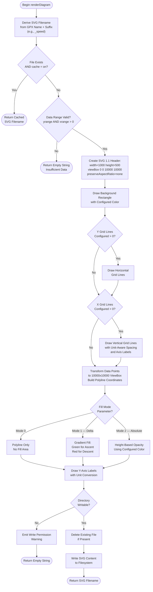

**Caching Behavior** (lines 1409–1411, requirement F-004-RQ-004):

| Scenario | Cache Parameter | File Exists | Action |
|---|---|---|---|
| Cache hit | `cache=on` (default) | Yes | Return existing filename immediately |
| Cache miss | `cache=on` | No | Generate SVG, write to filesystem, return filename |
| Cache bypassed | `cache=off` | Any | Always regenerate SVG |

**Important Constraint:** The cache has no automatic invalidation mechanism. When GPX source data changes and caching is enabled, cached SVG and ZIP files must be manually deleted, as noted in Section 2.4.5.

### 4.2.8 Template Selection and Output Assembly

The template resolution process (`gpxtrackmap.php`, lines 222–273) selects, loads, and populates an HTML layout template. Six built-in templates (`template1.html` through `template6.html`) are provided, with support for custom templates and localized variants.

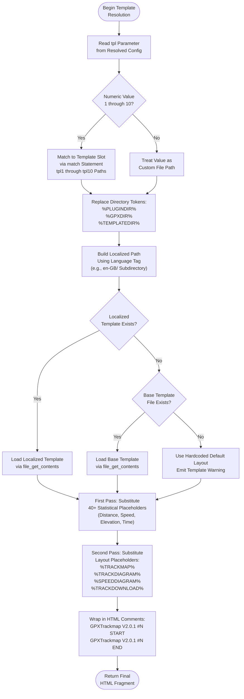

**Template Search Order** (lines 243–258):

1. Localized directory variant (e.g., `{templatedir}/en-GB/template1.html`)
2. Base directory path (e.g., `{templatedir}/template1.html`)
3. Three directory roots tried: plugin directory, GPX file directory, Joomla template directory
4. Hardcoded default layout (fallback with warning)

### 4.2.9 Download Link Generation and ZIP Compression

The download workflow (`gpxtrackmap.php`, lines 614–633) generates download links or buttons, with optional ZIP compression handled by the `ziptrackfile()` method (lines 1586–1620).

# 5. System Architecture

## 5.1 High-Level Architecture

### 5.1.1 System Overview

GPXTrackMap 2 is implemented as a **server-side rendering pipeline with client-side map initialization** operating within the Joomla 5 CMS framework. The architecture follows a **two-tier, event-driven plugin model** in which all server-side logic resides in a single PHP class (`PlgContentGPXTrackMap` in `gpxtrackmap.php`, 1,666 lines) that intercepts Joomla's content lifecycle events, and all client-side interactivity is delegated to the bundled OpenLayers 2.13.2 mapping library executing in the visitor's browser.

#### Architectural Style and Rationale

The system adopts a **monolithic content plugin architecture** governed by the Observer design pattern. The `PlgContentGPXTrackMap` class subscribes to Joomla's `onContentPrepare` event (`gpxtrackmap.php`, line 98), receiving article content before display and transforming it by replacing shortcode tags with fully assembled HTML and JavaScript output. This architectural style is dictated by the following design principles:

- **Platform Confinement**: The plugin exists solely within the Joomla 5 content plugin lifecycle and cannot function independently. It extends `Joomla\CMS\Plugin\CMSPlugin` (`gpxtrackmap.php`, line 36) and depends on seven Joomla framework APIs (lines 27–34).
- **Self-Containment**: All client-side dependencies — OpenLayers 2.13.2, tile layer definitions, CSS themes, and marker assets — are bundled locally within the plugin distribution ZIP. No package managers (`composer.json`, `package.json`), CDN references, or build pipelines exist.
- **Zero External Server Dependencies**: No intermediate API layer, no database backend (constraint C-004), and no server-side proxy for tile services. The plugin reads GPX files from the local filesystem, computes statistics in PHP, generates cached SVG and ZIP artifacts, and emits self-contained HTML/JavaScript.
- **Simplicity of Deployment**: A single ZIP archive installed via Joomla's extension manager constitutes the entire deployment artifact, requiring only PHP 8+ with SimpleXML as a server prerequisite (assumption A-001).

#### System Boundaries

The system operates across five distinct boundaries:

| Boundary | Role | Execution Context |
|---|---|---|
| **Joomla 5 CMS** | Event dispatch and API host | Web server |
| **GPXTrackMap Plugin** | Content transformation | Web server (PHP) |
| **Server File System** | GPX data and cache | Web server storage |
| **User Browser** | Map rendering and interaction | Client device |
| **Tile Servers** | Map imagery delivery | Remote HTTPS |

### 5.1.2 Core Components

The following table enumerates all major system components, their responsibilities, dependencies, and integration points.

| Component | Primary Responsibility | Key Dependencies |
|---|---|---|
| **PlgContentGPXTrackMap** (`gpxtrackmap.php`, 1,666 lines) | Sole server-side engine: shortcode detection, GPX parsing, SVG generation, template assembly, JS/CSS injection | Joomla CMSPlugin, Factory, Uri, HtmlDocument, Text, File/Path, Archive APIs |
| **gpxtrackmap.js** (131 lines) | Client-side map initialization template with token-substituted, per-instance JavaScript | OpenLayers 2.13.2 namespace, DOM readiness |
| **OpenLayers 2.13.2** (`OpenLayers.2.13.2.full.js`) | Monolithic browser-side mapping library: tile rendering, vector layers, controls, popups | None (self-contained) |
| **OpenStreetMap.js** (200 lines) | Extends `OpenLayers.Layer.OSM` with 6 named tile layer constructors | OpenLayers 2.13.2 |

| Component | Primary Responsibility | Key Dependencies |
|---|---|---|
| **gpxtrackmap.xml** (577 lines) | Joomla extension manifest: plugin type declaration, file inventory, 90+ admin parameters across 10 fieldsets | Joomla extension installer |
| **plg_content_gpxtrackmap.ini** | 283 localized strings for admin UI labels and frontend output | Joomla Language API |
| **template1–6.html** | 6 HTML layout templates with 40+ placeholder tokens for output composition | Plugin PHP engine |
| **Static Assets** (`markers/`, `theme/default/`) | Marker icon PNGs (21×25px), 8 CSS stylesheets (desktop, mobile, Google, IE6 variants) | Browser asset loading |

### 5.1.3 Data Flow Architecture

The primary data flow spans two sequential phases — a server-side processing phase and a client-side initialization phase — with no bidirectional communication between them.

#### Server-Side Phase

The server-side phase executes entirely within the `onContentPrepare` event handler (`gpxtrackmap.php`, lines 98–652) and follows this sequence:

1. **Event Interception** — Joomla fires `onContentPrepare` for each article. The plugin's regex (`@\{gpxtrackmap\}(.*)\{/gpxtrackmap\}@Us`, line 100) scans article content for shortcode tags.
2. **One-Time Asset Injection** — For the first article on the page (`counterArticles === 0`), JavaScript libraries and CSS stylesheets are injected into the HTML `<head>` via `HtmlDocument::addCustomTag()` (lines 137–161).
3. **Per-Shortcode Processing Loop** — For each matched shortcode (line 174), the plugin:
   - Loads the JavaScript template (`gpxtrackmap.js`) as a string for token substitution.
   - Increments the map counter to generate unique instance IDs (`map0`, `map1`, etc.).
   - Parses inline parameters from the shortcode body and resolves the GPX file path (local vs. remote, line 186).
   - Executes three-tier parameter resolution via `collectParams()` (inline → preset → admin defaults, lines 668–692).
   - Conditionally invokes `getGpxFileInfo()` when statistics, diagrams, or waypoints are enabled (line 502).
   - Generates cached SVG diagrams via `renderDiagram()` (lines 1388–1561) and optional ZIP archives via `ziptrackfile()` (lines 1586–1620).
   - Performs two-pass token substitution: 23 map tokens into the JavaScript template, then 40+ statistical placeholders into the selected HTML layout template.
   - Replaces the original shortcode in the article text with the assembled HTML output, wrapped in `<!-- GPXTrackmap V2.0.1 #N START/END -->` comments.

#### Client-Side Phase

After the server delivers the fully assembled HTML page to the browser:

1. **DOM/Library Readiness** — The per-instance `initMap_%MAPVAR%()` function polls every 100ms, checking for both the `OpenLayers` global namespace and the DOM element's existence (`gpxtrackmap.js`, lines 29–31).
2. **Map Construction** — An `OpenLayers.Map` instance is created with EPSG:900913 projection, configured controls, and tile layers.
3. **GPX Vector Loading** — An `OpenLayers.Layer.Vector` with `Strategy.Fixed` and `Protocol.HTTP` fetches the GPX file directly from the server, parsing it via `OpenLayers.Format.GPX` (lines 48–63).
4. **Post-Load Initialization** — On the `loadend` event, the map zooms to the track extent, places start/end markers, and renders waypoints (lines 69–73).
5. **Tile Requests** — The browser issues direct HTTPS GET requests (`/${z}/${x}/${y}.png`) to external tile servers. No server-side proxy exists.
6. **Interactive Controls** — Window resize events trigger a 200ms debounced map update. Fullscreen toggling is handled by `switch_map_fullscreen_%MAPVAR%()` (lines 90–128).

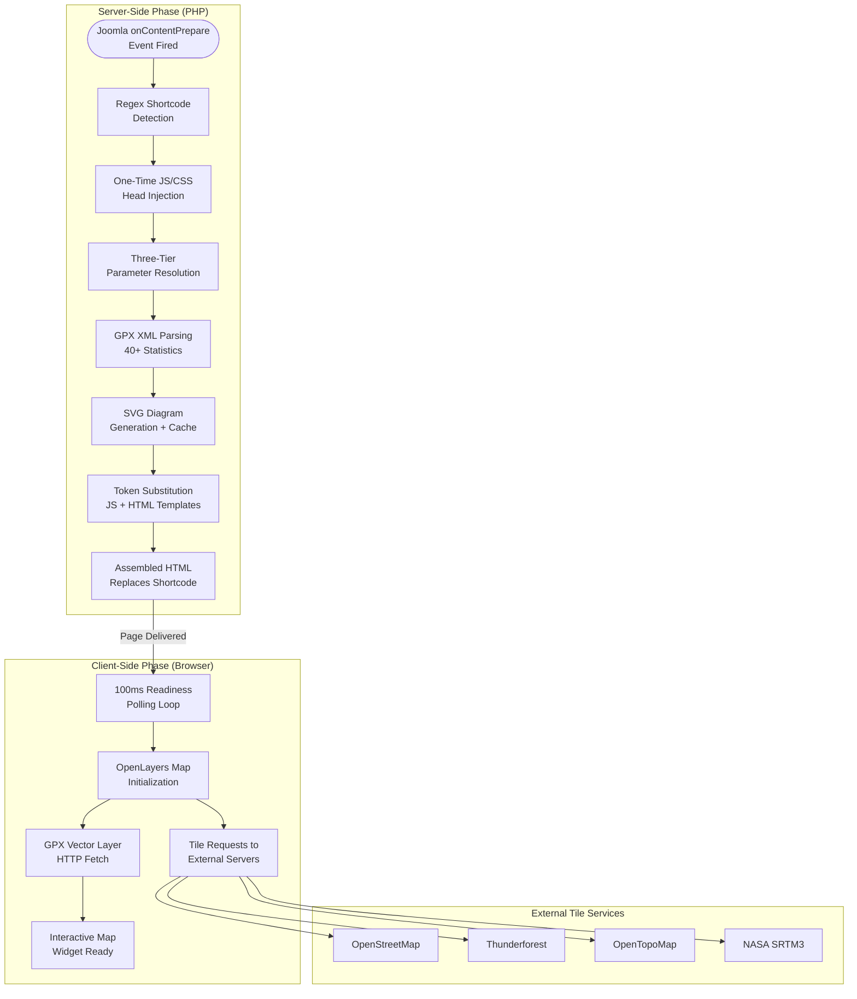

### 5.1.4 External Integration Points

GPXTrackMap 2 integrates with two categories of external systems: the Joomla CMS framework (server-side) and tile service providers (client-side).

#### Tile Service Providers

All tile requests originate from the visitor's browser via OpenLayers. No server-side proxy, cache, or relay mechanism exists.

| Service | Integration Type | Protocol | Authentication |
|---|---|---|---|
| OpenStreetMap Mapnik | HTTP tile fetch | HTTPS `/${z}/${x}/${y}.png` | None |
| OpenStreetMap DE | HTTP tile fetch | HTTPS `/${z}/${x}/${y}.png` | None |
| Thunderforest (4 layers) | HTTP tile fetch | HTTPS `/${z}/${x}/${y}.png?apikey=` | API key (query param) |
| OpenTopoMap | HTTP tile fetch | HTTPS `/${z}/${x}/${y}.png` | None |
| NASA SRTM3 Hillshading | TMS tile fetch | HTTPS TMS protocol | None |

#### Joomla Framework APIs

| API | Integration Method | Purpose |
|---|---|---|
| `onContentPrepare` event | Observer pattern subscription | Entry point for all processing |
| `HtmlDocument::addCustomTag()` | Direct method call | JS/CSS injection into `<head>` |
| `Factory::getApplication()->getUserState()` | State API | Map and article counter management |
| `Joomla\Archive\Archive::getAdapter('zip')` | Method call | ZIP archive creation (line 1616) |
| `Joomla\CMS\Filesystem\File/Path` | File API | Existence checks, path validation |
| `Joomla\CMS\Language\Text` | Translation API | Localized string resolution |
| `Joomla\CMS\Uri\Uri` | URL construction | Asset and file URL generation |

---

## 5.2 Component Details

### 5.2.1 Core PHP Plugin — PlgContentGPXTrackMap

#### Purpose and Responsibilities

The `PlgContentGPXTrackMap` class (`gpxtrackmap.php`, line 36) is the sole server-side component and the architectural nucleus of the entire system. It implements the complete rendering pipeline: shortcode detection, parameter resolution, GPX data parsing and statistics computation, SVG diagram generation, download link creation, template assembly, and JavaScript code generation.

#### Key Class Properties

The class maintains nine protected properties (`gpxtrackmap.php`, lines 38–46) that establish the runtime environment:

- `$_params` — Resolved parameter array for the current shortcode instance
- `$_absolute_path` / `$_rootfolder` / `$_rootpath` / `$_live_site` — Path and URL construction primitives
- `$_plugin_dir` / `$_markers_dir` — Plugin asset directories
- `$_warnings` — Accumulated warning message buffer
- `$_gtmversion` — Version string (`'V2.0.1'`)

#### Method Inventory

| Method | Lines | Responsibility |
|---|---|---|
| `__construct()` | 71–92 | Language string injection via `ReflectionClass`, counter reset |
| `onContentPrepare()` | 98–652 | Main entry point: shortcode detection, asset injection, per-shortcode processing loop |
| `collectParams()` | 668–692 | Three-tier parameter resolution (inline → preset → admin) |
| `expandPresets()` | 698–744 | Preset chain expansion with dash notation |
| `getGpxFileInfo()` | 750–1093 | GPX XML parsing, 40+ statistical metrics, waypoint extraction |
| `renderDiagram()` | 1388–1561 | SVG 1.1 diagram generation with filesystem caching |
| `ziptrackfile()` | 1586–1620 | ZIP compression via Joomla Archive API |
| `makeWptCode()` | 1182–1360 | Waypoint JavaScript code generation (markers, popups, symbols) |
| `filterSignal()` | 1366–1382 | Moving average signal smoothing for elevation/speed data |
| `formatDateTime()` | 1103–1113 | PHP 8.1+ strftime replacement |
| `formatDuration()` | 1120–1132 | Duration formatting (overflow-safe for durations > 24 hours) |
| `getGPXTime()` | 1567–1584 | GPX ISO timestamp parsing (substr-based extraction) |
| `markerFilename()` | 1626–1640 | Marker icon path construction from set and color parameters |
| `isWritable()` | 1646–1665 | Write permission verification before cache file operations |

#### Technologies and Frameworks

- **Language**: PHP 8+ with SimpleXML extension
- **Base Class**: `Joomla\CMS\Plugin\CMSPlugin`
- **XML Processing**: `simplexml_load_file()` for GPX 1.0/1.1 parsing
- **Graphics**: Pure PHP SVG 1.1 generation via string concatenation (no graphics library)
- **Compression**: `Joomla\Archive\Archive` ZIP adapter
- **State Management**: `Factory::getApplication()->getUserState()/setUserState()` for per-page counters

#### Scaling Considerations

- **Multi-instance**: Counter-based unique IDs (`map0`, `map1`, etc.) support unlimited concurrent maps per page.
- **Large GPX files**: All trackpoints are iterated in PHP memory; files with 100k+ points may impact server processing time and memory.
- **Caching**: SVG and ZIP artifacts are cached on the filesystem, preventing redundant computation on subsequent page requests.

### 5.2.2 Client-Side Map Template — gpxtrackmap.js

#### Purpose and Responsibilities

The `gpxtrackmap.js` file (131 lines) serves as a JavaScript **template** rather than a standalone module. The PHP plugin reads this file as a string and performs server-side token substitution, replacing 23 placeholders with instance-specific values before injecting the resulting JavaScript into the page output.

#### Key Functions

| Function | Purpose |
|---|---|
| `osm_getTileURL(bounds)` | TMS tile URL computation helper for hill shading overlay |
| `initMap_%MAPVAR%()` | Map initialization with 100ms retry polling for OpenLayers namespace and DOM element readiness |
| `onWindowResize_%MAPVAR%()` | 200ms debounced resize handler that triggers `map.updateSize()` |
| `switch_map_fullscreen_%MAPVAR%(onoroff)` | Fullscreen toggle: saves/restores map dimensions, triggers CSS class swap (lines 90–128) |

#### Token Substitution Interface

The PHP engine substitutes 23 tokens into each instance of the template (`gpxtrackmap.php`, lines 538–543):

`%MAPVAR%`, `%GPXPATH%`, `%NOMOUSEWHEELZOOM%`, `%MAPLAYERS%`, `%MARKERLAYER%`, `%GPXLAYERNAME%`, `%MAPCONTROLS%`, `%ZOOMCODE%`, `%TRACKCOLOR%`, `%TRACKWIDTH%`, `%TRACKOPACITY%`, `%TRACKDASHSTYLE%`, `%MARKERCODE%`, `%MAPCLASS%`, `%WPCOLOR%`, `%WPRADIUS%`, `%EXTRACTCODE%`, `%HILLSHADINGLAYER%`, `%WPTCODE%`, `%MAPWIDTH%`, `%MAPHEIGHT%`, `%MAPFULLSCREEN_ENTER%`, `%MAPFULLSCREEN_EXIT%`

#### Map Configuration

Maps are constructed with a fixed projection configuration (`gpxtrackmap.js`, lines 34–43):

- **Projection**: EPSG:900913 (Spherical Mercator)
- **Display Projection**: EPSG:4326 (WGS84 geographic)
- **Max Extent**: −20,037,508.34 to 20,037,508.34 (full Mercator bounds)
- **Max Resolution**: 156,543.0399
- **Zoom Levels**: 19

### 5.2.3 OpenLayers 2.13.2 — Bundled Mapping Library

#### Purpose and Responsibilities

OpenLayers 2.13.2 (`OpenLayers.2.13.2.full.js`) is the monolithic client-side mapping engine responsible for all interactive map rendering, tile management, vector layer display, and user interaction controls. It is the final release of the OL2 series, licensed under BSD-2-Clause, and is locked at this version per constraint C-005.

#### OL2 Classes Utilized

| Category | Classes | Purpose |
|---|---|---|
| **Map Core** | `OpenLayers.Map` | Map container with projection configuration |
| **Base Layers** | `OpenLayers.Layer.OSM` | OpenStreetMap-family tile layers |
| **Overlay Layers** | `OpenLayers.Layer.TMS` | NASA SRTM3 hill shading tiles |
| **Vector Layers** | `OpenLayers.Layer.Vector` | GPX track polyline rendering |
| **Marker Layers** | `OpenLayers.Layer.Markers` | Waypoint and start/end marker icons |

| Category | Classes | Purpose |
|---|---|---|
| **Data Pipeline** | `Strategy.Fixed`, `Protocol.HTTP`, `Format.GPX` | GPX file fetch and parse |
| **Features** | `Feature`, `Icon`, `Popup.FramedCloud` | Waypoint features with interactive popups |
| **Controls (10)** | `Navigation`, `PanZoomBar`, `Zoom`, `LayerSwitcher`, `ScaleLine`, `OverviewMap`, `MousePosition`, `Graticule`, `Attribution`, `SelectFeature` | Configurable map interaction and information overlays |

#### Version Lock Rationale

The version is permanently fixed at 2.13.2 due to the fundamental API incompatibility between OL2 and OL3+. Migration would require a complete rewrite of the client-side map initialization template, tile layer definitions, and all vector/marker/popup code.

### 5.2.4 Tile Layer Definitions — OpenStreetMap.js

#### Purpose and Responsibilities

`OpenStreetMap.js` (200 lines) is a companion library that extends `OpenLayers.Layer.OSM` with six named tile layer constructors, bridging OpenLayers' generic tile API with specific tile server URL patterns and attribution requirements.

#### Defined Constructors

| Constructor | Provider | API Key Required |
|---|---|---|
| `OSM.Mapnik` | OpenStreetMap standard | No |
| `OSM.CycleMap` | Thunderforest Cycle | Yes |
| `OSM.TransportMap` | Thunderforest Transport | Yes |
| `OSM.Landscape` | Thunderforest Landscape | Yes |
| `OSM.Outdoors` | Thunderforest Outdoors | Yes |
| `OSM.OpenTopoMap` | OpenTopoMap topographic | No |

API key injection follows the pattern: `(options && options.apiKey) ? "?apikey=" + options.apiKey : ""`, appending the key as a query parameter on all Thunderforest tile requests. The API key is configured via the `tfapikey` admin parameter (`gpxtrackmap.xml`, line 555) and passed through by the PHP engine at map initialization (`gpxtrackmap.php`, line 306).

### 5.2.5 Extension Manifest and Configuration — gpxtrackmap.xml

#### Purpose and Responsibilities

The extension manifest (`gpxtrackmap.xml`, 577 lines) declares the plugin's type (`plugin`, group `content`, method `upgrade`), enumerates all distributed files, and defines 90+ admin-configurable parameters organized across 10 fieldsets.

#### Configuration Fieldsets

| Fieldset | Purpose |
|---|---|
| GTM_SETTINGS | GPX root path, map dimensions, track appearance, zoom |
| GTM_MAPCONTROLS | 10 map control toggle parameters |
| GTM_MAPLAYERS | Base layer selection, layer set, hill shading |
| GTM_WAYPOINTS | Display, popups, symbols, BBCode settings |
| GTM_TRACKINFO | Statistics display, decimal separator, date/time formats |
| GTM_ELEDIA | Elevation diagram appearance and grid |
| GTM_SPDDIA | Speed diagram appearance and grid |
| GTM_MARKER | Start/end marker colors and icon sets |
| GTM_DOWNLOADSETTINGS | Download link/button and ZIP options |
| GTM_PRESETS | Named preset definitions for reusable configurations |

### 5.2.6 Layout Templates and Static Assets

#### HTML Layout Templates

Six built-in templates (`template1.html` through `template6.html`) provide graduated levels of detail, from compact (template 1: map + distance + diagram in 6 lines) to comprehensive (template 6: all statistics in 8 tables across 316 lines). Templates use placeholder tokens (`%TRACKMAP%`, `%TRACKDIAGRAM%`, `%SPEEDDIAGRAM%`, `%TRACKDOWNLOAD%`, plus 40+ statistical placeholders) that are substituted by the PHP engine during output assembly.

Template resolution supports three directory token replacements (`%PLUGINDIR%`, `%GPXDIR%`, `%TEMPLATEDIR%`) and attempts a localized variant lookup using the active language tag before falling back to the base directory (`gpxtrackmap.php`, lines 222–273).

#### Fullscreen Control Templates

Two HTML fragment templates handle fullscreen interaction:
- `fullscreencontrols_buttons.html` — Standard button-based controls (selected when `mappan != 1`)
- `fullscreencontrols_navbar.html` — Navbar-style controls (selected when `mappan == 1`)

Both use `%MAPVAR%` tokens for unique element IDs and function names per map instance.

#### Static Asset Directories

| Directory | Contents | Access Pattern |
|---|---|---|
| `markers/` | PNG marker icons (21×25px, pattern: `marker<set>-<color>.png`), waypoint markers, `404.png` fallback | Read-only by browser |
| `theme/default/` | 8 CSS files: `style.css`/`style.tidy.css` (desktop), `style.mobile.css`/`style.mobile.tidy.css` (touch), `google.css`/`google.tidy.css` (legacy), `ie6-style.css`/`ie6-style.tidy.css` (IE6) | Read-only by browser |

#### Component Interaction Diagram

The following diagram illustrates the integration relationships between all components during a typical request lifecycle.

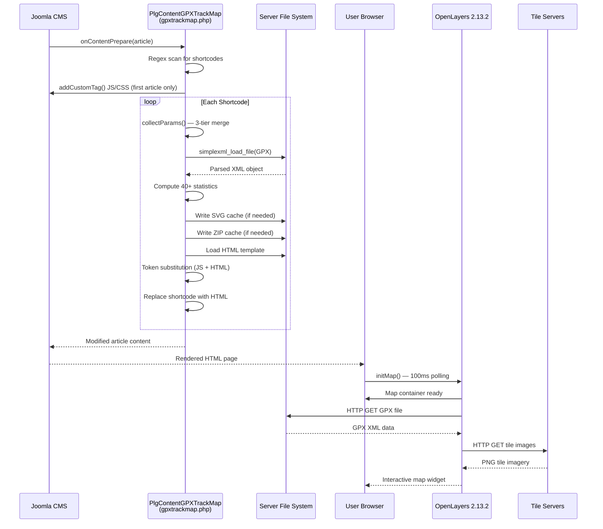

---

## 5.3 Technical Decisions

### 5.3.1 Architecture Style Decisions

The following table documents the key architectural decisions, their rationale, and accepted trade-offs.

| Decision | Rationale | Trade-off |
|---|---|---|
| Monolithic single-class PHP architecture | Entire server logic in one file — aligns with Joomla plugin model simplicity | No modularity; harder to isolate and test individual concerns |
| Observer pattern integration | Joomla's `onContentPrepare` event provides a clean, non-invasive hook into the content lifecycle | Plugin is wholly dependent on Joomla's event dispatch; no standalone operation |
| Server-side token substitution for JS | Generates unique, self-contained JavaScript per map instance without requiring a client-side framework | Tight coupling between PHP and JS template; no dynamic client-side reconfiguration |

### 5.3.2 Communication Pattern Choices

| Decision | Rationale | Trade-off |
|---|---|---|
| Client-side direct tile fetching | Eliminates server-side proxy complexity; tile caching handled by browser and CDN | API key exposure in client JS; tile server dependency at the client level |
| No intermediate API layer | Plugin outputs final HTML directly — no REST or GraphQL endpoints needed for this use case | Cannot be consumed by external applications or headless frontends |
| One-way server→client data flow | Server assembles complete output; client initializes from static configuration | No dynamic server communication after initial page load |

### 5.3.3 Data Storage Solution Rationale

| Decision | Rationale | Trade-off |
|---|---|---|
| No database tables (C-004) | Zero database dependency simplifies deployment; Joomla manages config persistence in `#__extensions` | No structured query capability; no relational data; no full-text search |
| File-based SVG/ZIP caching | Simple deployment model; cache files co-located with source GPX files | Manual cache invalidation required when GPX data changes |
| Joomla `UserState` for counters | Session-scoped state avoids global variables; integrates with Joomla's session management | State is per-request; no cross-request persistence needed or provided |

### 5.3.4 Caching Strategy

The plugin implements a simple filesystem-based caching strategy for computed artifacts:

| Cached Artifact | Location | Cache Key | Invalidation |
|---|---|---|---|
| SVG elevation diagram | Same directory as GPX file | `<gpxfilename>.svg` | Manual file deletion |
| SVG speed diagram | Same directory as GPX file | `<gpxfilename>_speed.svg` | Manual file deletion |
| ZIP archive | Same directory as GPX file | `<gpxfilename>.zip` | Manual file deletion |

**Cache Behavior** (`gpxtrackmap.php`, lines 1409–1411 and 1599–1600):
- When `cache=on` (default): the plugin checks for file existence before regeneration. If the file exists, it is reused immediately.
- When `cache=off`: artifacts are always regenerated on every request.
- **No automatic invalidation** mechanism exists. When GPX source data changes, cached SVG and ZIP files must be manually deleted.

Write permission is verified via the `isWritable()` method (lines 1646–1665) before any write operation, and a warning is emitted if the directory lacks write permissions.

### 5.3.5 Security Mechanism Selection

| Mechanism | Implementation | Rationale |
|---|---|---|
| Joomla execution guard | `defined('_JEXEC') or die;` (line 25) | Prevents direct PHP file access outside Joomla |
| GPX path containment | Paths resolved relative to `gpxroot`; Joomla `Path` API for validation | Mitigates directory traversal attacks |
| BBCode whitelist | Only 8 BBCode tags parsed; no raw HTML pass-through (lines 818–829) | Prevents XSS injection via GPX waypoint descriptions |
| JS string escaping | `addslashes()` applied to translated strings in JS context (line 278) | Prevents script injection through language strings |
| Write permission checks | `isWritable()` verification before all filesystem writes | Prevents unauthorized or unexpected write operations |

#### Architecture Decision Record — OpenLayers Version Lock

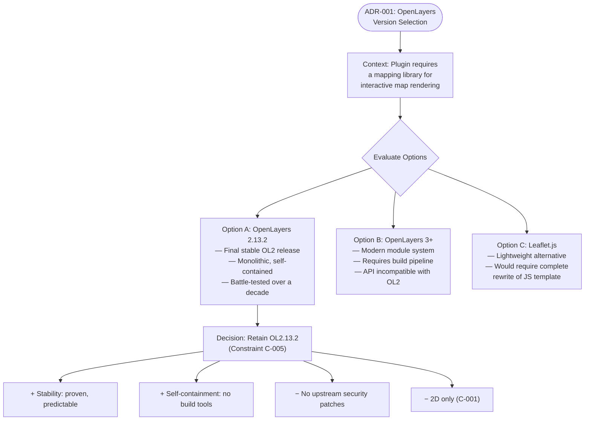

#### Architecture Decision Record — Local Asset Bundling

| Attribute | Detail |
|---|---|
| **Decision** | Bundle all client-side dependencies locally within the plugin ZIP |
| **Context** | HTTPS compatibility requirements (introduced V1.4.0 Beta) and offline installation capability |
| **Rationale** | Eliminates CDN dependency, avoids mixed-content warnings, ensures complete self-sufficiency of the distribution artifact |
| **Consequence** | Larger distribution ZIP; no CDN caching benefits; no automated security updates from upstream libraries |

---

## 5.4 Cross-Cutting Concerns

### 5.4.1 Error Handling Patterns

GPXTrackMap 2 implements a layered error handling strategy spanning both server-side and client-side boundaries. Errors are surfaced either as inline HTML warnings within article content (visible to the site visitor when `showwarnings` is enabled) or as silent fallbacks that maintain visual continuity.

#### Server-Side Error Handling

| Error Condition | Location | Response |
|---|---|---|
| JS template file missing | Lines 128–131 | Fatal red HTML error injected into article; processing aborted |
| GPX file not found | Lines 206–207 | Red HTML warning injected; processing continues with empty data |
| HTML template not found | Lines 262–270 | Warning emitted; hardcoded fallback layout used |
| XML parse failure | Line 765 | Returns empty array silently; statistics render as empty |
| SVG write failure | Line 1030 | Warning appended to `_warnings` buffer |
| ZIP creation failure | Line 1604 | Warning emitted; `return false` |
| Unknown parameters | `collectParams()` | Warning when `showwarnings` enabled |
| Unknown preset name | `expandPresets()` | Warning when `showwarnings` enabled |
| Custom layer file missing | Lines 658–662 | Warning via `warnCustom()` method |

#### Client-Side Error Handling

| Error Condition | Location | Response |
|---|---|---|
| OpenLayers not loaded | `gpxtrackmap.js`, lines 29–31 | 100ms retry polling continues indefinitely |
| DOM element not ready | `gpxtrackmap.js`, lines 29–31 | 100ms retry polling continues until element appears |
| Marker image load failure | `gpxtrackmap.js`, line 76 | Fallback to `markers/404.png` |
| Tile server unavailable | Browser runtime | Map displays but shows empty/broken tile areas |

```mermaid
flowchart TD
    subgraph ServerErrors["Server-Side Error Flow"]
        EventStart([onContentPrepare<br/>Invoked])
        JSCheck{JS Template<br/>Exists?}
        JSFatal[Red Fatal Error HTML<br/>Abort Processing]
        GPXCheck{GPX File<br/>Exists?}
        GPXWarn[Red Warning HTML<br/>Continue Processing]
        XMLCheck{XML Parse<br/>Successful?}
        XMLEmpty[Return Empty Array<br/>Stats = Empty]
        TPLCheck{Template<br/>Exists?}
        TPLFallback[Use Hardcoded<br/>Default Layout]
        WriteCheck{Directory<br/>Writable?}
        WriteWarn[Emit Write<br/>Permission Warning]
        NormalOutput([Normal HTML<br/>Output])
    end

    subgraph ClientErrors["Client-Side Error Flow"]
        InitPoll[100ms Polling<br/>for Readiness]
        OLReady{OpenLayers<br/>Available?}
        RetryWait[Wait 100ms<br/>Retry]
        DOMReady{DOM Element<br/>Available?}
        MapInit[Initialize Map<br/>Instance]
        ImgErr{Image Load<br/>Error?}
        Fallback404[Load markers/404.png]
    end

    EventStart --> JSCheck
    JSCheck -->|No| JSFatal
    JSCheck -->|Yes| GPXCheck
    GPXCheck -->|No| GPXWarn
    GPXCheck -->|Yes| XMLCheck
    GPXWarn --> XMLCheck
    XMLCheck -->|No| XMLEmpty
    XMLCheck -->|Yes| TPLCheck
    XMLEmpty --> TPLCheck
    TPLCheck -->|No| TPLFallback
    TPLCheck -->|Yes| WriteCheck
    TPLFallback --> WriteCheck
    WriteCheck -->|No| WriteWarn
    WriteCheck -->|Yes| NormalOutput
    WriteWarn --> NormalOutput

    InitPoll --> OLReady
    OLReady -->|No| RetryWait
    RetryWait --> OLReady
    OLReady -->|Yes| DOMReady
    DOMReady -->|No| RetryWait
    DOMReady -->|Yes| MapInit
    MapInit --> ImgErr
    ImgErr -->|Yes| Fallback404
    ImgErr -->|No| MapInit
```

### 5.4.2 Multi-Instance Support

The architecture supports unlimited concurrent map widgets per page through a counter-based unique identification system:

- **Map Counter** (`gtmcount`): Managed via Joomla's `UserState` API, incremented for each shortcode processed. Produces unique identifiers: `map0`, `map1`, `map2`, etc.
- **Article Counter** (`gtmcountarticles`): Guards one-time asset injection — JavaScript libraries and CSS are injected only for the first article on the page (lines 137–161).
- **Per-Instance JavaScript Scope**: Each map instance has fully independent function names (`initMap_map0`, `initMap_map1`, etc.) and DOM element IDs, created via `%MAPVAR%` token substitution. No shared mutable state exists between map instances.

### 5.4.3 Security Framework

| Security Layer | Mechanism | Evidence |
|---|---|---|
| **Execution Containment** | `defined('_JEXEC') or die;` | `gpxtrackmap.php`, line 25 |
| **Path Traversal Mitigation** | Paths resolved relative to `gpxroot`; Joomla `Path` API | `gpxtrackmap.php`, lines 186–207 |
| **XSS Prevention** | BBCode whitelist (8 tags); no raw HTML pass-through | `gpxtrackmap.php`, lines 818–829 |
| **JS Injection Prevention** | `addslashes()` for translated strings in JS | `gpxtrackmap.php`, line 278 |
| **Write Safety** | `isWritable()` verification before all writes | `gpxtrackmap.php`, lines 1646–1665 |
| **Image Error Resilience** | `404.png` fallback on load failure | `gpxtrackmap.js`, line 76 |

**Accepted Security Risks:**
- Thunderforest API key is exposed in client-side JavaScript and visible in the browser's network inspector. No server-side proxy exists to shield it.
- OpenLayers 2.13.2 receives no upstream security patches. The library operates in the sandboxed browser context, limiting the attack surface.
- Remote GPX URL validation is limited to `http://`/`https://` prefix checking — no content-type or file size validation is performed (`gpxtrackmap.php`, lines 186–203).

### 5.4.4 Performance and Optimization

The architecture incorporates several performance optimizations at both the server and client tiers:

| Optimization | Mechanism | Impact |
|---|---|---|
| **One-time asset injection** | JS/CSS loaded once per page via `counterArticles === 0` guard (lines 137–161) | Prevents redundant loading of OpenLayers (280KB+) for multi-map pages |
| **Conditional GPX parsing** | `getGpxFileInfo()` invoked only when `ti=1 OR ed=1 OR spd=1 OR wpshow!=0` (line 502) | Avoids unnecessary XML parsing for basic map-only displays |
| **Filesystem caching** | SVG and ZIP artifacts cached alongside GPX files when `cache=on` | Eliminates redundant computation on subsequent page requests |
| **Signal smoothing** | Moving average filter (`filterSignal`, lines 1366–1382) with configurable order | Reduces noise in elevation/speed data before diagram rendering |
| **Resize debounce** | 200ms delay on window resize events (`gpxtrackmap.js`, lines 18–22) | Prevents excessive `map.updateSize()` calls during resize |
| **Map init retry** | 100ms polling for DOM + OpenLayers readiness (`gpxtrackmap.js`, lines 29–31) | Ensures reliable initialization regardless of script loading order |

### 5.4.5 Graceful Degradation

The system degrades gracefully when encountering incomplete GPX data or unavailable services:

| Missing Data / Service | System Behavior |
|---|---|
| No `<ele>` elements in GPX | All elevation statistics set to `'n/a'`; elevation diagram skipped |
| No `<time>` elements in GPX | All time/speed statistics set to `'n/a'`; speed diagram skipped |
| Elapsed time equals zero | Average speed calculations set to `'n/a'` to prevent division by zero |
| Tile server unavailable | Map container renders but displays empty/broken tile areas; track data still visible |
| JavaScript disabled (A-004) | No map rendering; article text remains but shortcode output is invisible |
| Write permissions denied | Warning emitted; SVG/ZIP caching disabled but map rendering continues |

---

## 5.5 Technology Stack Summary

### 5.5.1 Five-Layer Architecture

The complete system is organized into five logical layers, from platform foundation through external service consumption:

| Layer | Technologies | Context |
|---|---|---|
| **Platform** | Joomla 5 CMS, PHP 8+ Runtime | Web server |
| **Server-Side Logic** | PHP 8+ (core plugin), SimpleXML, SVG 1.1 generation | Web server |
| **Client-Side Rendering** | OpenLayers 2.13.2, OpenStreetMap.js, gpxtrackmap.js | Browser |
| **External Services** | OSM, Thunderforest, OpenTopoMap, NASA SRTM3 tile servers | Remote HTTPS |
| **Data & Storage** | GPX XML files, SVG/ZIP cache, Joomla extension params, INI language files | Filesystem |

### 5.5.2 Feature Execution Dependency Chain

The eight features of GPXTrackMap 2 (F-001 through F-008) execute in a defined dependency order during shortcode processing, as implemented in `gpxtrackmap.php` (lines 174–648):

| Order | Feature | Input Dependencies | Output |
|---|---|---|---|
| 1 | F-008: Configuration | Inline params, presets, admin defaults | Resolved parameter set |
| 2 | F-003: GPX Parsing | Resolved params, GPX file | Statistics, coordinates, waypoints |
| 3 | F-004: SVG Diagrams | Elevation/speed arrays from F-003 | Cached SVG files |
| 4 | F-001: Map Display | Resolved params, map counter | Map container HTML + JS |
| 5 | F-005: Waypoints | Waypoint data from F-003, map instance | Waypoint layer JS code |
| 6 | F-002: Track Visualization | GPX path, map instance from F-001 | Track vector layer JS code |
| 7 | F-006: Download | GPX path, resolved params | Download link/button HTML |
| 8 | F-007: Template Layout | All upstream outputs | Final assembled HTML fragment |

### 5.5.3 Assumptions and Constraints

The architecture operates under the following documented assumptions and constraints:

**Assumptions:**
- **A-001**: PHP 8+ with the SimpleXML extension is enabled on the hosting environment.
- **A-002**: The web server has write permissions in the GPX file directory for SVG and ZIP cache files.
- **A-003**: External tile servers (OSM, Thunderforest, OpenTopoMap, NASA SRTM3) maintain current URL structures and availability.
- **A-004**: Site visitors have JavaScript enabled in their browsers.

**Constraints:**
- **C-001**: All map rendering is 2D only — no 3D terrain or globe views.
- **C-002**: Only GPX format is accepted — no KML, FIT, TCX, or other GPS formats.
- **C-003**: The plugin does not create or modify GPX files (read-only visualization).
- **C-004**: No database tables are used — all configuration persists in Joomla extension params.
- **C-005**: OpenLayers 2.13.2 is the fixed mapping library version; no migration path to OL3+ is provided.

---

#### References

- `gpxtrackmap.php` (lines 1–1,666) — Core plugin: complete server-side architecture, all methods, class properties, data flow, event handling, and error management
- `gpxtrackmap.js` (lines 1–131) — Client-side map initialization template: OpenLayers setup, retry mechanism, resize handler, fullscreen toggle
- `gpxtrackmap.xml` (lines 1–577) — Extension manifest: plugin type declaration, file inventory, 90+ configuration parameters across 10 fieldsets
- `OpenStreetMap.js` (lines 1–200) — Tile layer constructor definitions: 6 tile providers, API key handling pattern
- `OpenLayers.2.13.2.full.js` — Bundled monolithic mapping library (BSD-2-Clause, locked at final OL2 release)
- `template1.html` through `template6.html` — HTML layout templates with placeholder tokens
- `fullscreencontrols_buttons.html` / `fullscreencontrols_navbar.html` — Fullscreen control HTML templates
- `plg_content_gpxtrackmap.ini` — 283 localized language strings
- `markers/` — Marker icon asset directory (PNG, 21×25px)
- `theme/default/` — 8 CSS stylesheets (desktop, mobile, Google legacy, IE6 variants)

# 6. SYSTEM COMPONENTS DESIGN

## 6.1 Core Services Architecture

### 6.1.1 Applicability Assessment

**Core Services Architecture is not applicable for this system.** GPXTrackMap 2 is a monolithic Joomla 5 content plugin that operates as a single-class server-side rendering pipeline with client-side map initialization. It does not employ microservices, distributed architecture, service meshes, API gateways, or any distinct service components that would warrant a services architecture specification.

This determination is grounded in the system's explicit architectural decisions, its platform confinement within Joomla's plugin lifecycle, and the complete absence of any service infrastructure artifacts in the codebase.

#### 6.1.1.1 Architectural Evidence

The following evidence, drawn from the repository structure and documented architectural decisions, confirms the non-applicability of a services architecture:

| Evidence Category | Finding | Source |
|---|---|---|
| **Architecture Style** | Monolithic single-class PHP architecture | `gpxtrackmap.php` (1,666 lines) |
| **Design Pattern** | Observer pattern via Joomla `onContentPrepare` event | `gpxtrackmap.php`, line 98 |
| **Server-Side Scope** | All logic resides in one class: `PlgContentGPXTrackMap` | `gpxtrackmap.php`, line 36 |
| **API Layer** | No REST, GraphQL, or intermediate API endpoints | Section 5.3.2 decision record |

| Evidence Category | Finding | Source |
|---|---|---|
| **Database Backend** | No database tables; configuration persists in Joomla extension params (C-004) | Section 2.6, Constraint C-004 |
| **Communication Model** | One-way server→client data flow; no dynamic server communication after page load | Section 5.3.2 decision record |
| **Deployment Model** | Single ZIP archive installed via Joomla Extension Manager | `gpxtrackmap.xml`, line 2 |
| **Infrastructure** | No Dockerfile, docker-compose.yml, CI/CD pipelines, or orchestration files | Repository root listing |

#### 6.1.1.2 Absence of Service Infrastructure

A comprehensive examination of the repository's root directory confirms zero service-related configuration files. The entire codebase consists of:

- **1 PHP file** — `gpxtrackmap.php` (sole server-side logic, 1,666 lines)
- **1 JS template** — `gpxtrackmap.js` (client-side map initialization, 131 lines)
- **1 XML manifest** — `gpxtrackmap.xml` (Joomla extension descriptor, 577 lines)
- **1 bundled library** — `OpenLayers.2.13.2.full.js` (monolithic mapping engine)
- **1 tile layer library** — `OpenStreetMap.js` (6 tile constructors, 200 lines)
- **6 HTML templates** — `template1–6.html` (layout composition)
- **2 HTML fragments** — Fullscreen control UI templates
- **1 INI file** — `plg_content_gpxtrackmap.ini` (283 localized strings)
- **Static assets** — `markers/` (PNG icons), `theme/default/` (8 CSS files)

No `composer.json`, `package.json`, `Dockerfile`, `docker-compose.yml`, `.github/workflows/`, `.gitlab-ci.yml`, `Jenkinsfile`, `.env`, API route definitions, service mesh configurations, load balancer manifests, health check endpoints, or message queue configurations exist anywhere in the repository.

#### 6.1.1.3 Architectural Decision Records

Two formal architecture decisions documented in Section 5.3 directly preclude a services architecture:

**ADR: Monolithic Single-Class Architecture**

| Attribute | Detail |
|---|---|
| **Decision** | Entire server logic in one PHP file |
| **Rationale** | Aligns with Joomla plugin model simplicity |
| **Trade-off** | No modularity; harder to isolate and test individual concerns |

**ADR: No Intermediate API Layer**

| Attribute | Detail |
|---|---|
| **Decision** | Plugin outputs final HTML directly — no REST or GraphQL endpoints |
| **Rationale** | No API endpoints needed for this use case |
| **Trade-off** | Cannot be consumed by external applications or headless frontends |

---

### 6.1.2 Actual System Architecture

While a services architecture does not apply, the following subsections document the actual architectural topology of GPXTrackMap 2 to provide readers with the necessary context for understanding why each service architecture concept is inapplicable.

#### 6.1.2.1 Two-Tier Plugin Architecture

GPXTrackMap 2 implements a **two-tier, event-driven plugin model** that operates entirely within the Joomla 5 CMS lifecycle. The architecture comprises a server-side rendering phase (PHP within Joomla) and a client-side initialization phase (JavaScript in the browser), with a strict one-way data flow between them.

The `PlgContentGPXTrackMap` class extends `Joomla\CMS\Plugin\CMSPlugin` (`gpxtrackmap.php`, line 36) and depends on seven Joomla framework APIs (`gpxtrackmap.php`, lines 27–34):

| Joomla API | Purpose |
|---|---|
| `CMSPlugin` | Base class providing event subscription |
| `Factory` | Application and language service access |
| `Uri` | URL construction for assets and files |
| `HtmlDocument` | JS/CSS injection into the page `<head>` |
| `Text` | Translation string resolution |
| `File` / `Path` | File system operations |
| `Archive` | ZIP file creation |

The plugin cannot function independently outside the Joomla 5 platform — it exists solely within the content plugin lifecycle and has no standalone execution capability.

#### 6.1.2.2 System Boundaries

The system operates across five distinct boundaries, none of which constitute independent services:

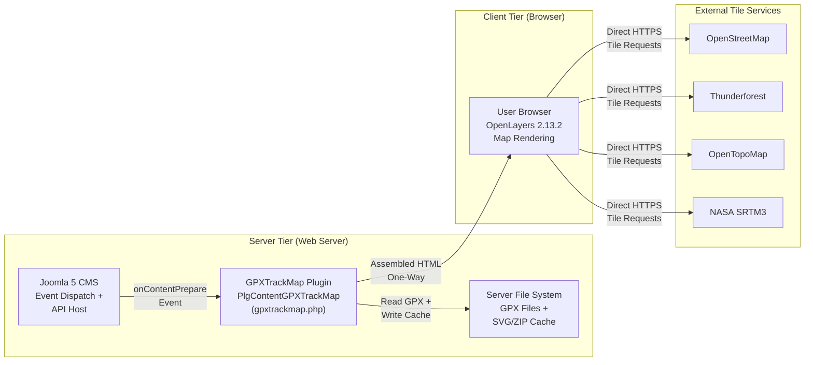

| Boundary | Role | Nature |
|---|---|---|
| **Joomla 5 CMS** | Event dispatch and API host | Host platform (not a service) |
| **GPXTrackMap Plugin** | Content transformation engine | Embedded plugin (not a service) |
| **Server File System** | GPX data and cache storage | Local storage (not a service) |
| **User Browser** | Map rendering and interaction | End-user client (not a service) |
| **Tile Servers** | Map imagery delivery | External third-party (client-initiated) |

#### 6.1.2.3 Data Flow Model

The system follows a strictly **one-way server→client data flow** with no bidirectional communication:

1. **Server Phase** — Joomla fires `onContentPrepare`; the plugin scans article content for `{gpxtrackmap}...{/gpxtrackmap}` shortcodes via regex (`gpxtrackmap.php`, line 100), parses GPX files via SimpleXML, computes 40+ statistics, generates cached SVG/ZIP artifacts, performs token substitution into HTML and JS templates, and replaces each shortcode with assembled HTML output.

2. **Client Phase** — The browser receives the fully rendered HTML page. Per-instance JavaScript functions (`initMap_%MAPVAR%`) poll at 100ms intervals for OpenLayers namespace and DOM readiness (`gpxtrackmap.js`, lines 29–31), then initialize `OpenLayers.Map` instances that fetch GPX vector data and tile imagery directly from external servers.

3. **No Return Channel** — After the initial page delivery, no further communication occurs between the browser and the GPXTrackMap plugin. Tile requests are issued directly from the browser to external tile servers — no server-side proxy, relay, or API gateway intermediates these requests.

---

### 6.1.3 Service Architecture Concept Mapping

This subsection systematically addresses each service architecture concept specified in the section prompt, documenting its status and the specific evidence for non-applicability.

#### 6.1.3.1 Service Component Concepts

The following table maps each service component concept to its status within GPXTrackMap 2:

| Service Concept | Status | Evidence |
|---|---|---|
| **Service Boundaries** | Not applicable | All logic resides in one PHP class (`gpxtrackmap.php`, 1,666 lines); no service decomposition exists |
| **Inter-Service Communication** | Not applicable | No services exist to communicate between; the one-way server→client flow uses direct HTML output |
| **Service Discovery** | Not applicable | Plugin registers via Joomla's Observer pattern event subscription (`onContentPrepare`), not service discovery |

| Service Concept | Status | Evidence |
|---|---|---|
| **Load Balancing** | Not applicable | No load balancer; the plugin runs as a PHP process within the hosting server's web server stack |
| **Circuit Breaker Patterns** | Not applicable | No inter-service calls to protect; no remote API calls from the server side |
| **Retry / Fallback Mechanisms** | Limited (client-side only) | 100ms polling for DOM/library readiness; `404.png` marker fallback on image load failure |

#### 6.1.3.2 Scalability Design Concepts

| Scalability Concept | Status | Evidence |
|---|---|---|
| **Horizontal Scaling** | Not applicable | No scaling infrastructure; plugin executes as a single PHP process per HTTP request within Joomla |
| **Vertical Scaling** | Not applicable | Plugin has no resource management; depends entirely on the hosting server's PHP configuration |
| **Auto-Scaling Triggers** | Not applicable | No auto-scaling rules, triggers, or metrics collection exists |
| **Resource Allocation** | Not applicable | Memory and CPU allocation determined by the hosting environment's PHP runtime (`memory_limit`, `max_execution_time`) |

| Scalability Concept | Status | Evidence |
|---|---|---|
| **Performance Optimization** | Present (application-level) | One-time asset injection, conditional GPX parsing, filesystem caching, resize debounce, signal smoothing |
| **Capacity Planning** | Not applicable | No capacity planning guidelines; large GPX files (100k+ points) may impact server processing time and memory |

#### 6.1.3.3 Resilience Pattern Concepts

| Resilience Concept | Status | Evidence |
|---|---|---|
| **Fault Tolerance** | Limited (application-level) | Layered error handling: inline HTML warnings (server) and silent fallbacks (client); no distributed fault tolerance |
| **Disaster Recovery** | Not applicable | No DR procedures; relies on standard hosting backup practices |
| **Data Redundancy** | Not applicable | File-system cache only (SVG/ZIP alongside GPX files); manual invalidation required |
| **Failover Configurations** | Not applicable | No failover configurations; single-process model |
| **Service Degradation** | Present (graceful degradation) | Detailed graceful degradation for incomplete data — not distributed service-level degradation |

---

### 6.1.4 Application-Level Resilience Patterns

Although service-level resilience does not apply, GPXTrackMap 2 implements several application-level resilience patterns that merit documentation. These operate within the monolithic plugin context and should not be confused with distributed systems resilience.

#### 6.1.4.1 Graceful Degradation Matrix

The plugin degrades gracefully when encountering incomplete data or unavailable resources:

| Missing Data / Resource | System Behavior |
|---|---|
| No `<ele>` elements in GPX | Elevation statistics set to `'n/a'`; elevation diagram skipped |
| No `<time>` elements in GPX | Time/speed statistics set to `'n/a'`; speed diagram skipped |
| Elapsed time equals zero | Average speed set to `'n/a'` (prevents division by zero) |
| Tile server unavailable | Map container renders; tiles show as empty/broken areas; track data remains visible |
| JavaScript disabled (A-004) | No map rendering; article text remains but shortcode output is invisible |
| Directory write permissions denied | Warning emitted; SVG/ZIP caching disabled but map rendering continues |
| GPX file not found | Red HTML warning injected; processing continues with empty data |
| HTML template not found | Warning emitted; hardcoded fallback layout used |
| XML parse failure | Returns empty array silently; statistics render as empty |

#### 6.1.4.2 Client-Side Resilience Mechanisms

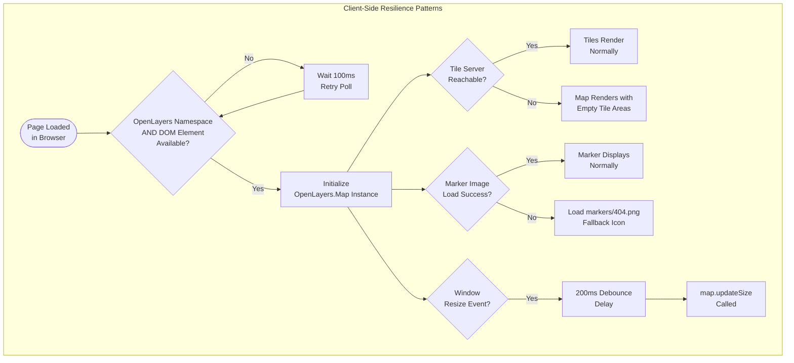

These three client-side mechanisms — polling retry for library/DOM readiness, image fallback for broken markers, and resize debounce — represent the full extent of resilience logic within the system. They operate independently within the browser and require no coordination with server-side components.

#### 6.1.4.3 Filesystem Caching Strategy

The plugin's sole caching mechanism is a filesystem-based artifact cache, documented in Section 5.3.4. This functions as a simple performance optimization, not a distributed caching layer:

| Cached Artifact | Location | Invalidation |
|---|---|---|
| SVG elevation diagram | Same directory as GPX file (`<filename>.svg`) | Manual file deletion |
| SVG speed diagram | Same directory as GPX file (`<filename>_speed.svg`) | Manual file deletion |
| ZIP archive | Same directory as GPX file (`<filename>.zip`) | Manual file deletion |

When `cache=on` (default), the plugin checks for file existence before regeneration (`gpxtrackmap.php`, lines 1409–1411 and 1599–1600). When `cache=off`, artifacts are always regenerated. No automatic cache invalidation, TTL-based expiry, or distributed cache coordination exists. Write permission is verified via the `isWritable()` method (`gpxtrackmap.php`, lines 1646–1665) before any write operation.

---

### 6.1.5 Comparison: Services Architecture vs. Actual Architecture

The following diagram provides a visual comparison between what a services architecture would entail and the actual monolithic architecture of GPXTrackMap 2:

```mermaid
flowchart TB
    subgraph Typical["Typical Services Architecture (NOT APPLICABLE)"]
        direction TB
        GW["API Gateway"]
        S1["Service A"]
        S2["Service B"]
        S3["Service C"]
        MQ["Message Queue"]
        DB1["Database A"]
        DB2["Database B"]
        SD["Service Discovery"]
        LB["Load Balancer"]
        CB["Circuit Breaker"]

        LB --> GW
        GW --> S1
        GW --> S2
        S1 --> MQ
        MQ --> S3
        S1 --> DB1
        S2 --> DB2
        SD --> S1
        SD --> S2
        SD --> S3
        CB --> S1
        CB --> S2
    end

    subgraph Actual["GPXTrackMap 2 Actual Architecture"]
        direction TB
        JoomlaEvt["Joomla CMS<br/>onContentPrepare Event"]
        PluginClass["PlgContentGPXTrackMap<br/>(Single PHP Class)"]
        FS["File System<br/>(GPX + Cache)"]
        HTMLOut["Assembled HTML<br/>Output"]
        BrowserMap["Browser<br/>(OpenLayers 2.13.2)"]
        ExtTiles["External Tile<br/>Servers"]

        JoomlaEvt --> PluginClass
        PluginClass --> FS
        PluginClass --> HTMLOut
        HTMLOut --> BrowserMap
        BrowserMap --> ExtTiles
    end
```

The contrast illustrates the fundamental difference: where a services architecture requires API gateways, service discovery, message queues, multiple databases, load balancers, and circuit breakers, GPXTrackMap 2 operates as a single PHP class within a CMS event lifecycle, reading files from the local filesystem and emitting self-contained HTML.

---

### 6.1.6 When Services Architecture Might Become Relevant

While currently not applicable, a services architecture could become relevant for GPXTrackMap if future requirements introduced any of the following capabilities:

| Future Capability | Service Implication |
|---|---|
| Server-side tile proxy / caching | Would require an independent tile caching service to shield API keys and reduce client-side requests |
| Multi-user GPX management | Would require a database-backed user service and potentially a storage service |
| Real-time GPS tracking | Would require WebSocket or SSE services for live data streaming |
| GPX processing at scale | Would require a background job queue and worker service for large-file processing |
| Headless / API-first access | Would require a REST or GraphQL API service layer separating data from presentation |

None of these capabilities exist in the current V2.0.1 release. The system's constraints — no database (C-004), fixed OpenLayers version (C-005), read-only GPX visualization (C-003), and single ZIP deployment — collectively preclude the need for service decomposition.

---

### 6.1.7 Summary

GPXTrackMap 2 is a self-contained, monolithic Joomla 5 content plugin where all server-side logic resides in a single 1,666-line PHP class (`PlgContentGPXTrackMap`). The system has no database backend, no intermediate API layer, no build pipeline, no containerization, and no inter-service communication. It follows a two-tier architecture with one-way server→client data flow, distributing as a single ZIP archive. Consequently, service components, scalability design patterns, and distributed resilience mechanisms described in standard services architecture frameworks are not applicable. The application-level resilience patterns documented in Section 6.1.4 — graceful degradation, client-side retry polling, image fallback, and filesystem caching — represent the complete set of fault-tolerance mechanisms within this system.

---

#### References

- `gpxtrackmap.php` — Sole server-side PHP class (1,666 lines); confirms monolithic architecture, single-class design, Joomla CMSPlugin base class, seven Joomla API imports, complete rendering pipeline
- `gpxtrackmap.xml` — Joomla extension manifest (577 lines); confirms plugin type, file inventory, 90+ configuration parameters, ZIP-based distribution model
- `gpxtrackmap.js` — Client-side JavaScript template (131 lines); confirms client-side resilience patterns (100ms polling, 200ms resize debounce, 404.png fallback)
- `OpenLayers.2.13.2.full.js` — Bundled mapping library; confirms self-contained client-side dependency with no external service calls
- `OpenStreetMap.js` — Tile layer definitions (200 lines); confirms client-side-only tile fetching pattern
- `markers/` — Static PNG icon assets; confirms read-only browser-accessed assets
- `theme/default/` — CSS stylesheets (8 files); confirms static asset delivery
- Repository root directory — Full listing confirms absence of Dockerfile, docker-compose.yml, CI/CD pipelines, API route files, service mesh configs, and all service infrastructure artifacts
- Section 2.6 (Assumptions and Constraints) — Constraints C-001 through C-005 confirming architectural boundaries
- Section 3.1 (Stack Overview) — Two-tier technology stack with no intermediate API layer, database backend, or build pipeline
- Section 3.7 (Development & Deployment) — No build system, no development tooling, no CI/CD, no containerization
- Section 5.1 (High-Level Architecture) — Monolithic content plugin architecture, system boundaries, one-way data flow
- Section 5.2 (Component Details) — Complete component inventory confirming all components reside in a single codebase
- Section 5.3 (Technical Decisions) — Architecture Decision Records: monolithic single-class design, no intermediate API layer, one-way data flow
- Section 5.4 (Cross-Cutting Concerns) — Error handling, graceful degradation, performance optimization, and security patterns operating at the application level

## 6.2 Database Design

### 6.2.1 Applicability Assessment

**Database Design is not applicable to the GPXTrackMap 2 system.** The plugin does not create, read from, or write to any database tables. All data persistence is achieved through Joomla's built-in extension parameter system, the server file system, and session-scoped state — none of which involve direct database interaction from the plugin code.

This determination is grounded in an explicit architectural constraint, formally documented architecture decision records, and exhaustive code-level verification across the entire repository.

#### 6.2.1.1 Governing Architectural Constraint

The absence of database usage is not incidental but is a deliberate design decision codified as a formal system constraint:

| ID | Type | Statement |
|---|---|---|
| **C-004** | Constraint | No database tables are used; all configuration persists in Joomla extension params |

This constraint, documented in Section 2.6 (Assumptions and Constraints), governs all data storage decisions throughout the system and directly eliminates the need for schema design, migration procedures, query optimization, or any other database-centric concerns.

#### 6.2.1.2 Architecture Decision Record

Section 5.3.3 (Data Storage Solution Rationale) formally records the rationale and trade-offs for this decision:

| Attribute | Detail |
|---|---|
| **Decision** | No database tables (C-004) |
| **Rationale** | Zero database dependency simplifies deployment; Joomla manages config persistence in `#__extensions` |
| **Trade-off** | No structured query capability; no relational data; no full-text search |

This trade-off is accepted because the system's data model — read-only GPX files, cached SVG/ZIP artifacts, and CMS-managed configuration — does not require relational querying, transactional writes, or structured data retrieval.

#### 6.2.1.3 Code-Level Verification

Exhaustive analysis of the codebase confirms the complete absence of any database interaction:

| Verification Target | Scope | Result |
|---|---|---|
| SQL keywords in source code | All `.php`, `.xml`, `.ini` files | Zero matches for `SELECT`, `INSERT`, `UPDATE`, `DELETE`, `CREATE TABLE`, `ALTER TABLE`, `DROP TABLE`, `JOIN`, `WHERE` |
| Joomla Database API usage | `gpxtrackmap.php` (1,666 lines) | Zero matches for `getDbo`, `getDb`, `JDatabaseDriver`, `DatabaseInterface`, `loadResult`, `loadObject`, `loadAssoc` |
| Database table references | Entire repository | Zero matches for `#__` table prefix patterns |
| SQL installation files | Repository-wide file search | Zero `.sql` files found (no `install.sql`, `uninstall.sql`, `update.sql`, or migration scripts) |

| Verification Target | Scope | Result |
|---|---|---|
| Extension manifest SQL elements | `gpxtrackmap.xml` (577 lines) | No `<install>` or `<uninstall>` SQL elements declared |
| Dependency management files | Repository root | No `composer.json` or `package.json` — no ORM, database library, or migration tool dependencies |
| Database configuration | Repository root | No `.env`, database connection strings, or DSN configurations |

The plugin's entire server-side logic resides in a single 1,666-line PHP class (`PlgContentGPXTrackMap` in `gpxtrackmap.php`) that uses exclusively Joomla's file system APIs (`File`, `Path`), XML parsing (`simplexml_load_file()`), archive utilities (`Archive`), and CMS service locators (`Factory`, `Uri`, `Text`). No database-related import or method call exists anywhere in the codebase.

---

### 6.2.2 Alternative Data Persistence Architecture

Although GPXTrackMap 2 has no database, it implements a well-defined data persistence strategy through three complementary mechanisms. This subsection documents each mechanism in full to provide the equivalent context that a database design section would normally cover.

#### 6.2.2.1 Data Persistence Overview

The following diagram illustrates the complete data persistence architecture, showing how data flows through the system without any database involvement:

```mermaid
flowchart TB
    subgraph JoomlaPlatform["Joomla 5 Platform (Managed by CMS)"]
        ExtTable["#__extensions Table<br/>(Joomla-managed, plugin has<br/>NO direct access)"]
        SessionStore["Joomla Session Handler<br/>(Per-request state)"]
        LangAPI["Joomla Language API<br/>(283 translation strings)"]
    end

    subgraph PluginRuntime["GPXTrackMap Plugin Runtime"]
        ParamObj["$this->params<br/>(CMSPlugin inherited)"]
        UserState["Factory::getApplication()<br/>->getUserState() / setUserState()"]
        TextAPI["Text::_() / Text::sprintf()"]
        FileOps["simplexml_load_file()<br/>File::exists() / Path::check()<br/>isWritable()"]
    end

    subgraph FileSystem["Server File System"]
        GPXFiles["GPX XML Files<br/>(Read-Only Source Data)"]
        SVGCache["SVG Diagram Cache<br/>(.svg elevation + speed)"]
        ZIPCache["ZIP Archive Cache<br/>(.zip compressed GPX)"]
        StaticAssets["Static Assets<br/>(markers/, theme/, templates)"]
    end

    subgraph ConfigSource["Configuration Source"]
        Manifest["gpxtrackmap.xml<br/>(90+ parameters,<br/>12 fieldsets)"]
        INIFile["plg_content_gpxtrackmap.ini<br/>(283 language strings)"]
    end

    ExtTable -->|"Joomla loads params<br/>on plugin init"| ParamObj
    Manifest -->|"Installed via<br/>Extension Manager"| ExtTable
    INIFile -->|"Loaded by<br/>Language API"| LangAPI
    LangAPI --> TextAPI
    SessionStore --> UserState
    ParamObj -->|"Read 90+<br/>config values"| FileOps
    FileOps -->|"Read GPX data"| GPXFiles
    FileOps -->|"Write cached<br/>artifacts"| SVGCache
    FileOps -->|"Write compressed<br/>archives"| ZIPCache
    FileOps -->|"Read templates<br/>and icons"| StaticAssets
```

#### 6.2.2.2 Mechanism 1 — Joomla Extension Parameter System

The primary configuration persistence mechanism is Joomla's built-in extension parameter system. The plugin defines over 90 administrator-configurable parameters across 12 fieldsets in `gpxtrackmap.xml`, which Joomla stores internally in its `#__extensions` database table. Critically, the plugin itself never directly queries, reads from, or writes to this table — all parameter access is mediated through the `CMSPlugin`-inherited `$this->params` object.

| Attribute | Detail |
|---|---|
| **Storage Location** | Joomla `#__extensions` table (CMS-managed) |
| **Access Method** | `$this->params->get('paramName', defaultValue)` |
| **Parameter Count** | 90+ parameters across 12 fieldsets |
| **Definition Source** | `gpxtrackmap.xml` (577 lines) |
| **Write Path** | Joomla Admin UI → Extension Manager → `#__extensions` |
| **Plugin Write Access** | None — strictly read-only consumption |

| Attribute | Detail |
|---|---|
| **Language Strings** | 283 translation strings in `plg_content_gpxtrackmap.ini` |
| **Language Access** | `Joomla\CMS\Language\Text::_()` and `Text::sprintf()` |
| **Language Management** | Joomla Language API (file-system-based INI loading) |

This design means that **all configuration backup, migration, and versioning is handled by standard Joomla CMS administration** — database exports, Joomla extension manager operations, or hosting-level backup solutions cover configuration persistence without any plugin-specific database procedures.

#### 6.2.2.3 Mechanism 2 — File System Storage

The file system serves as the sole data storage and caching layer for runtime data. Three distinct categories of file system interaction exist:

#### GPX File Access (Read-Only Source Data)

| Attribute | Detail |
|---|---|
| **Root Directory** | Configurable via `gpxroot` parameter (default: `/images/gpx/`) |
| **Remote Support** | HTTP/HTTPS URLs accepted with prefix validation (`gpxtrackmap.php`, lines 186–203) |
| **Format** | GPX 1.0 / 1.1 XML (constraint C-002) |
| **Access Pattern** | Read via `simplexml_load_file()` — no modification of source files (constraint C-003) |
| **Data Model** | XML elements: `<trk>`, `<trkseg>`, `<trkpt>`, `<rte>`, `<rtept>`, `<wpt>`, with `<ele>`, `<time>`, `<name>`, `<desc>`, `<sym>` child elements |

#### SVG Diagram Cache (Write — Computed Artifacts)

| Attribute | Detail |
|---|---|
| **File Patterns** | `<gpxfilename>.svg` (elevation), `<gpxfilename>_speed.svg` (speed) |
| **Location** | Written alongside GPX source files |
| **Cache Control** | Enabled when `cache=on` (default); disabled when `cache=off` |
| **Invalidation** | Manual deletion required — no automatic invalidation |
| **Write Safety** | `isWritable()` check before all writes (`gpxtrackmap.php`, lines 1409–1411, 1552–1558) |

#### ZIP Archive Cache (Write — Compressed Downloads)

| Attribute | Detail |
|---|---|
| **File Pattern** | `<gpxfilename>.zip` |
| **Location** | Written alongside GPX source files |
| **Compression** | `Joomla\Archive\Archive` ZIP adapter (`gpxtrackmap.php`, lines 1586–1620) |
| **Cache Control** | Same as SVG cache — persists indefinitely when `cache=on` |
| **Write Safety** | `isWritable()` check before compression |

#### Static Assets (Read-Only)

| Asset Category | Directory | Contents |
|---|---|---|
| **Marker Icons** | `markers/` | PNG files (21×25px): 4 icon sets × 7 colors, waypoint markers, `404.png` fallback |
| **CSS Themes** | `theme/default/` | 8 CSS files for desktop, mobile, Google, and IE6 variants |
| **HTML Templates** | Plugin root | `template1.html`–`template6.html`, fullscreen control templates |

#### 6.2.2.4 Mechanism 3 — Session State Management

The plugin uses Joomla's session-backed state API for transient, per-request counter management:

| State Key | Purpose | API |
|---|---|---|
| `gtmcount` | Global map counter — generates unique IDs (`map0`, `map1`, …) | `Factory::getApplication()->getUserState()` / `setUserState()` |
| `gtmcountarticles` | Article counter — ensures JS/CSS libraries are injected only once per page render | `Factory::getApplication()->getUserState()` / `setUserState()` |

These counters are initialized at `gpxtrackmap.php` lines 52–65 and incremented at lines 104–106 and 133–135. The state persists only for the duration of the page render request and does not require external session storage beyond Joomla's default session handler. No cross-request persistence is needed or provided.

---

### 6.2.3 Data Flow Without a Database

#### 6.2.3.1 Complete Data Flow Diagram

The following diagram traces all data read and write operations through the system, demonstrating how each data flow bypasses any database layer:

```mermaid
flowchart LR
    subgraph InputSources["Data Input Sources"]
        AdminUI["Joomla Admin UI<br/>(Parameter Configuration)"]
        GPXSource["GPX Files<br/>(Local or Remote)"]
        ArticleContent["Article Content<br/>(Shortcode Tags)"]
    end

    subgraph ProcessingEngine["Plugin Processing Engine"]
        ParamRead["Parameter Resolution<br/>(Three-Tier Merge)"]
        GPXParse["GPX XML Parsing<br/>(SimpleXML)"]
        StatsCalc["Statistics Computation<br/>(40+ Metrics)"]
        SVGRender["SVG Diagram<br/>Rendering"]
        ZIPCreate["ZIP Archive<br/>Creation"]
        TokenSub["Template Token<br/>Substitution"]
    end

    subgraph OutputTargets["Data Output Targets"]
        HTMLPage["Assembled HTML<br/>(Browser Delivery)"]
        SVGFile["SVG Cache File<br/>(File System)"]
        ZIPFile["ZIP Cache File<br/>(File System)"]
    end

    AdminUI -->|"Joomla stores in<br/>#__extensions"| ParamRead
    GPXSource -->|"simplexml_load_file()"| GPXParse
    ArticleContent -->|"Regex match"| ParamRead
    ParamRead --> GPXParse
    GPXParse --> StatsCalc
    StatsCalc --> SVGRender
    StatsCalc --> TokenSub
    SVGRender -->|"cache=on"| SVGFile
    SVGRender --> TokenSub
    StatsCalc --> ZIPCreate
    ZIPCreate -->|"cache=on"| ZIPFile
    TokenSub --> HTMLPage
```

#### 6.2.3.2 Data Lifecycle Summary

The data lifecycle in GPXTrackMap 2 follows a stateless, request-scoped model with optional filesystem caching:

| Phase | Data Source | Operation | Destination |
|---|---|---|---|
| **Configuration Load** | Joomla `#__extensions` (CMS-mediated) | Read | `$this->params` object |
| **Shortcode Detection** | Article HTML content | Regex match | Inline parameter extraction |
| **Parameter Resolution** | Inline → Preset → Admin defaults | Three-tier merge | Resolved configuration |
| **GPX Parsing** | Local/remote GPX XML file | `simplexml_load_file()` | In-memory data arrays |

| Phase | Data Source | Operation | Destination |
|---|---|---|---|
| **Statistics Computation** | In-memory GPX data | PHP calculations | 40+ statistical metrics |
| **SVG Generation** | Statistical metrics | PHP string building | File system cache (optional) |
| **ZIP Compression** | Source GPX file | `Archive` ZIP adapter | File system cache (optional) |
| **Output Assembly** | Templates + tokens + stats | Token substitution | HTML string in article |
| **Counter Management** | Session state | Increment per map/article | Session state (per-request) |

---

### 6.2.4 Database-Equivalent Concerns Addressed

This subsection maps standard database design concerns to their resolution within GPXTrackMap 2's database-free architecture.

#### 6.2.4.1 Schema Design Equivalence

Since no database schema exists, the following table documents how the system addresses each schema design concern:

| Schema Concern | Status | Resolution |
|---|---|---|
| **Entity Relationships** | Not applicable | No entities stored in relational form; GPX data is read from XML files, configuration stored in Joomla extension params |
| **Data Models** | File-based | GPX 1.0/1.1 XML schema defines the data model; plugin parameters defined in `gpxtrackmap.xml` |
| **Indexing Strategy** | Not applicable | No database indexes; file lookup is by filename convention (`<gpxfilename>.svg`, `<gpxfilename>.zip`) |
| **Partitioning** | Not applicable | No data partitioning; files reside in a single configurable directory |
| **Replication** | Not applicable | No data replication; relies on hosting-level backup |
| **Backup Architecture** | Delegated to hosting | Standard web hosting backup covers file system and Joomla database |

#### 6.2.4.2 Data Management Equivalence

| Management Concern | Status | Resolution |
|---|---|---|
| **Migration Procedures** | Joomla Extension Manager | Plugin updates deployed via ZIP upload; no SQL migration scripts required |
| **Versioning Strategy** | Manifest-driven | Version tracked in `gpxtrackmap.xml` (`version` element); no database schema versions |
| **Archival Policies** | Not applicable | No data archival; GPX files are user-managed, cache files persist until manually deleted |
| **Caching Policies** | Filesystem-based | SVG and ZIP artifacts cached alongside source GPX files with manual invalidation (Section 5.3.4) |

#### 6.2.4.3 Compliance and Security Equivalence

| Compliance Concern | Status | Resolution |
|---|---|---|
| **Data Retention** | Not applicable | Plugin stores no user data; GPX files and cache are site-owner managed |
| **Backup / Fault Tolerance** | Delegated | Relies on standard hosting backup practices; no plugin-specific DR procedures |
| **Privacy Controls** | Not applicable | No personal data collected, stored, or processed by the plugin |
| **Audit Mechanisms** | Not applicable | No audit logging; Joomla's core audit log covers admin parameter changes |
| **Access Controls** | Joomla ACL | File system permissions govern GPX/cache access; Joomla ACL controls admin configuration |

#### 6.2.4.4 Performance Optimization Equivalence

| Performance Concern | Status | Resolution |
|---|---|---|
| **Query Optimization** | Not applicable | No database queries; GPX parsing optimized via SimpleXML streaming |
| **Caching Strategy** | Filesystem cache | Existence-check-based caching (`file_exists()`) for SVG and ZIP artifacts; `cache=on/off` toggle |
| **Connection Pooling** | Not applicable | No database connections; PHP process lifespan equals single HTTP request |
| **Read/Write Splitting** | Not applicable | No database reads/writes; file reads are source data, file writes are cache only |
| **Batch Processing** | Not applicable | Each page request processes only the GPX files referenced in that article's shortcodes |

---

### 6.2.5 Caching Architecture Detail

Although not a database, the filesystem caching mechanism is the closest equivalent to a data management layer in this system and merits detailed documentation.

#### 6.2.5.1 Cache Decision Flow

```mermaid
flowchart TD
    Start([Plugin Processes<br/>Shortcode])
    CacheEnabled{cache parameter<br/>= on?}
    FileExists{Cached file<br/>exists on disk?}
    Writable{Directory is<br/>writable?}
    Reuse[Reuse Existing<br/>Cached File]
    Generate[Generate SVG/ZIP<br/>Artifact]
    WriteToDisk[Write Artifact<br/>to File System]
    ServeInline[Serve Generated<br/>Artifact Inline]
    WarnUser[Emit Warning:<br/>Directory Not Writable]
    SkipCache[Serve Without<br/>Caching]

    Start --> CacheEnabled
    CacheEnabled -->|Yes| FileExists
    CacheEnabled -->|No| Generate
    Generate -->|"cache=off"| ServeInline
    FileExists -->|Yes| Reuse
    FileExists -->|No| Writable
    Writable -->|Yes| Generate
    Generate -->|"cache=on"| WriteToDisk
    Writable -->|No| WarnUser
    WarnUser --> SkipCache
```

#### 6.2.5.2 Cached Artifact Inventory

| Artifact | File Pattern | Generation Source | Invalidation | Code Reference |
|---|---|---|---|---|
| Elevation SVG | `<name>.svg` | `renderDiagram()` | Manual deletion | Lines 1409–1411 |
| Speed SVG | `<name>_speed.svg` | `renderDiagram()` | Manual deletion | Lines 1552–1558 |
| ZIP Archive | `<name>.zip` | `ziptrackfile()` | Manual deletion | Lines 1586–1620 |

#### 6.2.5.3 Cache Characteristics

| Characteristic | Behavior |
|---|---|
| **Cache Key** | Filename-based — derived from the source GPX filename |
| **TTL / Expiry** | None — artifacts persist indefinitely until manually deleted |
| **Automatic Invalidation** | Not implemented — changing GPX source data does not invalidate cached SVG/ZIP |
| **Write Verification** | `isWritable()` method (`gpxtrackmap.php`, lines 1646–1665) called before every write operation |
| **Failure Behavior** | Warning emitted if directory is not writable; map rendering continues without caching |
| **Co-location Strategy** | Cache files written to the same directory as the source GPX file |

---

### 6.2.6 Future Considerations

While database design is not applicable to the current V2.0.1 release, a database backend could become relevant if future requirements introduced capabilities beyond the plugin's current scope. As documented in Section 6.1.6, the following scenarios would necessitate a database design:

| Future Capability | Database Implication |
|---|---|
| **Multi-user GPX management** | Would require a database-backed user service and storage service for per-user track libraries |
| **Server-side tile proxy/caching** | Would require a tile metadata and cache management database |
| **Real-time GPS tracking** | Would require persistent storage for live track data streams |
| **GPX processing at scale** | Would require a job queue database for background processing |
| **Headless / API-first access** | Would require a data layer separating content from presentation |

None of these capabilities exist in the current system. The constraints — no database (C-004), fixed OpenLayers version (C-005), read-only GPX visualization (C-003), and single ZIP deployment — collectively define a system architecture that is intentionally and effectively database-free.

---

### 6.2.7 Summary

GPXTrackMap 2 operates entirely without a database. Constraint C-004 explicitly prohibits database table usage, and this decision is validated by exhaustive code analysis revealing zero SQL statements, zero database API calls, and zero database-related files across the entire repository. The system achieves all data persistence through three mechanisms: Joomla's extension parameter system for configuration (CMS-managed, not plugin-accessed), the server file system for GPX source data and cached SVG/ZIP artifacts, and Joomla's session state API for transient per-request counters. This architecture yields zero database dependency, simplified deployment via a single ZIP archive, and complete reliance on standard Joomla CMS and hosting-level backup procedures for data protection.

---

#### References

- `gpxtrackmap.php` — Sole server-side PHP class (1,666 lines); verified absence of all SQL keywords, Joomla Database API calls, and `#__` table references; contains file system caching logic (lines 1409–1411, 1552–1558, 1586–1620) and write safety checks (lines 1646–1665)
- `gpxtrackmap.xml` — Joomla extension manifest (577 lines); defines 90+ configuration parameters across 12 fieldsets; confirmed absence of `<install>` and `<uninstall>` SQL elements
- `plg_content_gpxtrackmap.ini` — Language file containing 283 translation strings managed by Joomla's Language API
- `markers/` — Static PNG icon assets (read-only browser-accessed files)
- `theme/default/` — CSS stylesheets (8 files, read-only static assets)
- `template1.html`–`template6.html` — HTML layout templates (read-only, loaded by PHP engine)
- Repository root directory — Full listing confirms absence of `.sql` files, `composer.json`, `package.json`, `.env`, and all database-related artifacts
- Section 2.6 (Assumptions and Constraints) — Constraint C-004: "No database tables are used; all configuration persists in Joomla extension params"
- Section 3.1 (Stack Overview) — Confirms "no intermediate API layer, database backend, or build pipeline"
- Section 3.6 (Data Storage) — Primary reference for all three data persistence mechanisms: extension parameters, file system storage, and session state
- Section 5.1 (High-Level Architecture) — Confirms "No database backend (constraint C-004)" as a core architectural principle
- Section 5.3.3 (Data Storage Solution Rationale) — Architecture Decision Record for no-database design with rationale and trade-offs
- Section 6.1 (Core Services Architecture) — Confirms non-applicability of database backend with evidence table and future considerations

## 6.3 Integration Architecture

### 6.3.1 Applicability Assessment

**Conventional Integration Architecture is not applicable for this system.** GPXTrackMap 2 is a monolithic Joomla 5 content plugin that operates as a single-class server-side rendering pipeline with client-side map initialization. It does not implement REST or GraphQL API endpoints, message queues, event buses, API gateways, stream processing infrastructure, or inter-service communication patterns that would warrant a standard integration architecture specification.

This determination is consistent with the findings documented in Section 6.1 (Core Services Architecture — not applicable) and Section 6.2 (Database Design — not applicable), and is grounded in the system's explicit architectural decisions, its confinement within the Joomla plugin lifecycle, and the complete absence of integration infrastructure artifacts in the codebase.

#### 6.3.1.1 Architectural Evidence

The following evidence, drawn from the repository structure and formal architecture decision records, confirms the non-applicability of a conventional integration architecture:

| Evidence Category | Finding | Source |
|---|---|---|
| **Architecture Style** | Monolithic single-class PHP architecture | `gpxtrackmap.php` (1,666 lines) |
| **API Layer** | No REST, GraphQL, or intermediate API endpoints | Section 5.3.2 ADR |
| **Communication Model** | One-way server→client data flow; no dynamic server communication after page load | Section 5.3.2 ADR |

| Evidence Category | Finding | Source |
|---|---|---|
| **Database Backend** | No database tables (C-004) | Section 2.6, Constraint C-004 |
| **Message Infrastructure** | No message queues, event buses, or broker configurations | Repository root listing |
| **Deployment Model** | Single ZIP archive via Joomla Extension Manager | `gpxtrackmap.xml`, line 2 |
| **Build/CI Infrastructure** | No Dockerfile, docker-compose.yml, CI/CD pipelines, or orchestration files | Repository root listing |

#### 6.3.1.2 Non-Applicable Integration Concepts

The following table systematically maps each standard integration architecture concept specified in the section prompt to its status within GPXTrackMap 2:

| Integration Concept | Status | Evidence |
|---|---|---|
| REST/GraphQL API Endpoints | Not applicable | ADR: "No intermediate API layer" (Section 5.3.2) |
| API Gateway | Not applicable | No gateway configuration files; no proxy server |
| Message Queues | Not applicable | No queue configurations; single-process model |
| Event Bus / Stream Processing | Not applicable | No message broker; Joomla `onContentPrepare` event only |
| Batch Processing Systems | Not applicable | Per-request shortcode processing only |

| Integration Concept | Status | Evidence |
|---|---|---|
| Rate Limiting | Not applicable | No API endpoints to rate-limit |
| API Versioning | Not applicable | No API exists to version |
| Circuit Breakers | Not applicable | No inter-service calls to protect |
| Service Discovery | Not applicable | Plugin uses Observer pattern subscription |
| External Service Contracts | Not applicable | Client-side tile URL patterns only |
| Legacy System Interfaces | Not applicable | No legacy integration |

#### 6.3.1.3 Architecture Decision Records

Two formal architecture decisions documented in Section 5.3 directly preclude a conventional integration architecture:

| Attribute | ADR: No Intermediate API Layer |
|---|---|
| **Decision** | Plugin outputs final HTML directly — no REST or GraphQL endpoints |
| **Rationale** | No API endpoints needed for this use case |
| **Trade-off** | Cannot be consumed by external applications or headless frontends |

| Attribute | ADR: Client-Side Direct Tile Fetching |
|---|---|
| **Decision** | Tile requests issued directly from browser to external servers |
| **Rationale** | Eliminates server-side proxy complexity; tile caching handled by browser and CDN |
| **Trade-off** | API key exposure in client JS; tile server dependency at the client level |

---

### 6.3.2 Actual Integration Architecture

While a conventional integration architecture does not apply, GPXTrackMap 2 implements five well-defined integration points that span the boundary between the plugin and external systems. These integration points represent the complete set of interfaces through which the system exchanges data with its environment, and they are documented in the following subsections in lieu of standard integration architecture concerns.

#### 6.3.2.1 Integration Point Overview

The system's integration architecture operates across two execution tiers — server-side (PHP within Joomla) and client-side (JavaScript in the browser) — connected by a one-way data flow with no bidirectional communication after page delivery.

```mermaid
flowchart TB
    subgraph ServerIntegrations["Server-Side Integration Points"]
        IP1["IP-1: Joomla CMS<br/>Framework APIs<br/>(7 Joomla APIs)"]
        IP3["IP-3: PHP→JS Token<br/>Substitution Bridge<br/>(23 Tokens)"]
        IP4["IP-4: File System<br/>GPX + SVG/ZIP Cache"]
    end

    subgraph ClientIntegrations["Client-Side Integration Points"]
        IP2["IP-2: External Tile<br/>Service Providers<br/>(8 Tile Layers)"]
        IP5["IP-5: OpenLayers 2.13.2<br/>Mapping Library"]
    end

    subgraph DataFlow["One-Way Data Flow"]
        direction LR
        Server["Server Tier<br/>(PHP)"]
        Client["Client Tier<br/>(Browser)"]
        Server -->|"Assembled HTML<br/>+ Inline JS"| Client
    end

    IP1 --> IP3
    IP4 --> IP3
    IP3 --> DataFlow
    DataFlow --> IP5
    IP5 --> IP2
```

| Integration Point | ID | Tier | Pattern | Protocol |
|---|---|---|---|---|
| Joomla CMS Framework | IP-1 | Server | Observer / Event-driven | PHP method calls |
| External Tile Providers | IP-2 | Client | Direct HTTP tile fetch | HTTPS GET |
| PHP→JS Token Bridge | IP-3 | Server→Client | Template rendering | String substitution |
| File System Access | IP-4 | Server | Direct file I/O | PHP filesystem APIs |
| OpenLayers Library | IP-5 | Client | Constructor-based | JavaScript API |

#### 6.3.2.2 Technology Integration Matrix

The complete integration matrix documenting all component-to-component interfaces in the system, as established in Section 3.9:

| Source Component | Target Component | Integration Interface |
|---|---|---|
| Joomla CMS Core | Plugin PHP | `onContentPrepare` event dispatch |
| Plugin PHP | Joomla HtmlDocument | `addCustomTag()` method |
| Plugin PHP | Joomla Archive API | `getAdapter('zip')` method |
| Plugin PHP | Joomla Factory | `getUserState()` / `setUserState()` |

| Source Component | Target Component | Integration Interface |
|---|---|---|
| Plugin PHP | SimpleXML | `simplexml_load_file()` |
| Plugin PHP | gpxtrackmap.js | Token substitution (23 placeholders) |
| gpxtrackmap.js | OpenLayers 2.13.2 | `new OpenLayers.Map()` constructor |
| OpenStreetMap.js | OpenLayers 2.13.2 | `OpenLayers.Layer.OSM` class extension |

| Source Component | Target Component | Integration Interface |
|---|---|---|
| OpenLayers 2.13.2 | Tile Servers | HTTP GET `/${z}/${x}/${y}.png` |
| Plugin PHP | File System | `file_put_contents()` / `simplexml_load_file()` |
| Plugin PHP | HTML Templates | `file_get_contents()` + `str_replace()` |

---

### 6.3.3 Integration Point Details

#### 6.3.3.1 IP-1: Joomla CMS Framework Integration

#### Integration Pattern

The plugin integrates with the Joomla 5 CMS via the Observer design pattern, subscribing to the `onContentPrepare` lifecycle event. The `PlgContentGPXTrackMap` class extends `Joomla\CMS\Plugin\CMSPlugin` (`gpxtrackmap.php`, line 36) and registers its `onContentPrepare` method (line 98) as the sole entry point for all processing.

#### Consumed Joomla APIs

The plugin consumes seven distinct Joomla framework APIs, imported at `gpxtrackmap.php` lines 27–34:

| Joomla API | Import Location | Purpose |
|---|---|---|
| `Joomla\CMS\Plugin\CMSPlugin` | Line 27 | Base class; event subscription lifecycle |
| `Joomla\CMS\Factory` | Line 28 | Application, session, and language access |
| `Joomla\CMS\Uri\Uri` | Line 29 | URL construction for assets and files |

| Joomla API | Import Location | Purpose |
|---|---|---|
| `Joomla\CMS\Document\HtmlDocument` | Line 30 | JS/CSS injection into page `<head>` |
| `Joomla\CMS\Language\Text` | Line 31 | Translation string resolution (`Text::_()`) |
| `Joomla\CMS\Filesystem\File` / `Path` | Lines 32–33 | File existence checks and path validation |
| `Joomla\Archive\Archive` | Line 34 | ZIP archive creation |

#### Joomla API Interaction Methods

| API Method | Integration Direction | Data Exchanged |
|---|---|---|
| `onContentPrepare(context, &article, &params, limitstart)` | Joomla → Plugin | Article HTML body, context string |
| `HtmlDocument::addCustomTag()` | Plugin → Joomla | `<script>` and `<link>` tags for `<head>` |
| `Factory::getApplication()->getUserState()` / `setUserState()` | Bidirectional | Counter values (`gtmcount`, `gtmcountarticles`) |

| API Method | Integration Direction | Data Exchanged |
|---|---|---|
| `Archive::getAdapter('zip')` | Plugin → Joomla | GPX file data → compressed ZIP output |
| `Text::_()` / `Text::sprintf()` | Plugin → Joomla | Translation key → localized string |
| `File::exists()`, `Path::check()` | Plugin → Joomla | File path → boolean existence result |
| `Uri::root()`, `Uri::base()` | Plugin → Joomla | Request for base URL components |

#### Language String Injection

The plugin constructor (`gpxtrackmap.php`, lines 77–87) employs a non-standard integration pattern for language loading. Rather than using Joomla's standard language loading mechanism, it directly injects 283 INI strings into the Language object's protected `$strings` property using PHP `ReflectionClass`. This bypasses the standard Joomla language loading API while still integrating with the `Text::_()` resolution mechanism used throughout the plugin.

#### Joomla Integration Sequence

```mermaid
sequenceDiagram
    participant Joomla as Joomla 5 CMS
    participant Plugin as PlgContentGPXTrackMap
    participant Session as Joomla UserState
    participant HtmlDoc as HtmlDocument
    participant LangAPI as Joomla Language API

    Note over Joomla,Plugin: Plugin Initialization (Once per page request)
    Joomla->>Plugin: __construct() via plugin loader
    Plugin->>Plugin: ReflectionClass injection of 283 INI strings
    Plugin->>Session: unsetCounter(gtmcount, gtmcountarticles)

    Note over Joomla,Plugin: Per-Article Event Dispatch
    Joomla->>Plugin: onContentPrepare(context, &article, &params, limitstart)
    Plugin->>Plugin: Regex scan for {gpxtrackmap} shortcodes
    Plugin->>Session: getUserState(gtmcountarticles)
    Plugin->>Session: setUserState(gtmcountarticles, incremented)

    alt First Article on Page
        Plugin->>HtmlDoc: addCustomTag(OpenLayers.2.13.2.full.js)
        Plugin->>HtmlDoc: addCustomTag(OpenStreetMap.js)
        Plugin->>HtmlDoc: addCustomTag(CSS stylesheets)
    end

    loop Each Shortcode Block
        Plugin->>Session: getUserState(gtmcount)
        Plugin->>Session: setUserState(gtmcount, incremented)
        Plugin->>LangAPI: Text::_() for localized strings
        Plugin->>Plugin: Process shortcode → generate HTML
    end

    Plugin-->>Joomla: Modified article content (shortcodes replaced with HTML)
```

#### 6.3.3.2 IP-2: External Tile Service Providers

#### Integration Pattern

All tile requests originate from the visitor's browser via the OpenLayers 2.13.2 library. No server-side proxy, tile cache, or relay mechanism exists — the plugin's PHP code generates JavaScript that instructs OpenLayers to fetch tiles directly from third-party servers. This is a deliberate architectural decision documented in Section 5.3.2 (ADR: Client-side direct tile fetching).

#### Tile Provider Catalog

| Provider | Layer ID(s) | Authentication |
|---|---|---|
| OpenStreetMap Mapnik | 0 (default) | None |
| OpenStreetMap DE | 2 | None |
| Thunderforest CycleMap | 1 | API Key |

| Provider | Layer ID(s) | Authentication |
|---|---|---|
| Thunderforest Transport | 11 | API Key |
| Thunderforest Landscape | 12 | API Key |
| Thunderforest Outdoors | 13 | API Key |
| OpenTopoMap | 15 | None |
| NASA SRTM3 Hillshading | Overlay | None |

#### Tile Request Protocol

All tile providers use a common protocol pattern with minor variations:

| Attribute | Specification |
|---|---|
| **Protocol** | HTTPS (protocol-relative URLs resolve to HTTPS) |
| **Method** | HTTP GET |
| **URL Pattern** | `/${z}/${x}/${y}.png` (standard slippy-map) |
| **Subdomain Rotation** | `a`, `b`, `c` subdomains for parallel loading |
| **Response Format** | 256×256 PNG tile images |
| **NASA SRTM3 Variant** | TMS protocol via `osm_getTileURL()` helper function |

#### Thunderforest API Key Management Flow

The Thunderforest tile services are the only providers requiring authentication. The API key flows through a four-stage pipeline:

```mermaid
sequenceDiagram
    participant Admin as Site Administrator
    participant JoomlaUI as Joomla Admin Panel
    participant Plugin as Plugin PHP<br/>(gpxtrackmap.php)
    participant Browser as Visitor Browser
    participant TF as Thunderforest<br/>Tile Servers

    Note over Admin,JoomlaUI: Configuration Phase (One-Time)
    Admin->>JoomlaUI: Enter Thunderforest API key
    JoomlaUI->>JoomlaUI: Store in tfapikey parameter<br/>(gpxtrackmap.xml, line 555)

    Note over Plugin,Browser: Request Phase (Per Page Load)
    Plugin->>Plugin: Read tfapikey from $this->params<br/>(gpxtrackmap.php, line 306)
    Plugin->>Plugin: Append ?apikey= to tile URL templates
    Plugin->>Browser: Deliver HTML with embedded JS<br/>(API key in tile layer config)

    Note over Browser,TF: Tile Fetch Phase (Per Map Interaction)
    Browser->>TF: GET /cycle/{z}/{x}/{y}.png?apikey=KEY
    TF-->>Browser: 256×256 PNG tile image
    Note right of Browser: API key visible in<br/>network inspector<br/>(accepted security risk)
```

| Stage | Actor | Action | Evidence |
|---|---|---|---|
| 1. Obtain | Administrator | Register at thunderforest.com | Section 3.5.3 |
| 2. Configure | Administrator | Enter key in `tfapikey` parameter | `gpxtrackmap.xml`, line 555 |
| 3. Inject | Plugin PHP | Read key, append to JS tile URLs | `gpxtrackmap.php`, line 306 |
| 4. Transmit | Browser | Append `?apikey=` on every tile GET | `OpenStreetMap.js`, lines 47–170 |

**Security implication**: The API key is embedded in client-side JavaScript and is visible in the browser's network inspector for every Thunderforest tile request. No server-side proxy exists to shield it. This is documented as an accepted security risk in Section 3.8 and Section 5.4.3.

#### Custom Tile Layer Extensibility

The system supports up to three administrator-defined custom tile layers (Layer IDs 8, 9, 10), loaded from external JavaScript files (`gpxtrackmap.php`, lines 370–376):

| Slot | Expected File | Status |
|---|---|---|
| Custom Layer 1 | `CustomMapLayer1.js` | Not bundled — administrator-created |
| Custom Layer 2 | `CustomMapLayer2.js` | Not bundled — administrator-created |
| Custom Layer 3 | `CustomMapLayer3.js` | Not bundled — administrator-created |

These files are loaded via `file_get_contents()` with `%MAPVAR%` token substitution, and must define valid `OpenLayers.Layer` subclass constructors compatible with the OpenLayers 2.13.2 API.

#### 6.3.3.3 IP-3: PHP → JavaScript Token Substitution Bridge

#### Integration Pattern

The server-to-client data bridge is implemented through a two-pass token substitution mechanism. The PHP engine reads template files as raw strings and replaces placeholder tokens with instance-specific values, producing self-contained JavaScript and HTML output per map instance.

#### First Pass — JavaScript Template (23 Map Tokens)

The PHP plugin reads `gpxtrackmap.js` via `file_get_contents()` and performs `str_replace()` with 23 placeholder tokens (`gpxtrackmap.php`, lines 538–556):

| Token Category | Tokens | Purpose |
|---|---|---|
| Instance Identity | `%MAPVAR%`, `%MAPCLASS%` | Unique map ID, CSS class |
| Data Source | `%GPXPATH%`, `%GPXLAYERNAME%` | GPX file URL, layer name |
| Map Dimensions | `%MAPWIDTH%`, `%MAPHEIGHT%` | Container width and height |

| Token Category | Tokens | Purpose |
|---|---|---|
| Track Styling | `%TRACKCOLOR%`, `%TRACKWIDTH%`, `%TRACKOPACITY%`, `%TRACKDASHSTYLE%` | Polyline appearance |
| Map Configuration | `%MAPLAYERS%`, `%MAPCONTROLS%`, `%ZOOMCODE%`, `%NOMOUSEWHEELZOOM%` | Layer set, controls, zoom |
| Waypoints/Markers | `%MARKERLAYER%`, `%MARKERCODE%`, `%WPTCODE%`, `%WPCOLOR%`, `%WPRADIUS%` | Marker and waypoint rendering |
| Features | `%EXTRACTCODE%`, `%HILLSHADINGLAYER%`, `%MAPFULLSCREEN_ENTER%`, `%MAPFULLSCREEN_EXIT%` | Extent zoom, hillshading, fullscreen |

Each map instance receives a fully independent JavaScript block with unique function names (`initMap_map0`, `initMap_map1`, etc.) and DOM element IDs. No shared mutable state exists between instances, ensuring multi-instance isolation.

#### Second Pass — HTML Template (40+ Statistical Tokens)

After map token substitution, the selected HTML layout template undergoes a second substitution pass with 40+ statistical placeholders derived from GPX parsing:

| Token Category | Example Tokens |
|---|---|
| Distance | `%DISTANCE-KM%`, `%DISTANCE-MI%`, `%DISTANCE-NM%` |
| Elevation | `%ELE-UP-M%`, `%ELE-DOWN-M%`, `%ELE-MIN-M%`, `%ELE-MAX-M%` |
| Speed | `%AVGSPEED-KMH%`, `%MAXSPEED-KMH%`, `%MOVINGSPEED-KMH%` |
| Time | `%STARTTIME%`, `%ENDTIME%`, `%DURATION%`, `%MOVINGTIME%` |
| Layout | `%TRACKMAP%`, `%TRACKDIAGRAM%`, `%SPEEDDIAGRAM%`, `%TRACKDOWNLOAD%` |

#### Token Substitution Data Flow

```mermaid
flowchart TD
    subgraph ServerProcessing["Server-Side Token Substitution"]
        JSTemplate["gpxtrackmap.js<br/>(131-line template)"]
        HTMLTemplate["template1–6.html<br/>(Layout template)"]
        ParamEngine["Parameter Resolution<br/>Engine (collectParams)"]
        GPXParser["GPX Parser<br/>(getGpxFileInfo)"]
        Pass1["Pass 1: str_replace()<br/>23 Map Tokens → JS"]
        Pass2["Pass 2: str_replace()<br/>40+ Stat Tokens → HTML"]
        FinalOutput["Assembled HTML + JS<br/>per Map Instance"]
    end

    subgraph ClientExecution["Client-Side Execution"]
        BrowserParse["Browser Parses<br/>Inline JavaScript"]
        InitFunc["initMap_mapN()<br/>Self-Contained Function"]
        OLMap["OpenLayers.Map<br/>Instance Created"]
    end

    JSTemplate --> Pass1
    ParamEngine -->|"Map config<br/>values"| Pass1
    Pass1 --> FinalOutput
    HTMLTemplate --> Pass2
    GPXParser -->|"40+ statistics"| Pass2
    Pass2 --> FinalOutput
    FinalOutput -->|"Page delivery<br/>(one-way)"| BrowserParse
    BrowserParse --> InitFunc
    InitFunc --> OLMap
```

#### 6.3.3.4 IP-4: File System Integration

#### Integration Pattern

The file system serves as the sole persistent data layer, handling three categories of I/O operations: GPX source file reading, computed artifact caching (SVG/ZIP), and static asset loading. All operations use PHP's native filesystem functions and Joomla's `File`/`Path` API wrappers.

#### GPX File Access

| Attribute | Specification |
|---|---|
| **Root Directory** | Configurable via `gpxroot` parameter (default: `/images/gpx/`) |
| **Local Resolution** | Paths resolved relative to `gpxroot` using Joomla `Path` API |
| **Remote Support** | HTTP/HTTPS URLs accepted with `http://`/`https://` prefix validation |
| **Parsing Method** | `simplexml_load_file()` for GPX 1.0/1.1 XML (`gpxtrackmap.php`, line 764) |
| **Access Pattern** | Read-only — plugin never creates or modifies GPX files (Constraint C-003) |

#### Filesystem Cache Operations

| Artifact | File Pattern | Write Method | Cache Control |
|---|---|---|---|
| Elevation SVG | `<gpxfilename>.svg` | `file_put_contents()` | `cache=on/off` toggle |
| Speed SVG | `<gpxfilename>_speed.svg` | `file_put_contents()` | `cache=on/off` toggle |
| ZIP Archive | `<gpxfilename>.zip` | `Archive::getAdapter('zip')` | `cache=on/off` toggle |

| Cache Characteristic | Behavior |
|---|---|
| **Cache Key** | Filename-based — derived from source GPX filename |
| **Invalidation** | Manual deletion only — no automatic TTL or content-change detection |
| **Co-location** | Cache files written alongside source GPX files |
| **Write Safety** | `isWritable()` check (`gpxtrackmap.php`, lines 1646–1665) before all writes |
| **Failure Mode** | Warning emitted; map rendering continues without caching |

#### Static Asset Loading

| Asset Category | Load Method | Files |
|---|---|---|
| JS Template | `file_get_contents()` | `gpxtrackmap.js` |
| HTML Templates | `file_get_contents()` | `template1–6.html`, fullscreen templates |
| Custom Layers | `file_get_contents()` | `CustomMapLayer1–3.js` (if present) |
| Marker Icons | Browser HTTP GET | `markers/*.png` |
| CSS Themes | Browser HTTP GET | `theme/default/*.css` |

#### 6.3.3.5 IP-5: OpenLayers Library Integration

#### Integration Pattern

The client-side map rendering is delegated to the bundled OpenLayers 2.13.2 library (`OpenLayers.2.13.2.full.js`), which is permanently locked at this version per Constraint C-005. Integration occurs through the OpenLayers JavaScript constructor API, configured via the token-substituted JavaScript generated by IP-3.

#### OpenLayers API Surface Used

| API Category | Classes Utilized | Purpose |
|---|---|---|
| Map Core | `OpenLayers.Map` | Map container with EPSG:900913 projection |
| Base Layers | `OpenLayers.Layer.OSM` | Tile layer management (6 providers) |
| Overlay Layers | `OpenLayers.Layer.TMS` | NASA SRTM3 hillshading overlay |

| API Category | Classes Utilized | Purpose |
|---|---|---|
| Vector Layers | `OpenLayers.Layer.Vector` | GPX track polyline rendering |
| Marker Layers | `OpenLayers.Layer.Markers` | Start/end and waypoint markers |
| Data Pipeline | `Strategy.Fixed`, `Protocol.HTTP`, `Format.GPX` | GPX file fetch and parse |
| Interactive | `Feature`, `Icon`, `Popup.FramedCloud` | Waypoint popups with BBCode content |
| Controls (10) | `Navigation`, `PanZoomBar`, `Zoom`, `LayerSwitcher`, `ScaleLine`, `OverviewMap`, `MousePosition`, `Graticule`, `Attribution`, `SelectFeature` | Configurable map interaction overlays |

#### Map Initialization Configuration

Maps are constructed with a fixed projection configuration (`gpxtrackmap.js`, lines 34–43):

| Parameter | Value |
|---|---|
| **Projection** | EPSG:900913 (Spherical Mercator) |
| **Display Projection** | EPSG:4326 (WGS84 geographic) |
| **Max Extent** | −20,037,508.34 to 20,037,508.34 |
| **Max Resolution** | 156,543.0399 |
| **Zoom Levels** | 19 |

#### Client-Side GPX Vector Loading

OpenLayers fetches the GPX file directly from the server via `Protocol.HTTP`, independently of the server-side GPX parsing that occurred during page generation:

```mermaid
sequenceDiagram
    participant Init as initMap_mapN()
    participant OL as OpenLayers.Map
    participant HTTP as Protocol.HTTP
    participant Server as Web Server<br/>(GPX File)
    participant Tiles as Tile Servers

    Init->>Init: Poll every 100ms for<br/>OpenLayers namespace + DOM
    Init->>OL: new OpenLayers.Map(config)
    OL->>OL: Add tile layer(s)
    OL->>Tiles: HTTP GET /${z}/${x}/${y}.png
    Tiles-->>OL: PNG tile images

    OL->>HTTP: new Protocol.HTTP({url: gpxPath})
    HTTP->>Server: HTTP GET gpxfile.gpx
    Server-->>HTTP: GPX XML content
    HTTP->>OL: Format.GPX parses to vector features

    OL->>OL: loadend event fires
    OL->>OL: zoomToExtent(track bounds)
    OL->>OL: Place start/end markers
    OL->>OL: Render waypoints with popups
```

---

### 6.3.4 End-to-End Integration Flow

#### 6.3.4.1 Complete Request Lifecycle

The following diagram traces the complete integration flow from initial Joomla event dispatch through final interactive map rendering, showing all five integration points in their execution sequence:

```mermaid
sequenceDiagram
    participant Joomla as Joomla 5 CMS<br/>(IP-1)
    participant Plugin as PlgContentGPXTrackMap
    participant FS as File System<br/>(IP-4)
    participant Bridge as Token Bridge<br/>(IP-3)
    participant Browser as User Browser
    participant OL as OpenLayers 2.13.2<br/>(IP-5)
    participant Tiles as Tile Servers<br/>(IP-2)

    Note over Joomla,Tiles: SERVER-SIDE PHASE
    Joomla->>Plugin: onContentPrepare(article)
    Plugin->>Plugin: Regex scan for shortcodes
    Plugin->>Joomla: addCustomTag() — JS/CSS (first article)

    loop Each Shortcode
        Plugin->>Plugin: collectParams() — 3-tier merge
        Plugin->>FS: simplexml_load_file(GPX)
        FS-->>Plugin: Parsed XML object
        Plugin->>Plugin: Compute 40+ statistics
        Plugin->>FS: Write SVG/ZIP cache (if needed)
        Plugin->>FS: Load JS + HTML templates
        Plugin->>Bridge: Token substitution (23 + 40+ tokens)
        Bridge-->>Plugin: Assembled HTML + JS
        Plugin->>Plugin: Replace shortcode in article
    end
    Plugin-->>Joomla: Modified article content

    Note over Joomla,Tiles: ONE-WAY PAGE DELIVERY
    Joomla-->>Browser: Complete HTML page

    Note over Browser,Tiles: CLIENT-SIDE PHASE
    Browser->>OL: initMap_mapN() — 100ms polling
    OL->>FS: HTTP GET GPX file (via Protocol.HTTP)
    FS-->>OL: GPX XML data
    OL->>Tiles: HTTP GET /${z}/${x}/${y}.png
    Tiles-->>OL: PNG tile images
    OL-->>Browser: Interactive map widget ready
```

#### 6.3.4.2 Data Flow Model

The system follows a strictly **one-way server→client data flow** with no bidirectional communication (Section 5.1.3, Section 5.3.2):

| Phase | Direction | Description |
|---|---|---|
| **Server Phase** | Joomla → Plugin → File System | Event dispatch, GPX parsing, statistics computation, SVG/ZIP generation |
| **Bridge Phase** | Server → Client (one-way) | Token substitution assembles final HTML; Joomla delivers rendered page |
| **Client Phase** | Browser → External Servers | OpenLayers fetches GPX vector data and tile imagery directly |

**No return channel** exists. After the initial page delivery, no communication occurs between the browser and the GPXTrackMap plugin. All tile requests are issued directly from the browser to external tile servers — no server-side proxy, relay, or API gateway intermediates these requests.

---

### 6.3.5 Security at Integration Boundaries

#### 6.3.5.1 Security Mechanism Matrix

Each integration point has specific security mechanisms and associated risk levels, documented in Section 3.8, Section 5.3.5, and Section 5.4.3:

| Integration Point | Security Mechanism | Risk Level |
|---|---|---|
| IP-1: Joomla execution | `defined('_JEXEC') or die;` (`gpxtrackmap.php`, line 25) | Low |
| IP-1: Language injection | `ReflectionClass` bypasses standard Joomla language API | Low |
| IP-2: Thunderforest API key | Exposed in client-side JS; no server proxy | Accepted |

| Integration Point | Security Mechanism | Risk Level |
|---|---|---|
| IP-3: JS string injection | `addslashes()` applied to translated strings in JS context (line 278) | Low |
| IP-4: GPX path resolution | Paths relative to `gpxroot`; Joomla `Path` API validation | Low–Moderate |
| IP-4: Remote GPX URLs | `http://`/`https://` prefix validation only — no content-type or size check | Moderate |

| Integration Point | Security Mechanism | Risk Level |
|---|---|---|
| IP-4: File write operations | `isWritable()` verification before all writes (lines 1646–1665) | Low |
| IP-4: BBCode in waypoints | Whitelist of 8 tags; no raw HTML pass-through (lines 818–829) | Low |
| IP-5: OpenLayers 2.13.2 | No upstream security patches; operates in browser sandbox | Moderate |
| IP-5: Marker image fallback | `404.png` fallback on load failure (`gpxtrackmap.js`, line 76) | Low |

#### 6.3.5.2 Accepted Security Risks

Three security risks at integration boundaries have been explicitly documented and accepted:

| Risk | Integration Point | Mitigation Status |
|---|---|---|
| **API key exposure** — Thunderforest API key visible in browser network inspector on every tile request | IP-2 | Accepted — architectural limitation of client-side tile fetching; no server-side proxy exists |
| **Remote GPX content** — No content-type or file size validation for HTTP/HTTPS GPX URLs | IP-4 | Partially mitigated — `http://`/`https://` prefix validation only (`gpxtrackmap.php`, lines 186–203) |
| **Unpatched library** — OpenLayers 2.13.2 receives no upstream security maintenance | IP-5 | Accepted — library operates in sandboxed browser context; local bundling prevents CDN compromise |

---

### 6.3.6 Error Handling at Integration Boundaries

#### 6.3.6.1 Server-Side Integration Errors

Error conditions at server-side integration boundaries are handled through inline HTML warnings and silent fallbacks, as documented in Section 5.4.1:

| Integration Point | Error Condition | Response | Severity |
|---|---|---|---|
| IP-1 | JS template file missing | Fatal red HTML error; abort processing | Fatal |
| IP-4 | GPX file not found | Red HTML warning; continue with empty data | Warning |
| IP-4 | XML parse failure | Return empty array; statistics render as empty | Silent |

| Integration Point | Error Condition | Response | Severity |
|---|---|---|---|
| IP-4 | HTML template not found | Warning emitted; hardcoded fallback layout | Warning |
| IP-4 | SVG/ZIP write failure | Warning appended to `_warnings` buffer | Warning |
| IP-4 | Directory not writable | Warning emitted; caching disabled, rendering continues | Warning |
| IP-3 | Custom layer file missing | Warning via `warnCustom()` method | Warning |

#### 6.3.6.2 Client-Side Integration Errors

Client-side error handling operates through polling, fallback, and graceful degradation patterns:

| Integration Point | Error Condition | Response |
|---|---|---|
| IP-5 | OpenLayers namespace not loaded | 100ms retry polling continues indefinitely (`gpxtrackmap.js`, lines 29–31) |
| IP-5 | DOM element not ready | 100ms retry polling continues until element appears |
| IP-5 | Marker image load failure | Fallback to `markers/404.png` (`gpxtrackmap.js`, line 76) |
| IP-2 | Tile server unavailable | Map renders but displays empty/broken tile areas |
| IP-5 | Window resize event | 200ms debounced `map.updateSize()` call |

#### 6.3.6.3 Integration Error Flow

```mermaid
flowchart TD
    subgraph ServerBoundary["Server-Side Integration Errors"]
        JSMissing{JS Template<br/>Exists?}
        FatalAbort[Fatal: Red Error HTML<br/>Processing Aborted]
        GPXMissing{GPX File<br/>Exists?}
        GPXWarn[Warning: File Not Found<br/>Continue Empty]
        XMLFail{XML Parse<br/>Success?}
        XMLSilent[Silent: Empty Array<br/>Stats = n/a]
        TPLMissing{Template<br/>Exists?}
        TPLFallback[Fallback: Hardcoded Layout<br/>+ Warning]
        WriteFail{Directory<br/>Writable?}
        WriteWarn[Warning: Cache Disabled<br/>Rendering Continues]
        NormalOut([Normal HTML Output])
    end

    subgraph ClientBoundary["Client-Side Integration Errors"]
        OLPoll{OpenLayers +<br/>DOM Ready?}
        Retry[Wait 100ms<br/>Retry]
        MapOK[Map Initialized]
        ImgFail{Image<br/>Load Error?}
        Img404[Load markers/404.png]
        TileFail{Tile Server<br/>Available?}
        TilesOK[Tiles Render]
        TilesBroken[Empty Tile Areas<br/>Track Still Visible]
    end

    JSMissing -->|No| FatalAbort
    JSMissing -->|Yes| GPXMissing
    GPXMissing -->|No| GPXWarn
    GPXMissing -->|Yes| XMLFail
    GPXWarn --> XMLFail
    XMLFail -->|No| XMLSilent
    XMLFail -->|Yes| TPLMissing
    XMLSilent --> TPLMissing
    TPLMissing -->|No| TPLFallback
    TPLMissing -->|Yes| WriteFail
    TPLFallback --> WriteFail
    WriteFail -->|No| WriteWarn
    WriteFail -->|Yes| NormalOut
    WriteWarn --> NormalOut

    OLPoll -->|No| Retry
    Retry --> OLPoll
    OLPoll -->|Yes| MapOK
    MapOK --> ImgFail
    ImgFail -->|Yes| Img404
    MapOK --> TileFail
    TileFail -->|Yes| TilesOK
    TileFail -->|No| TilesBroken
```

---

### 6.3.7 Integration Assumptions and Constraints

#### 6.3.7.1 Governing Assumptions

The integration architecture operates under the following documented assumptions from Section 2.6:

| ID | Assumption | Integration Impact |
|---|---|---|
| A-001 | PHP 8+ with SimpleXML extension enabled | Required for IP-4 GPX file parsing via `simplexml_load_file()` |
| A-002 | Web server has write permissions in GPX directory | Required for IP-4 SVG/ZIP cache writes |
| A-003 | External tile servers maintain current URL structures | Required for IP-2 tile fetching — any URL change breaks map imagery |
| A-004 | Site visitors have JavaScript enabled | Required for IP-5 OpenLayers initialization and IP-2 tile requests |

#### 6.3.7.2 Governing Constraints

| ID | Constraint | Integration Impact |
|---|---|---|
| C-002 | Only GPX format accepted | IP-4 file parsing limited to GPX 1.0/1.1 XML |
| C-003 | Read-only GPX visualization | IP-4 never writes to GPX source files |
| C-004 | No database tables | All integration is file-based or event-based; no database-mediated integration |
| C-005 | OpenLayers 2.13.2 fixed version | IP-5 locked to OL2 API; no migration path to OL3+ |

---

### 6.3.8 Future Integration Considerations

While a conventional integration architecture is not applicable to the current V2.0.1 release, the following future capabilities — as documented in Sections 6.1.6 and 6.2.6 — would introduce integration architecture requirements:

| Future Capability | Integration Implication |
|---|---|
| Server-side tile proxy/caching | Would require an independent tile caching service with proxy API, shielding API keys from client exposure |
| Multi-user GPX management | Would require database-backed user service and authentication API layer |
| Real-time GPS tracking | Would require WebSocket or Server-Sent Events (SSE) integration for live data streaming |
| GPX processing at scale | Would require background job queue with worker service and message processing infrastructure |
| Headless / API-first access | Would require REST or GraphQL API service layer separating data from presentation |

None of these capabilities exist in the current system. The constraints — no database (C-004), fixed OpenLayers version (C-005), read-only GPX visualization (C-003), and single ZIP deployment — collectively define a system that requires no conventional integration architecture.

---

### 6.3.9 Summary

GPXTrackMap 2 does not implement a conventional integration architecture. No REST or GraphQL API endpoints, message queues, event buses, API gateways, stream processing systems, or inter-service communication patterns exist anywhere in the codebase. This is consistent with the system's monolithic, single-class design and the formal Architecture Decision Records documented in Section 5.3.

The system does, however, implement five well-defined integration points that span the boundary between the plugin and its environment: (1) Joomla CMS framework integration via seven consumed APIs and the `onContentPrepare` Observer pattern; (2) external tile service provider integration via client-side HTTPS tile fetching across eight tile layers from five providers; (3) a PHP→JavaScript token substitution bridge that transfers server-computed configuration and statistics to client-side map instances through 23 map tokens and 40+ statistical placeholders; (4) file system integration for GPX parsing, SVG/ZIP caching, and template loading; and (5) OpenLayers 2.13.2 library integration for all client-side map rendering. All five integration points follow a strictly one-way server→client data flow with no bidirectional communication after initial page delivery.

---

#### References

- `gpxtrackmap.php` — Sole server-side PHP class (1,666 lines); all integration logic including Joomla API usage (lines 27–34), event handler (line 98), tile layer configuration (lines 306, 316–321, 370–376, 419–436), token substitution (lines 538–556), GPX parsing (line 764), cache operations (lines 1409–1411, 1552–1558, 1586–1620), write safety (lines 1646–1665), and security mechanisms (lines 25, 186–207, 278, 818–829)
- `gpxtrackmap.js` — Client-side JavaScript template (131 lines); OpenLayers integration, 100ms polling (lines 29–31), TMS tile URL helper, 200ms resize debounce (lines 18–22), fullscreen toggle (lines 90–128), marker fallback (line 76)
- `OpenStreetMap.js` — Tile layer definitions (200 lines); 6 tile layer constructors, Thunderforest API key injection pattern, URL templates for all providers
- `gpxtrackmap.xml` — Extension manifest (577 lines); plugin type declaration, Thunderforest API key parameter `tfapikey` (line 555), file inventory, 90+ configuration parameters
- `plg_content_gpxtrackmap.ini` — Language file (283 translation strings); consumed by Language API integration
- `markers/` — Static PNG marker icons; browser-accessed assets with `404.png` fallback
- `theme/default/` — CSS stylesheets (8 files); browser-accessed static assets
- `template1.html`–`template6.html` — HTML layout templates with 40+ placeholder tokens
- Section 2.6 (Assumptions and Constraints) — Assumptions A-001 through A-004 and Constraints C-001 through C-005 governing integration boundaries
- Section 3.5 (Third-Party Services) — Tile service architecture, provider catalog, API key management, custom layer extensibility
- Section 3.8 (Technology Security Considerations) — Security risk matrix across all integration points
- Section 3.9 (Technology Integration Matrix) — Complete component-to-component integration interface documentation
- Section 5.1 (High-Level Architecture) — System overview, data flow architecture, external integration points
- Section 5.2 (Component Details) — Component inventory with integration relationships
- Section 5.3 (Technical Decisions) — ADRs: monolithic architecture, no API layer, client-side tile fetching, caching strategy
- Section 5.4 (Cross-Cutting Concerns) — Error handling at integration boundaries, security framework, graceful degradation
- Section 6.1 (Core Services Architecture) — Non-applicability assessment; two-tier architecture; system boundaries
- Section 6.2 (Database Design) — Non-applicability assessment; alternative data persistence mechanisms

## 6.4 Security Architecture

### 6.4.1 Applicability Assessment

**Detailed Security Architecture for authentication, authorization, and RBAC is not applicable for this system.** GPXTrackMap 2 is a monolithic Joomla 5 content plugin that operates as a single-class server-side rendering pipeline (`PlgContentGPXTrackMap` in `gpxtrackmap.php`, 1,666 lines) with client-side map initialization. It does not implement independent authentication, authorization, identity management, user accounts, session management, token handling, role-based access control, or audit logging. All such concerns are delegated entirely to the host Joomla 5 CMS platform.

This determination is consistent with the findings documented in Section 6.1 (Core Services Architecture — not applicable), Section 6.2 (Database Design — not applicable), and Section 6.3 (Integration Architecture — non-conventional), and is grounded in the system's explicit architectural decisions, its confinement within the Joomla plugin lifecycle, and the complete absence of security infrastructure artifacts in the codebase.

#### 6.4.1.1 Architectural Evidence

The following evidence confirms the non-applicability of a conventional security architecture comprising authentication frameworks, authorization systems, and full data protection stacks:

| Evidence Category | Finding | Source |
|---|---|---|
| **Architecture Style** | Monolithic single-class PHP architecture; no middleware layer | `gpxtrackmap.php` (1,666 lines) |
| **API Layer** | No REST, GraphQL, or intermediate API endpoints to protect | Section 5.3.2 ADR |
| **Communication Model** | One-way server→client data flow; no bidirectional communication after page load | Section 5.3.2 ADR |

| Evidence Category | Finding | Source |
|---|---|---|
| **Database Backend** | No database tables; no user data stored (C-004) | Section 2.6, Constraint C-004 |
| **Data Model** | Read-only GPX visualization; no user-generated content (C-003) | Section 2.6, Constraint C-003 |
| **User Management** | No login, logout, registration, password, or token handling | Repository-wide examination |
| **Session Usage** | Joomla `UserState` used solely for map counters — not authentication state | `gpxtrackmap.php`, lines 90–91, 104–105, 121–122 |

#### 6.4.1.2 Non-Applicable Security Concepts

The following table systematically maps each conventional security architecture concept to its status within GPXTrackMap 2:

| Security Concept | Status | Rationale |
|---|---|---|
| Identity Management | Not applicable | No user identities managed; Joomla handles all identity |
| Multi-Factor Authentication | Not applicable | No authentication mechanism exists in the plugin |
| Session Management | Not applicable | No plugin-specific sessions; Joomla `UserState` used only for map counters |

| Security Concept | Status | Rationale |
|---|---|---|
| Token Handling (JWT/OAuth) | Not applicable | No API endpoints; no token-based authentication |
| Password Policies | Not applicable | No user accounts or credentials |
| Role-Based Access Control | Not applicable | Plugin processes all articles uniformly; no user differentiation |

| Security Concept | Status | Rationale |
|---|---|---|
| Permission Management | Not applicable | Joomla admin panel controls plugin configuration access |
| Policy Enforcement Points | Not applicable | No authorization gates in plugin code |
| Audit Logging | Not applicable | No user actions to audit; no logging infrastructure |

#### 6.4.1.3 Security Delegation Model

GPXTrackMap 2 delegates all conventional security responsibilities to the Joomla 5 CMS platform. The plugin operates within the trust boundary established by Joomla's content lifecycle and inherits the platform's security posture without augmentation.

```mermaid
flowchart TB
    subgraph JoomlaPlatformSecurity["Joomla 5 Platform Security (DELEGATED)"]
        AuthN["Authentication<br/>User Login / Logout<br/>Session Management"]
        AuthZ["Authorization<br/>ACL / User Groups<br/>Content Access Control"]
        AdminAccess["Admin Panel Access<br/>Plugin Configuration<br/>Article Editing Rights"]
        SessionMgmt["Session Management<br/>CSRF Protection<br/>Cookie Security"]
    end

    subgraph PluginScope["GPXTrackMap 2 Plugin Scope"]
        ExecGuard["Execution Guard<br/>defined JEXEC or die"]
        PathValidation["Path Traversal<br/>Mitigation"]
        XSSPrevention["XSS Prevention<br/>BBCode Whitelist"]
        JSEscape["JS Injection<br/>Prevention"]
        WriteSafety["Write Safety<br/>isWritable Check"]
        ImgFallback["Image Error<br/>Resilience"]
    end

    subgraph PluginProcessing["Plugin Content Processing"]
        ContentTransform["Article Content<br/>Transformation"]
    end

    AuthN -->|"User authenticated<br/>before content render"| ContentTransform
    AuthZ -->|"Article access<br/>verified by Joomla"| ContentTransform
    AdminAccess -->|"Config access<br/>controlled by Joomla"| ContentTransform
    SessionMgmt -->|"Session validated<br/>by Joomla"| ContentTransform
    ContentTransform --> ExecGuard
    ExecGuard --> PathValidation
    PathValidation --> XSSPrevention
    XSSPrevention --> JSEscape
    JSEscape --> WriteSafety
    WriteSafety --> ImgFallback
```

| Joomla Security Responsibility | Plugin Dependency |
|---|---|
| User authentication and session lifecycle | Plugin activates only after Joomla completes authentication |
| Article access control via ACL user groups | Plugin receives only articles the user is authorized to view |
| Admin panel access for plugin configuration | Only authorized Joomla administrators can modify plugin parameters |
| CSRF token validation on admin forms | Joomla handles all form token validation |

**Standard security practices followed in lieu of a custom security architecture:**

1. **Platform Security Delegation** — All authentication, authorization, session management, and user administration are handled by Joomla 5 CMS
2. **Joomla Extension Security Conventions** — `defined('_JEXEC') or die;` execution guard, use of Joomla's `File`/`Path` API for filesystem operations, and use of Joomla's `UserState` API for session-scoped counters
3. **Input Validation** — Path validation, URL prefix checking, BBCode whitelist approach
4. **Output Encoding** — `addslashes()` for JavaScript context strings
5. **Write Protection** — Permission checks before all filesystem writes
6. **Local Asset Bundling** — Eliminates CDN dependency and mixed-content warnings (Section 5.3, ADR: Local Asset Bundling)
7. **Open-Source Auditability** — GPLv3 license enables external security review

---

### 6.4.2 Application-Level Security Controls

While a conventional security architecture is not applicable, GPXTrackMap 2 implements six distinct application-level security mechanisms that protect against specific threat vectors relevant to a content-rendering plugin. These controls are documented in Section 5.3.5 (Security Mechanism Selection) and Section 5.4.3 (Security Framework) and are consolidated here as the authoritative security reference.

#### 6.4.2.1 Security Control Inventory

The following table presents the complete security control matrix for all application-level mechanisms implemented by the plugin:

| Control ID | Security Layer | Mechanism | Location | Risk Mitigated |
|---|---|---|---|---|
| SC-01 | Execution Containment | `defined('_JEXEC') or die;` | `gpxtrackmap.php`, line 25 | Direct PHP file access outside Joomla |
| SC-02 | Path Traversal Mitigation | Paths resolved relative to `gpxroot`; Joomla `Path` API | `gpxtrackmap.php`, lines 186–207 | Directory traversal via inline parameters |
| SC-03 | XSS Prevention | BBCode whitelist (8 tags); no raw HTML pass-through | `gpxtrackmap.php`, lines 818–829 | Script injection via GPX waypoint descriptions |

| Control ID | Security Layer | Mechanism | Location | Risk Mitigated |
|---|---|---|---|---|
| SC-04 | JS Injection Prevention | `addslashes()` for translated strings in JS context | `gpxtrackmap.php`, line 278 | Script injection through language strings |
| SC-05 | Write Safety | `isWritable()` verification before all filesystem writes | `gpxtrackmap.php`, lines 1646–1665 | Unauthorized or unexpected file writes |
| SC-06 | Image Error Resilience | `404.png` fallback on image load failure | `gpxtrackmap.js`, line 76 | Broken marker/icon rendering errors |

#### 6.4.2.2 SC-01: Execution Containment

The primary server-side entry guard prevents direct browser access to the plugin's PHP file outside the Joomla CMS execution context. The constant `_JEXEC` is defined only by the Joomla application bootstrap; any direct HTTP request to `gpxtrackmap.php` triggers immediate script termination via `die;` before any plugin logic executes. This mechanism is the standard Joomla extension security convention and is placed at line 25, before all class definitions, imports, and logic.

| Attribute | Detail |
|---|---|
| **Implementation** | `defined('_JEXEC') or die;` |
| **Scope** | All server-side plugin execution |
| **Threat Addressed** | Direct PHP file access bypassing Joomla |
| **Residual Risk** | Low |

#### 6.4.2.3 SC-02: Path Traversal Mitigation

GPX file paths specified in article shortcode parameters are resolved relative to a configurable root directory (`gpxroot`, default: `/images/gpx/`). The Joomla `Path` API is used for path validation, and `File::exists()` verifies the resolved file path before any read operation occurs. Remote GPX URLs are validated by checking for `http://` or `https://` prefixes (`gpxtrackmap.php`, lines 186–203).

| Attribute | Detail |
|---|---|
| **Local Path Resolution** | `$gpx_dir = $this->_absolute_path . DIRECTORY_SEPARATOR . $this->_rootfolder;` (line 199) |
| **Remote URL Validation** | `str_starts_with($gpx_file, 'http://') \|\| str_starts_with($gpx_file, 'https://')` (line 186) |
| **File Existence Check** | `File::exists($gpx_filepath)` via Joomla's File API (lines 205–207) |
| **Residual Risk** | Low–Moderate (no comprehensive canonicalization; remote URL validation limited to prefix checking) |

#### 6.4.2.4 SC-03: XSS Prevention via BBCode Whitelist

Waypoint descriptions from GPX `<desc>` elements are processed through a BBCode whitelist approach that allows only eight specific formatting tags. No raw HTML is passed through to the rendered output. This mechanism prevents cross-site scripting (XSS) injection through maliciously crafted GPX files.

| Allowed BBCode Tag | HTML Equivalent | Purpose |
|---|---|---|
| `[br]` | `<br>` | Line break |
| `[b]...[/b]` | `<b>...</b>` | Bold text |
| `[u]...[/u]` | `<u>...</u>` | Underlined text |
| `[i]...[/i]` | `<i>...</i>` | Italic text |
| `[code]...[/code]` | `<code>...</code>` | Code formatting |
| `[quote]...[/quote]` | `<blockquote>...</blockquote>` | Quoted text |
| `[url=...]...[/url]` | `<a href='...'>...</a>` | Hyperlink |
| `[img]...[/img]` | `` | Image embed |

The implementation uses regex-based replacement (`preg_replace`) to convert BBCode tags to safe HTML equivalents, controlled by the `wppopupdescbb` parameter. The `[url]` and `[img]` tags accept arbitrary URLs from GPX data, which represents a mild residual risk as they could reference external resources.

#### 6.4.2.5 SC-04: JavaScript Injection Prevention

Localized strings injected into JavaScript context use `addslashes()` to escape special characters that could break out of string literals and inject executable code. This control is applied at line 278 of `gpxtrackmap.php` for base layer names, and at additional occurrences on lines 290 and 303 for layer names and graticule labels.

| Attribute | Detail |
|---|---|
| **Implementation** | `addslashes(Text::_('PLG_CONTENT_GTM_BASELAYER'))` |
| **Scope** | All translated strings embedded in JavaScript |
| **Threat Addressed** | Script injection through malicious language strings |
| **Residual Risk** | Low |

#### 6.4.2.6 SC-05: Write Safety

All filesystem write operations for SVG diagram caching and ZIP archive creation are preceded by a write permission verification via the `isWritable()` method (`gpxtrackmap.php`, lines 1646–1665). This method employs a robust testing approach rather than relying solely on PHP's `is_writable()` function.

| Target Type | Verification Method |
|---|---|
| **Directories** | Attempts to create a temporary file with `uniqid(mt_rand())` name; returns `false` if creation fails |
| **Files** | Attempts `fopen($path, 'a')`; cleans up if the file did not previously exist; returns `false` if open fails |

When write permission is denied, the plugin emits a warning and continues rendering without caching. Map functionality is preserved — only the performance optimization of cached artifacts is disabled.

#### 6.4.2.7 SC-06: Image Error Resilience

Client-side image load failures for marker icons are intercepted by OpenLayers' global error handler, which substitutes the failed image source with `markers/404.png` (`gpxtrackmap.js`, line 76). Additionally, the `osm_getTileURL()` helper function (line 11) returns `404.png` for out-of-bounds tile coordinate requests. While primarily a resilience mechanism, this prevents broken image indicators from exposing internal path information.

---

### 6.4.3 Security Zone Architecture

The system operates across five distinct security zones with specific trust levels and security mechanisms at each boundary crossing.

#### 6.4.3.1 Security Zone Diagram

```mermaid
flowchart TB
    subgraph Zone1["Zone 1: Joomla CMS Platform (TRUSTED)"]
        direction TB
        JoomlaAuth["Joomla Authentication<br/>& Session Management"]
        JoomlaACL["Joomla ACL<br/>& Access Control"]
        EventDispatch["onContentPrepare<br/>Event Dispatch"]
        JoomlaAPIs["Joomla File/Path/Archive<br/>Framework APIs"]
    end

    subgraph Zone2["Zone 2: Plugin Processing (SERVER-SIDE)"]
        direction TB
        ExecGuard2["SC-01: Execution Guard<br/>defined JEXEC or die"]
        PathVal["SC-02: Path Traversal<br/>Mitigation"]
        XSSPrev["SC-03: XSS Prevention<br/>BBCode Whitelist"]
        JSEsc["SC-04: JS Injection<br/>Prevention"]
        WriteChk["SC-05: Write Safety<br/>isWritable Check"]
    end

    subgraph Zone3["Zone 3: Server File System (LOCAL)"]
        direction TB
        GPXRead["GPX File Read<br/>(Read-Only)"]
        CacheWrite["SVG/ZIP Cache Write<br/>(Permission-Checked)"]
        TemplateLoad["Template/Asset Loading<br/>(Read-Only)"]
    end

    subgraph Zone4["Zone 4: User Browser (CLIENT-SIDE)"]
        direction TB
        OLSandbox["OpenLayers 2.13.2<br/>Browser Sandbox"]
        ImgFallback2["SC-06: Image Fallback<br/>markers/404.png"]
        InlineJS["Token-Substituted<br/>Self-Contained JS"]
    end

    subgraph Zone5["Zone 5: External Tile Services (REMOTE)"]
        direction TB
        OSMTiles["OpenStreetMap<br/>(No Auth)"]
        TFTiles["Thunderforest<br/>(API Key via Query Param)"]
        TopoTiles["OpenTopoMap<br/>(No Auth)"]
        NASATiles["NASA SRTM3<br/>(No Auth)"]
    end

    JoomlaAuth --> EventDispatch
    JoomlaACL --> EventDispatch
    EventDispatch -->|"Authenticated context"| ExecGuard2
    ExecGuard2 --> PathVal
    PathVal --> XSSPrev
    XSSPrev --> JSEsc
    JSEsc --> WriteChk
    JoomlaAPIs --> PathVal
    PathVal --> GPXRead
    WriteChk --> CacheWrite
    ExecGuard2 --> TemplateLoad
    WriteChk -->|"One-way HTML delivery"| InlineJS
    InlineJS --> OLSandbox
    OLSandbox --> ImgFallback2
    OLSandbox -->|"HTTPS tile requests"| OSMTiles
    OLSandbox -->|"HTTPS + API key"| TFTiles
    OLSandbox -->|"HTTPS tile requests"| TopoTiles
    OLSandbox -->|"HTTPS tile requests"| NASATiles
```

#### 6.4.3.2 Security Zone Trust Matrix

| Zone | Trust Level | Security Controls | Data Sensitivity |
|---|---|---|---|
| Zone 1: Joomla CMS Platform | Fully Trusted | Joomla authentication, ACL, CSRF, session management | User credentials, admin configuration |
| Zone 2: Plugin Processing | Trusted (within Joomla) | SC-01 through SC-05; Joomla API wrappers | Plugin parameters, GPX file paths |
| Zone 3: Server File System | Controlled | Permission-checked writes; path validation; read-only GPX access | GPX track data, cached SVG/ZIP artifacts |

| Zone | Trust Level | Security Controls | Data Sensitivity |
|---|---|---|---|
| Zone 4: User Browser | Untrusted | Browser sandbox; SC-06 image fallback; self-contained JS | Rendered map data, API keys in JS |
| Zone 5: External Tile Services | External/Untrusted | HTTPS transport; API key query parameter | Tile imagery; Thunderforest API key |

#### 6.4.3.3 Boundary Crossing Security

Each zone transition involves specific security mechanisms that protect data integrity and system boundaries:

| Boundary Crossing | Direction | Security Mechanism | Evidence |
|---|---|---|---|
| Zone 1 → Zone 2 | Joomla → Plugin | `defined('_JEXEC') or die;` ensures valid CMS context | `gpxtrackmap.php`, line 25 |
| Zone 2 → Zone 3 | Plugin → File System | Path resolution relative to `gpxroot`; Joomla `Path` API; `isWritable()` checks | `gpxtrackmap.php`, lines 186–207, 1646–1665 |
| Zone 2 → Zone 4 | Server → Browser | One-way HTML delivery; `addslashes()` for JS strings; BBCode whitelist for waypoints | `gpxtrackmap.php`, lines 278, 818–829 |
| Zone 4 → Zone 5 | Browser → Tile Servers | HTTPS transport; API key as query parameter (Thunderforest only) | `OpenStreetMap.js`, lines 47–170 |

---

### 6.4.4 Authentication and Authorization Flows

#### 6.4.4.1 Authentication Flow — Platform Delegated

GPXTrackMap 2 has no authentication flow of its own. The following diagram illustrates how Joomla's authentication completely encapsulates plugin execution — the plugin activates only within an already-authenticated (or anonymous, depending on Joomla ACL) content rendering context.

```mermaid
sequenceDiagram
    participant User as Site Visitor
    participant Joomla as Joomla 5 CMS
    participant Session as Joomla Session<br/>Management
    participant ACL as Joomla Access<br/>Control Layer
    participant Plugin as GPXTrackMap 2<br/>Plugin

    Note over User,Joomla: Authentication Phase (Joomla-Managed)
    User->>Joomla: HTTP Request for Article Page
    Joomla->>Session: Validate Session / Authenticate User
    Session-->>Joomla: Session Valid (authenticated or guest)

    Note over Joomla,ACL: Authorization Phase (Joomla-Managed)
    Joomla->>ACL: Check Article View Permission
    ACL-->>Joomla: Access Granted

    Note over Joomla,Plugin: Content Rendering Phase (Plugin Scope)
    Joomla->>Plugin: onContentPrepare(context, article)
    Plugin->>Plugin: Regex scan for shortcodes
    Plugin->>Plugin: Process GPX data and generate output
    Plugin-->>Joomla: Modified article content

    Note over Joomla,User: Response Delivery
    Joomla-->>User: Rendered HTML Page with Map Widget

    Note right of Plugin: Plugin has NO awareness<br/>of user identity,<br/>authentication state,<br/>or access permissions
```

#### 6.4.4.2 Authorization Flow — Platform Delegated

The plugin does not differentiate between users. All visitors who are authorized by Joomla to view an article containing `{gpxtrackmap}` shortcodes receive the same map rendering output. Plugin configuration is restricted to Joomla administrators via the Joomla admin panel's extension management interface.

| Authorization Scope | Controlled By | Plugin Involvement |
|---|---|---|
| Article viewing rights | Joomla ACL (user groups) | None — plugin processes whatever articles Joomla dispatches |
| Plugin parameter configuration | Joomla admin panel access | None — parameters stored in Joomla's `#__extensions` table |
| GPX file management on server | Server filesystem permissions | None — plugin reads files; OS controls file access |
| Shortcode authoring in articles | Joomla article editor permissions | None — Joomla controls who can edit articles |

#### 6.4.4.3 API Key Authentication Flow

The only authentication credential managed by the plugin is the optional Thunderforest tile service API key. This key follows a four-stage pipeline from administrator configuration to client-side tile requests, as documented in Section 6.3.3.2:

```mermaid
sequenceDiagram
    participant Admin as Site Administrator
    participant JoomlaAdmin as Joomla Admin Panel
    participant PluginPHP as Plugin PHP<br/>(gpxtrackmap.php)
    participant Browser as Visitor Browser
    participant TF as Thunderforest<br/>Tile Servers

    Note over Admin,JoomlaAdmin: Stage 1-2: Configuration (One-Time)
    Admin->>JoomlaAdmin: Enter API key in tfapikey parameter
    JoomlaAdmin->>JoomlaAdmin: Store in Joomla extension params

    Note over PluginPHP,Browser: Stage 3: Injection (Per Page Load)
    PluginPHP->>PluginPHP: Read tfapikey from params (line 306)
    PluginPHP->>PluginPHP: Append ?apikey= to tile URL template
    PluginPHP->>Browser: Deliver HTML with embedded JS

    Note over Browser,TF: Stage 4: Transmission (Per Tile Request)
    Browser->>TF: GET /cycle/{z}/{x}/{y}.png?apikey=KEY
    TF-->>Browser: 256x256 PNG tile image

    Note right of Browser: API key visible in<br/>browser network inspector<br/>(ACCEPTED RISK)
```

| Stage | Actor | Action | Evidence |
|---|---|---|---|
| 1. Obtain | Administrator | Register at thunderforest.com | Section 3.5 |
| 2. Configure | Administrator | Enter key in `tfapikey` parameter | `gpxtrackmap.xml`, line 555 |
| 3. Inject | Plugin PHP | Read key, append to JS tile URLs | `gpxtrackmap.php`, line 306 |
| 4. Transmit | Browser | Append `?apikey=` on every tile GET | `OpenStreetMap.js`, lines 47–170 |

---

### 6.4.5 Data Protection

#### 6.4.5.1 Data Classification

GPXTrackMap 2 processes and renders geographic track data. No personally identifiable information (PII), credentials (other than the Thunderforest API key), financial data, or health records are handled by the plugin. The following data classification applies:

| Data Category | Classification | Storage Location | Sensitivity |
|---|---|---|---|
| GPX track files | Non-sensitive geographic data | Server filesystem (`gpxroot`) | Low |
| Cached SVG diagrams | Computed visualization artifacts | Server filesystem (alongside GPX) | Low |
| Cached ZIP archives | Compressed GPX copies | Server filesystem (alongside GPX) | Low |
| Plugin configuration | Admin settings (90+ params) | Joomla `#__extensions` table | Low |

| Data Category | Classification | Storage Location | Sensitivity |
|---|---|---|---|
| Thunderforest API key | Service credential | Joomla `#__extensions` table; client-side JS | Moderate |
| Map counter state | Session-scoped counter | Joomla `UserState` (PHP session) | Negligible |
| Rendered HTML output | Transient page content | HTTP response (not persisted) | Low |

#### 6.4.5.2 Encryption Standards

| Encryption Context | Status | Detail |
|---|---|---|
| **At-Rest Encryption** | Not applicable | Plugin does not handle sensitive data requiring encryption; GPX files are read-only geographic data; SVG/ZIP cache are non-sensitive computed artifacts |
| **In-Transit Encryption (Tiles)** | HTTPS | All tile requests use protocol-relative URLs (e.g., `//a.tile.openstreetmap.org/...`) that resolve to HTTPS on HTTPS-hosted sites (`OpenStreetMap.js`, lines 22–26) |
| **In-Transit Encryption (GPX)** | Host-dependent | GPX file fetching by OpenLayers uses the protocol of the hosting site; remote GPX URLs support both `http://` and `https://` |
| **Application-Level Encryption** | None | No encryption implemented within the plugin; no encrypted fields, encrypted cookies, or encrypted API payloads |

#### 6.4.5.3 Key Management

The plugin manages exactly one credential — the Thunderforest API key — with the following lifecycle:

| Lifecycle Phase | Mechanism | Security Implication |
|---|---|---|
| **Creation** | Administrator registers at thunderforest.com | External to plugin |
| **Storage** | Stored in Joomla's `#__extensions` table via `tfapikey` parameter | Protected by Joomla's database access controls |
| **Injection** | Read from `$this->_params['tfapikey']` and appended to JS tile URL templates | Key enters client-side code |
| **Exposure** | Embedded in client-side JavaScript; transmitted as HTTP query parameter | Visible in browser network inspector |
| **Rotation** | Manual — administrator updates value in Joomla admin panel | No automated rotation |
| **Revocation** | Manual — administrator clears `tfapikey` value or revokes via thunderforest.com | No plugin-side key lifecycle management |

#### 6.4.5.4 Secure Communication

All external communication originates from the client-side browser after page delivery. No server-to-server communication exists within the plugin.

| Communication Path | Protocol | Authentication | Encryption |
|---|---|---|---|
| Browser → OpenStreetMap | HTTPS GET | None | TLS (via protocol-relative URL) |
| Browser → Thunderforest | HTTPS GET | API key (query param) | TLS (via protocol-relative URL) |
| Browser → OpenTopoMap | HTTPS GET | None | TLS (via protocol-relative URL) |
| Browser → NASA SRTM3 | HTTPS GET | None | TLS (via protocol-relative URL) |
| Browser → Server (GPX fetch) | HTTP/HTTPS GET | None | Depends on host site protocol |

#### 6.4.5.5 Compliance Considerations

As a content-rendering plugin with no user data collection, storage, or processing capabilities, GPXTrackMap 2 has minimal compliance exposure. The following assessment applies:

| Compliance Domain | Applicability | Rationale |
|---|---|---|
| GDPR / Data Privacy | Minimal | Plugin does not collect, store, or process personal data; tile requests from visitors' browsers go directly to third-party servers (potential IP address exposure to tile providers) |
| PCI DSS | Not applicable | No payment processing or cardholder data |
| HIPAA | Not applicable | No health information processed |
| SOC 2 | Not applicable | No customer data management |
| OWASP Top 10 | Partially addressed | Path traversal (A01), XSS (A03), and injection (A03) mitigated by SC-02, SC-03, SC-04 |

---

### 6.4.6 Technology Security Risk Matrix

#### 6.4.6.1 Comprehensive Risk Assessment

Each technology in the stack carries specific security implications, as documented in Section 3.8. The following consolidated matrix presents all identified risks with their mitigations and residual risk levels:

| Technology | Threat | Mitigation | Residual Risk |
|---|---|---|---|
| PHP 8+ / File System | Malicious path parameters could access files outside `gpxroot` | Paths resolved relative to `gpxroot`; Joomla `Path` API validation | Low–Moderate |
| PHP 8+ / HTTP | Remote GPX URLs may point to malicious or oversized content | `http://`/`https://` prefix validation (`gpxtrackmap.php`, lines 186–203) | Moderate |

| Technology | Threat | Mitigation | Residual Risk |
|---|---|---|---|
| PHP 8+ / Regex | BBCode content in GPX `<desc>` could inject scripts | Whitelist approach — 8 BBCode tags; no raw HTML (`gpxtrackmap.php`, lines 818–829) | Low |
| JavaScript / Thunderforest | API key visible in browser network tab on all tile requests | No mitigation — architectural limitation of client-side tile fetching | Accepted |

| Technology | Threat | Mitigation | Residual Risk |
|---|---|---|---|
| PHP 8+ / File System | SVG/ZIP cache writes to server filesystem | `isWritable()` check before all write operations (`gpxtrackmap.php`, lines 1646–1665) | Low |
| OpenLayers 2.13.2 | No upstream security maintenance (end-of-life library) | Local bundling prevents CDN compromise; browser sandbox limits attack surface | Moderate |
| JavaScript / Assets | Missing icon files cause rendering errors | Fallback to `markers/404.png` on load failure (`gpxtrackmap.js`, line 76) | Low |

#### 6.4.6.2 Security at Integration Boundaries

Each of the five integration points documented in Section 6.3 has specific security mechanisms and associated risk levels:

| Integration Point | Security Mechanism | Risk Level |
|---|---|---|
| IP-1: Joomla Execution | `defined('_JEXEC') or die;` (line 25) | Low |
| IP-1: Language Injection | `ReflectionClass` bypasses standard Joomla language API | Low |
| IP-2: Thunderforest API Key | Exposed in client-side JS; no server proxy | Accepted |
| IP-3: JS String Injection | `addslashes()` for translated strings (line 278) | Low |

| Integration Point | Security Mechanism | Risk Level |
|---|---|---|
| IP-4: GPX Path Resolution | Paths relative to `gpxroot`; Joomla `Path` API | Low–Moderate |
| IP-4: Remote GPX URLs | `http://`/`https://` prefix validation only | Moderate |
| IP-4: File Write Operations | `isWritable()` verification (lines 1646–1665) | Low |
| IP-4: BBCode in Waypoints | Whitelist of 8 tags; no raw HTML (lines 818–829) | Low |
| IP-5: OpenLayers 2.13.2 | No upstream patches; browser sandbox | Moderate |
| IP-5: Marker Image Fallback | `404.png` fallback on load failure (line 76) | Low |

---

### 6.4.7 Accepted Security Risks

Three security risks have been explicitly documented and accepted as inherent to the system's architectural decisions. These risks are cross-referenced from Section 3.8, Section 5.3.2, and Section 5.4.3.

#### 6.4.7.1 Accepted Risk Register

| Risk ID | Risk Description | Integration Point | Root Cause |
|---|---|---|---|
| ASR-01 | Thunderforest API key exposure in client-side JavaScript | IP-2: External Tile Providers | Architectural limitation of client-side tile fetching; no server-side proxy |
| ASR-02 | Unpatched OpenLayers 2.13.2 library | IP-5: OpenLayers Library | End-of-life library retained per Constraint C-005; no upstream maintenance |
| ASR-03 | Insufficient remote GPX URL validation | IP-4: File System Access | Only `http://`/`https://` prefix checking; no content-type or file size validation |

#### 6.4.7.2 ASR-01: Thunderforest API Key Exposure

| Attribute | Detail |
|---|---|
| **Threat** | API key visible in browser network inspector on every Thunderforest tile request |
| **Evidence** | `gpxtrackmap.php`, line 306: `$ldTfApiKey = ($this->_params['tfapikey'] !== '') ? '?apikey=' . $this->_params['tfapikey'] : '';` |
| **Impact** | Potential unauthorized use of the administrator's Thunderforest API quota |
| **Mitigation Status** | None — architectural limitation; would require a server-side tile proxy to resolve |
| **Acceptance Rationale** | ADR in Section 5.3.2 documents client-side direct tile fetching as a deliberate choice to eliminate server-side proxy complexity |

#### 6.4.7.3 ASR-02: Unpatched OpenLayers 2.13.2

| Attribute | Detail |
|---|---|
| **Threat** | Final OL2 release receives no upstream security patches |
| **Evidence** | `OpenLayers.2.13.2.full.js` bundled locally; Constraint C-005 locks version |
| **Impact** | Any discovered vulnerabilities in OL2 have no remediation path |
| **Existing Mitigations** | Local bundling prevents CDN compromise; library operates in sandboxed browser context with no server access; ADR in Section 5.3 documents version lock rationale |
| **Acceptance Rationale** | Browser sandbox limits attack surface; library has no network write capability; migration to OL3+ would require complete JS rewrite |

#### 6.4.7.4 ASR-03: Insufficient Remote GPX URL Validation

| Attribute | Detail |
|---|---|
| **Threat** | Remote GPX URLs validated only by protocol prefix — no content-type, file size, or domain validation |
| **Evidence** | `gpxtrackmap.php`, lines 186–203: `str_starts_with()` checks for `http://`/`https://` only |
| **Impact** | Potential for loading malicious or oversized content from external URLs |
| **Partial Mitigation** | SimpleXML parser rejects non-XML content; the plugin does not execute GPX content as code |
| **Acceptance Rationale** | Remote GPX support is an optional feature; administrators control which articles contain remote URLs |

---

### 6.4.8 Dependency Security Profile

#### 6.4.8.1 Supply Chain Security

GPXTrackMap 2 adopts a zero-dependency-resolution approach that eliminates supply-chain attack vectors through package repositories, as documented in Section 3.4.1. No `composer.json`, `package.json`, `requirements.txt`, or any equivalent dependency specification file exists in the repository.

| Supply Chain Factor | Status | Security Implication |
|---|---|---|
| Package manager usage | None | No exposure to compromised package registries |
| Dependency resolution | None | No version drift or transitive dependency vulnerabilities |
| Runtime library fetching | None | No network dependency during server-side execution |
| CDN references | None | No mixed-content or CDN compromise risks |
| Automated security updates | None | No automated patching; manual review required |

#### 6.4.8.2 Bundled Dependency Inventory

| Dependency | Version | License | Security Status |
|---|---|---|---|
| OpenLayers | 2.13.2 | BSD-2-Clause | End-of-life; no security patches; locally bundled |
| OpenStreetMap.js | Custom (2024+) | GPLv3 | Maintained as part of plugin codebase |

The local bundling strategy, formalized in the ADR documented in Section 5.3 (Local Asset Bundling), ensures that all client-side dependencies are distributed within the plugin ZIP archive. This eliminates CDN dependency, avoids mixed-content warnings, and ensures the integrity of distributed files. The trade-off is the absence of automated security updates from upstream libraries.

---

### 6.4.9 Security Architecture Summary

GPXTrackMap 2's security posture is defined by its nature as a read-only content-rendering plugin embedded within the Joomla 5 CMS lifecycle. The system delegates all authentication, authorization, session management, and user administration to the host platform. The plugin itself implements six application-level security controls (SC-01 through SC-06) that address the specific threat vectors relevant to content transformation: execution containment, path traversal, XSS prevention, JavaScript injection prevention, write safety, and image error resilience.

Three security risks are explicitly accepted: Thunderforest API key exposure in client-side JavaScript (ASR-01), the unpatched OpenLayers 2.13.2 library operating within the browser sandbox (ASR-02), and insufficient remote GPX URL validation limited to protocol prefix checking (ASR-03). No sensitive user data is collected, stored, or processed by the plugin, and all external communication uses HTTPS transport via protocol-relative URLs.

The zero-dependency-resolution strategy eliminates supply-chain attack vectors, while the GPLv3 open-source license enables external security auditing of the complete codebase.

---

#### References

- `gpxtrackmap.php` — Sole server-side PHP class (1,666 lines); execution guard (line 25), Joomla API imports (lines 27–34), session state usage (lines 90–91, 104–105, 121–122), path traversal mitigation (lines 186–207), JavaScript injection prevention (lines 278, 290, 303), Thunderforest API key injection (line 306), XSS prevention via BBCode whitelist (lines 818–829), write safety verification (lines 1646–1665)
- `gpxtrackmap.js` — Client-side JavaScript template (131 lines); image error fallback to `markers/404.png` (line 76), tile URL safety via `osm_getTileURL()` (line 11)
- `gpxtrackmap.xml` — Extension manifest (577 lines); Thunderforest API key parameter `tfapikey` (line 555), cache configuration parameters
- `OpenStreetMap.js` — Tile layer definitions (200 lines); API key injection pattern for Thunderforest layers, protocol-relative HTTPS URLs
- `OpenLayers.2.13.2.full.js` — Bundled mapping library; end-of-life version with no upstream security patches
- `markers/` — Static PNG marker icon assets; includes `404.png` fallback image
- `LICENSE` — GPLv3 license enabling open-source security auditability
- Section 2.4.4 (Security Implications) — Risk and mitigation inventory for path traversal, remote URLs, BBCode, API key, and write operations
- Section 2.6 (Assumptions and Constraints) — Governing constraints C-001 through C-005 and assumptions A-001 through A-004
- Section 3.4 (Open Source Dependencies) — Zero-dependency-resolution strategy and bundled dependency inventory
- Section 3.8 (Technology Security Considerations) — Complete technology security risk matrix
- Section 5.3 (Technical Decisions) — ADRs for security mechanism selection (Section 5.3.5), local asset bundling, OpenLayers version lock, and client-side tile fetching
- Section 5.4.3 (Security Framework) — Security control table and accepted security risk documentation
- Section 6.1 (Core Services Architecture) — Non-applicability assessment confirming monolithic architecture
- Section 6.3.5 (Security at Integration Boundaries) — Integration point security mechanism matrix and accepted risk register

## 6.5 Monitoring and Observability

### 6.5.1 Applicability Assessment

**Detailed Monitoring Architecture is not applicable for this system.** GPXTrackMap 2 is a monolithic Joomla 5 content plugin that operates as a single-class server-side rendering pipeline (`PlgContentGPXTrackMap` in `gpxtrackmap.php`, 1,666 lines) with client-side map initialization. It does not implement metrics collection agents, log aggregation systems, distributed tracing infrastructure, alerting rule engines, monitoring dashboards, health check endpoints, or any observability tooling. All infrastructure-level monitoring responsibilities are delegated entirely to the host Joomla 5 CMS platform and the underlying hosting environment.

This determination is consistent with the findings documented in Section 6.1 (Core Services Architecture — not applicable), Section 6.2 (Database Design — not applicable), Section 6.3 (Integration Architecture — non-conventional), and Section 6.4 (Security Architecture — authentication/RBAC not applicable), and is grounded in the system's explicit architectural constraints, its confinement within the Joomla plugin lifecycle, and the exhaustive absence of monitoring infrastructure artifacts in the codebase.

#### 6.5.1.1 Architectural Evidence

The following evidence, drawn from the complete repository inventory and documented architectural decisions, confirms the non-applicability of a monitoring and observability architecture:

| Evidence Category | Finding | Source |
|---|---|---|
| **Architecture Style** | Monolithic single-class PHP architecture; no microservices or distributed components | `gpxtrackmap.php` (1,666 lines) |
| **API Layer** | No REST, GraphQL, or intermediate API endpoints to instrument | Section 5.3.2 ADR |
| **Database Backend** | No database tables; no connection pools or query metrics to monitor (C-004) | Section 2.6, Constraint C-004 |

| Evidence Category | Finding | Source |
|---|---|---|
| **Communication Model** | One-way server→client data flow; no bidirectional communication after page load | Section 5.3.2 ADR |
| **Logging Framework** | Zero logging calls: no `JLog`, PSR-3, `Syslog`, `error_log()`, or `console.log()` | `gpxtrackmap.php`, `gpxtrackmap.js` — full code search |
| **Build/CI/CD Pipeline** | No CI/CD, no automated testing, no deployment automation | Section 3.7 |

#### 6.5.1.2 Absence of Monitoring Infrastructure

A comprehensive examination of the repository's root directory confirms zero monitoring-related configuration files. The entire codebase consists of:

- **1 PHP file** — `gpxtrackmap.php` (sole server-side logic, 1,666 lines)
- **1 JS template** — `gpxtrackmap.js` (client-side map initialization, 131 lines)
- **1 XML manifest** — `gpxtrackmap.xml` (Joomla extension descriptor, 577 lines)
- **1 bundled library** — `OpenLayers.2.13.2.full.js` (monolithic mapping engine)
- **1 tile layer library** — `OpenStreetMap.js` (6 tile constructors, 200 lines)
- **6 HTML templates** — `template1–6.html` (layout composition)
- **2 HTML fragments** — Fullscreen control UI templates
- **1 INI file** — `plg_content_gpxtrackmap.ini` (283 localized strings)
- **Static assets** — `markers/` (PNG icons), `theme/default/` (8 CSS files)

The following monitoring infrastructure categories are entirely absent from the repository:

| Monitoring Category | Expected Artifacts | Present |
|---|---|---|
| Metrics Collection | Prometheus config, StatsD, Datadog agent config | None |
| Log Aggregation | ELK config, Fluentd, Winston/Monolog config | None |
| Distributed Tracing | OpenTelemetry, Jaeger, Zipkin config | None |

| Monitoring Category | Expected Artifacts | Present |
|---|---|---|
| Alert Management | PagerDuty, OpsGenie, alert rule definitions | None |
| Health Checks | `/health` or `/status` endpoints, ping scripts | None |
| Dashboard Design | Grafana JSON, Kibana dashboards | None |
| CI/CD Monitoring | `.github/workflows/`, `.gitlab-ci.yml`, `Jenkinsfile` | None |

#### 6.5.1.3 Architectural Decisions Precluding Monitoring

Two formal Architecture Decision Records (ADRs), documented in Section 5.3, directly preclude the need for monitoring infrastructure:

| ADR | Decision | Monitoring Implication |
|---|---|---|
| **Monolithic Single-Class Architecture** | Entire server logic in one PHP file | No service boundaries to monitor; no inter-service communication to trace |
| **No Intermediate API Layer** | Plugin outputs final HTML directly — no REST or GraphQL endpoints | No API endpoints to instrument; no request/response metrics to collect |

Additionally, Constraint C-004 (no database tables) eliminates database monitoring concerns, and the absence of any build system or CI/CD pipeline (Section 3.7) eliminates deployment monitoring and pipeline health tracking.

---

### 6.5.2 Monitoring Concept Non-Applicability Matrix

This subsection systematically addresses each monitoring and observability concept specified in the section prompt, documenting its status and the specific evidence for non-applicability within GPXTrackMap 2.

#### 6.5.2.1 Monitoring Infrastructure Concepts

| Concept | Status | Evidence |
|---|---|---|
| **Metrics Collection** | Not applicable | No metrics agents, no StatsD/Prometheus endpoints; single PHP class within Joomla's request lifecycle |
| **Log Aggregation** | Not applicable | Zero logging framework usage — no `JLog`, PSR-3, `Syslog`, `error_log()`, or `console.log()` calls |
| **Distributed Tracing** | Not applicable | No distributed components; all logic in one PHP class; no inter-service calls to trace |

| Concept | Status | Evidence |
|---|---|---|
| **Alert Management** | Not applicable | No alerting rules, escalation configs, or integration with PagerDuty/OpsGenie/Slack |
| **Dashboard Design** | Not applicable | No monitoring dashboards; no Grafana, Kibana, or custom dashboard configurations |
| **SLA Monitoring** | Not applicable | No SLA definitions; plugin renders content within Joomla's request cycle — no independent service guarantees |

#### 6.5.2.2 Observability Pattern Concepts

| Concept | Status | Evidence |
|---|---|---|
| **Health Checks** | Not applicable | No health check endpoints possible within the plugin architecture; no standalone process to monitor |
| **Performance Metrics** | Not applicable | No application-level performance metrics collection; no response time tracking or throughput measurement |
| **Business Metrics** | Not applicable | No analytics, usage tracking, or business event instrumentation |

| Concept | Status | Evidence |
|---|---|---|
| **Capacity Tracking** | Not applicable | No resource utilization monitoring; plugin memory and CPU determined by PHP runtime (`php.ini`) |
| **Auto-Scaling Triggers** | Not applicable | No auto-scaling rules, triggers, or metrics collection (Section 6.1.3.2) |

#### 6.5.2.3 Incident Response Concepts

| Concept | Status | Evidence |
|---|---|---|
| **Alert Routing** | Not applicable | No alerting infrastructure to route |
| **Escalation Procedures** | Not applicable | No defined escalation paths; manual troubleshooting via Joomla admin |
| **Runbooks** | Not applicable | No operational runbooks; plugin configuration via Joomla admin panel |
| **Post-Mortem Processes** | Not applicable | No formal incident management framework |
| **Improvement Tracking** | Not applicable | Manual release notes in `gpxtrackmap-release-notes.txt`; no issue tracker integration |

---

### 6.5.3 Application-Level Observability Mechanisms

While no formal monitoring infrastructure exists, the plugin implements several application-level observability mechanisms that provide basic visibility into processing errors and runtime conditions. These mechanisms operate entirely within the monolithic plugin context and should not be confused with distributed systems monitoring.

#### 6.5.3.1 Internal Warning Buffer System

The plugin maintains a protected `$_warnings` string property (`gpxtrackmap.php`, line 45) that accumulates HTML warning messages during shortcode processing. This buffer serves as the sole server-side observability mechanism — a lightweight, in-process warning accumulator that surfaces configuration and data errors directly in the article output.

```mermaid
flowchart TD
    subgraph WarningSystem["Warning Buffer Lifecycle"]
        ShortcodeStart([Shortcode Block<br/>Processing Begins])
        BufferReset["Reset Warning Buffer<br/>_warnings = empty string<br/>(line 647)"]
        ProcessPhase["Process GPX Data,<br/>Templates, Parameters"]
        WarningCheck{Warning<br/>Condition<br/>Detected?}
        AppendWarning["Append HTML Warning<br/>to _warnings Buffer"]
        ContinueProcess["Continue Processing<br/>Next Step"]
        ShowCheck{showwarnings<br/>Parameter<br/>Enabled?}
        InjectWarnings["Inject Warning HTML<br/>into Article Output"]
        SuppressWarnings["Suppress Warnings<br/>from Output"]
        ShortcodeEnd([Shortcode Block<br/>Output Complete])
    end

    ShortcodeStart --> BufferReset
    BufferReset --> ProcessPhase
    ProcessPhase --> WarningCheck
    WarningCheck -->|Yes| AppendWarning
    AppendWarning --> ContinueProcess
    WarningCheck -->|No| ContinueProcess
    ContinueProcess --> ProcessPhase
    ContinueProcess --> ShowCheck
    ShowCheck -->|Yes| InjectWarnings
    ShowCheck -->|No| SuppressWarnings
    InjectWarnings --> ShortcodeEnd
    SuppressWarnings --> ShortcodeEnd
```

The following table documents all warning conditions captured by the buffer system:

| Warning Condition | Code Location | Warning Content |
|---|---|---|
| GPX file not found | `gpxtrackmap.php`, line 206 | Red HTML error: GPX file path not found |
| Layout template file not found | `gpxtrackmap.php`, line 263 | Red HTML error: layout template path not found |
| Custom layer file missing | `gpxtrackmap.php`, line 660 | Red HTML error: file does not exist or is empty |

| Warning Condition | Code Location | Warning Content |
|---|---|---|
| Syntax error in preset definition | `gpxtrackmap.php`, line 715 | Warning identifying the malformed preset |
| Unknown preset name referenced | `gpxtrackmap.php`, line 735 | Warning identifying the unknown preset |
| Unknown parameter in shortcode | `gpxtrackmap.php`, line 740 | Warning identifying the unrecognized parameter |

| Warning Condition | Code Location | Warning Content |
|---|---|---|
| SVG diagram write failure | `gpxtrackmap.php`, line 1030 | Warning to check directory write permissions |
| ZIP archive creation failure | `gpxtrackmap.php`, line 1604 | Warning to check directory write permissions |

The warning buffer is **reset** (`$this->_warnings = '';` at line 647) at the beginning of each shortcode block's processing, ensuring warnings are scoped to their originating shortcode instance and do not bleed across multiple `{gpxtrackmap}` blocks within the same article.

#### 6.5.3.2 Configurable Warning Display

The plugin provides a single configurable observability control — the `showwarnings` admin parameter — which serves as the system's only toggle for error visibility:

| Attribute | Detail |
|---|---|
| **Parameter Name** | `showwarnings` |
| **Location** | `gpxtrackmap.xml`, line 570 |
| **Type** | Radio toggle (Yes/No) |
| **Default Value** | `1` (Yes — warnings displayed) |
| **Scope** | Global — applies to all shortcode instances |
| **Output Format** | Red `<h2>` HTML tags inline within article content |
| **Audience** | Site administrators and content authors |

When `showwarnings` is enabled, accumulated warnings are injected directly into the article HTML at the location of the shortcode. This mechanism serves both development-time debugging and production content verification. When disabled, all warnings are silently suppressed, and the plugin continues processing with degraded output where applicable.

#### 6.5.3.3 Client-Side Resilience Mechanisms

The client-side JavaScript template (`gpxtrackmap.js`, 131 lines) implements three resilience patterns that handle runtime errors silently without logging, alerting, or reporting. While these are not monitoring mechanisms, they represent the full extent of client-side observability-adjacent behavior.

| Mechanism | Implementation | Location | Behavior |
|---|---|---|---|
| **OpenLayers/DOM Readiness Polling** | 100ms retry loop until namespace + DOM element available | `gpxtrackmap.js`, lines 29–31 | Silently retries; no timeout or error reporting |
| **Image Error Fallback** | Broken marker images → `markers/404.png` | `gpxtrackmap.js`, line 76 | Silent substitution; no error logged |
| **Resize Debounce** | 200ms delay on `window.resize` events | `gpxtrackmap.js`, lines 18–22 | Prevents excessive `map.updateSize()` calls |

**Critical observation:** Zero `console.log()`, `console.error()`, `console.warn()`, or any other client-side logging calls exist anywhere in `gpxtrackmap.js`. All error conditions are handled by silent fallbacks that maintain visual continuity without any diagnostic output.

---

### 6.5.4 Monitoring Delegation Model

GPXTrackMap 2 delegates all infrastructure monitoring responsibilities to the Joomla 5 CMS platform and the underlying hosting environment. The plugin operates within established trust boundaries and inherits the monitoring posture of its host without augmentation.

#### 6.5.4.1 Delegation Architecture

```mermaid
flowchart TB
    subgraph HostingEnvironment["Hosting Environment (DELEGATED)"]
        ServerHealth["Server Health Monitoring<br/>CPU, Memory, Disk, Network"]
        WebServerLogs["Web Server Logs<br/>Apache/Nginx Access + Error"]
        PHPRuntime["PHP Runtime Monitoring<br/>php.ini error_log settings<br/>memory_limit, max_execution_time"]
    end

    subgraph JoomlaPlatform["Joomla 5 CMS Platform (DELEGATED)"]
        JoomlaSession["Session Management<br/>& User State Tracking"]
        JoomlaExtMgr["Extension Manager<br/>Plugin Enable/Disable"]
        JoomlaErrorLog["Joomla Error Reporting<br/>& Logging Configuration"]
        JoomlaAdmin["Admin Panel<br/>Configuration Access Control"]
    end

    subgraph PluginScope["GPXTrackMap 2 Plugin Scope"]
        WarningBuffer["Warning Buffer System<br/>_warnings Property<br/>(gpxtrackmap.php, line 45)"]
        ShowWarnings["showwarnings Toggle<br/>(gpxtrackmap.xml, line 570)"]
        GracefulDeg["Graceful Degradation<br/>Silent Fallbacks"]
        WriteCheck["Write Permission Check<br/>isWritable() Method<br/>(lines 1646–1665)"]
    end

    subgraph ClientScope["Client-Side (Browser)"]
        PollRetry["100ms Readiness<br/>Polling Retry"]
        ImgFallback["markers/404.png<br/>Image Fallback"]
        ResizeDebounce["200ms Resize<br/>Debounce"]
    end

    subgraph ExternalTile["External Tile Servers (UNMONITORED)"]
        TileAvail["Tile Availability<br/>Client-Side Dependency"]
    end

    ServerHealth -.->|"Hosting provider<br/>responsibility"| HostingEnvironment
    PHPRuntime -.->|"Captures PHP<br/>fatal errors"| PluginScope
    JoomlaAdmin -->|"Controls plugin<br/>configuration"| ShowWarnings
    JoomlaExtMgr -->|"Controls plugin<br/>activation"| PluginScope
    WarningBuffer --> ShowWarnings
    ShowWarnings -->|"Inline HTML<br/>warnings"| GracefulDeg
    WriteCheck -->|"Permission denied<br/>warning"| WarningBuffer
    PollRetry --> ClientScope
    ImgFallback --> ClientScope
    ClientScope -->|"Direct HTTPS<br/>tile requests"| TileAvail
```

#### 6.5.4.2 Monitoring Responsibility Matrix

The following matrix maps each monitoring concern to its responsible party within the GPXTrackMap 2 deployment context:

| Monitoring Concern | Responsible Party | Mechanism |
|---|---|---|
| Server uptime and availability | Hosting provider | Provider-specific monitoring tools |
| PHP error logging and fatal errors | PHP runtime | `php.ini` `error_log` and `error_reporting` settings |
| Web server access and error logs | Web server (Apache/Nginx) | Server configuration (`access.log`, `error.log`) |

| Monitoring Concern | Responsible Party | Mechanism |
|---|---|---|
| Resource utilization (CPU, memory, disk) | Hosting provider | Provider-specific resource monitoring |
| Session management and CSRF protection | Joomla 5 CMS | Joomla session handler |
| Plugin activation state | Joomla admin panel | Extensions → Plugins management interface |

| Monitoring Concern | Responsible Party | Mechanism |
|---|---|---|
| Plugin configuration errors | GPXTrackMap warning buffer | `showwarnings` parameter + inline HTML |
| GPX file access issues | GPXTrackMap warning buffer | Red HTML warnings in article output |
| Tile server availability | Unmonitored (client-side) | Graceful degradation — empty tile areas |
| Client-side rendering errors | Unmonitored (browser) | Silent fallbacks — no logging or reporting |

#### 6.5.4.3 External Dependency Monitoring Gap

The plugin depends on external tile servers (OpenStreetMap, Thunderforest, OpenTopoMap, NASA SRTM3) for map background imagery, as documented in Section 3.5. All tile requests originate from the visitor's browser via OpenLayers (client-side), and no server-side proxy, relay, or health check mechanism exists to monitor tile server availability.

| External Dependency | Health Monitoring | Failure Mode |
|---|---|---|
| OpenStreetMap tile servers | None (unmonitored) | Map renders with empty/broken tile areas; track data remains visible |
| Thunderforest tile servers | None (unmonitored) | Map renders with empty/broken tile areas if API key is invalid or servers unreachable |
| OpenTopoMap tile servers | None (unmonitored) | Map renders with empty/broken tile areas |
| NASA SRTM3 hill shading | None (unmonitored) | Hill shading overlay absent; base map unaffected |

This gap is an accepted architectural consequence of the client-side tile fetching design (Section 5.3.2 ADR: No Intermediate API Layer). Tile server unavailability results in graceful visual degradation, not application failure — the map container renders, track vector data remains visible, and only the background imagery is affected.

---

### 6.5.5 Basic Monitoring Practices

In lieu of a formal monitoring architecture, the following basic monitoring practices apply to GPXTrackMap 2 deployments. These practices leverage existing platform capabilities and the plugin's built-in warning system.

#### 6.5.5.1 Recommended Monitoring Practices

| Practice | Implementation | Responsibility |
|---|---|---|
| **Platform Security Delegation** | Joomla 5 CMS handles all server-side health monitoring, session management, and access control | Joomla administrator |
| **PHP Runtime Error Handling** | Standard PHP `php.ini` `error_log` configuration captures runtime PHP errors, including fatal errors during plugin execution | Hosting administrator |
| **Web Server Log Review** | Apache/Nginx access and error logs capture HTTP request activity for the Joomla site, including requests to articles with map widgets | Hosting administrator |

| Practice | Implementation | Responsibility |
|---|---|---|
| **Inline Warning Monitoring** | Plugin's `showwarnings` parameter (default: enabled) surfaces GPX file, template, parameter, and write permission errors directly in article output | Content author / Joomla administrator |
| **Filesystem Permission Verification** | `isWritable()` method (`gpxtrackmap.php`, lines 1646–1665) verifies write permissions before cache operations, emitting warnings on failure | Joomla administrator |
| **Graceful Degradation Awareness** | Missing GPX data or unavailable tile servers result in safe fallbacks rather than application failures, as documented in Section 5.4.5 | Site visitors (visual) |
| **Manual Version Tracking** | Release history documented in `gpxtrackmap-release-notes.txt`; version declared in `gpxtrackmap.php`, line 46 (`$_gtmversion = 'V2.0.1'`) | Plugin maintainer |

#### 6.5.5.2 Error Visibility Flow

The following diagram illustrates the complete flow of error visibility across all tiers of the system, showing how errors are surfaced (or silently handled) at each layer:

```mermaid
flowchart TD
    subgraph ErrorSources["Error Sources"]
        GPXMissing["GPX File<br/>Not Found"]
        TemplateMissing["Layout Template<br/>Not Found"]
        XMLFail["XML Parse<br/>Failure"]
        WriteDenied["Directory Write<br/>Permission Denied"]
        ParamError["Unknown Parameter<br/>or Preset"]
        TileUnavail["Tile Server<br/>Unavailable"]
        MarkerBroken["Marker Image<br/>Load Failure"]
        OLNotReady["OpenLayers/DOM<br/>Not Ready"]
    end

    subgraph ServerHandling["Server-Side Handling"]
        WarningBuf["Append to _warnings<br/>Buffer"]
        SilentEmpty["Return Empty Array<br/>Silently"]
        ShowWarnChk{showwarnings<br/>Enabled?}
        HTMLWarning["Red HTML Warning<br/>in Article Output"]
        Suppressed["Warning Suppressed<br/>Processing Continues"]
    end

    subgraph ClientHandling["Client-Side Handling"]
        PollRetryAction["100ms Retry Poll<br/>(No Timeout)"]
        FallbackImg["Load markers/404.png<br/>Substitute Icon"]
        EmptyTiles["Map Renders with<br/>Empty Tile Areas"]
    end

    subgraph Visibility["Error Visibility"]
        AdminVisible["Visible to Admin<br/>(Inline HTML)"]
        InvisibleServer["Invisible<br/>(Silent Degradation)"]
        InvisibleClient["Invisible<br/>(Silent Fallback)"]
        VisitorVisible["Visible to Visitor<br/>(Degraded Map)"]
    end

    GPXMissing --> WarningBuf
    TemplateMissing --> WarningBuf
    WriteDenied --> WarningBuf
    ParamError --> WarningBuf
    XMLFail --> SilentEmpty

    WarningBuf --> ShowWarnChk
    ShowWarnChk -->|Yes| HTMLWarning
    ShowWarnChk -->|No| Suppressed

    HTMLWarning --> AdminVisible
    Suppressed --> InvisibleServer
    SilentEmpty --> InvisibleServer

    TileUnavail --> EmptyTiles
    MarkerBroken --> FallbackImg
    OLNotReady --> PollRetryAction

    EmptyTiles --> VisitorVisible
    FallbackImg --> InvisibleClient
    PollRetryAction --> InvisibleClient
```

#### 6.5.5.3 Alert Threshold Matrix

While no automated alerting infrastructure exists, the following matrix documents the conditions under which the plugin's warning system activates and the appropriate administrative response:

| Condition | Severity | Detection Method | Administrative Response |
|---|---|---|---|
| GPX file not found on server | High | Inline red HTML warning | Verify GPX file path and `gpxroot` parameter |
| Layout template file missing | High | Inline red HTML warning | Restore template file or select valid template |
| Directory write permissions denied | Medium | Inline HTML warning | Correct filesystem permissions on GPX directory |

| Condition | Severity | Detection Method | Administrative Response |
|---|---|---|---|
| Unknown parameter in shortcode | Low | Inline HTML warning (when `showwarnings=1`) | Correct shortcode parameter syntax |
| Unknown preset name referenced | Low | Inline HTML warning (when `showwarnings=1`) | Verify preset definition in admin |
| Custom layer JS file missing | Medium | Inline red HTML warning | Create or correct the custom layer file |

| Condition | Severity | Detection Method | Administrative Response |
|---|---|---|---|
| SVG diagram write failure | Medium | Inline HTML warning | Check directory write permissions |
| ZIP creation failure | Medium | Inline HTML warning | Check directory write permissions |
| XML parse failure (corrupt GPX) | Medium | Silent — empty statistics | Validate GPX file format externally |
| Tile server unavailable | Low | Visual — empty tile areas in map | Verify network access; check tile server status |

#### 6.5.5.4 Operational SLA Context

GPXTrackMap 2 does not define independent Service Level Agreements. The plugin's availability and performance are entirely determined by the host Joomla 5 CMS and the underlying server infrastructure. The following context applies:

| SLA Dimension | Plugin Responsibility | Host Responsibility |
|---|---|---|
| **Availability** | None — plugin activates only during Joomla content rendering | Joomla + hosting provider uptime SLA |
| **Response Time** | Plugin adds processing time proportional to GPX complexity | Web server and PHP runtime performance |
| **Data Integrity** | Read-only GPX visualization (C-003); no data modification | Hosting provider backup and storage SLA |
| **Error Rate** | Graceful degradation for all known error conditions | PHP error rate monitoring via `error_log` |

---

### 6.5.6 Graceful Degradation as Observability Strategy

In the absence of formal monitoring, the plugin's graceful degradation patterns (documented in Section 5.4.5) serve as the primary observability strategy. Rather than failing with opaque errors, the system degrades visibly, allowing administrators and visitors to identify issues through the rendered output.

#### 6.5.6.1 Degradation Observability Matrix

| Failure Mode | Observable Symptom | Diagnostic Value |
|---|---|---|
| GPX file missing | Red warning text in article (if `showwarnings=1`) | Immediately identifies the missing file path |
| Template file missing | Red warning text; fallback layout renders | Identifies missing template; confirms fallback is active |
| Write permission failure | Warning text about permissions; map still renders | Identifies the directory requiring permission correction |

| Failure Mode | Observable Symptom | Diagnostic Value |
|---|---|---|
| No elevation data in GPX | Elevation statistics display `'n/a'`; elevation diagram absent | Indicates incomplete GPX data without error |
| No time data in GPX | Speed statistics display `'n/a'`; speed diagram absent | Indicates incomplete GPX data without error |
| Tile server unavailable | Map container visible with track but empty/broken background | Differentiates tile issue from plugin failure |
| Marker image missing | Fallback `404.png` icon displays | Identifies missing marker asset |

#### 6.5.6.2 Filesystem Caching as Performance Indicator

The plugin's filesystem caching mechanism (`gpxtrackmap.php`, lines 1409–1411 and 1599–1600) provides a basic performance observability signal. When `cache=on` (default), the presence of cached SVG and ZIP artifacts alongside GPX files indicates successful prior rendering. The absence of expected cache files — despite `cache=on` — may indicate write permission issues or first-time rendering.

| Cached Artifact | File Pattern | Diagnostic Implication |
|---|---|---|
| SVG elevation diagram | `<gpxfilename>.svg` | Present: elevation data processed successfully |
| SVG speed diagram | `<gpxfilename>_speed.svg` | Present: speed data processed successfully |
| ZIP archive | `<gpxfilename>.zip` | Present: download archive generated successfully |

Cache invalidation is manual (file deletion); no TTL, automatic expiry, or distributed cache coordination exists. The `isWritable()` method (`gpxtrackmap.php`, lines 1646–1665) verifies permissions before every write operation using a robust approach: for directories, it attempts creation of a temporary file with `uniqid(mt_rand())` name; for files, it attempts `fopen($path, 'a')` with cleanup if the file did not previously exist.

---

### 6.5.7 Comparison: Monitoring Architecture vs. Actual Observability

The following diagram provides a visual comparison between what a full monitoring architecture would entail and the actual observability mechanisms present in GPXTrackMap 2:

```mermaid
flowchart TB
    subgraph TypicalMonitoring["Typical Monitoring Architecture (NOT APPLICABLE)"]
        direction TB
        MetricsAgent["Metrics Collection<br/>Agent"]
        LogShipper["Log Aggregation<br/>Shipper"]
        Tracer["Distributed<br/>Tracing"]
        AlertEngine["Alert<br/>Engine"]
        Dashboard["Monitoring<br/>Dashboard"]
        HealthEndpoint["Health Check<br/>Endpoint"]
        PagerDuty["PagerDuty /<br/>OpsGenie"]

        MetricsAgent --> Dashboard
        LogShipper --> Dashboard
        Tracer --> Dashboard
        AlertEngine --> PagerDuty
        HealthEndpoint --> AlertEngine
    end

    subgraph ActualObs["GPXTrackMap 2 Actual Observability"]
        direction TB
        WarningProp["_warnings Buffer<br/>(gpxtrackmap.php, line 45)"]
        ShowWarnParam["showwarnings<br/>Admin Toggle"]
        InlineHTML["Inline Red HTML<br/>in Article Output"]
        SilentFallback["Silent Client-Side<br/>Fallbacks"]
        PHPErrorLog["PHP Runtime<br/>error_log (Delegated)"]
        WebServerLog["Apache/Nginx<br/>Logs (Delegated)"]

        WarningProp --> ShowWarnParam
        ShowWarnParam --> InlineHTML
        SilentFallback --> ActualObs
        PHPErrorLog --> ActualObs
        WebServerLog --> ActualObs
    end
```

The contrast illustrates the fundamental difference: where a monitoring architecture requires metrics agents, log aggregation pipelines, distributed tracing, alerting engines, and dashboards, GPXTrackMap 2 relies on a simple in-process warning buffer, inline HTML error display, silent client-side fallbacks, and delegation to platform-level logging.

---

### 6.5.8 When Monitoring Architecture Might Become Relevant

While currently not applicable, a monitoring architecture could become relevant for GPXTrackMap if future requirements introduced any of the following capabilities:

| Future Capability | Monitoring Implication |
|---|---|
| Server-side tile proxy / caching service | Would require health checks, cache hit/miss metrics, and tile server availability monitoring |
| Multi-user GPX management with database | Would require database connection monitoring, query performance tracking, and user activity metrics |
| Real-time GPS tracking via WebSocket | Would require connection monitoring, message throughput metrics, and latency tracking |
| GPX processing at scale (background jobs) | Would require job queue monitoring, worker health checks, and processing time metrics |
| REST/GraphQL API layer | Would require API endpoint monitoring, request rate/latency metrics, and error rate alerting |

None of these capabilities exist in the current V2.0.1 release. The system's constraints — no database (C-004), fixed OpenLayers version (C-005), read-only GPX visualization (C-003), and single ZIP deployment — collectively preclude the need for monitoring infrastructure.

---

### 6.5.9 Summary

GPXTrackMap 2 is a self-contained, monolithic Joomla 5 content plugin where all server-side logic resides in a single 1,666-line PHP class (`PlgContentGPXTrackMap`). The system has no database backend, no intermediate API layer, no build pipeline, no containerization, no logging framework, no metrics collection, and no monitoring infrastructure of any kind. Consequently, monitoring infrastructure, observability patterns, and incident response mechanisms described in standard monitoring architecture frameworks are not applicable.

The plugin's observability posture consists of:

1. **Internal Warning Buffer** — A `$_warnings` property (`gpxtrackmap.php`, line 45) that accumulates HTML warnings during shortcode processing, controlled by the `showwarnings` admin toggle (`gpxtrackmap.xml`, line 570).
2. **Inline HTML Error Display** — Server-side errors surfaced as red `<h2>` tags within article content, scoped per shortcode block.
3. **Silent Client-Side Fallbacks** — 100ms readiness polling, `markers/404.png` image fallback, and 200ms resize debounce in `gpxtrackmap.js` — all operating without logging.
4. **Platform Delegation** — PHP runtime error logging, web server access/error logs, and Joomla session/extension management handle all infrastructure-level monitoring.
5. **Graceful Degradation** — Missing data and unavailable services result in safe, visually observable fallbacks rather than opaque failures, as documented in Section 5.4.5.

---

#### References

- `gpxtrackmap.php` — Sole server-side PHP class (1,666 lines); `$_warnings` buffer property (line 45), `$_gtmversion` version string (line 46), shortcode regex (line 100), one-time asset injection guard (lines 137–161), GPX file existence check and path traversal warning (lines 205–207), layout template existence check and warning (lines 262–270), warning buffer reset (line 647), custom layer file warning (line 660), preset syntax warning (line 715), unknown preset warning (line 735), unknown parameter warning (line 740), SVG write failure warning (line 1030), cache existence checks (lines 1409–1411, 1599–1600), ZIP creation failure (line 1604), `isWritable()` method (lines 1646–1665)
- `gpxtrackmap.js` — Client-side JavaScript template (131 lines); resize debounce (lines 18–22), OpenLayers/DOM readiness polling (lines 29–31), image error fallback to `markers/404.png` (line 76); confirmed zero `console.log()`/`console.error()`/`console.warn()` calls
- `gpxtrackmap.xml` — Extension manifest (577 lines); `showwarnings` admin parameter (line 570), `tfapikey` Thunderforest API key parameter (line 555), 90+ configuration parameters across 10 fieldsets
- `OpenLayers.2.13.2.full.js` — Bundled mapping library; end-of-life version with no upstream monitoring or telemetry capabilities
- `OpenStreetMap.js` — Tile layer definitions (200 lines); client-side tile fetching with no health check or monitoring instrumentation
- `markers/` — Static PNG marker icon assets; includes `404.png` fallback image for error resilience
- `theme/default/` — CSS stylesheets (8 files); static assets with no monitoring relevance
- Repository root directory — Full listing confirms absence of all monitoring tooling, CI/CD configuration, logging configuration, containerization files, and monitoring agent configuration
- Section 1.2 (System Overview) — Project context, primary capabilities, and core technical approach
- Section 2.6 (Assumptions and Constraints) — Governing constraints C-001 through C-005 and assumptions A-001 through A-004
- Section 3.5 (Third-Party Services) — Tile service architecture confirming client-side-only tile requests with no server-side monitoring
- Section 3.7 (Development & Deployment) — No build system, no CI/CD, no containerization, no automated testing
- Section 5.1 (High-Level Architecture) — Monolithic content plugin architecture, system boundaries, one-way data flow
- Section 5.4 (Cross-Cutting Concerns) — Error handling patterns (Section 5.4.1), graceful degradation matrix (Section 5.4.5), performance optimizations (Section 5.4.4)
- Section 6.1 (Core Services Architecture) — Non-applicability assessment confirming monolithic architecture; scalability and resilience concept mapping
- Section 6.4 (Security Architecture) — Non-applicability assessment for auth/RBAC; security delegation model; confirmed zero audit logging

## 6.6 Testing Strategy

### 6.6.1 Applicability Assessment

**Detailed Testing Strategy is not applicable for this system.** GPXTrackMap 2 is a monolithic Joomla 5 content plugin that operates as a single-class server-side rendering pipeline (`PlgContentGPXTrackMap` in `gpxtrackmap.php`, 1,666 lines) with client-side map initialization. It does not include any testing frameworks, test runner configurations, test suites, test data fixtures, code coverage tooling, CI/CD pipelines, or any automated testing infrastructure of any kind. All testing capabilities that would underpin a comprehensive testing strategy — unit testing, integration testing, end-to-end testing, test automation, and quality metrics — are entirely absent from the codebase.

This determination is consistent with the findings documented in Section 6.1 (Core Services Architecture — not applicable), Section 6.2 (Database Design — not applicable), Section 6.3 (Integration Architecture — non-conventional), Section 6.4 (Security Architecture — authentication/RBAC not applicable), and Section 6.5 (Monitoring and Observability — not applicable), and is grounded in the system's explicit architectural constraints, its confinement within the Joomla plugin lifecycle, and the exhaustive absence of testing artifacts in the repository.

#### 6.6.1.1 Architectural Evidence

The following evidence, drawn from the complete repository inventory and documented architectural decisions, confirms the non-applicability of a comprehensive testing strategy:

| Evidence Category | Finding | Source |
|---|---|---|
| **Testing Frameworks** | No PHPUnit, Jest, Mocha, Cypress, or any test framework files | Section 3.7.3 |
| **Test Files** | Zero test files, test directories, or test fixtures exist | Repository root listing |
| **CI/CD Pipeline** | No `.github/workflows/`, `.gitlab-ci.yml`, or `Jenkinsfile` | Section 3.7.3 |

| Evidence Category | Finding | Source |
|---|---|---|
| **Build System** | No webpack, gulp, grunt, npm scripts, Makefile, or compilation step | Section 3.7.2 |
| **PHP Dependencies** | No `composer.json` (which would declare PHPUnit as dev dependency) | Section 3.7.3 |
| **JS Dependencies** | No `package.json` (which would declare Jest/Mocha as dev dependency) | Section 3.7.3 |

| Evidence Category | Finding | Source |
|---|---|---|
| **Static Analysis** | No `.eslintrc`, `.phpcs.xml`, PHPStan, or Psalm configuration | Section 3.7.2 |
| **Code Coverage** | No Xdebug/PCOV code coverage configuration or reports | Repository root listing |
| **Architecture Style** | Monolithic single-class; harder to isolate and test individual concerns | Section 6.1.1.3 ADR |

#### 6.6.1.2 Absence of Testing Infrastructure

A comprehensive examination of the repository's root directory confirms zero testing-related configuration files. The entire codebase consists of:

- **1 PHP file** — `gpxtrackmap.php` (sole server-side logic, 1,666 lines)
- **1 JS template** — `gpxtrackmap.js` (client-side map initialization, 131 lines)
- **1 XML manifest** — `gpxtrackmap.xml` (Joomla extension descriptor, 577 lines)
- **1 bundled library** — `OpenLayers.2.13.2.full.js` (monolithic mapping engine)
- **1 tile layer library** — `OpenStreetMap.js` (6 tile constructors, 200 lines)
- **6 HTML templates** — `template1–6.html` (layout composition)
- **2 HTML fragments** — Fullscreen control UI templates
- **1 INI file** — `plg_content_gpxtrackmap.ini` (283 localized strings)
- **Static assets** — `markers/` (PNG icons), `theme/default/` (8 CSS files)

The following testing infrastructure categories are entirely absent:

| Testing Category | Expected Artifacts | Present |
|---|---|---|
| Unit Test Framework | `phpunit.xml`, `jest.config.js` | None |
| Test Suites | `tests/`, `__tests__/`, `spec/` directories | None |
| Test Fixtures | Sample GPX, mock data files | None |

| Testing Category | Expected Artifacts | Present |
|---|---|---|
| Code Coverage | `.coveragerc`, `coverage/` reports | None |
| CI/CD Integration | Workflow definitions, pipeline configs | None |
| E2E Testing | Cypress, Playwright, Selenium configs | None |

| Testing Category | Expected Artifacts | Present |
|---|---|---|
| Mocking Libraries | Mockery, PHPUnit mocks, sinon.js | None |
| Test Runners | `vendor/bin/phpunit`, `npx jest` | None |
| Quality Gates | Pre-commit hooks, branch protection rules | None |

#### 6.6.1.3 Architectural Decisions Precluding Comprehensive Testing

Two formal Architecture Decision Records (ADRs), documented in Section 5.3, directly impact testing feasibility:

| ADR | Decision | Testing Implication |
|---|---|---|
| **Monolithic Single-Class Architecture** | Entire server logic in one 1,666-line PHP file | No modular boundaries for unit isolation; all methods except `onContentPrepare` are private |
| **No Intermediate API Layer** | Plugin outputs final HTML directly | No API endpoints to test independently; no request/response contract to validate |

Additionally, Constraint C-004 (no database tables) eliminates database testing concerns, and the zero-dependency-resolution approach (Section 3.4) eliminates the dependency management infrastructure that would typically host test framework declarations.

---

### 6.6.2 Testing Concept Non-Applicability Matrix

This subsection systematically addresses each testing concept specified in the section prompt, documenting its status and the specific evidence for non-applicability within GPXTrackMap 2.

#### 6.6.2.1 Unit Testing Concepts

| Concept | Status | Evidence |
|---|---|---|
| **Testing Framework** | Not present | No PHPUnit, Jest, or any test framework installed or configured |
| **Test Organization** | Not applicable | No test directories, naming conventions, or test class structures |
| **Mocking Strategy** | Not applicable | No mocking libraries; Joomla API dependencies would require extensive mocking |

| Concept | Status | Evidence |
|---|---|---|
| **Code Coverage** | Not measured | No Xdebug/PCOV configuration; no coverage reports or thresholds |
| **Test Naming** | Not applicable | No tests exist to have naming conventions |
| **Test Data Management** | Not applicable | No test fixtures, factories, or sample data files in the repository |

#### 6.6.2.2 Integration Testing Concepts

| Concept | Status | Evidence |
|---|---|---|
| **Service Integration** | Not applicable | No services exist; monolithic single-class architecture (Section 6.1) |
| **API Testing** | Not applicable | No REST, GraphQL, or API endpoints (Section 5.3.2 ADR) |
| **Database Integration** | Not applicable | No database tables (Constraint C-004) |

| Concept | Status | Evidence |
|---|---|---|
| **External Service Mocking** | Not applicable | No server-side external API calls; tile requests are client-side only |
| **Test Environment** | Not applicable | No test environment configurations, Docker containers, or staging definitions |

#### 6.6.2.3 End-to-End Testing Concepts

| Concept | Status | Evidence |
|---|---|---|
| **E2E Scenarios** | Not applicable | No Cypress, Playwright, Selenium, or browser automation tools |
| **UI Automation** | Not applicable | No test scripts for map rendering, interaction, or fullscreen behavior |
| **Test Data Setup/Teardown** | Not applicable | No test lifecycle management; no sample GPX test data |

| Concept | Status | Evidence |
|---|---|---|
| **Performance Testing** | Not applicable | No load testing tools, benchmarks, or performance thresholds defined |
| **Cross-Browser Testing** | Not applicable | No BrowserStack, Sauce Labs, or cross-browser test matrix |

#### 6.6.2.4 Test Automation Concepts

| Concept | Status | Evidence |
|---|---|---|
| **CI/CD Integration** | Not applicable | No `.github/workflows/`, `.gitlab-ci.yml`, or `Jenkinsfile` |
| **Automated Triggers** | Not applicable | No pre-commit hooks, branch protection, or merge gate configurations |
| **Parallel Execution** | Not applicable | No test suite to parallelize |

| Concept | Status | Evidence |
|---|---|---|
| **Test Reporting** | Not applicable | No test report generators, dashboards, or notification integrations |
| **Flaky Test Management** | Not applicable | No tests exist to exhibit flakiness |

---

### 6.6.3 Testability Assessment of Current Architecture

While no testing infrastructure exists, the codebase contains methods with varying degrees of testability. This subsection documents the testability profile of each code unit to inform potential future testing efforts.

#### 6.6.3.1 Method Testability Matrix — Server-Side PHP

All methods in `PlgContentGPXTrackMap` except the public entry point are declared **private**, which represents the primary structural barrier to unit testing. The following matrix classifies each method by its inherent testability based on coupling, side effects, and dependency requirements:

| Method | Visibility | Testability | Barrier |
|---|---|---|---|
| `formatDateTime()` | Private | **High** (pure logic) | Visibility only; no external dependencies |
| `formatDuration()` | Private | **High** (pure logic) | Visibility only; no external dependencies |
| `filterSignal()` | Private | **High** (pure logic) | Visibility only; array-in/array-out |
| `markerFilename()` | Private | **High** (pure logic) | Visibility only; uses local color map |

| Method | Visibility | Testability | Barrier |
|---|---|---|---|
| `expandPresets()` | Private | **Medium-High** | Visibility + reads `$this->_params` and writes `$this->_warnings` |
| `collectParams()` | Private | **Medium** | Visibility + reads `$this->_params` and plugin admin params |
| `getGpxFileInfo()` | Private | **Medium** | Visibility + file I/O (`simplexml_load_file`) |
| `renderDiagram()` | Private | **Medium** | Visibility + file I/O (SVG writes) |

| Method | Visibility | Testability | Barrier |
|---|---|---|---|
| `getGPXTime()` | Private | **Medium-High** | Visibility + reads `$this->_params` |
| `isWritable()` | Private | **Medium** | Visibility + filesystem operations |
| `ziptrackfile()` | Private | **Low** | Visibility + Joomla `Archive` API dependency |
| `__construct()` | Public | **Low** | Requires Joomla `Factory`, `ReflectionClass`, `JPATH_PLUGINS` |
| `onContentPrepare()` | Public | **Very Low** | 554-line method deeply coupled to Joomla event system, session, and DOM output |

#### 6.6.3.2 Pure Logic Methods — Ideal Test Candidates

Four methods contain self-contained logic with no external dependencies beyond the private visibility barrier. These represent the highest-value targets for unit testing if the architecture were adapted:

**`formatDateTime(string $fmt, int $timestamp): string`** (`gpxtrackmap.php`, lines 1103–1113)
Converts legacy strftime format tokens (`%Y`, `%m`, `%d`, `%H`, `%M`, `%S`) to their PHP `gmdate()` equivalents, then applies the resulting format to the given timestamp. This is a pure function — deterministic output for any given input pair — with no side effects or external dependencies.

**`formatDuration(string $fmt, int $seconds): string`** (`gpxtrackmap.php`, lines 1120–1132)
Formats a duration in seconds using a format string, with explicit handling for durations exceeding 24 hours (overflow-safe). This method computes hours, minutes, and seconds from the total seconds value and applies format token substitution. It is fully self-contained with no side effects.

**`filterSignal(array $s, int $n, int $order): array`** (`gpxtrackmap.php`, lines 1366–1382)
Implements a moving average signal smoothing algorithm applied iteratively. Accepts a data array, window size, and iteration count; returns a filtered array. This is a pure array-transformation function with no I/O, no state mutation, and no external dependencies.

**`markerFilename(mixed $markertype, mixed $markerset): string`** (`gpxtrackmap.php`, lines 1626–1640)
Maps a marker type (numeric color index or string color name) and marker set identifier to a filename string using a local color map array. This is a pure lookup function with deterministic output.

#### 6.6.3.3 Joomla-Coupled Methods — Testing Challenges

Methods that directly invoke Joomla framework APIs would require extensive mocking infrastructure to test in isolation:

| Method | Joomla Dependencies | Mocking Complexity |
|---|---|---|
| `__construct()` | `Factory::getApplication()`, `ReflectionClass`, `JPATH_PLUGINS` constant | High |
| `onContentPrepare()` | `Factory::getApplication()`, `HtmlDocument`, `Uri`, article object model | Very High |
| `ziptrackfile()` | `Joomla\CMS\Filesystem\File`, `Joomla\Archive\Archive` | Medium |

| Method | Joomla Dependencies | Mocking Complexity |
|---|---|---|
| `getCounter()` / `setCounter()` / `unsetCounter()` | `Factory::getApplication()->getUserState()` / `setUserState()` | Medium |
| `getGpxFileInfo()` | `Joomla\CMS\Filesystem\File::exists()`, `simplexml_load_file()` | Medium |

#### 6.6.3.4 Client-Side Testability Assessment

| Component | Testability | Barrier |
|---|---|---|
| `gpxtrackmap.js` | **Very Low** | Template file with 23 `%TOKEN%` server-side placeholders; cannot execute without pre-processing |
| `OpenStreetMap.js` | **Low** | Requires `OpenLayers.Layer.OSM` namespace available in test environment |
| `OpenLayers.2.13.2.full.js` | N/A (third-party) | Bundled library; not a test target |

The JavaScript template's dependency on server-side token substitution (`%MAPVAR%`, `%GPXPATH%`, `%MAPLAYERS%`, etc.) means the file cannot be loaded or executed directly in a test runner without first simulating the PHP substitution phase.

---

### 6.6.4 Test Environment Architecture

While no test environment exists, this subsection documents the theoretical test environment that would be required to test GPXTrackMap 2, illustrating the complexity that contributes to the absence of testing infrastructure.

#### 6.6.4.1 Required Test Environment Components

```mermaid
flowchart TB
    subgraph RequiredTestEnv["Required Test Environment (NOT IMPLEMENTED)"]
        direction TB
        subgraph PHPLayer["PHP Testing Layer"]
            PHPUnit["PHPUnit 10+<br/>(PHP 8+ Compatible)"]
            Xdebug["Xdebug / PCOV<br/>(Code Coverage)"]
            Mockery["Mockery / PHPUnit Mocks<br/>(Joomla API Mocking)"]
        end

        subgraph JoomlaLayer["Joomla Simulation Layer"]
            JoomlaBoot["Joomla Bootstrap<br/>Stub / Mock"]
            CMSPlugin["CMSPlugin<br/>Base Class Mock"]
            FactoryMock["Factory::getApplication()<br/>Mock"]
            FileMock["File / Path / Archive<br/>API Mocks"]
        end

        subgraph JSLayer["JavaScript Testing Layer"]
            Jest["Jest Test Runner<br/>(JSDOM Environment)"]
            OLStub["OpenLayers 2.13.2<br/>Namespace Stub"]
            TokenPre["Token Preprocessor<br/>(Substitute %TOKENS%)"]
        end

        subgraph DataLayer["Test Data Layer"]
            GPXFixtures["Sample GPX Files<br/>(Various Scenarios)"]
            SVGExpected["Expected SVG<br/>Output Baselines"]
            HTMLExpected["Expected HTML<br/>Output Baselines"]
        end
    end

    subgraph ActualState["Actual State (CURRENT)"]
        NoTests["No Testing Infrastructure<br/>of Any Kind"]
    end

    PHPUnit --> Mockery
    Mockery --> JoomlaBoot
    JoomlaBoot --> CMSPlugin
    JoomlaBoot --> FactoryMock
    JoomlaBoot --> FileMock
    PHPUnit --> Xdebug
    PHPUnit --> GPXFixtures
    Jest --> OLStub
    Jest --> TokenPre
    GPXFixtures --> SVGExpected
    GPXFixtures --> HTMLExpected
```

#### 6.6.4.2 Environment Dependency Matrix

Testing GPXTrackMap 2 comprehensively would require satisfying all platform assumptions and constraints documented in Section 2.6:

| Requirement | Test Environment Need | Complexity |
|---|---|---|
| A-001: PHP 8+ with SimpleXML | PHP runtime with extension enabled | Low |
| A-002: Write permissions for cache | Writable temp directory for SVG/ZIP tests | Low |
| A-003: Tile server URLs | Mock tile server or network stubs | Medium |
| A-004: JavaScript enabled | Browser or JSDOM environment | Medium |

| Requirement | Test Environment Need | Complexity |
|---|---|---|
| C-002: GPX format only | Sample GPX 1.0/1.1 fixture files | Low |
| C-004: No database | No database setup required | N/A (simplifies testing) |
| C-005: OpenLayers 2.13.2 lock | OL2 library available in JS test context | High |
| Joomla 5 CMS | Full Joomla mock or bootstrap stub | **Very High** |

The **Very High** complexity of simulating the Joomla 5 CMS environment — including the `CMSPlugin` base class, `Factory` service locator, `HtmlDocument` for asset injection, `File`/`Path`/`Archive` filesystem APIs, and the `onContentPrepare` event dispatch model — represents the single greatest barrier to implementing a testing strategy.

---

### 6.6.5 Test Execution Flow

This subsection documents the theoretical test execution flow that would apply if testing were implemented, contrasted with the current state.

#### 6.6.5.1 Theoretical Test Execution Pipeline

```mermaid
flowchart TD
    subgraph TestPipeline["Theoretical Test Pipeline (NOT IMPLEMENTED)"]
        Trigger([Developer Pushes Code<br/>or Opens PR])
        CIStart["CI/CD Runner<br/>Initializes"]
        PHPSetup["PHP Environment Setup<br/>PHP 8+ / SimpleXML"]
        ComposerInstall["composer install<br/>(PHPUnit + Mocks)"]
        PHPUnitRun["PHPUnit Execution<br/>Unit Tests"]
        CoverageReport["Code Coverage<br/>Report Generation"]
        CoverageGate{Coverage<br/>Meets Threshold?}
        JSSetup["Node.js Setup<br/>(Jest + JSDOM)"]
        NpmInstall["npm install<br/>(Jest + Dependencies)"]
        JestRun["Jest Execution<br/>JS Unit Tests"]
        AllPass{All Tests<br/>Pass?}
        QualityGate{Quality<br/>Gates Met?}
        DeployReady([Build Marked<br/>as Deployable])
        FailReport([Failure Report<br/>Generated])
    end

    Trigger --> CIStart
    CIStart --> PHPSetup
    CIStart --> JSSetup
    PHPSetup --> ComposerInstall
    ComposerInstall --> PHPUnitRun
    PHPUnitRun --> CoverageReport
    CoverageReport --> CoverageGate
    CoverageGate -->|No| FailReport
    CoverageGate -->|Yes| AllPass
    JSSetup --> NpmInstall
    NpmInstall --> JestRun
    JestRun --> AllPass
    AllPass -->|No| FailReport
    AllPass -->|Yes| QualityGate
    QualityGate -->|No| FailReport
    QualityGate -->|Yes| DeployReady
```

#### 6.6.5.2 Comparison: Testing Pipeline vs. Actual Deployment

The following diagram provides a visual comparison between what a testing pipeline would entail and the actual manual deployment model:

```mermaid
flowchart TB
    subgraph TypicalTesting["Typical Testing Pipeline (NOT APPLICABLE)"]
        direction TB
        TCommit["Code Commit"]
        TCIRun["CI/CD Runner"]
        TUnit["Unit Tests"]
        TInteg["Integration Tests"]
        TE2E["E2E Tests"]
        TCoverage["Coverage Gate"]
        TDeploy["Automated Deploy"]

        TCommit --> TCIRun
        TCIRun --> TUnit
        TUnit --> TInteg
        TInteg --> TE2E
        TE2E --> TCoverage
        TCoverage --> TDeploy
    end

    subgraph ActualDeployment["GPXTrackMap 2 Actual Process"]
        direction TB
        AEdit["Manual Code Edit"]
        AManualTest["Manual Verification<br/>in Joomla Environment"]
        AZip["Create ZIP Archive"]
        ARelease["Publish Release<br/>Update release-notes.txt"]
        AInstall["Admin Installs via<br/>Joomla Extension Manager"]

        AEdit --> AManualTest
        AManualTest --> AZip
        AZip --> ARelease
        ARelease --> AInstall
    end
```

The contrast illustrates the fundamental difference: where a testing pipeline requires CI/CD runners, multiple test stages, coverage gates, and automated deployment, GPXTrackMap 2 follows a manual edit-verify-package-release workflow with no automated quality assurance steps.

---

### 6.6.6 Test Data Flow

This subsection documents the data flow that would be required for testing the key processing paths of the plugin.

#### 6.6.6.1 GPX Processing Test Data Flow

```mermaid
flowchart LR
    subgraph TestDataFlow["Test Data Flow for GPX Processing (NOT IMPLEMENTED)"]
        subgraph InputData["Test Input Data"]
            FullGPX["Complete GPX File<br/>(All Elements)"]
            NoEleGPX["GPX Without<br/>Elevation Data"]
            NoTimeGPX["GPX Without<br/>Time Data"]
            EmptyGPX["Empty/Malformed<br/>GPX File"]
            LargeGPX["Large GPX File<br/>(100K+ Points)"]
            RemoteGPX["Remote GPX URL<br/>(HTTP/HTTPS)"]
        end

        subgraph ProcessUnderTest["Processing Under Test"]
            ParseXML["simplexml_load_file<br/>XML Parsing"]
            ComputeStats["40+ Statistical<br/>Metrics Computation"]
            RenderSVG["SVG Diagram<br/>Generation"]
            AssembleHTML["HTML Template<br/>Assembly"]
        end

        subgraph ExpectedOutput["Expected Test Output"]
            StatsValues["Computed Statistics<br/>(Distance, Elevation, Speed)"]
            SVGBaseline["SVG Diagram<br/>Baseline Files"]
            HTMLBaseline["Rendered HTML<br/>Baseline Fragments"]
            Warnings["Expected Warning<br/>Messages"]
            NAValues["'n/a' Values for<br/>Missing Data"]
        end
    end

    FullGPX --> ParseXML
    NoEleGPX --> ParseXML
    NoTimeGPX --> ParseXML
    EmptyGPX --> ParseXML
    LargeGPX --> ParseXML
    RemoteGPX --> ParseXML
    ParseXML --> ComputeStats
    ComputeStats --> RenderSVG
    ComputeStats --> AssembleHTML
    ComputeStats --> StatsValues
    RenderSVG --> SVGBaseline
    AssembleHTML --> HTMLBaseline
    ParseXML --> Warnings
    ComputeStats --> NAValues
```

#### 6.6.6.2 Test Scenario Matrix — Server-Side

The following matrix documents the test scenarios that would validate the plugin's core processing logic, mapped to the graceful degradation behavior documented in Section 5.4.5:

| Test Scenario | Input Condition | Expected Behavior | Priority |
|---|---|---|---|
| Complete GPX processing | GPX with `<ele>` + `<time>` | All statistics computed; diagrams generated | High |
| Missing elevation data | GPX without `<ele>` elements | Elevation stats = `'n/a'`; diagram skipped | High |
| Missing time data | GPX without `<time>` elements | Speed/time stats = `'n/a'`; diagram skipped | High |
| Zero elapsed time | GPX with identical timestamps | Average speed = `'n/a'` (no division by zero) | High |

| Test Scenario | Input Condition | Expected Behavior | Priority |
|---|---|---|---|
| GPX file not found | Non-existent file path | Red HTML warning; continue processing | High |
| XML parse failure | Malformed XML content | Empty array returned silently | High |
| Template not found | Invalid template number | Warning + fallback layout renders | Medium |
| Write permissions denied | Read-only directory | Warning; map renders without cache | Medium |

| Test Scenario | Input Condition | Expected Behavior | Priority |
|---|---|---|---|
| SVG cache exists | Pre-existing `.svg` file | Cached file used; no regeneration | Medium |
| ZIP cache exists | Pre-existing `.zip` file | Cached file used; no regeneration | Medium |
| Unknown parameter | Invalid param in shortcode | Warning when `showwarnings=1` | Low |
| Unknown preset name | Non-existent preset reference | Warning when `showwarnings=1` | Low |

#### 6.6.6.3 Test Scenario Matrix — Security Controls

The six application-level security controls documented in Section 6.4.2 would each require targeted validation:

| Control | Test Input | Expected Result | Priority |
|---|---|---|---|
| SC-01: Execution Guard | Direct HTTP access to `gpxtrackmap.php` | Script terminates (`die;`); no output | High |
| SC-02: Path Traversal | `../` sequences in GPX file path | Path resolved safely within `gpxroot` | High |
| SC-03: XSS Prevention | `<script>` tags in GPX `<desc>` | BBCode whitelist strips raw HTML | High |
| SC-04: JS Injection | Special characters in language strings | `addslashes()` escapes quotes/backslashes | Medium |

| Control | Test Input | Expected Result | Priority |
|---|---|---|---|
| SC-05: Write Safety | Read-only target directory | `isWritable()` returns `false`; warning emitted | Medium |
| SC-06: Image Fallback | Missing marker icon file | `markers/404.png` substituted | Low |

#### 6.6.6.4 Test Scenario Matrix — Configuration Parameters

With 90+ admin parameters across 10 fieldsets (Section 5.2.5), parameter interaction testing represents significant complexity:

| Parameter Group | Scenario Count | Key Interactions |
|---|---|---|
| GTM_SETTINGS | ~15 parameters | `gpxroot` path resolution, map dimensions, zoom levels |
| GTM_MAPCONTROLS | 10 toggles | Control enable/disable combinations |
| GTM_MAPLAYERS | ~8 parameters | Layer selection, API key injection |

| Parameter Group | Scenario Count | Key Interactions |
|---|---|---|
| GTM_WAYPOINTS | ~12 parameters | BBCode processing, popup behavior |
| GTM_ELEDIA / GTM_SPDDIA | ~36 parameters combined | Diagram rendering, axis labels, grid lines |
| GTM_PRESETS | Unlimited presets | Preset chain expansion, dash notation, three-tier merge |

---

### 6.6.7 Recommended Testing Tools and Frameworks

Based on the technology stack documented in Section 3.1 (PHP 8+, Joomla 5, OpenLayers 2.13.2, vanilla JavaScript), the following tools would be appropriate if testing were to be introduced.

#### 6.6.7.1 Testing Tool Matrix

| Testing Layer | Recommended Tool | Justification |
|---|---|---|
| PHP Unit Testing | PHPUnit 10+ | Standard PHP testing framework; PHP 8+ compatible |
| PHP Mocking | PHPUnit Mocks or Mockery | Required for Joomla API isolation |
| PHP Code Coverage | Xdebug or PCOV | Standard PHP coverage drivers |

| Testing Layer | Recommended Tool | Justification |
|---|---|---|
| PHP Static Analysis | PHPStan Level 5+ or Psalm | Type-level verification for PHP 8+ |
| JavaScript Unit Testing | Jest with JSDOM | Modern JS testing with DOM simulation |
| Security Validation | OWASP ZAP + manual testing | Validates SC-01 through SC-06 controls |

#### 6.6.7.2 Testing Strategy Matrix

The following matrix maps each testing approach to its applicability and the level of effort required for implementation:

| Testing Type | Applicability | Implementation Effort | Value |
|---|---|---|---|
| Pure Logic Unit Tests | High | Low (4 methods) | High — validates core algorithms |
| Joomla-Mocked Unit Tests | Medium | High (mocking layer) | Medium — validates integration logic |
| GPX Parsing Tests | Medium | Medium (test fixtures) | High — validates data processing |

| Testing Type | Applicability | Implementation Effort | Value |
|---|---|---|---|
| SVG Output Tests | Medium | Medium (baseline files) | Medium — validates diagram generation |
| Security Control Tests | Medium | Low–Medium | High — validates attack mitigations |
| Client-Side JS Tests | Low | Very High (token preprocessing + OL2 stubs) | Low — template-based architecture limits value |
| Full E2E Tests | Low | Very High (Joomla + browser) | Medium — validates complete rendering pipeline |

---

### 6.6.8 Basic Testing Practices

In lieu of automated testing infrastructure, the following basic testing practices represent the current quality assurance approach for GPXTrackMap 2.

#### 6.6.8.1 Manual Verification Practices

| Practice | Implementation | Responsibility |
|---|---|---|
| **Manual Functional Testing** | Developer verifies map rendering in a Joomla 5 environment after code changes | Plugin maintainer |
| **Visual Inspection** | Maps, diagrams, markers, and popups inspected in browser | Plugin maintainer |
| **Warning System Testing** | `showwarnings=1` parameter used to surface configuration and data errors | Plugin maintainer / site admin |

| Practice | Implementation | Responsibility |
|---|---|---|
| **Multi-Map Verification** | Articles with multiple `{gpxtrackmap}` shortcodes tested for counter-based ID uniqueness | Plugin maintainer |
| **Template Verification** | All six layout templates tested with representative GPX data | Plugin maintainer |
| **Release Documentation** | Release history maintained in `gpxtrackmap-release-notes.txt` | Plugin maintainer |

#### 6.6.8.2 Inline Warning System as Test Oracle

The plugin's internal warning buffer system (`$_warnings` property, `gpxtrackmap.php`, line 45) serves as a rudimentary test oracle during manual testing. When `showwarnings=1` (default), the following conditions surface directly in the article output as red HTML warnings:

| Warning Condition | Test Utility |
|---|---|
| GPX file not found (line 206) | Confirms file path resolution is working correctly |
| Layout template missing (line 263) | Confirms template loading and fallback behavior |
| Unknown parameter (line 740) | Identifies typos in shortcode parameters |

| Warning Condition | Test Utility |
|---|---|
| Unknown preset name (line 735) | Validates preset chain definitions |
| Syntax error in preset (line 715) | Catches malformed preset configurations |
| Write permission failure (line 1030) | Verifies filesystem permissions for caching |

This warning system, documented in detail in Section 6.5.3.1, provides the only automated feedback mechanism available during development and content authoring.

#### 6.6.8.3 Graceful Degradation as Implicit Testing

The plugin's graceful degradation patterns, documented in Section 5.4.5, provide implicit testing indicators through observable output behavior:

| Degradation Signal | Observable Indicator | Diagnostic Action |
|---|---|---|
| Elevation stats show `'n/a'` | GPX file lacks `<ele>` elements | Verify GPX data completeness |
| Speed stats show `'n/a'` | GPX file lacks `<time>` elements | Verify GPX data completeness |
| Map shows empty tile areas | Tile server unreachable | Check network connectivity |
| Fallback `404.png` marker icon | Marker image file missing | Verify `markers/` directory contents |

---

### 6.6.9 Quality Metrics

#### 6.6.9.1 Current Quality Metrics Status

| Metric | Status | Value |
|---|---|---|
| **Code Coverage** | Not measured | 0% (no test suite) |
| **Test Success Rate** | Not applicable | No automated tests |
| **Performance Thresholds** | Not defined | No benchmarks established |
| **Quality Gates** | Not configured | No automated gate enforcement |

#### 6.6.9.2 Recommended Quality Targets

If testing were to be introduced, the following targets would be appropriate for the system's scope:

| Metric | Target | Rationale |
|---|---|---|
| Pure Logic Unit Coverage | 90%+ | Four pure methods are fully deterministic and testable |
| Security Control Coverage | 100% | All six SC controls must be validated |
| GPX Parsing Path Coverage | 80%+ | Covers complete, partial, and malformed inputs |
| Overall Plugin Coverage | 40–50% | Practical ceiling given Joomla coupling constraints |

The overall coverage target is limited by the extensive Joomla API coupling in the `onContentPrepare()` method (554 lines), the constructor, and the session management methods — all of which would require substantial mocking infrastructure to achieve test coverage.

---

### 6.6.10 When Comprehensive Testing Might Become Relevant

While currently not applicable, a comprehensive testing strategy could become relevant for GPXTrackMap if future requirements introduced any of the following capabilities:

| Future Capability | Testing Implication |
|---|---|
| Modular class decomposition | Extracting pure logic into separate classes would enable straightforward unit testing |
| Composer dependency management | Would provide PHPUnit, Mockery, and PHPStan as dev dependencies |
| API layer introduction | Would enable contract testing and integration testing |
| Database backend | Would require migration testing and data integrity verification |
| CI/CD pipeline | Would enable automated test execution, coverage gates, and deployment gates |
| Plugin marketplace distribution | Would require regression testing across Joomla versions |

None of these capabilities exist in the current V2.0.1 release. The system's constraints — no database (C-004), fixed OpenLayers version (C-005), read-only GPX visualization (C-003), monolithic single-class architecture, and ZIP-based manual distribution — collectively preclude the need for a comprehensive testing strategy.

---

### 6.6.11 Summary

GPXTrackMap 2 is a self-contained, monolithic Joomla 5 content plugin where all server-side logic resides in a single 1,666-line PHP class (`PlgContentGPXTrackMap`). The system has no testing frameworks, no test files, no CI/CD pipeline, no build system, no dependency managers, no code coverage tools, and no automated testing infrastructure of any kind. Consequently, unit testing, integration testing, end-to-end testing, test automation, and quality metrics described in standard testing strategy frameworks are not applicable.

The plugin's quality assurance posture consists of:

1. **Manual Verification** — Developer-driven functional testing in a Joomla 5 environment, relying on visual inspection of rendered maps, diagrams, and statistical output.
2. **Inline Warning System** — A `$_warnings` buffer (`gpxtrackmap.php`, line 45) controlled by the `showwarnings` admin toggle (`gpxtrackmap.xml`, line 570) that surfaces configuration and data errors as red HTML warnings in article output.
3. **Graceful Degradation** — Observable degradation patterns for missing data and unavailable services, providing implicit quality indicators through rendered output behavior (Section 5.4.5).
4. **Testable Pure Logic** — Four private methods (`formatDateTime`, `formatDuration`, `filterSignal`, `markerFilename`) contain self-contained, deterministic logic that represents the highest-value unit testing candidates if testing were introduced.
5. **Zero-Dependency Strategy** — The absence of `composer.json` and `package.json` eliminates the standard mechanism for declaring test framework dependencies, contributing to the absence of testing infrastructure.

---

#### References

- `gpxtrackmap.php` — Sole server-side PHP class (1,666 lines); class declaration (line 36), `$_warnings` buffer property (line 45), `$_gtmversion` version string (line 46), execution guard `defined('_JEXEC') or die;` (line 25), `onContentPrepare()` entry point (lines 98–652), `collectParams()` parameter resolution (lines 668–692), `expandPresets()` preset chain expansion (lines 698–744), `getGpxFileInfo()` GPX parsing (lines 750–1093), `formatDateTime()` pure logic (lines 1103–1113), `formatDuration()` pure logic (lines 1120–1132), `filterSignal()` signal smoothing (lines 1366–1382), `renderDiagram()` SVG generation (lines 1388–1561), `getGPXTime()` timestamp parsing (lines 1567–1584), `ziptrackfile()` ZIP creation (lines 1586–1620), `markerFilename()` marker path logic (lines 1626–1640), `isWritable()` write permission check (lines 1646–1665), path traversal mitigation (lines 186–207), XSS prevention via BBCode whitelist (lines 818–829), JS injection prevention via `addslashes()` (line 278)
- `gpxtrackmap.js` — Client-side JavaScript template (131 lines); 23 `%TOKEN%` server-side placeholders, resize debounce (lines 18–22), OpenLayers/DOM readiness polling (lines 29–31), image error fallback to `markers/404.png` (line 76); confirmed zero `console.log()`/`console.error()` calls
- `gpxtrackmap.xml` — Extension manifest (577 lines); `showwarnings` admin parameter (line 570), 90+ configuration parameters across 10 fieldsets, `method="upgrade"` distribution model (line 2)
- `OpenLayers.2.13.2.full.js` — Bundled mapping library; end-of-life version with no upstream testing or maintenance
- `OpenStreetMap.js` — Tile layer definitions (200 lines); 6 constructors extending `OpenLayers.Layer.OSM`; API key injection pattern
- `markers/` — Static PNG marker icon assets; includes `404.png` fallback image for SC-06 testing
- `theme/default/` — CSS stylesheets (8 files); static assets with no testing relevance
- `gpxtrackmap-release-notes.txt` — Manual release history (V1.0.0 through V2.0.1); sole release management artifact
- Repository root directory — Full listing confirms absence of all testing tooling, CI/CD configuration, test directories, test fixtures, coverage reports, and quality gate definitions
- Section 2.6 (Assumptions and Constraints) — Governing constraints C-001 through C-005 and assumptions A-001 through A-004; defines test environment requirements
- Section 3.1 (Stack Overview) — Technology stack defining appropriate testing framework choices
- Section 3.4 (Open Source Dependencies) — Zero-dependency-resolution strategy confirming no `composer.json` or `package.json`
- Section 3.7 (Development & Deployment) — No build system (Section 3.7.2), no development tooling (Section 3.7.3); explicit confirmation of absent testing and CI/CD
- Section 5.2 (Component Details) — Complete method inventory with line ranges, visibility, and responsibilities
- Section 5.3 (Technical Decisions) — ADRs for monolithic single-class architecture and no intermediate API layer
- Section 5.4 (Cross-Cutting Concerns) — Error handling patterns (Section 5.4.1), security framework (Section 5.4.3), performance optimizations (Section 5.4.4), graceful degradation matrix (Section 5.4.5)
- Section 6.1 (Core Services Architecture) — Non-applicability assessment; monolithic architecture confirmation; ADR trade-off on testability
- Section 6.4 (Security Architecture) — Security controls SC-01 through SC-06 requiring test validation; accepted security risks ASR-01 through ASR-03
- Section 6.5 (Monitoring and Observability) — Warning buffer system as test oracle; graceful degradation as observability strategy

# 7. User Interface Design

GPXTrackMap 2 delivers an interactive GPX track visualization experience embedded within Joomla 5 CMS articles. The UI comprises a server-rendered HTML/SVG output combined with client-side OpenLayers 2.13.2 map widgets, a template-driven layout engine with 40+ data placeholders, and a Joomla backend administration panel with 90+ configurable parameters. This section documents all aspects of the user interface design: the technology stack powering the presentation layer, all use cases and user interactions, the client-server rendering boundary, the placeholder-based UI schema, each screen/template provided, and the visual design system.

---

## 7.1 Core UI Technologies

### 7.1.1 Frontend Rendering Stack

The client-side user interface is powered by a compact set of vanilla JavaScript libraries with no frontend framework dependencies. All assets are bundled locally within the plugin distribution ZIP for self-containment and HTTPS compatibility.

| Technology | File | Role |
|---|---|---|
| **OpenLayers 2.13.2** | `OpenLayers.2.13.2.full.js` | Monolithic client-side mapping engine (BSD-2-Clause); handles all interactive map rendering, tile management, vector layer display, and user interaction controls |
| **OpenStreetMap.js** | `OpenStreetMap.js` (200 lines) | Companion library extending `OpenLayers.Layer.OSM` with 6 named tile layer constructors (Mapnik, CycleMap, TransportMap, Landscape, Outdoors, OpenTopoMap) |
| **gpxtrackmap.js** | `gpxtrackmap.js` (131 lines) | JavaScript **template** (not standalone module); PHP performs server-side token substitution on 23 placeholders before injecting the resulting JS per map instance |
| **Vanilla JavaScript** | Inline/generated | Standard DOM APIs (`document.addEventListener`, `setTimeout`, `window.addEventListener`); no frameworks such as jQuery, React, or Vue |

OpenLayers 2.13.2 is the final release of the OL2 series and is permanently version-locked per constraint C-005. This version uses the `OpenLayers.Map` API with EPSG:900913 (Spherical Mercator) projection and EPSG:4326 (WGS84) display projection, supporting 19 zoom levels with a maximum resolution of 156,543.0399.

### 7.1.2 CSS Theme System

The visual styling of OpenLayers map controls and the plugin widget is managed through 8 CSS files located in `theme/default/`:

| CSS File | Variant | Purpose |
|---|---|---|
| `style.css` | Desktop (full) | Core OpenLayers theme: map viewport, controls, popups, layer switcher, zoom panels, scale lines, attribution |
| `style.tidy.css` | Desktop (minified) | Production-optimized version of the desktop theme |
| `style.mobile.css` | Mobile (full) | Touch device adaptations: larger tap targets, WebKit tap highlight suppression, GPU `translate3d` acceleration |
| `style.mobile.tidy.css` | Mobile (minified) | Production-optimized version of the mobile theme |
| `google.css` / `google.tidy.css` | Google layer (legacy) | Google layer attribution positioning (retained for legacy compatibility) |
| `ie6-style.css` / `ie6-style.tidy.css` | IE6 fallback | Internet Explorer 6 compatibility fallbacks |

Additionally, the plugin injects critical inline CSS overrides directly into the page head (`gpxtrackmap.php`, lines 153–158). These overrides ensure that Joomla template CSS does not interfere with map tile image rendering, layer switcher label styles, or button margins within the `.gpxtrack` container.

### 7.1.3 Server-Side UI Generation

All HTML output, SVG diagram images, and JavaScript initialization code are generated server-side by the PHP plugin before being delivered to the browser:

| Technology | Purpose |
|---|---|
| **PHP 8+** (`gpxtrackmap.php`, 1,666 lines) | Single-file plugin handling all server-side rendering: shortcode detection, parameter resolution, GPX parsing, template assembly, JavaScript token substitution |
| **SVG 1.1 Generation** | Pure PHP string-based SVG diagram creation for elevation and speed profiles (1000×500px viewport, 10000×10000 viewBox) |
| **Joomla 5 CMS APIs** | `HtmlDocument` for JS/CSS injection into `<head>`, `CMSPlugin` base class, `Text` for i18n string resolution from 283 language keys in `plg_content_gpxtrackmap.ini` |

The architecture employs **no intermediate API layer, no build pipeline, and no database backend**. The plugin directly transforms article content by replacing shortcode tags with self-contained HTML/JavaScript output.

---

## 7.2 UI Use Cases

### 7.2.1 End-User (Site Visitor) Use Cases

Site visitors interact with the embedded map widget and its supporting content directly within Joomla article pages. The following use cases represent the full range of visitor interactions:

| ID | Use Case | Description | Related Feature |
|---|---|---|---|
| UC-V01 | View Interactive GPX Track Map | Pan, zoom, and interact with an OpenLayers map widget embedded in a Joomla article | F-001, F-002 |
| UC-V02 | Switch Map Tile Layers | Use the LayerSwitcher control to switch between up to 7 built-in + 3 custom tile layers | F-001 |
| UC-V03 | Toggle Fullscreen Mode | Enter/exit fullscreen map view via grow/shrink button controls | F-001 |
| UC-V04 | View Track Statistics | See auto-computed metrics (distance, elevation, speed, timing) in formatted HTML tables below or above the map | F-003, F-007 |
| UC-V05 | View Elevation/Speed Diagrams | See scalable SVG diagram images showing elevation and speed profiles along the track | F-004 |
| UC-V06 | Interact with Waypoints | Hover or click waypoints on the map to view popup descriptions with BBCode-formatted content | F-005 |
| UC-V07 | Download GPX File | Click a download link or button to retrieve the GPX file (optionally ZIP compressed) | F-006 |

### 7.2.2 Content Editor Use Cases

Content editors control the map presentation through Joomla article shortcodes without modifying plugin code:

| ID | Use Case | Description | Related Feature |
|---|---|---|---|
| UC-E01 | Embed Map in Article | Use `{gpxtrackmap}file.gpx{/gpxtrackmap}` shortcode in Joomla article content to embed a map widget | F-001, F-007 |
| UC-E02 | Override Parameters Per-Instance | Pass inline parameters to override defaults: `{gpxtrackmap}file.gpx,tpl=2,trackcolor=red{/gpxtrackmap}` | F-008 |
| UC-E03 | Select Layout Template | Choose from 6 built-in templates or specify a custom template file path via the `tpl` parameter | F-007 |
| UC-E04 | Apply Named Presets | Reference named presets or chained presets via `preset=hiking` or `preset=hiking-detailed` | F-008 |

### 7.2.3 Administrator Use Cases

Administrators manage global plugin behavior through the Joomla backend administration panel:

| ID | Use Case | Description | Related Feature |
|---|---|---|---|
| UC-A01 | Configure Plugin Defaults | Set 90+ parameters across 10 organized fieldsets in the Joomla backend plugin configuration | F-008 |
| UC-A02 | Define Named Presets | Create reusable parameter sets (presets) for common configurations | F-008 |
| UC-A03 | Manage Map Layers | Select default and available tile layers, configure Thunderforest API keys | F-001, F-008 |
| UC-A04 | Control Diagram Appearance | Configure elevation/speed diagram dimensions, colors, fill modes, and grid settings | F-004, F-008 |

---

## 7.3 UI / Backend Interaction Boundaries

### 7.3.1 Rendering Architecture Overview

GPXTrackMap 2 employs a **server-side rendering pipeline with client-side map initialization** architecture. All data processing, template assembly, and JavaScript code generation occur on the server; the browser is responsible solely for interactive map rendering and tile loading. There is no bidirectional API communication between client and server after the initial page delivery.

```mermaid
flowchart TB
    subgraph ServerBoundary["Server-Side Boundary (PHP 8+)"]
        JoomlaEvt([Joomla fires<br/>onContentPrepare])
        Regex[Regex shortcode<br/>detection]
        ParamMerge[3-tier parameter merge<br/>inline → preset → admin]
        GPXParse[GPX XML parsing<br/>SimpleXML]
        StatsComp[Statistics computation<br/>40+ metrics]
        SVGGen[SVG diagram<br/>generation + cache]
        TokenSub[Template placeholder<br/>substitution]
        JSSub[JavaScript token<br/>substitution — 23 tokens]
        HTMLOut[Final HTML output<br/>injected into article]
    end

    subgraph ClientBoundary["Client-Side Boundary (Browser)"]
        DOMReady[DOMContentLoaded /<br/>100ms polling]
        OLInit[OpenLayers.Map<br/>initialization]
        GPXLoad[GPX vector layer<br/>HTTP fetch]
        TileLoad[Tile image requests<br/>to external servers]
        UserInteract[User interaction<br/>pan / zoom / popups]
    end

    subgraph ExternalBoundary["External Tile Services"]
        OSMTiles[OpenStreetMap]
        TFTiles[Thunderforest]
        TopoTiles[OpenTopoMap]
        NASATiles[NASA SRTM3]
    end

    JoomlaEvt --> Regex
    Regex --> ParamMerge
    ParamMerge --> GPXParse
    GPXParse --> StatsComp
    StatsComp --> SVGGen
    SVGGen --> TokenSub
    TokenSub --> JSSub
    JSSub --> HTMLOut
    HTMLOut -->|Page delivered to browser| DOMReady
    DOMReady --> OLInit
    OLInit --> GPXLoad
    OLInit --> TileLoad
    GPXLoad --> UserInteract
    TileLoad --> OSMTiles
    TileLoad --> TFTiles
    TileLoad --> TopoTiles
    TileLoad --> NASATiles
```

### 7.3.2 Communication Channels

All UI communication falls into three categories with no intermediate API layer:

| Channel | Direction | Protocol | Data |
|---|---|---|---|
| **Server → Client** | One-way | HTML response | Assembled HTML with inline JavaScript (23 tokens substituted), CSS, SVG `` tags, and statistical data embedded in HTML tables |
| **Client → External Tiles** | Direct HTTP | HTTPS `/${z}/${x}/${y}.png` | Tile image requests from the browser directly to tile servers; Thunderforest layers append `?apikey=` query parameter |
| **Client → Server** | Direct HTTP GET | HTTPS | GPX XML file fetch by `OpenLayers.Protocol.HTTP` for vector track rendering |

### 7.3.3 One-Time Asset Injection

JavaScript and CSS assets are injected into the page `<head>` exactly once per page, regardless of how many map widgets are embedded in articles on that page. This is managed through the `gtmcountarticles` counter in Joomla's `UserState` API (`gpxtrackmap.php`, lines 137–161). The injected assets include:

- `OpenLayers.2.13.2.full.js` (280KB+ monolithic build)
- `OpenStreetMap.js` (tile layer definitions)
- CSS theme files from `theme/default/`
- Inline CSS overrides for map container compatibility

### 7.3.4 Multi-Instance Scoping

Each map widget on a page receives a unique counter-based identifier (`map0`, `map1`, `map2`, etc.), managed via `Factory::getApplication()->getUserState()/setUserState()`. All generated JavaScript functions are namespaced per instance:

- `initMap_map0()`, `initMap_map1()`, etc.
- `onWindowResize_map0()`, `onWindowResize_map1()`, etc.
- `switch_map_fullscreen_map0()`, `switch_map_fullscreen_map1()`, etc.

No shared mutable state exists between map instances, ensuring complete isolation of each widget's behavior and appearance.

---

## 7.4 UI Schemas

### 7.4.1 Template Placeholder System

The UI output is assembled through a two-pass token substitution engine. HTML layout templates contain placeholder tokens that are replaced by the PHP engine with computed values during article rendering.

#### Primary Layout Placeholders

These four placeholders represent the major UI components and are substituted in the second pass:

| Placeholder | Source Feature | Output |
|---|---|---|
| `%TRACKMAP%` | F-001 | Complete map widget HTML container + injected per-instance JavaScript |
| `%TRACKDIAGRAM%` | F-004 | Elevation SVG diagram `` tag (e.g., ``) |
| `%SPEEDDIAGRAM%` | F-004 | Speed SVG diagram `` tag (e.g., ``) |
| `%TRACKDOWNLOAD%` | F-006 | Download link (`<a>`) or button (`<button>`) HTML |

### 7.4.2 Statistical Placeholders

Over 40 statistical placeholders are computed from GPX data by `getGpxFileInfo()` (`gpxtrackmap.php`, lines 750–1093) and substituted in the first pass. These placeholders can be used in any template to display precise track metrics:

| Category | Placeholders |
|---|---|
| **Distance** | `%DISTANCE-KM%`, `%DISTANCE-MI%`, `%DISTANCE-NM%` |
| **Elevation (metric)** | `%ELE-UP-M%`, `%ELE-DOWN-M%`, `%ELE-MIN-M%`, `%ELE-MAX-M%`, `%ELE-DELTA-M%` |
| **Elevation (imperial)** | `%ELE-UP-FT%`, `%ELE-DOWN-FT%`, `%ELE-MIN-FT%`, `%ELE-MAX-FT%`, `%ELE-DELTA-FT%` |
| **Time** | `%STARTTIME%`, `%ENDTIME%`, `%DURATION%`, `%DURATIONMOVING%`, `%DURATIONPAUSED%` |
| **Speed (km/h)** | `%AVGSPEED-KMH%`, `%AVGSPEEDMOVING-KMH%`, `%AVGSPEEDUP-KMH%`, `%AVGSPEEDDOWN-KMH%`, `%MAXSPEED-KMH%`, `%MAXSPEEDUP-KMH%`, `%MAXSPEEDDOWN-KMH%` |
| **Speed (mph)** | Same patterns with `-MPH%` suffix |
| **Speed (knots)** | Same patterns with `-KN%` suffix |
| **Trackpoints** | `%TRACKPOINTS%`, `%TRACKPOINTDISTANCE-M%`, `%TRACKPOINTDISTANCE-FT%` |

When GPX data lacks elevation or time elements, affected placeholders gracefully degrade to the string `'n/a'` rather than displaying errors.

### 7.4.3 JavaScript Token Interface

The PHP engine substitutes 23 tokens into each instance of the `gpxtrackmap.js` template (`gpxtrackmap.php`, lines 538–543), producing fully self-contained JavaScript per map widget:

| Token Category | Tokens |
|---|---|
| **Identity** | `%MAPVAR%`, `%MAPCLASS%` |
| **Data Source** | `%GPXPATH%`, `%GPXLAYERNAME%` |
| **Map Controls** | `%NOMOUSEWHEELZOOM%`, `%MAPCONTROLS%`, `%ZOOMCODE%` |
| **Layers** | `%MAPLAYERS%`, `%HILLSHADINGLAYER%`, `%MARKERLAYER%` |
| **Track Style** | `%TRACKCOLOR%`, `%TRACKWIDTH%`, `%TRACKOPACITY%`, `%TRACKDASHSTYLE%` |
| **Markers** | `%MARKERCODE%`, `%EXTRACTCODE%` |
| **Waypoints** | `%WPCOLOR%`, `%WPRADIUS%`, `%WPTCODE%` |
| **Dimensions** | `%MAPWIDTH%`, `%MAPHEIGHT%` |
| **Fullscreen** | `%MAPFULLSCREEN_ENTER%`, `%MAPFULLSCREEN_EXIT%` |

---

## 7.5 Screens and Layout Templates

### 7.5.1 Template System Overview

GPXTrackMap 2 provides 6 built-in HTML layout templates (`template1.html` through `template6.html`) that define the visual arrangement of map widgets, statistical tables, SVG diagrams, and download links within an article. Templates are selected via the `tpl` parameter (numeric 1–6 for built-in, or custom file path) and resolved through a localization-aware search process supporting three directory placeholders: `%PLUGINDIR%`, `%GPXDIR%`, and `%TEMPLATEDIR%`.

The template resolution sequence (`gpxtrackmap.php`, lines 222–273) is:

1. Localized directory variant (e.g., `{templatedir}/en-GB/template1.html`)
2. Base directory path (e.g., `{templatedir}/template1.html`)
3. Fallback to hardcoded default layout with warning

```mermaid
flowchart TD
    Start([Template Resolution<br/>Begins]) --> ReadTPL[Read tpl parameter<br/>from resolved config]
    ReadTPL --> NumCheck{Numeric value<br/>1 through 10?}
    NumCheck -->|Yes| SlotMatch[Match to template slot<br/>tpl1 through tpl10 paths]
    NumCheck -->|No| CustomPath[Treat as custom<br/>file path]
    SlotMatch --> ResolveDir[Replace directory tokens:<br/>%PLUGINDIR% / %GPXDIR% / %TEMPLATEDIR%]
    CustomPath --> ResolveDir
    ResolveDir --> LangLookup[Build localized path<br/>using language tag]
    LangLookup --> LangCheck{Localized template<br/>exists?}
    LangCheck -->|Yes| LoadLang([Load localized<br/>template])
    LangCheck -->|No| BaseCheck{Base template<br/>exists?}
    BaseCheck -->|Yes| LoadBase([Load base<br/>template])
    BaseCheck -->|No| UseFallback([Use hardcoded<br/>default layout])
```

### 7.5.2 Template 1 — Compact Layout

**File:** `template1.html` (6 lines)  
**Layout:** Download → Map → Summary → Elevation Diagram

This is a minimal layout displaying the download link at the top, the interactive map widget, a one-line summary (distance and duration), and the elevation profile diagram. It is suitable for articles where the map is the primary visual focus with only essential metrics.

| Section Order | CSS Class | Content |
|---|---|---|
| 1 | `.gpxtracklink` | Download link/button (`%TRACKDOWNLOAD%`) |
| 2 | `.gpxtrackmap` | Interactive map widget (`%TRACKMAP%`) |
| 3 | `.gpxtrackinfo` | One-line summary: `%DISTANCE-KM% km, %DURATION%` |
| 4 | `.gpxtrackdiagram` | Elevation SVG diagram (`%TRACKDIAGRAM%`) |

### 7.5.3 Template 2 — Statistics Above and Below Map

**File:** `template2.html` (49 lines)  
**Layout:** Stats Table 1 → Map → Stats Table 2 → Diagram → Download

This intermediate layout surrounds the map with statistical context. A table above the map presents distance, duration, average speed, trackpoint count, and average trackpoint distance. A second table below the map shows altitude range, lowest/highest points, and uphill/downhill elevation totals. The elevation diagram and download link appear at the bottom.

| Section Order | Content |
|---|---|
| 1 | HTML table: distance, duration, avg speed, trackpoints, trackpoint distance |
| 2 | Interactive map widget (`%TRACKMAP%`) |
| 3 | HTML table: altitude range, lowest/highest point, uphill/downhill elevation |
| 4 | Elevation SVG diagram (`%TRACKDIAGRAM%`) |
| 5 | Download link (`%TRACKDOWNLOAD%`) |

### 7.5.4 Template 3 — Statistics Above Map with Diagram

**File:** `template3.html` (47 lines)  
**Layout:** Stats Table 1 → Stats Table 2 → Map → Diagram → Download

Similar to Template 2 but places both statistical tables above the map, grouping all textual metrics before the visual content. This layout favors data-first consumption patterns.

### 7.5.5 Template 4 — Stats Table, Map, Download

**File:** `template4.html` (47 lines)  
**Layout:** Stats Table 1 → Stats Table 2 → Map → Download → Diagram

An alternate arrangement that positions the download link between the map and the diagram, providing immediate download access after viewing the map.

### 7.5.6 Template 5 — Minimal Summary

**File:** `template5.html` (6 lines)  
**Layout:** Summary → Map → Diagram → Download

A streamlined layout that leads with a brief one-line summary (distance and duration), followed by the map, elevation diagram, and download link. It provides a clean, content-first presentation with the same conciseness as Template 1 but different section ordering.

| Section Order | CSS Class | Content |
|---|---|---|
| 1 | `.gpxtrackinfo` | One-line summary: `%DISTANCE-KM% km, %DURATION%` |
| 2 | `.gpxtrackmap` | Interactive map widget (`%TRACKMAP%`) |
| 3 | `.gpxtrackdiagram` | Elevation SVG diagram (`%TRACKDIAGRAM%`) |
| 4 | `.gpxtracklink` | Download link/button (`%TRACKDOWNLOAD%`) |

### 7.5.7 Template 6 — Comprehensive Reference

**File:** `template6.html` (316 lines)  
**Layout:** Full statistical reference with all diagrams

This is the most detailed template, designed as a comprehensive reference output. It features `<h3>` headings for each content section and 8 detailed HTML tables covering every statistical placeholder:

| Section | Content |
|---|---|
| GPX Track Map | `<h3>` heading + download link + interactive map widget |
| Elevation Diagram | `<h3>` heading + elevation SVG image (`%TRACKDIAGRAM%`) |
| Speed Diagram | `<h3>` heading + speed SVG image (`%SPEEDDIAGRAM%`) |
| Statistical Data | `<h3>` heading introducing 8 tables |
| Table 1 | Track length and trackpoint statistics |
| Table 2 | Times and durations |
| Tables 3–5 | Speeds in metric (km/h), imperial (mph), and nautical (kn) |
| Tables 6–7 | Elevation in metric (m) and imperial (ft) |

Each table row displays: information label, calculated value, and the placeholder token name — making Template 6 simultaneously a reference layout and a template authoring guide.

### 7.5.8 Default Fallback Template

When no template file is found at the resolved path, the plugin falls back to a hardcoded inline layout (`gpxtrackmap.php`, lines 265–270) and emits a template-not-found warning. The fallback presents:

| Section Order | Content |
|---|---|
| 1 | Trackpoint count + distance + duration summary |
| 2 | Interactive map widget |
| 3 | Elevation diagram |
| 4 | Download link |

### 7.5.9 Fullscreen Control Templates

Two HTML fragment templates handle the fullscreen toggle button overlay, selected based on the `mappan` parameter:

| Template File | Selection Condition | Button Size | Positioning |
|---|---|---|---|
| `fullscreencontrols_buttons.html` | `mappan != 1` (standard) | 28×28px (`grow_button.png` / `shrink_button.png`) | Relative, top: 60px |
| `fullscreencontrols_navbar.html` | `mappan == 1` (navbar) | 22×22px (`grow_navbar.png` / `shrink_navbar.png`) | Relative, top: 326px |

Both templates use `%MAPVAR%` tokens for unique element IDs and JavaScript function references per map instance.

---

## 7.6 User Interactions

### 7.6.1 Map Control Interactions

The interactive map widget supports 10 configurable OpenLayers controls, each toggled via a dedicated admin parameter:

| Control | Parameter | Default | OL2 Class | Interaction |
|---|---|---|---|---|
| Navigation (drag/pan) | `mapnav` | On | `OpenLayers.Control.Navigation` | Click-and-drag to pan the map viewport |
| Mouse Wheel Zoom | `mapwheelzoom` | Off | Disabled via `disableZoomWheel()` | Scroll wheel to zoom in/out (off by default to avoid accidental zoom) |
| Pan with PanZoomBar | `mappan` | Off | `OpenLayers.Control.PanZoomBar` | Directional arrows + draggable zoom slider bar |
| Zoom +/− Buttons | `mapzoombtns` | On | `OpenLayers.Control.Zoom` | Click +/− buttons for discrete zoom steps |
| Fullscreen Toggle | `mapfullscreen` | On | Custom implementation | Click grow/shrink button to enter/exit fullscreen |
| Scale Line | `mapscale` | On | `OpenLayers.Control.ScaleLine` | Passive geodesic scale indicator (no interaction) |
| Layer Switcher | `mapswitch` | On | `OpenLayers.Control.LayerSwitcher` | Click to expand/collapse; select base/overlay layers |
| Overview Mini-Map | `mapoverview` | Off | `OpenLayers.Control.OverviewMap` | Shows current viewport extent on a miniature map |
| Mouse Position Coords | `mapmousepos` | Off | `OpenLayers.Control.MousePosition` | Displays real-time geographic coordinates at cursor position |
| Graticule Grid | `mapgraticule` | Off | `OpenLayers.Control.Graticule` | Overlays latitude/longitude grid lines on the map |

### 7.6.2 Fullscreen Toggle Interaction

The fullscreen toggle is a custom JavaScript implementation (`switch_map_fullscreen_%MAPVAR%` in `gpxtrackmap.js`, lines 90–128) that dynamically resizes the map container:

**Enter Fullscreen:**
1. Saves current map dimensions (`%MAPWIDTH%` / `%MAPHEIGHT%`)
2. Sets map `<div>` to `position: fixed; top: 0; left: 0; width: 100%; height: 100%; z-index: 1100`
3. Displays a white background overlay (`.gpxtrackfullscreenbg`) at `z-index: 1099`
4. Calls `map.updateSize()` followed by `zoomIn()` for smooth visual transition
5. Swaps grow button to shrink button

**Exit Fullscreen:**
1. Restores map `<div>` to `position: relative` with original width/height
2. Hides the background overlay
3. Calls `map.updateSize()` followed by `zoomOut()` to restore the previous zoom level
4. Swaps shrink button back to grow button

### 7.6.3 Waypoint Popup Interactions

Waypoints extracted from GPX `<wpt>` elements support three popup interaction modes, controlled by the `wppopup` parameter:

| Mode | Value | Behavior |
|---|---|---|
| **Off** | 0 | No popups; waypoints shown as markers only |
| **Hover** | 1 | Popup appears on mouse hover over the waypoint marker; disappears on mouse out |
| **Click-to-Toggle** | 2 | Popup toggles on/off with each mouse click on the waypoint marker |

Popup rendering uses `OpenLayers.Popup.FramedCloud` with configurable dimensions (default: 350×350px via `wppopupwidth`/`wppopupheight`). Popup content supports 9 BBCode tags that are converted to HTML on the server side:

| BBCode Tag | HTML Output |
|---|---|
| `[b]...[/b]` | `<strong>...</strong>` |
| `[i]...[/i]` | `<i>...</i>` |
| `[u]...[/u]` | `<u>...</u>` |
| `[url=...]...[/url]` | `<a href="..." target="_self">` |
| `[br]` | `<br>` |
| `[code]...[/code]` | `<code>...</code>` |
| `[quote]...[/quote]` | `<blockquote>...</blockquote>` |
| `[img]...[/img]` | `` |
| `[link1]` | Reference to GPX `<link>` element |

### 7.6.4 Download Interaction

The GPX file download is presented in one of two display modes, controlled by the `dltype` parameter:

| Mode | Parameter Value | HTML Output | Interaction |
|---|---|---|---|
| **Text Link** | `dltype=0` | `<a>` tag with `type="application/gpx+xml"` and `download` attribute | Standard hyperlink click triggers browser download |
| **Button** | `dltype=1` (default) | `<button onclick="window.location.href=...">` in styled `<div>` | Button click triggers JavaScript-based navigation to file URL |

The download text format is configurable via `dltext` (default: `"Download: %s"` where `%s` is replaced with the filename). Optional ZIP compression creates a `<filename>.zip` archive alongside the GPX file using Joomla's `Archive` API. Custom styling is supported via `dlstyle` (inline CSS) and `dlclass` (CSS class name) parameters.

### 7.6.5 Map Initialization and Resize Behavior

**Initialization Sequence:**
The per-instance `initMap_%MAPVAR%()` function employs a safety polling mechanism (`gpxtrackmap.js`, lines 28–32):
1. Registered via `DOMContentLoaded` event or `setTimeout(fn, 0)` fallback
2. Polls every 100ms checking both `typeof OpenLayers === 'undefined'` and `document.getElementById('%MAPVAR%')`
3. Only proceeds with `OpenLayers.Map` construction when both conditions are satisfied
4. On the GPX layer's `loadend` event, auto-zooms to track extent and renders markers/waypoints

**Resize Handling:**
Window resize events are debounced at 200ms intervals (`gpxtrackmap.js`, lines 18–22). The debounced handler calls `map.updateSize()` to recalculate the map viewport dimensions, preventing excessive re-renders during continuous resize gestures.

---

## 7.7 Visual Design Considerations

### 7.7.1 Map Widget Dimensions and Responsiveness

| Property | Default | Configurable Via | Notes |
|---|---|---|---|
| **Map Width** | `100%` | `mapwidth` parameter | Fills the parent container width for responsive behavior |
| **Map Height** | `400px` | `mapheight` parameter | Fixed pixel height by default |

The default `100%` width ensures the map widget responds to container resizing across viewport sizes. The mobile CSS theme (`style.mobile.css`) further enhances touch device compatibility by increasing tap target sizes to 32×32px, applying semi-transparent backgrounds to controls, suppressing WebKit tap highlight with `-webkit-tap-highlight-color`, and enabling GPU-accelerated rendering via `translate3d(0,0,0)` on tile images.

### 7.7.2 Track Visualization Styling

The GPX track polyline appearance is fully configurable through six parameters:

| Property | Parameter | Default | Options |
|---|---|---|---|
| **Color** | `trackcolor` | `"blue"` | Any CSS-valid color name or hex value |
| **Width** | `trackwidth` | `6` (px) | Numeric pixel value |
| **Opacity** | `trackopacity` | `0.5` | Decimal value 0.0–1.0 |
| **Line Style** | `trackstyle` | `solid` | `solid`, `dots`, `dashes`, `dashdot`, `longdash`, `longdashdot` |

### 7.7.3 Marker Icon System

Marker icons are sourced from the `markers/` directory and follow a naming convention:

| Icon Type | Pattern | Size | Default |
|---|---|---|---|
| Start Marker | `marker<set>-<color>.png` | 21×25px | Set 1, Green (`startmarker=3`) |
| End Marker | `marker<set>-<color>.png` | 21×25px | Set 1, Red (`endmarker=2`) |
| Waypoint Marker | `waypointmarker16.png` | 16×16px | Default waypoint symbol |
| Error Fallback | `404.png` | — | Displayed when an image fails to load |

**Available Colors:** none (0), blue (1), red (2), green (3), yellow (4), white (5), gray (6), black (7)  
**Available Marker Sets:** 1 through 4

Custom waypoint symbol mapping is supported via the `wpsymbolmappings` parameter, accepting the format `symbol_name=icon_path,width,height[,offsetleft,offsettop]` with wildcard `*` for default icons and pipe `|` for multiple symbols per mapping.

### 7.7.4 SVG Diagram Design

Elevation and speed profile diagrams are generated as SVG 1.1 graphics with the following design specifications:

| Property | Value |
|---|---|
| **Viewport Size** | 1000×500px |
| **ViewBox** | `0 0 10000 10000` |
| **Aspect Ratio** | `preserveAspectRatio="none"` for responsive scaling to container width |
| **SVG Primitives Used** | `<rect>` (background), `<polyline>` (data curve), `<polygon>` (fill areas), `<line>` (grid), `<text>` (axis labels) |

**Configurable Diagram Properties:**

| Property | Elevation Diagram | Speed Diagram |
|---|---|---|
| Enable | `ed` (default: on) | `spd` (default: off) |
| Display Dimensions | `edwidth` / `edheight` | `spdwidth` / `spdheight` |
| Line Color | `edlinecolor` | `spdlinecolor` |
| Line Width | `edlinewidth` | `spdlinewidth` |
| Fill Mode | `edfillmode` | `spdfillmode` |
| Grid Lines | Configurable Y and X grid lines | Configurable Y and X grid lines |
| Background Color | Configurable | Configurable |
| Signal Smoothing | `edfilterorder` (default: 3) | `spdfilterorder` (default: 3) |

**Fill Modes:**

| Mode | Value | Description |
|---|---|---|
| None | 0 | Polyline curve only, no fill area |
| Delta/Gradient | 1 | Color-coded by direction: green for ascent, red for descent |
| Absolute/Height | 2 | Height-based opacity fill using a single configurable color |

SVG files are cached alongside GPX files when the `cache` parameter is enabled, with filenames `<gpxfilename>.svg` (elevation) and `<gpxfilename>_speed.svg` (speed).

### 7.7.5 CSS Class Architecture

All UI output is wrapped in a standardized CSS class hierarchy, enabling theme customization without modifying plugin templates:

```mermaid
flowchart TD
    Root[".gpxtrack<br/>Outer widget container"]
    Root --> MapContainer[".gpxtrackmap<br/>Map container div<br/>(also .olMap from OpenLayers)"]
    Root --> InfoArea[".gpxtrackinfo<br/>Statistics tables area"]
    Root --> DiagramArea[".gpxtrackdiagram<br/>Elevation diagram container"]
    Root --> SpeedDiagram[".gpxspeeddiagram<br/>Speed diagram (img class)"]
    Root --> LinkArea[".gpxtracklink<br/>Download link/button area"]
    Root --> FSOverlay[".gpxtrackfullscreenbg<br/>Fullscreen white overlay"]
    Root --> FSControls[".gpxtrackfullscreen<br/>Fullscreen control buttons"]
```

| CSS Class | Element | Purpose |
|---|---|---|
| `.gpxtrack` | `<div>` | Outer container wrapping the entire widget instance |
| `.gpxtrackmap` | `<div>` | Map container; also receives `.olMap` from OpenLayers internals |
| `.gpxtrackinfo` | `<div>` | Contains statistical data tables |
| `.gpxtrackdiagram` | `<div>` / `` | Elevation diagram container and image |
| `.gpxspeeddiagram` | `` | Speed diagram image |
| `.gpxtracklink` | `<div>` | Download link or button area |
| `.gpxtrackfullscreenbg` | `<div>` | White background overlay at `z-index: 1099` during fullscreen |
| `.gpxtrackfullscreen` | `<div>` | Fullscreen toggle button container |

### 7.7.6 Localization

The UI supports full localization through 283 language strings defined in `plg_content_gpxtrackmap.ini`. All map control labels, field descriptions, and UI strings are resolved via `Joomla\CMS\Language\Text::_()`. The template directory structure supports localized template variants through a language tag subdirectory (e.g., `{templatedir}/en-GB/template1.html`) that is checked before the base template path.

---

## 7.8 Administration Interface

### 7.8.1 Joomla Backend Configuration Panel

The administrator interface is provided through Joomla's standard plugin configuration framework, defined in `gpxtrackmap.xml` (577 lines). It exposes 90+ parameters organized across 10 fieldsets, each accessible as a separate tab in the Joomla backend plugin settings page:

| Fieldset ID | Label | Parameters | Purpose |
|---|---|---|---|
| `GTM_SETTINGS` | GPX Track Settings | GPX root path, map dimensions, track color/width/opacity/style, zoom level | Core display and data configuration |
| `GTM_MAPCONTROLS` | Map Controls | 10 radio toggle parameters | Enable/disable each of the 10 map controls |
| `GTM_MAPLAYERS` | Map Layers | Base layer selection, layer set (multi-select), hill shading mode, API keys | Configure available and default tile layers |
| `GTM_WAYPOINTS` | Waypoints | Display toggle, popup mode, symbol size/color, BBCode enable, symbol mappings (textarea) | Waypoint rendering and interaction behavior |
| `GTM_TRACKINFO` | Track Information | Statistics display toggle, decimal separator, date/time format strings | Control statistical output formatting |
| `GTM_ELEDIA` | Elevation Diagram | Enable, dimensions, line color/width, fill mode, grid configuration, background | Elevation profile SVG appearance |
| `GTM_SPDDIA` | Speed Diagram | Enable, dimensions, line color/width, fill mode, grid configuration, background | Speed profile SVG appearance |
| `GTM_MARKER` | Markers | Start/end marker colors, marker icon set selection | Route start/end marker configuration |
| `GTM_DOWNLOADSETTINGS` | Download Link | Enable, display type (link/button), ZIP compression, download text, CSS class/style | File download presentation |
| `GTM_PRESETS` | Parameter Presets | Named preset definitions (textarea), warning toggle | Reusable configuration set management |

### 7.8.2 Field Types Used

The configuration panel employs Joomla's standard form field types:

| Field Type | Usage |
|---|---|
| `text` | Text input fields for paths, colors, dimensions, format strings |
| `radio` | Yes/No toggle switches for feature enable/disable (e.g., map controls) |
| `list` | Single-selection dropdowns for mode selection (e.g., fill mode, base layer) |
| `list multiple` | Multi-selection lists for layer set configuration |
| `textarea` | Multi-line input for preset definitions and symbol mappings |
| `spacer` | Visual separators between parameter groups within a fieldset |

### 7.8.3 Three-Tier Parameter Override Model

The configuration system implements a three-tier merging strategy via `collectParams()` (`gpxtrackmap.php`, lines 668–692) that governs how administrator defaults interact with editor overrides:

| Priority | Source | Scope | Override Behavior |
|---|---|---|---|
| **1 — Highest** | Inline parameters | Per-shortcode | `{gpxtrackmap}file.gpx,trackcolor=red{/gpxtrackmap}` — always wins |
| **2 — Medium** | Named preset parameters | Per-shortcode | `preset=hiking` expands to configured parameter set; applied only if not set by inline |
| **3 — Lowest** | Admin defaults | Site-wide | Joomla backend configuration; used when neither inline nor preset provides a value |

Presets support chaining via dash notation (e.g., `preset=hiking-detailed`), where each preset in the chain applies sequentially without overriding values from earlier presets or inline parameters. Unknown preset names or parameter names trigger warnings when `showwarnings` is enabled.

---

## 7.9 References

#### Files Examined

- `template1.html` — Compact layout template (6 lines): download, map, summary, elevation diagram
- `template2.html` — Statistics-above-and-below layout (49 lines): stats tables flanking the map
- `template3.html` — Statistics-above layout (47 lines): both stats tables above the map
- `template4.html` — Alternate layout (47 lines): stats, map, download, diagram
- `template5.html` — Minimal summary layout (6 lines): summary, map, diagram, download
- `template6.html` — Comprehensive reference layout (316 lines): 8 detailed statistics tables
- `gpxtrackmap.js` — JavaScript map initialization template (131 lines): 23-token substitution, fullscreen, resize, init
- `fullscreencontrols_buttons.html` — Standard fullscreen button controls (15 lines)
- `fullscreencontrols_navbar.html` — Navbar-style fullscreen controls (16 lines)
- `plg_content_gpxtrackmap.ini` — Language/localization strings (283 keys)
- `gpxtrackmap.php` (lines 98–170) — Event handler, CSS/JS injection, asset loading
- `gpxtrackmap.php` (lines 222–310) — Template resolution, map controls generation, layer definitions
- `gpxtrackmap.php` (lines 440–580) — Marker rendering, track style, zoom, diagram HTML, token substitution
- `gpxtrackmap.php` (lines 580–665) — Elevation/speed diagram `` generation, download link HTML, template assembly
- `gpxtrackmap.xml` (lines 1–577) — Extension manifest, file list, 10 fieldsets, 90+ parameter definitions

#### Folders Examined

- `markers/` — Static asset directory for PNG marker icons (21×25px start/end markers, 16×16px waypoint markers, 404.png fallback)
- `theme/default/` — 8 CSS files: desktop, mobile, Google (legacy), and IE6 theme variants

#### Cross-Referenced Specification Sections

- Section 1.2 — System Overview: Architecture, Joomla integration, evolution context
- Section 2.1 — Feature Catalog: Features F-001 through F-008 with complete UI details
- Section 3.1 — Stack Overview: 5-layer technology stack definition
- Section 3.3 — Frameworks & Libraries: OpenLayers 2.13.2 and OpenStreetMap.js details
- Section 4.2 — Core Server-Side Process Flows: Rendering pipeline, template resolution, token substitution
- Section 5.1 — High-Level Architecture: Data flow architecture and system boundaries
- Section 5.2 — Component Details: All component internals, interaction diagrams
- Section 5.4 — Cross-Cutting Concerns: Error handling, multi-instance support, security, performance

# 8. Infrastructure

GPXTrackMap 2 is a self-contained Joomla 5 content plugin distributed as a single ZIP archive and installed exclusively through Joomla's built-in extension manager. **Detailed Infrastructure Architecture is not applicable for this system.** The plugin operates entirely within the Joomla CMS lifecycle as an embedded content transformation engine — it has no independent deployment infrastructure, no cloud services, no containerization, no orchestration, no CI/CD pipeline, and no infrastructure monitoring of any kind. This section documents the evidence for this determination, the minimal platform prerequisites, the distribution and installation model, and the external service dependencies that represent the system's only infrastructure-adjacent concerns.

---

## 8.1 Applicability Assessment

### 8.1.1 System Classification

GPXTrackMap 2 is implemented as a **monolithic, single-class PHP content plugin** (`PlgContentGPXTrackMap` in `gpxtrackmap.php`, 1,666 lines) that extends `Joomla\CMS\Plugin\CMSPlugin` (`gpxtrackmap.php`, line 36). The plugin subscribes to Joomla's `onContentPrepare` event (`gpxtrackmap.php`, line 98), receives article content before display, and transforms it by replacing shortcode tags with fully assembled HTML and JavaScript output. It follows a two-tier, event-driven plugin model with server-side rendering and client-side map initialization via the bundled OpenLayers 2.13.2 mapping library.

The plugin cannot function independently outside the Joomla 5 platform. It exists solely within the CMS's content plugin lifecycle and has no standalone execution capability, no independent process, and no network-accessible endpoints of its own.

This determination is consistent with the findings documented across Section 6.1 (Core Services Architecture — not applicable), Section 6.5 (Monitoring and Observability — not applicable), and Section 6.6 (Testing Strategy — not applicable), and is grounded in the system's explicit architectural constraints, its confinement within the Joomla plugin lifecycle, and the exhaustive absence of infrastructure artifacts in the codebase.

### 8.1.2 Architectural Evidence for Non-Applicability

The following evidence, drawn from the complete repository inventory, the extension manifest, and documented architectural decisions, confirms that deployment infrastructure is not applicable for this system.

#### 8.1.2.1 Codebase Composition

The entire repository consists of static, pre-built files requiring no compilation, transpilation, or post-install processing:

| Artifact Category | Files | Description |
|---|---|---|
| **Server-Side Logic** | `gpxtrackmap.php` (1,666 lines) | Sole PHP class; entire server-side engine |
| **Client-Side Template** | `gpxtrackmap.js` (131 lines) | JavaScript map initialization template |
| **Extension Manifest** | `gpxtrackmap.xml` (577 lines) | Joomla plugin descriptor; 90+ parameters |
| **Bundled Libraries** | `OpenLayers.2.13.2.full.js`, `OpenStreetMap.js` | Monolithic mapping engine and tile layer definitions |

| Artifact Category | Files | Description |
|---|---|---|
| **Layout Templates** | `template1–6.html`, 2 fullscreen HTML fragments | HTML composition templates with 40+ placeholder tokens |
| **Localization** | `plg_content_gpxtrackmap.ini` (283 strings) | Language strings for admin and frontend |
| **Static Assets** | `markers/` (PNG icons), `theme/default/` (8 CSS files), `img/` | Visual assets for map controls and markers |
| **Documentation** | `gpxtrackmap-release-notes.txt`, `LICENSE` | Release history and GPLv3 license |

#### 8.1.2.2 Absence of Infrastructure Artifacts

A comprehensive examination of the repository root directory confirms zero infrastructure-related configuration files:

| Infrastructure Category | Expected Artifacts | Present |
|---|---|---|
| **Cloud Services** | AWS/GCP/Azure configs, Terraform, CloudFormation | None |
| **Containerization** | `Dockerfile`, `docker-compose.yml`, `.dockerignore` | None |
| **Orchestration** | Kubernetes manifests, Helm charts, Docker Swarm configs | None |

| Infrastructure Category | Expected Artifacts | Present |
|---|---|---|
| **CI/CD Pipeline** | `.github/workflows/`, `.gitlab-ci.yml`, `Jenkinsfile` | None |
| **Build System** | `webpack.config.js`, `Makefile`, `gulpfile.js`, `Gruntfile.js` | None |
| **Package Managers** | `composer.json`, `package.json`, `requirements.txt` | None |

| Infrastructure Category | Expected Artifacts | Present |
|---|---|---|
| **Infrastructure as Code** | Terraform (`.tf`), Ansible playbooks, Puppet manifests | None |
| **Monitoring** | Prometheus configs, Grafana dashboards, ELK configs | None |
| **Environment Configs** | `.env`, `env.example`, staging/production configs | None |
| **Version Control Tooling** | `.gitignore`, `.gitattributes`, pre-commit hooks | None |

#### 8.1.2.3 Architectural Decisions Precluding Infrastructure

Three formal Architecture Decision Records documented in Section 5.3 directly preclude the need for deployment infrastructure:

| ADR | Decision | Infrastructure Implication |
|---|---|---|
| **Monolithic Single-Class Architecture** | Entire server logic in one PHP file | No service decomposition; no inter-service networking; no container boundaries |
| **No Intermediate API Layer** | Plugin outputs final HTML directly — no REST or GraphQL endpoints | No API gateway, load balancer, or reverse proxy needed |
| **Local Asset Bundling** | All client-side dependencies bundled within the plugin ZIP | No CDN configuration, no build pipeline, no asset optimization step |

Additionally, Constraint C-004 (no database tables) eliminates database server provisioning, and the zero-dependency-resolution approach (Section 3.4.1) eliminates package registry infrastructure.

### 8.1.3 Infrastructure Concept Non-Applicability Matrix

The following matrix systematically addresses each infrastructure concept specified in the section prompt, documenting its status and the specific evidence for non-applicability within GPXTrackMap 2.

#### Deployment Environment Concepts

| Concept | Status | Evidence |
|---|---|---|
| **Environment Type** | Not applicable | Plugin deploys within any Joomla 5 hosting environment; no dedicated infrastructure provisioned |
| **Geographic Distribution** | Not applicable | No multi-region deployment; plugin operates on the single web server hosting Joomla |
| **Infrastructure as Code** | Not applicable | No Terraform, CloudFormation, Ansible, or Puppet; installation via Joomla Extension Manager |

| Concept | Status | Evidence |
|---|---|---|
| **Configuration Management** | Not applicable | Plugin configuration managed via Joomla's admin panel (90+ parameters in `gpxtrackmap.xml`) |
| **Environment Promotion** | Not applicable | No dev/staging/prod separation; single ZIP archive installed identically in any Joomla instance |
| **Backup and DR** | Not applicable | Plugin files backed up as part of standard Joomla site backup; no independent DR plan |

#### Service Infrastructure Concepts

| Concept | Status | Evidence |
|---|---|---|
| **Cloud Provider** | Not applicable | Plugin runs on any hosting that supports Joomla 5 + PHP 8+; no cloud-specific services |
| **Container Platform** | Not applicable | No `Dockerfile` or container config; plugin is PHP source files installed by Joomla |
| **Orchestration Platform** | Not applicable | No Kubernetes, Docker Swarm, or ECS; single PHP class within web server process |
| **Auto-Scaling** | Not applicable | No scaling rules; plugin executes as a single PHP process per HTTP request |

#### Pipeline Concepts

| Concept | Status | Evidence |
|---|---|---|
| **Build Pipeline** | Not applicable | No build system; all files distributed in final executable form (Section 3.7.2) |
| **Deployment Pipeline** | Not applicable | No CI/CD; manual ZIP creation and installation (Section 3.7.3) |
| **Quality Gates** | Not applicable | No automated testing, linting, or code coverage (Section 6.6) |
| **Artifact Storage** | Not applicable | No artifact repository; ZIP distributed directly to site administrators |

---

## 8.2 Platform Prerequisites

### 8.2.1 Server Environment Requirements

While GPXTrackMap 2 does not provision its own infrastructure, it requires the following platform prerequisites to be pre-installed on the hosting environment. These represent the minimal server requirements for plugin operation, as documented in Assumption A-001 (Section 2.6).

| Prerequisite | Minimum Version | Role | Source |
|---|---|---|---|
| **Joomla CMS** | 5.x | Host CMS platform; event system, parameter storage, filesystem API, archive API, document injection | `gpxtrackmap.php`, lines 27–34 |
| **PHP** | 8.0+ (8.1+ recommended) | Server-side runtime for all plugin logic | `gpxtrackmap.xml`, line 2 |
| **SimpleXML Extension** | Bundled with PHP | GPX XML file parsing via `simplexml_load_file()` | `gpxtrackmap.php`, line 752 |
| **Web Server** | Apache / Nginx / IIS | HTTP request handling and static file serving | Standard Joomla requirement |

#### Joomla Framework API Dependencies

The plugin depends on seven specific Joomla 5 framework APIs, all declared in `gpxtrackmap.php` (lines 27–34):

| Joomla API | Purpose |
|---|---|
| `Joomla\CMS\Plugin\CMSPlugin` | Base class providing event subscription |
| `Joomla\CMS\Factory` | Application and language service access |
| `Joomla\CMS\Uri\Uri` | URL construction for assets and files |
| `Joomla\CMS\Document\HtmlDocument` | JS/CSS injection into the page `<head>` |
| `Joomla\CMS\Language\Text` | Translation string resolution |
| `Joomla\CMS\Filesystem\File` / `Path` | File system operations |
| `Joomla\Archive\Archive` | ZIP file creation for GPX downloads |

### 8.2.2 Filesystem Requirements

The plugin requires specific filesystem conditions for full operation, as documented in Assumption A-002 (Section 2.6):

| Requirement | Purpose | Evidence |
|---|---|---|
| **Read access** to plugin directory | Serving PHP, JS, CSS, and HTML template files | Standard Joomla plugin directory: `/plugins/content/gpxtrackmap/` |
| **Read access** to GPX file directory | Loading GPX XML files for parsing | Path configured via `gpxroot` parameter |
| **Write access** to GPX file directory | Writing cached SVG diagrams and ZIP archives | `isWritable()` check at `gpxtrackmap.php`, lines 1646–1665 |

The plugin's `isWritable()` method (`gpxtrackmap.php`, lines 1646–1665) verifies permissions before every write operation. For directories, it creates a temporary file with a `uniqid(mt_rand())` name to test writability; for files, it attempts `fopen($path, 'a')`. If write permissions are denied, a warning is emitted via the internal `$_warnings` buffer, but map rendering continues without caching.

### 8.2.3 Client-Side Prerequisites

| Prerequisite | Requirement | Evidence |
|---|---|---|
| **JavaScript Enabled** | Required for map rendering (Assumption A-004) | `gpxtrackmap.js` — OpenLayers initialization |
| **Modern Browser** | HTML5/CSS3/SVG support | CSS themes in `theme/default/`; SVG diagram rendering |
| **Network Access** | HTTPS access to external tile servers | Client-side tile fetching (Section 3.5) |

---

## 8.3 Distribution and Installation Model

### 8.3.1 Package Format and Contents

GPXTrackMap 2 is distributed as a standard **Joomla extension package** — a self-contained ZIP archive processed by Joomla's built-in extension installer. The package format is defined in the extension manifest `gpxtrackmap.xml` (line 2: `<extension type="plugin" group="content" method="upgrade">`).

| Attribute | Detail |
|---|---|
| **Package Format** | ZIP archive |
| **Manifest File** | `gpxtrackmap.xml` (577 lines) |
| **Plugin Type** | Content plugin (`group="content"`) |
| **Upgrade Support** | `method="upgrade"` enables both fresh install and in-place upgrade |
| **Target Directory** | `/plugins/content/gpxtrackmap/` |
| **Current Version** | 2.0.1 (declared in `gpxtrackmap.xml` line 11 and `gpxtrackmap.php` line 46) |

#### Complete Package Inventory

The ZIP archive contains all files declared in `gpxtrackmap.xml` (lines 14–38):

| File/Folder | Type | Purpose |
|---|---|---|
| `gpxtrackmap.php` | PHP | Core plugin class (1,666 lines) |
| `gpxtrackmap.js` | JavaScript | Client-side map initialization template (131 lines) |
| `gpxtrackmap.xml` | XML | Extension manifest with 90+ configuration parameters |
| `OpenLayers.2.13.2.full.js` | JavaScript | Bundled mapping library (monolithic full build) |

| File/Folder | Type | Purpose |
|---|---|---|
| `OpenStreetMap.js` | JavaScript | Tile layer definitions for 6 providers (200 lines) |
| `plg_content_gpxtrackmap.ini` | INI | 283 localized language strings |
| `template1.html` – `template6.html` | HTML | 6 layout templates with 40+ placeholder tokens |
| `fullscreencontrols_buttons.html` | HTML | Fullscreen UI button controls |

| File/Folder | Type | Purpose |
|---|---|---|
| `fullscreencontrols_navbar.html` | HTML | Fullscreen navigation bar controls |
| `markers/` | Folder | PNG marker icon assets (21×25px) including `404.png` fallback |
| `theme/default/` | Folder | 8 CSS stylesheets (desktop, mobile, Google, IE6 variants) |
| `theme/default/img/` | Folder | Image assets for map controls |

| File/Folder | Type | Purpose |
|---|---|---|
| `img/` | Folder | Additional image assets |
| `gpxtrackmap-release-notes.txt` | Text | Release history (V1.0.0 through V2.0.1) |
| `LICENSE` | Text | GNU GPLv3 license |
| `index.html` | HTML | Blank placeholder (Joomla convention) |

All files are distributed in their final, executable form. No compilation, transpilation, minification, or post-install processing step is required (Section 3.7.2).

### 8.3.2 Installation and Upgrade Workflow

The plugin follows Joomla's standard extension installation lifecycle. No custom installer scripts, database migrations, or post-install hooks are required.

```mermaid
flowchart TD
    subgraph ObtainPhase["Phase 1: Obtain Package"]
        Download([Administrator<br/>Downloads ZIP Archive])
    end

    subgraph InstallPhase["Phase 2: Install via Joomla"]
        JoomlaAdmin[Navigate to<br/>Joomla Admin Panel]
        ExtManager[Extensions →<br/>Install → Upload<br/>Package File]
        UploadZIP[Select and Upload<br/>ZIP Archive]
        JoomlaExtract[Joomla Extracts Files<br/>to /plugins/content/<br/>gpxtrackmap/]
        ManifestRead[Joomla Reads<br/>gpxtrackmap.xml<br/>Manifest]
        RegisterPlugin[Plugin Registered in<br/>Joomla Extension<br/>Manager]
    end

    subgraph ActivatePhase["Phase 3: Activate Plugin"]
        PluginManager[Navigate to<br/>Extensions → Plugins]
        FindPlugin[Search for<br/>GPXTrackMap]
        EnablePlugin[Enable Plugin<br/>Status Toggle]
        ConfigureParams[Configure 90+<br/>Parameters via<br/>Admin Panel]
    end

    subgraph OperatePhase["Phase 4: Operational"]
        CreateArticle[Author Creates<br/>Article with<br/>gpxtrackmap Shortcodes]
        PluginFires[Plugin Fires on<br/>onContentPrepare Event]
        MapRenders[Interactive Map<br/>Renders in Article]
    end

    Download --> JoomlaAdmin
    JoomlaAdmin --> ExtManager
    ExtManager --> UploadZIP
    UploadZIP --> JoomlaExtract
    JoomlaExtract --> ManifestRead
    ManifestRead --> RegisterPlugin
    RegisterPlugin --> PluginManager
    PluginManager --> FindPlugin
    FindPlugin --> EnablePlugin
    EnablePlugin --> ConfigureParams
    ConfigureParams --> CreateArticle
    CreateArticle --> PluginFires
    PluginFires --> MapRenders
```

| Step | Action | Detail |
|---|---|---|
| **Fresh Install** | Upload ZIP via Extensions → Install | Files extracted; plugin registered but disabled by default |
| **Post-Install Activation** | Enable in Extensions → Plugins | Plugin must be manually enabled after first installation |
| **Upgrade** | Upload new ZIP via Extensions → Install | `method="upgrade"` attribute preserves existing configuration and overwrites files |
| **Configuration** | Extensions → Plugins → GPXTrackMap | 90+ parameters across 10 fieldsets configured via Joomla admin panel |

### 8.3.3 Rollback Procedures

GPXTrackMap 2 has no built-in rollback mechanism. Rollback is handled through standard Joomla site maintenance practices:

| Rollback Scenario | Procedure |
|---|---|
| **Failed Upgrade** | Restore plugin directory from Joomla site backup; or re-install previous ZIP version via Extension Manager |
| **Configuration Error** | Adjust parameters via Joomla Admin → Plugins; `showwarnings=1` (default) surfaces configuration errors inline |
| **Complete Removal** | Joomla Admin → Extensions → Manage → Uninstall the plugin; removes all plugin files from `/plugins/content/gpxtrackmap/` |
| **Cache Corruption** | Manually delete cached `.svg` and `.zip` files from the GPX file directory; plugin regenerates on next request |

---

## 8.4 Deployment Environment

### 8.4.1 Non-Applicability Declaration

**Dedicated deployment environment management is not applicable for this system.** GPXTrackMap 2 does not provision, configure, or manage any infrastructure resources. The plugin deploys into an existing Joomla 5 CMS installation and inherits the hosting environment's infrastructure entirely. There is no environment type selection, geographic distribution, resource provisioning, environment promotion strategy, or disaster recovery plan specific to the plugin.

### 8.4.2 Actual Deployment Topology

The plugin operates within a single hosting server's Joomla 5 installation. The following diagram illustrates the actual deployment topology, showing the system boundaries and the separation between server-hosted components, client-side rendering, and external tile services.

```mermaid
flowchart TB
    subgraph HostingEnvironment["Hosting Environment (Any Joomla 5 Host)"]
        subgraph WebServer["Web Server (Apache / Nginx / IIS)"]
            subgraph PHPRuntime["PHP 8+ Runtime"]
                JoomlaCMS["Joomla 5 CMS"]
                GPXPlugin["GPXTrackMap Plugin<br/>PlgContentGPXTrackMap<br/>(gpxtrackmap.php)"]
            end
            subgraph StaticAssets["Static File Serving"]
                JSLibs["OpenLayers 2.13.2<br/>OpenStreetMap.js<br/>gpxtrackmap.js"]
                CSSTheme["theme/default/<br/>8 CSS Files"]
                Markers["markers/<br/>PNG Icon Assets"]
            end
        end
        subgraph FileSystem["Server File System"]
            PluginDir["/plugins/content/<br/>gpxtrackmap/"]
            GPXDir["GPX File Directory<br/>(Configurable via gpxroot)"]
            CacheDir["Cache: SVG + ZIP<br/>(Co-located with GPX)"]
        end
    end

    subgraph ClientBrowser["Visitor's Browser"]
        HTMLPage["Rendered HTML Page<br/>with Map Widget(s)"]
        OLEngine["OpenLayers 2.13.2<br/>Map Rendering Engine"]
    end

    subgraph TileServers["External Tile Services"]
        OSMTiles["OpenStreetMap<br/>Mapnik / DE"]
        TFTiles["Thunderforest<br/>(4 Layers)"]
        TopoTiles["OpenTopoMap"]
        NASATiles["NASA SRTM3<br/>Hill Shading"]
    end

    JoomlaCMS -->|onContentPrepare| GPXPlugin
    GPXPlugin -->|Read GPX| GPXDir
    GPXPlugin -->|Write Cache| CacheDir
    GPXPlugin -->|Assembled HTML| HTMLPage
    HTMLPage --> OLEngine
    OLEngine -->|HTTPS Tile Requests| OSMTiles
    OLEngine -->|HTTPS + API Key| TFTiles
    OLEngine -->|HTTPS Tile Requests| TopoTiles
    OLEngine -->|HTTPS TMS| NASATiles
    JSLibs -.->|Loaded by Browser| OLEngine
    CSSTheme -.->|Loaded by Browser| HTMLPage
    Markers -.->|Loaded by Browser| OLEngine
```

#### Deployment Boundary Responsibilities

| Boundary | Owner | Responsibility |
|---|---|---|
| **Hosting Server** | Hosting provider | Uptime, security patches, PHP runtime, web server configuration |
| **Joomla 5 CMS** | Joomla administrator | CMS updates, extension management, user access control, session security |
| **GPXTrackMap Plugin** | Plugin maintainer / site admin | Plugin configuration via admin panel; GPX file management; cache maintenance |
| **Visitor Browser** | End user | JavaScript enabled; network access to tile servers |
| **Tile Servers** | Third-party providers | Tile availability and URL structure maintenance (Assumption A-003) |

---

## 8.5 Cloud Services

### 8.5.1 Non-Applicability Statement

**Cloud services are not applicable for this system.** GPXTrackMap 2 does not use, require, or integrate with any cloud provider services. The plugin is designed to operate within any hosting environment that supports Joomla 5 with PHP 8+ — this includes shared hosting, VPS, dedicated servers, and cloud-hosted instances, but the plugin itself makes no cloud-provider-specific API calls, does not require cloud storage services, and does not leverage any cloud-native features.

| Cloud Concept | Status | Rationale |
|---|---|---|
| **Cloud Provider Selection** | Not applicable | Plugin is hosting-environment agnostic; no cloud-specific APIs consumed |
| **Core Cloud Services** | Not applicable | No S3, RDS, Lambda, SQS, CloudFront, or equivalent services required |
| **High Availability Design** | Not applicable | Plugin runs within Joomla's request lifecycle; HA determined by hosting infrastructure |
| **Cost Optimization** | Not applicable | No cloud resources provisioned by the plugin; hosting costs determined by provider |

---

## 8.6 Containerization

### 8.6.1 Non-Applicability Statement

**Containerization is not applicable for this system.** The repository contains no `Dockerfile`, `docker-compose.yml`, `.dockerignore`, or any container-related configuration. GPXTrackMap 2 is a PHP content plugin distributed as a ZIP archive and installed via Joomla's extension manager — not a standalone application that would benefit from container isolation.

| Container Concept | Status | Rationale |
|---|---|---|
| **Container Platform** | Not applicable | No container runtime required; plugin installed via Joomla's native installer |
| **Base Image Strategy** | Not applicable | No Docker images built or maintained |
| **Image Versioning** | Not applicable | Plugin versioned via `gpxtrackmap.xml` manifest, not container image tags |
| **Build Optimization** | Not applicable | No build step exists; all files are pre-built (Section 3.7.2) |
| **Security Scanning** | Not applicable | No container images to scan; OpenLayers 2.13.2 is a known EOL risk (Section 3.8) |

While site administrators may choose to run their Joomla 5 installation inside containers, this is entirely outside the plugin's scope and does not change the plugin's installation or operational model.

---

## 8.7 Orchestration

### 8.7.1 Non-Applicability Statement

**Orchestration is not applicable for this system.** GPXTrackMap 2 is a single PHP class executing within the Joomla web server process — not a multi-service application requiring container orchestration. No Kubernetes manifests, Helm charts, Docker Swarm configurations, or ECS task definitions exist in the repository.

| Orchestration Concept | Status | Rationale |
|---|---|---|
| **Orchestration Platform** | Not applicable | No services to orchestrate; single PHP class within Joomla |
| **Cluster Architecture** | Not applicable | No cluster resources provisioned or managed |
| **Service Deployment Strategy** | Not applicable | Plugin deployed via Joomla Extension Manager, not orchestration tools |
| **Auto-Scaling** | Not applicable | No scaling rules; plugin executes as a single PHP process per HTTP request (Section 6.1.3.2) |
| **Resource Allocation** | Not applicable | Memory and CPU determined by hosting environment's PHP configuration (`memory_limit`, `max_execution_time`) |

---

## 8.8 CI/CD Pipeline

### 8.8.1 Non-Applicability of Automated Pipeline

**Automated CI/CD pipelines are not configured for this system.** The repository contains no `.github/workflows/`, `.gitlab-ci.yml`, `Jenkinsfile`, or any continuous integration or deployment configuration. No automated build triggers, quality gates, or deployment workflows exist (Section 3.7.3). This is consistent with the absence of a build system (Section 3.7.2), the absence of automated testing (Section 6.6), and the zero-dependency-resolution strategy (Section 3.4.1).

| CI/CD Concept | Status | Evidence |
|---|---|---|
| **Source Control Triggers** | Not configured | No webhook integrations or branch protection rules |
| **Build Environment** | Not applicable | No build step; files distributed in final form |
| **Dependency Management** | Not applicable | No `composer.json` or `package.json`; zero dependencies to resolve |
| **Artifact Generation** | Manual | ZIP archive created manually by the plugin maintainer |

| CI/CD Concept | Status | Evidence |
|---|---|---|
| **Quality Gates** | Not configured | No linting, static analysis, test suites, or code coverage thresholds |
| **Deployment Strategy** | Not applicable | No blue-green, canary, or rolling deployments; manual install via Joomla |
| **Post-Deployment Validation** | Manual | Visual inspection of map rendering in Joomla frontend |

### 8.8.2 Actual Release Process

GPXTrackMap 2 follows a **manual edit → verify → package → release** workflow with no automation at any stage.

```mermaid
flowchart TD
    subgraph DevelopPhase["Development Phase"]
        CodeEdit([Developer Edits<br/>Source Files Directly])
        ManualTest[Manual Verification<br/>in Local Joomla 5<br/>Environment]
        VisualInspect[Visual Inspection of<br/>Maps, Diagrams,<br/>Statistics, Waypoints]
    end

    subgraph PackagePhase["Packaging Phase"]
        UpdateVersion[Update Version String<br/>gpxtrackmap.xml line 11<br/>gpxtrackmap.php line 46]
        UpdateNotes[Update Release Notes<br/>gpxtrackmap-release-notes.txt]
        CreateZIP[Manually Create<br/>ZIP Archive of<br/>All Plugin Files]
    end

    subgraph ReleasePhase["Release Phase"]
        PublishZIP[Publish ZIP Archive<br/>to Distribution Channel]
        AdminDownload[Site Administrator<br/>Downloads ZIP]
        JoomlaInstall[Install via Joomla<br/>Extensions → Install]
        AdminEnable[Enable and Configure<br/>in Joomla Plugin Manager]
    end

    CodeEdit --> ManualTest
    ManualTest --> VisualInspect
    VisualInspect -->|Issues Found| CodeEdit
    VisualInspect -->|Verified| UpdateVersion
    UpdateVersion --> UpdateNotes
    UpdateNotes --> CreateZIP
    CreateZIP --> PublishZIP
    PublishZIP --> AdminDownload
    AdminDownload --> JoomlaInstall
    JoomlaInstall --> AdminEnable
```

| Process Step | Automation Level | Detail |
|---|---|---|
| **Code Editing** | Manual | Direct editing of PHP, JS, XML, HTML, CSS, and INI files |
| **Verification** | Manual | Developer-driven testing in a Joomla 5 environment; `showwarnings=1` for error visibility |
| **Version Stamping** | Manual | Version updated in two locations: `gpxtrackmap.xml` (line 11) and `gpxtrackmap.php` (line 46: `$_gtmversion = 'V2.0.1'`) |
| **Release Documentation** | Manual | `gpxtrackmap-release-notes.txt` updated (222 lines covering V1.0.0–V2.0.1) |
| **ZIP Creation** | Manual | No Makefile, script, or build tool; archive created with standard ZIP utility |
| **Distribution** | Manual | ZIP published to author's website (`https://dpinformatica.altervista.org/`) |
| **Installation** | Manual | Site administrator uploads ZIP via Joomla Admin → Extensions → Install |

### 8.8.3 Version Management

| Attribute | Detail | Source |
|---|---|---|
| **Current Version** | 2.0.1 | `gpxtrackmap.xml`, line 11 |
| **Version Declaration** | Dual: XML manifest + PHP class variable `$_gtmversion` | `gpxtrackmap.php`, line 46 |
| **Release Date** | 2026-03-06 | `gpxtrackmap.xml`, line 12 |
| **License** | GNU General Public License v3 (GPLv3) | `LICENSE` file; `gpxtrackmap.php`, lines 11–22 |
| **Author** | DP informatica (based on original work of Frank Ingermann) | `gpxtrackmap.xml` |
| **Project Origin** | V1.0.0 released 2012-12-12 | `gpxtrackmap-release-notes.txt` |

#### Key Version History

| Version | Date | Key Changes |
|---|---|---|
| V2.0.1 | 2026-03-06 | Removed non-working tile layers (Google Maps, MeMoMaps, Hike & Bike, MapQuest) |
| V2.0.0 | 2026-03-06 | Complete rewrite for Joomla 5 and PHP 8+; migrated from `JPlugin` to `CMSPlugin` |
| V1.4.1 Beta | 2017-09-06 | Added Thunderforest API key support |
| V1.4.0 Beta | 2017-01-15 | Bundled OpenStreetMap/OpenLayers locally for HTTPS compatibility |
| V1.0.0 | 2012-12-12 | Initial release by Frank Ingermann |

---

## 8.9 Infrastructure Monitoring

### 8.9.1 Non-Applicability Statement

**Infrastructure monitoring is not applicable for this system.** GPXTrackMap 2 has zero monitoring infrastructure — no metrics agents (Prometheus, StatsD, Datadog), no log aggregation (ELK, Fluentd), no distributed tracing (OpenTelemetry, Jaeger), no alerting rules (PagerDuty, OpsGenie), no health check endpoints, no dashboards (Grafana, Kibana), and zero logging calls in the codebase (no `JLog`, PSR-3, `error_log()`, or `console.log()`). This is documented extensively in Section 6.5.

| Monitoring Concept | Status | Evidence |
|---|---|---|
| **Resource Monitoring** | Not applicable | No metrics collection; plugin has no independent process to monitor |
| **Performance Metrics** | Not applicable | No response time tracking; processing time proportional to GPX complexity |
| **Cost Monitoring** | Not applicable | No cloud resources provisioned; hosting costs are provider-specific |
| **Security Monitoring** | Not applicable | No audit logging; security delegation to Joomla CMS and hosting environment |
| **Compliance Auditing** | Not applicable | No compliance framework requirements; GPLv3 open-source license |

### 8.9.2 Monitoring Delegation Model

All infrastructure monitoring responsibilities are delegated to the host Joomla 5 CMS platform and the underlying hosting environment. The plugin operates within established trust boundaries and inherits the monitoring posture of its host without augmentation.

| Monitoring Concern | Responsible Party | Mechanism |
|---|---|---|
| **Server Uptime** | Hosting provider | Provider-specific monitoring tools |
| **PHP Error Logging** | PHP runtime | `php.ini` `error_log` and `error_reporting` settings |
| **Web Server Logs** | Web server (Apache/Nginx) | `access.log` and `error.log` configurations |
| **Plugin Configuration Errors** | GPXTrackMap warning buffer | `$_warnings` property (`gpxtrackmap.php`, line 45) with `showwarnings` toggle |
| **Tile Server Availability** | Unmonitored | Client-side graceful degradation — empty tile areas; track data remains visible |
| **Client-Side Errors** | Unmonitored | Silent fallbacks: `markers/404.png` for broken images, 100ms polling for DOM readiness |

---

## 8.10 External Service Dependencies

### 8.10.1 Tile Service Infrastructure

While GPXTrackMap 2 provisions no infrastructure of its own, it depends on external tile services for map background imagery. All tile requests originate from the visitor's browser via OpenLayers — no server-side proxy, cache, or relay mechanism exists (Section 3.5.1). This architecture means tile server availability is a client-side runtime dependency governed by Assumption A-003.

```mermaid
flowchart LR
    subgraph VisitorBrowser["Visitor's Browser"]
        OLEngine["OpenLayers 2.13.2<br/>Tile Fetching Engine"]
    end

    subgraph TileProviders["External Tile Service Providers"]
        OSM["OpenStreetMap Mapnik<br/>tile.openstreetmap.org<br/>No Auth Required"]
        OSMDE["OpenStreetMap DE<br/>tile.openstreetmap.de<br/>No Auth Required"]
        TFCycle["Thunderforest Cycle<br/>tile.thunderforest.com/cycle<br/>API Key Required"]
        TFTransport["Thunderforest Transport<br/>tile.thunderforest.com/transport<br/>API Key Required"]
        TFLandscape["Thunderforest Landscape<br/>tile.thunderforest.com/landscape<br/>API Key Required"]
        TFOutdoors["Thunderforest Outdoors<br/>tile.thunderforest.com/outdoors<br/>API Key Required"]
        Topo["OpenTopoMap<br/>tile.opentopomap.org<br/>No Auth Required"]
        NASA["NASA SRTM3 v2<br/>tiles.wmflabs.org<br/>No Auth Required"]
    end

    OLEngine -->|"HTTPS z/x/y.png"| OSM
    OLEngine -->|"HTTPS z/x/y.png"| OSMDE
    OLEngine -->|"HTTPS ?apikey="| TFCycle
    OLEngine -->|"HTTPS ?apikey="| TFTransport
    OLEngine -->|"HTTPS ?apikey="| TFLandscape
    OLEngine -->|"HTTPS ?apikey="| TFOutdoors
    OLEngine -->|"HTTPS z/x/y.png"| Topo
    OLEngine -->|"HTTPS TMS"| NASA
```

#### Tile Provider Summary

| Provider | Layer Count | Protocol | Authentication | Max Zoom |
|---|---|---|---|---|
| OpenStreetMap Mapnik | 1 (default) | HTTPS `/${z}/${x}/${y}.png` | None | Standard |
| OpenStreetMap DE | 1 | HTTPS `/${z}/${x}/${y}.png` | None | Standard |
| Thunderforest | 4 (Cycle, Transport, Landscape, Outdoors) | HTTPS `/${z}/${x}/${y}.png?apikey=` | API key (query param) | Standard |
| OpenTopoMap | 1 | HTTPS `/${z}/${x}/${y}.png` | None | 18 |
| NASA SRTM3 v2 | 1 (overlay only) | HTTPS TMS | None | 16 |

### 8.10.2 API Key Management

Only Thunderforest tile services require authentication. The API key lifecycle is managed through Joomla's admin panel with no server-side infrastructure:

| Stage | Mechanism | Source |
|---|---|---|
| **Acquisition** | Administrator obtains a free API key from `https://www.thunderforest.com/` | Manual registration |
| **Configuration** | Key stored in `tfapikey` parameter via Joomla admin panel | `gpxtrackmap.xml`, line 555 |
| **Injection** | PHP reads key from plugin parameters and passes to JS layer constructors | `gpxtrackmap.php`, line 306 |
| **Transmission** | Key appended as `?apikey=` query parameter on every Thunderforest tile URL | Client-side JavaScript |

**Security Implication**: The API key is exposed in client-side JavaScript and visible in the browser's network inspector for every Thunderforest tile request. This is documented as an accepted security risk in Section 3.8, with no server-side proxy mechanism available to shield the key.

### 8.10.3 Dependency Availability Risk

| External Dependency | Failure Mode | Impact | Mitigation |
|---|---|---|---|
| OpenStreetMap tile servers | Tile images fail to load | Map renders with empty/broken tile areas; track data remains visible | Graceful visual degradation; no application failure |
| Thunderforest tile servers | Tile images fail to load (invalid key or server unreachable) | Affected layers show empty/broken tiles | Graceful degradation; fallback to other layer options |
| OpenTopoMap tile servers | Tile images fail to load | Topographic layer unavailable | Graceful degradation; other base layers unaffected |
| NASA SRTM3 hill shading | Overlay tiles fail to load | Hill shading absent; base map unaffected | Graceful degradation; cosmetic impact only |

No server-side health checks, availability monitoring, or failover mechanisms exist for any tile provider. This is an accepted architectural consequence of the client-side tile fetching design (Section 5.3.2 ADR: No Intermediate API Layer).

---

## 8.11 Infrastructure Security Considerations

### 8.11.1 Server-Side Security Controls

The plugin implements six application-level security controls relevant to its filesystem operations and rendering pipeline, as documented in Section 3.8:

| Control | Mechanism | Evidence |
|---|---|---|
| **Execution Guard** | `defined('_JEXEC') or die;` prevents direct PHP file access | `gpxtrackmap.php`, line 25 |
| **Path Traversal Mitigation** | Paths resolved relative to `gpxroot` via Joomla `Path` API | `gpxtrackmap.php`, lines 186–207 |
| **XSS Prevention** | BBCode whitelist (8 tags); no raw HTML pass-through from GPX descriptions | `gpxtrackmap.php`, lines 818–829 |
| **JS Injection Prevention** | `addslashes()` for translated strings in JavaScript context | `gpxtrackmap.php`, line 278 |
| **Write Safety** | `isWritable()` verification before all filesystem writes | `gpxtrackmap.php`, lines 1646–1665 |
| **Image Error Resilience** | Fallback to `markers/404.png` on marker image load failure | `gpxtrackmap.js`, line 76 |

### 8.11.2 Accepted Infrastructure Risks

| Risk | Description | Severity |
|---|---|---|
| **API Key Exposure** | Thunderforest API key visible in client-side JavaScript and browser network inspector | Accepted — architectural limitation of client-side tile fetching |
| **OpenLayers EOL** | OpenLayers 2.13.2 is end-of-life with no upstream security patches (Constraint C-005) | Moderate — library operates in sandboxed browser context; locally bundled to prevent CDN compromise |
| **Remote GPX Validation** | Remote GPX URL validation limited to `http://`/`https://` prefix checking only; no content-type or size validation | Moderate — potential for fetching malicious or oversized content |

---

## 8.12 Resource Sizing Guidelines

### 8.12.1 Server Resource Requirements

GPXTrackMap 2 has no dedicated resource allocation. Server resources are consumed transiently during PHP request processing within Joomla's lifecycle. The following guidelines apply:

| Resource | Requirement | Notes |
|---|---|---|
| **CPU** | Minimal; proportional to GPX file complexity | Geodesic calculations for large GPX files (100k+ trackpoints) may increase processing time |
| **Memory** | Within PHP `memory_limit` (typically 128–256 MB) | SimpleXML loads entire GPX file into memory; large files consume proportionally more |
| **Disk (Plugin)** | ~5–10 MB | Plugin directory including bundled OpenLayers library |
| **Disk (Cache)** | Variable | SVG and ZIP cache files co-located with GPX files; size proportional to GPX data |
| **Network** | No server-side network required | All tile requests are client-side; plugin reads GPX files from local filesystem |

### 8.12.2 Infrastructure Cost Estimates

| Cost Category | Estimate | Notes |
|---|---|---|
| **Plugin License** | Free (GPLv3) | Open-source; no licensing fees |
| **Hosting Infrastructure** | $0 incremental | Plugin operates within existing Joomla hosting; no additional servers, services, or resources required |
| **Tile Services** | Free tier available | OpenStreetMap, OpenTopoMap, and NASA SRTM3 are free; Thunderforest offers a free API key tier |
| **CI/CD Pipeline** | $0 | No CI/CD infrastructure; manual release process |
| **Monitoring** | $0 | No monitoring infrastructure; delegated to hosting provider |
| **Total Incremental Cost** | **$0** | Plugin adds zero infrastructure cost beyond existing Joomla hosting |

### 8.12.3 Filesystem Caching Requirements

The plugin's sole infrastructure-adjacent feature is its filesystem caching mechanism for computed SVG and ZIP artifacts, as documented in Section 5.3.4:

| Cached Artifact | File Pattern | Location | Invalidation |
|---|---|---|---|
| SVG elevation diagram | `<gpxfilename>.svg` | Same directory as GPX file | Manual file deletion |
| SVG speed diagram | `<gpxfilename>_speed.svg` | Same directory as GPX file | Manual file deletion |
| ZIP archive | `<gpxfilename>.zip` | Same directory as GPX file | Manual file deletion |

| Cache Setting | Behavior |
|---|---|
| `cache=on` (default) | Plugin checks file existence before regeneration; reuses cached artifacts (`gpxtrackmap.php`, lines 1409–1411, 1599–1600) |
| `cache=off` | Artifacts regenerated on every request; no cached files created |

No automatic cache invalidation, TTL-based expiry, or distributed cache coordination exists. When GPX source data changes, cached files must be manually deleted from the server filesystem.

---

## 8.13 Comparison: Typical Infrastructure vs. Actual System

The following diagram provides a visual comparison between what a typical web application infrastructure entails and the actual deployment model of GPXTrackMap 2:

```mermaid
flowchart TB
    subgraph TypicalInfra["Typical Web Application Infrastructure (NOT APPLICABLE)"]
        direction TB
        LB["Load Balancer"]
        AppServer1["App Server 1"]
        AppServer2["App Server 2"]
        APIGateway["API Gateway"]
        ContainerOrch["Container<br/>Orchestration"]
        DBCluster["Database<br/>Cluster"]
        CacheCluster["Cache Cluster<br/>(Redis/Memcached)"]
        CICD["CI/CD Pipeline"]
        MonitorStack["Monitoring Stack<br/>(Prometheus/Grafana)"]
        CDN["CDN / Edge<br/>Caching"]
        ObjStore["Object Storage<br/>(S3)"]

        LB --> AppServer1
        LB --> AppServer2
        AppServer1 --> APIGateway
        AppServer2 --> APIGateway
        ContainerOrch --> AppServer1
        ContainerOrch --> AppServer2
        APIGateway --> DBCluster
        APIGateway --> CacheCluster
        CICD --> ContainerOrch
        MonitorStack --> AppServer1
        MonitorStack --> AppServer2
        CDN --> LB
        ObjStore --> CDN
    end

    subgraph ActualSystem["GPXTrackMap 2 Actual Deployment"]
        direction TB
        JoomlaHost["Joomla 5 CMS<br/>(Any PHP Host)"]
        PluginFile["gpxtrackmap.php<br/>(Single PHP Class)"]
        LocalFS["Local File System<br/>(GPX + SVG/ZIP Cache)"]
        BrowserClient["Visitor Browser<br/>(OpenLayers 2.13.2)"]
        ExtTiles["External Tile<br/>Servers"]

        JoomlaHost --> PluginFile
        PluginFile --> LocalFS
        PluginFile -->|"Assembled HTML"| BrowserClient
        BrowserClient -->|"HTTPS Tiles"| ExtTiles
    end
```

The contrast illustrates the fundamental architectural difference: where a typical web application requires load balancers, multiple application servers, API gateways, container orchestration, database clusters, cache clusters, CI/CD pipelines, monitoring stacks, CDNs, and object storage, GPXTrackMap 2 operates as a single PHP class within an existing CMS installation, reading files from the local filesystem and emitting self-contained HTML.

---

## 8.14 When Infrastructure Architecture Might Become Relevant

While currently not applicable, dedicated infrastructure could become relevant for GPXTrackMap if future requirements introduced any of the following capabilities:

| Future Capability | Infrastructure Implication |
|---|---|
| **Server-side tile proxy / caching** | Would require a proxy service, cache storage, and tile server health monitoring |
| **Multi-user GPX management** | Would require a database server, user authentication infrastructure, and storage service |
| **Real-time GPS tracking** | Would require WebSocket server infrastructure, background processing, and connection monitoring |
| **GPX processing at scale** | Would require background job queue infrastructure, worker processes, and auto-scaling |
| **Headless / API-first access** | Would require an API gateway, container deployment, and load balancing |
| **Marketplace distribution** | Would require CI/CD pipelines for automated testing across Joomla versions |

None of these capabilities exist in the current V2.0.1 release. The system's constraints — no database (C-004), fixed OpenLayers version (C-005), read-only GPX visualization (C-003), and single ZIP deployment — collectively preclude the need for dedicated infrastructure.

---

## 8.15 Summary

GPXTrackMap 2 is a self-contained, monolithic Joomla 5 content plugin where all server-side logic resides in a single 1,666-line PHP class (`PlgContentGPXTrackMap`). The system has no dedicated infrastructure — no cloud services, no containers, no orchestration, no CI/CD pipeline, no build system, no monitoring, and no database backend. It distributes as a single ZIP archive installed via Joomla's Extension Manager and operates entirely within the host CMS's PHP request lifecycle.

The infrastructure posture consists of:

1. **Platform Prerequisites** — Joomla 5 CMS, PHP 8+ with SimpleXML, and a web server (Apache/Nginx/IIS) — all provided by the hosting environment.
2. **Distribution Model** — A self-contained ZIP archive with `method="upgrade"` support, requiring no build step, no dependency resolution, and no post-install processing.
3. **Manual Release Process** — A developer-driven edit → verify → package → release workflow with version tracked in two locations (`gpxtrackmap.xml` and `gpxtrackmap.php`).
4. **Filesystem Caching** — SVG and ZIP artifacts cached alongside GPX files with manual invalidation; `isWritable()` permission verification before all writes.
5. **External Tile Dependencies** — Eight tile layers across five providers (OpenStreetMap, Thunderforest, OpenTopoMap, NASA SRTM3), all fetched client-side with graceful degradation on unavailability.
6. **Monitoring Delegation** — All infrastructure monitoring delegated to the hosting provider, PHP runtime, web server, and Joomla CMS platform; plugin-level visibility limited to the `$_warnings` buffer and `showwarnings` toggle.
7. **Zero Incremental Cost** — The plugin adds no infrastructure cost beyond the existing Joomla hosting environment.

---

#### References

- `gpxtrackmap.php` — Sole server-side PHP class (1,666 lines); class declaration and `CMSPlugin` base class (line 36), Joomla API imports (lines 27–34), execution guard `defined('_JEXEC') or die;` (line 25), `$_warnings` buffer property (line 45), `$_gtmversion = 'V2.0.1'` version string (line 46), `onContentPrepare` entry point (line 98), path traversal mitigation (lines 186–207), `addslashes()` JS injection prevention (line 278), Thunderforest API key injection (line 306), BBCode whitelist XSS prevention (lines 818–829), SVG cache existence check (lines 1409–1411), ZIP cache existence check (lines 1599–1600), `isWritable()` permission verification (lines 1646–1665)
- `gpxtrackmap.xml` — Extension manifest (577 lines); plugin type declaration (`<extension type="plugin" group="content" method="upgrade">`, line 2), version declaration (line 11), file inventory (lines 14–38), `tfapikey` Thunderforest API key parameter (line 555), `showwarnings` admin parameter (line 570), 90+ configuration parameters across 10 fieldsets
- `gpxtrackmap.js` — Client-side JavaScript template (131 lines); resize debounce (lines 18–22), OpenLayers/DOM readiness polling at 100ms (lines 29–31), image error fallback to `markers/404.png` (line 76)
- `OpenLayers.2.13.2.full.js` — Bundled mapping library; BSD-2-Clause license; monolithic full build; end-of-life version with no upstream maintenance
- `OpenStreetMap.js` — Tile layer definitions (200 lines); 6 tile layer constructors for OpenStreetMap Mapnik, OpenStreetMap DE, Thunderforest (4 layers), and OpenTopoMap
- `gpxtrackmap-release-notes.txt` — Release history (222 lines); V1.0.0 (2012-12-12) through V2.0.1 (2026-03-06)
- `markers/` — Static PNG marker icon assets including `404.png` fallback image
- `theme/default/` — 8 CSS stylesheets: `style.css`/`style.tidy.css` (desktop), `style.mobile.css`/`style.mobile.tidy.css` (mobile), `google.css`/`google.tidy.css`, `ie6-style.css`/`ie6-style.tidy.css`
- `LICENSE` — GNU General Public License v3 (GPLv3)
- Repository root directory — Full listing confirms absence of `Dockerfile`, `docker-compose.yml`, `.github/workflows/`, `.gitlab-ci.yml`, `Jenkinsfile`, `composer.json`, `package.json`, `Makefile`, `webpack.config.js`, `.env`, Terraform files, Ansible playbooks, and all other infrastructure artifacts
- Section 1.2 (System Overview) — Project context, evolution from V1.x, Joomla ecosystem integration
- Section 2.6 (Assumptions and Constraints) — Assumptions A-001 through A-004 (PHP 8+, write permissions, tile server availability, JavaScript enabled) and Constraints C-001 through C-005 (2D only, GPX only, read-only, no database, OpenLayers version lock)
- Section 3.1 (Stack Overview) — Five-layer technology stack architecture; stack selection rationale
- Section 3.4 (Open Source Dependencies) — Zero-dependency-resolution strategy; bundled dependencies inventory; platform prerequisites
- Section 3.5 (Third-Party Services) — Tile service architecture; all 8 tile providers; API key management; custom layer extensibility
- Section 3.7 (Development & Deployment) — Distribution model (Section 3.7.1), build system absence (Section 3.7.2), development tooling absence (Section 3.7.3), version control and licensing (Section 3.7.4)
- Section 3.8 (Technology Security Considerations) — Security risk matrix for all stack technologies; accepted risks
- Section 5.1 (High-Level Architecture) — Two-tier event-driven plugin model; system boundaries; data flow architecture
- Section 5.3 (Technical Decisions) — ADRs for monolithic architecture, no API layer, client-side tile fetching, no database, local asset bundling, OpenLayers version lock
- Section 6.1 (Core Services Architecture) — Comprehensive non-applicability assessment; system boundary documentation; service concept mapping
- Section 6.5 (Monitoring and Observability) — Complete non-applicability assessment; warning buffer system; monitoring delegation model
- Section 6.6 (Testing Strategy) — Complete non-applicability assessment; manual verification practices; absence of CI/CD and quality gates

# 9. Appendices

This section consolidates supplementary technical reference material for the GPXTrackMap 2 Technical Specification. It includes additional technical details not fully captured in preceding sections, a complete glossary of domain-specific terms, and an acronym reference table. All content is grounded in evidence from the plugin's source files, extension manifest, and cross-referenced specification sections.

---

## 9.1 Additional Technical Information

### 9.1.1 Version History and Release Evolution

GPXTrackMap 2 has a development lineage spanning over 13 years, from its first release in December 2012 through its current Joomla 5 rewrite. The complete release timeline, as documented in `gpxtrackmap-release-notes.txt` (222 lines), traces the evolution of features, platform targets, and architectural decisions.

| Version | Date | Key Changes |
|---|---|---|
| V1.0.0 | 2012-12-12 | First stable release by Frank Ingermann — basic map display with GPX track rendering |
| V1.1.0 | — | Layout templates, elevation diagram engine, track statistics computation |
| V1.2.0 | — | Joomla 3 support, waypoint popups, moving speed threshold parameter |
| V1.3.2 | 2014-12-22 | Thunderforest tile layers, OpenTopoMap, expanded layer catalog |
| V1.3.3 | 2014-12-30 | Fullscreen switch mode; split map controls and layers option pages |
| V1.4.0 Beta 1 | 2017-01-15 | HTTPS support via bundled OpenLayers/OSM libraries locally; added `zoomlevel` parameter |
| V1.4.1 Beta 1 | 2017-09-06 | Thunderforest API key support for updated tile service authentication |
| V2.0.0 | 2026-03-06 | Complete rewrite by DP Informatica for Joomla 5 and PHP 8+; migration from `JPlugin` to `CMSPlugin` |
| V2.0.1 | 2026-03-06 | Removal of non-working layers: Google Maps, MeMoMaps Public Transport, Hike & Bike (dead server), MapQuest (old); default value optimization |

#### Authorship Transition

The project was originally created by **Frank Ingermann** (V1.0.0–V1.4.1 Beta) and is currently maintained and published by **DP Informatica** (V2.0.0+). The V2.0.0 release represents a complete rewrite rather than an incremental update, modernizing the entire codebase for the Joomla 5 platform and PHP 8+ runtime while preserving the accumulated feature set.

### 9.1.2 Map Projection and Coordinate System Configuration

The interactive map widget uses a fixed projection configuration defined in `gpxtrackmap.js` (lines 34–43). These projection parameters are not configurable by administrators and are determined by the OpenLayers 2.13.2 library's tile rendering requirements.

| Parameter | Value | Description |
|---|---|---|
| Map Projection | EPSG:900913 | Spherical Mercator projection for tile alignment |
| Display Projection | EPSG:4326 | WGS84 geographic coordinates for user-facing readouts |
| Max Extent | −20,037,508.34 to 20,037,508.34 | Full Mercator world bounds (both axes) |
| Max Resolution | 156,543.0399 | Meters per pixel at zoom level 0 |
| Zoom Levels | 19 | Total available zoom levels (0–18) |

The EPSG:900913 projection (also known as Web Mercator or EPSG:3857) is the standard tiling projection used by OpenStreetMap, Thunderforest, OpenTopoMap, and NASA SRTM3 tile servers. The display projection EPSG:4326 (WGS84) is used for mouse position readouts and coordinate display, converting the internal Mercator coordinates to latitude/longitude for human readability.

### 9.1.3 Geodesic Calculation Constants and Formulas

The GPX data parsing engine (`gpxtrackmap.php`, lines 750–1093) computes great-circle distances between consecutive trackpoints using the spherical law of cosines. The following constants and formulas define the mathematical foundation of all distance, speed, and elevation computations.

| Constant | Value | Source |
|---|---|---|
| Earth Radius (R) | 6,371.0 km | `gpxtrackmap.php`, line 851 (`$r0 = 6371.0`) |
| Moving Speed Threshold | 2 km/h (default) | `gpxtrackmap.php`, line 877 (`timovespeed`) |

#### Distance Formula

The spherical law of cosines formula computes great-circle distance between consecutive GPS trackpoints:

**distance = R × acos(min(1.0, cos(φ₁)·cos(φ₂) + sin(φ₁)·sin(φ₂)·cos(Δλ)))**

The `min(1.0, ...)` clamping prevents `acos()` domain errors caused by floating-point imprecision when two points are nearly identical. This is implemented at `gpxtrackmap.php`, line 864.

#### Unit Conversion Factors

| Conversion | Factor | Direction |
|---|---|---|
| km → miles | ÷ 1.609 | Metric to Imperial |
| km → nautical miles | ÷ 1.852 | Metric to Nautical |
| meters → feet | ÷ 0.3048 | Metric to Imperial |

#### Signal Smoothing Algorithm

The `filterSignal()` method (`gpxtrackmap.php`, lines 1366–1382) applies a moving average filter iteratively to elevation and speed data arrays before diagram rendering. The filter is configured via two parameters:

| Parameter | Default | Purpose |
|---|---|---|
| `edfilterorder` | 3 | Number of smoothing passes for elevation data |
| `spdfilterorder` | 3 | Number of smoothing passes for speed data |

Each pass replaces each data point with the average of itself and its two adjacent neighbors, progressively reducing GPS noise while preserving the overall trend shape. A filter order of 1 disables smoothing.

### 9.1.4 SVG Diagram Technical Specifications

The `renderDiagram()` method (`gpxtrackmap.php`, lines 1388–1561) generates SVG 1.1 vector graphics for elevation and speed profile visualizations. The following specifications define the SVG output format.

| Attribute | Value |
|---|---|
| SVG Version | 1.1 |
| Viewport Size | 1000 × 500 px |
| ViewBox | 0 0 10000 10000 |
| preserveAspectRatio | `"none"` |

#### SVG Primitive Usage

| SVG Element | Purpose |
|---|---|
| `<rect>` | Background rectangle with configurable color |
| `<polyline>` | Data curve (elevation or speed profile line) |
| `<polygon>` | Fill area beneath the data curve |
| `<line>` | Horizontal and vertical grid lines |
| `<text>` | Axis labels with unit-aware formatting |

#### Fill Modes

| Mode Value | Name | Rendering Behavior |
|---|---|---|
| 0 | No Fill | Polyline only; no area fill beneath the curve |
| 1 | Delta Mode | Gradient fill — green for ascending segments, red for descending segments |
| 2 | Absolute Mode | Height-based opacity fill using a single configured color |

#### Caching Behavior

| Cached Artifact | Filename Pattern | Location |
|---|---|---|
| Elevation diagram | `<gpxfilename>.svg` | Same directory as GPX source file |
| Speed diagram | `<gpxfilename>_speed.svg` | Same directory as GPX source file |
| ZIP archive | `<gpxfilename>.zip` | Same directory as GPX source file |

Cache validation checks for file existence only (`gpxtrackmap.php`, lines 1409–1411). No content-based invalidation, timestamp comparison, or hash verification is performed. When GPX source data changes, cached artifacts must be manually deleted.

### 9.1.5 Marker Icon Specifications

Start/end markers and waypoint icons are served from the `markers/` directory as static PNG image assets. The following specifications define the icon system.

| Attribute | Value |
|---|---|
| Marker Dimensions | 21 × 25 px (PNG) |
| Icon Sets Available | 4 sets (`markerset` 1–4) |
| Filename Pattern | `marker<set>-<color>.png` |
| Waypoint Default | `waypointmarker16.png` (16 × 16 px) |
| Error Fallback | `404.png` |

#### Available Marker Colors

| Color ID | Color Name | Example Filename (Set 1) |
|---|---|---|
| 0 | None (no marker) | — |
| 1 | Blue | `marker1-blue.png` |
| 2 | Red | `marker1-red.png` |
| 3 | Green | `marker1-green.png` |
| 4 | Yellow | `marker1-yellow.png` |
| 5 | White | `marker1-white.png` |
| 6 | Gray | `marker1-gray.png` |
| 7 | Black | `marker1-black.png` |

The `markerFilename()` method (`gpxtrackmap.php`, lines 1626–1640) constructs the appropriate icon path from the `markerset` and color parameters. When an icon file fails to load client-side, OpenLayers' error handler substitutes `markers/404.png` as a fallback (`gpxtrackmap.js`, line 76).

### 9.1.6 Complete Configuration Fieldset Reference

The extension manifest (`gpxtrackmap.xml`, 577 lines) organizes 90+ administrator-configurable parameters into 10 logical fieldsets. Each fieldset groups related settings for a specific functional domain.

| Fieldset ID | Purpose | Key Parameters |
|---|---|---|
| GTM_SETTINGS | Core plugin settings | `gpxroot`, `mapwidth`, `mapheight`, `trackcolor`, `trackwidth`, `zoomlevel` |
| GTM_MAPCONTROLS | Map interaction controls | `mapnav`, `mapwheelzoom`, `mappan`, `mapzoombtns`, `mapfullscreen`, `mapscale`, `mapswitch`, `mapoverview`, `mapmousepos`, `mapgraticule` |
| GTM_MAPLAYERS | Tile layer configuration | `maplayer`, `maplayerset`, `hillshading`, `tfapikey` |
| GTM_WAYPOINTS | Waypoint display settings | `wpshow`, `wppopup`, `wpsymbols`, `wpsymbolmappings`, `wppopupdescbb`, `wpradius`, `wpcolor` |
| GTM_TRACKINFO | Statistics and formatting | `ti`, `tidecimalsep`, `titimeformat`, `tidateformat`, `titimeshift`, `timovespeed` |
| GTM_ELEDIA | Elevation diagram settings | `ed`, `edwidth`, `edheight`, `edlinecolor`, `edlinewidth`, `edfillmode`, `edfilterorder` |
| GTM_SPDDIA | Speed diagram settings | `spd`, `spdwidth`, `spdheight`, `spdlinecolor`, `spdlinewidth`, `spdfillmode`, `spdfilterorder` |
| GTM_MARKER | Track marker icons | `startmarker`, `endmarker`, `markerset` |
| GTM_DOWNLOADSETTINGS | File download options | `dl`, `dltype`, `dltext`, `dlzip` |
| GTM_PRESETS | Reusable configurations | `preset1`–`preset10` (named preset definitions) |

### 9.1.7 Placeholder Token Reference

The plugin uses a two-pass token substitution engine to assemble final output. The following tables consolidate all placeholder tokens recognized by the system.

#### Layout Placeholders (Second Pass)

| Placeholder | Source Feature | Content |
|---|---|---|
| `%TRACKMAP%` | F-001 | Complete map widget HTML and JavaScript |
| `%TRACKDIAGRAM%` | F-004 | Elevation SVG diagram `` tag |
| `%SPEEDDIAGRAM%` | F-004 | Speed SVG diagram `` tag |
| `%TRACKDOWNLOAD%` | F-006 | Download link or button HTML |

#### Statistical Placeholders (First Pass — 40+ tokens)

| Category | Placeholder Examples |
|---|---|
| Distance | `%DISTANCE-KM%`, `%DISTANCE-MI%`, `%DISTANCE-NM%` |
| Elevation (metric) | `%ELE-UP-M%`, `%ELE-DOWN-M%`, `%ELE-MIN-M%`, `%ELE-MAX-M%`, `%ELE-DELTA-M%` |
| Elevation (imperial) | `%ELE-UP-FT%`, `%ELE-DOWN-FT%`, `%ELE-MIN-FT%`, `%ELE-MAX-FT%`, `%ELE-DELTA-FT%` |
| Time | `%STARTTIME%`, `%ENDTIME%`, `%DURATION%`, `%DURATIONMOVING%`, `%DURATIONPAUSED%` |
| Speed (metric) | `%AVGSPEED-KMH%`, `%MAXSPEED-KMH%`, `%AVGSPEED-MOVING-KMH%` |
| Speed (imperial) | `%AVGSPEED-MPH%`, `%MAXSPEED-MPH%` |
| Speed (nautical) | `%AVGSPEED-KN%`, `%MAXSPEED-KN%` |

#### JavaScript Template Tokens (23 tokens per map instance)

| Token | Purpose |
|---|---|
| `%MAPVAR%` | Unique map instance identifier (e.g., `map0`, `map1`) |
| `%GPXPATH%` | Resolved GPX file URL for client-side fetch |
| `%MAPLAYERS%` | JavaScript array of tile layer constructors |
| `%MAPCONTROLS%` | JavaScript array of map control constructors |
| `%TRACKCOLOR%` | Track polyline color value |
| `%TRACKWIDTH%` | Track polyline stroke width |
| `%TRACKOPACITY%` | Track polyline opacity (0.0–1.0) |
| `%TRACKDASHSTYLE%` | Track line dash pattern |
| `%ZOOMCODE%` | Auto-zoom or fixed zoom JavaScript |
| `%WPTCODE%` | Waypoint marker and popup JavaScript |
| `%HILLSHADINGLAYER%` | Hill shading TMS overlay configuration |
| `%MAPWIDTH%` / `%MAPHEIGHT%` | Map container pixel dimensions |

### 9.1.8 Architecture Decision Records Summary

The following table summarizes all formal architecture decisions documented throughout this specification, consolidated as a quick-reference index.

| ADR ID | Decision | Rationale | Trade-off |
|---|---|---|---|
| ADR-001 | Retain OpenLayers 2.13.2 (C-005) | Mature, self-contained, no build tools required | No upstream security patches; 2D only |
| ADR-002 | Bundle all client-side assets locally | HTTPS compatibility; offline installation; no CDN dependency | Larger distribution ZIP; no automated updates |
| ADR-003 | Monolithic single-class architecture | Aligns with Joomla plugin model simplicity | No modularity; harder to test in isolation |
| ADR-004 | No intermediate API layer | Plugin outputs final HTML directly; no REST/GraphQL needed | Cannot be consumed by external applications |
| ADR-005 | Client-side direct tile fetching | Eliminates server-side proxy complexity | API key exposure in browser; tile server dependency at client |
| ADR-006 | No database tables (C-004) | Zero database dependency; Joomla manages config persistence | No structured queries; no relational data |

### 9.1.9 Complete Repository File Inventory

The following table catalogs every file and directory in the GPXTrackMap 2 repository, as declared in the extension manifest (`gpxtrackmap.xml`, lines 14–38) and confirmed by root directory listing.

| Artifact | Type | Size/Lines | Description |
|---|---|---|---|
| `gpxtrackmap.php` | PHP | 1,666 lines | Core plugin class — all server-side logic |
| `gpxtrackmap.xml` | XML | 577 lines | Joomla extension manifest with 90+ parameters |
| `gpxtrackmap.js` | JavaScript | 131 lines | Client-side map initialization template |
| `OpenLayers.2.13.2.full.js` | JavaScript | Monolithic | Bundled OpenLayers 2.13.2 full build |

| Artifact | Type | Size/Lines | Description |
|---|---|---|---|
| `OpenStreetMap.js` | JavaScript | 200 lines | Six tile layer constructors |
| `plg_content_gpxtrackmap.ini` | INI | 283 strings | Frontend and backend language translations |
| `template1.html` | HTML | 6 lines | Compact layout template |
| `template2.html` | HTML | 49 lines | Stats-above-and-below layout |

| Artifact | Type | Size/Lines | Description |
|---|---|---|---|
| `template3.html` | HTML | 47 lines | Stats-above layout |
| `template4.html` | HTML | 47 lines | Alternate stats layout |
| `template5.html` | HTML | 6 lines | Minimal summary layout |
| `template6.html` | HTML | 316 lines | Comprehensive reference layout |

| Artifact | Type | Size/Lines | Description |
|---|---|---|---|
| `fullscreencontrols_buttons.html` | HTML | — | Standard fullscreen button controls |
| `fullscreencontrols_navbar.html` | HTML | — | Navbar-style fullscreen controls |
| `gpxtrackmap-release-notes.txt` | Text | 222 lines | Release history V1.0.0–V2.0.1 |
| `LICENSE` | Text | — | GNU GPLv3 full license text |

| Artifact | Type | Description |
|---|---|---|
| `index.html` | HTML | Blank placeholder (Joomla convention) |
| `markers/` | Directory | PNG marker icons (21×25px), waypoint markers, `404.png` fallback |
| `theme/default/` | Directory | 8 CSS files — desktop, mobile, Google attribution, IE6 legacy variants (source + minified) |
| `theme/default/img/` | Directory | Image assets for OpenLayers map controls |

### 9.1.10 Tile Layer Quick Reference

The following diagram illustrates the complete tile layer hierarchy, including authentication requirements and overlay capabilities.

```mermaid
flowchart LR
    subgraph BaseLayers["Base Tile Layers"]
        OSM0["Layer 0: OSM Mapnik<br/>(Default — No Auth)"]
        OSM2["Layer 2: OSM DE<br/>(No Auth)"]
        TF1["Layer 1: Thunderforest<br/>CycleMap (API Key)"]
        TF11["Layer 11: Thunderforest<br/>Transport (API Key)"]
        TF12["Layer 12: Thunderforest<br/>Landscape (API Key)"]
        TF13["Layer 13: Thunderforest<br/>Outdoors (API Key)"]
        Topo15["Layer 15: OpenTopoMap<br/>(No Auth)"]
        C8["Layer 8: Custom 1<br/>(User-Defined JS)"]
        C9["Layer 9: Custom 2<br/>(User-Defined JS)"]
        C10["Layer 10: Custom 3<br/>(User-Defined JS)"]
    end

    subgraph OverlayLayers["Overlay Layers"]
        HS["NASA SRTM3 v2<br/>Hill Shading<br/>(Off / Single / Double)"]
    end

    subgraph AuthModel["Authentication Model"]
        NoAuth["No Authentication<br/>OSM, OSM DE,<br/>OpenTopoMap, NASA"]
        APIKey["API Key (Query Param)<br/>Thunderforest Layers"]
        UserDef["User-Provided<br/>Custom Layers"]
    end

    OSM0 --> NoAuth
    OSM2 --> NoAuth
    Topo15 --> NoAuth
    HS --> NoAuth
    TF1 --> APIKey
    TF11 --> APIKey
    TF12 --> APIKey
    TF13 --> APIKey
    C8 --> UserDef
    C9 --> UserDef
    C10 --> UserDef
```

### 9.1.11 Assumptions and Constraints Quick Reference

The following consolidated tables reproduce the governing assumptions and constraints for rapid reference, as originally defined in Section 2.6.

#### Assumptions

| ID | Statement | Impact if Invalid |
|---|---|---|
| A-001 | Joomla 5 hosting has PHP 8+ with SimpleXML enabled | GPX parsing fails; plugin non-functional |
| A-002 | Web server has write permissions for SVG/ZIP cache | Caching disabled; diagram/ZIP generation fails gracefully |
| A-003 | External tile servers maintain current URL structures | Map backgrounds degrade to empty tiles |
| A-004 | Site visitors have JavaScript enabled | No map rendering; shortcode output invisible |

#### Constraints

| ID | Statement | Architectural Implication |
|---|---|---|
| C-001 | 2D only; no 3D terrain or globe views | OpenLayers 2.13.2 limitation |
| C-002 | GPX format only; no KML, FIT, TCX | Single-format parser in `getGpxFileInfo()` |
| C-003 | Read-only visualization; no GPX modification | No write-back to GPX files |
| C-004 | No database tables | All config in Joomla `#__extensions` table |
| C-005 | OpenLayers 2.13.2 fixed; no OL3+ migration | Permanent JS library version lock |

### 9.1.12 Security Controls and Accepted Risks Quick Reference

#### Security Controls

| ID | Mechanism | Location | Risk Mitigated |
|---|---|---|---|
| SC-01 | `defined('_JEXEC') or die;` | `gpxtrackmap.php`, L25 | Direct PHP file access |
| SC-02 | Path resolution relative to `gpxroot` + Joomla Path API | `gpxtrackmap.php`, L186–207 | Directory traversal |
| SC-03 | BBCode whitelist (8 tags) | `gpxtrackmap.php`, L818–829 | XSS via waypoint descriptions |
| SC-04 | `addslashes()` for JS strings | `gpxtrackmap.php`, L278 | JS injection via language strings |
| SC-05 | `isWritable()` verification | `gpxtrackmap.php`, L1646–1665 | Unauthorized file writes |
| SC-06 | `404.png` fallback on image error | `gpxtrackmap.js`, L76 | Broken marker rendering |

#### Accepted Security Risks

| ID | Risk Description | Root Cause |
|---|---|---|
| ASR-01 | Thunderforest API key exposure in client-side JS | No server-side proxy for tile requests |
| ASR-02 | Unpatched OpenLayers 2.13.2 (end-of-life) | Version lock per C-005; no upstream maintenance |
| ASR-03 | Insufficient remote GPX URL validation (prefix only) | Only `http://`/`https://` prefix checking; no content-type or size validation |

### 9.1.13 Feature-to-Requirement Identifier Index

The following table provides a consolidated index of all feature identifiers defined throughout the specification for cross-referencing purposes.

| Feature ID | Feature Name | Category | Priority | Requirements Count |
|---|---|---|---|---|
| F-001 | Interactive Map Display | Core Rendering | Critical | 5 |
| F-002 | Track Visualization | Core Rendering | Critical | 5 |
| F-003 | GPX Data Parsing & Statistics | Data Processing | Critical | 5 |
| F-004 | SVG Diagram Generation | Data Visualization | High | 4 |
| F-005 | Waypoint Support | Data Visualization | High | 4 |
| F-006 | GPX File Download | Content Delivery | Medium | 3 |
| F-007 | Template-Based Layout System | Presentation | High | 3 |
| F-008 | Extensible Configuration System | Administration | Critical | 4 |

---

## 9.2 Glossary

### 9.2.1 Core Domain Terms

The following terms define the fundamental concepts referenced throughout this Technical Specification. Definitions are grounded in their specific usage within the GPXTrackMap 2 system.

| Term | Definition |
|---|---|
| **Shortcode** | A tag syntax (`{gpxtrackmap}...{/gpxtrackmap}`) embedded in Joomla article content that triggers plugin processing. The plugin detects these tags via regex matching and replaces them with rendered HTML/JavaScript output. |
| **Content Plugin** | A Joomla extension type that hooks into the CMS content lifecycle via events such as `onContentPrepare` to transform article content before display. GPXTrackMap 2 is classified as a content plugin (`group="content"` in `gpxtrackmap.xml`). |
| **Trackpoint** | A single GPS coordinate point within a GPX track segment (`<trkpt>` element), containing latitude, longitude, and optionally elevation (`<ele>`) and timestamp (`<time>`). The parsing engine iterates all trackpoints via `<trk>` → `<trkseg>` → `<trkpt>` element hierarchy. |
| **Waypoint** | A significant GPS point (`<wpt>` element in GPX format) representing a named location with optional description, symbol identifier, and coordinates. Rendered as interactive markers on the map with configurable popup behavior. |
| **Preset** | A named, reusable parameter configuration defined in the admin panel using the format `presetname: param1=value1,param2=value2`. Applied via `preset=name` in shortcodes, with support for dash-notation chaining (e.g., `preset=hiking-detailed`). |

### 9.2.2 Architecture and Design Pattern Terms

| Term | Definition |
|---|---|
| **Token Substitution** | The process by which the PHP engine replaces placeholder tokens (e.g., `%MAPVAR%`, `%GPXPATH%`, `%DISTANCE-KM%`) in JavaScript and HTML templates with computed, instance-specific values before injecting into page output. The JS template uses 23 tokens; HTML templates use 40+ statistical tokens. |
| **Placeholder Token** | A named string pattern enclosed in percent signs (e.g., `%TRACKMAP%`, `%DISTANCE-KM%`) within HTML or JavaScript templates that is replaced with computed values during server-side output assembly. |
| **Three-Tier Parameter Merging** | The configuration resolution strategy implemented in `collectParams()` where inline parameters (highest priority) override preset parameters, which override admin defaults (lowest priority). This enables per-article customization while maintaining site-wide defaults. |
| **Observer Design Pattern** | The architectural pattern used by Joomla's event system where the plugin "observes" the `onContentPrepare` event and transforms article content when triggered. The plugin class (`PlgContentGPXTrackMap`) extends `CMSPlugin`, which provides the observer infrastructure. |
| **Monolithic Architecture** | The plugin's design where all server-side logic resides in a single PHP class (`PlgContentGPXTrackMap`, 1,666 lines) rather than being distributed across multiple modules, services, or microservices. |
| **Graceful Degradation** | The plugin's design pattern where missing data (e.g., no elevation elements in GPX) or unavailable services (e.g., tile server down) result in safe, visually observable fallbacks (e.g., `'n/a'` values, empty tile areas) rather than application failures. |
| **Execution Guard** | The `defined('_JEXEC') or die;` statement at line 25 of `gpxtrackmap.php` that prevents direct browser access to the PHP file outside the Joomla CMS execution context. This is a standard Joomla extension security convention. |

### 9.2.3 Mapping and Geographic Terms

| Term | Definition |
|---|---|
| **Tile Server** | An HTTP service that provides pre-rendered map image tiles in a `z/x/y.png` URL pattern (where z = zoom level, x = column, y = row). OpenLayers fetches tiles from these servers to compose interactive map backgrounds. The plugin supports tiles from OpenStreetMap, Thunderforest, OpenTopoMap, and NASA SRTM3 providers. |
| **Elevation Profile** | An SVG diagram visualizing altitude changes along a GPS track's distance axis, showing ascent and descent patterns. Generated by the `renderDiagram()` method with configurable fill modes, line styles, and grid options. |
| **Speed Profile** | An SVG diagram visualizing speed variations along a GPS track's distance axis, generated by the same `renderDiagram()` method with separate configuration parameters (prefixed with `spd`). |
| **Hill Shading** | A visual overlay on maps showing terrain relief using shaded relief imagery from NASA SRTM3 v2 data. Available in three modes: off, single intensity, and double intensity. Rendered as a TMS overlay layer above the base tile layer. |
| **Spherical Law of Cosines** | The geodesic distance calculation formula used by the plugin to compute great-circle distances between consecutive GPS trackpoints on a spherical Earth model (radius = 6,371.0 km). Implemented at `gpxtrackmap.php`, line 864. |
| **Great-Circle Distance** | The shortest distance between two points on the surface of a sphere, computed using the spherical law of cosines. This provides a more accurate distance measure than planar Euclidean distance for GPS coordinates. |
| **Spherical Mercator** | The EPSG:900913 map projection used for tile rendering, which projects the Earth's surface onto a flat square grid. Standard for web mapping tile services. |

### 9.2.4 Technical Implementation Terms

| Term | Definition |
|---|---|
| **Signal Smoothing** | A moving average filter algorithm (`filterSignal` method at `gpxtrackmap.php`, lines 1366–1382) applied iteratively to elevation and speed data arrays to reduce GPS noise before diagram rendering. Configurable via `edfilterorder` and `spdfilterorder` parameters. |
| **Readiness Polling** | A client-side JavaScript pattern where `initMap()` checks every 100ms for both the OpenLayers global namespace and the target DOM element's existence before initializing the map. This ensures reliable initialization regardless of script loading order (`gpxtrackmap.js`, lines 28–32). |
| **Debounce** | A performance optimization technique (200ms delay in this plugin) applied to the window resize event handler. It delays execution of `map.updateSize()` until the user stops resizing, preventing excessive layout recalculations (`gpxtrackmap.js`, lines 18–22). |
| **BBCode** | A lightweight markup syntax supporting 8 tags (`[b]`, `[i]`, `[u]`, `[br]`, `[code]`, `[quote]`, `[url]`, `[img]`) used in waypoint descriptions as a safe alternative to raw HTML. Processed via regex-based replacement to prevent XSS injection. |
| **ViewBox** | An SVG attribute (set to `0 0 10000 10000` in this plugin) that defines an internal coordinate system for scalable rendering independent of the display viewport dimensions (1000×500px). |
| **Extension Manifest** | The XML file (`gpxtrackmap.xml`) that declares the plugin's metadata (type, group, version), shipped file inventory, and admin-configurable parameters for the Joomla Extension Manager. |
| **Fieldset** | A logical grouping of related configuration parameters in the Joomla admin panel, organizing the plugin's 90+ parameters into 10 manageable sections identified by GTM_ prefixes. |

### 9.2.5 Joomla Platform Terms

| Term | Definition |
|---|---|
| **onContentPrepare** | A Joomla CMS content lifecycle event fired during article rendering. GPXTrackMap registers a handler for this event at `gpxtrackmap.php`, line 98, which scans article content for shortcodes and transforms them into map widget output. |
| **UserState** | A Joomla session-scoped key-value storage mechanism used by the plugin for map instance counters (`gtmcount`) and article counters (`gtmcountarticles`). Accessed via `Factory::getApplication()->getUserState()` / `setUserState()`. Not used for authentication state. |
| **CMSPlugin** | The Joomla 5 base class (`Joomla\CMS\Plugin\CMSPlugin`) from which `PlgContentGPXTrackMap` inherits. It provides event subscription, parameter access, and lifecycle management for content plugins. Replaces the deprecated `JPlugin` from Joomla 2.5/3.x. |
| **HtmlDocument** | A Joomla API class used to inject JavaScript and CSS into the HTML `<head>` section via the `addCustomTag()` method. The plugin uses this for one-time asset injection of OpenLayers, tile layer definitions, and CSS overrides. |

---

## 9.3 Acronyms

### 9.3.1 System and Platform Acronyms

| Acronym | Expanded Form |
|---|---|
| CMS | Content Management System |
| CSS | Cascading Style Sheets |
| DOM | Document Object Model |
| GPL / GPLv3 | GNU General Public License (version 3) |
| GPX | GPS Exchange Format |
| GPS | Global Positioning System |
| GTM | GPXTrackMap (plugin identifier prefix) |
| HTML | HyperText Markup Language |
| HTTP | HyperText Transfer Protocol |
| HTTPS | HyperText Transfer Protocol Secure |
| INI | Initialization (file format) |
| JS | JavaScript |
| OL / OL2 | OpenLayers / OpenLayers 2 |
| OSM | OpenStreetMap |
| PHP | PHP: Hypertext Preprocessor |
| PNG | Portable Network Graphics |
| SVG | Scalable Vector Graphics |
| TLS | Transport Layer Security |
| TMS | Tile Map Service |
| URL | Uniform Resource Locator |
| URI | Uniform Resource Identifier |
| XML | Extensible Markup Language |
| ZIP | Compressed Archive Format |

### 9.3.2 Geographic and Cartographic Acronyms

| Acronym | Expanded Form |
|---|---|
| DE | Deutschland (Germany) — as in OpenStreetMap DE tile variant |
| EPSG | European Petroleum Survey Group (coordinate reference system registry) |
| NASA | National Aeronautics and Space Administration |
| SRTM | Shuttle Radar Topography Mission |
| WGS84 | World Geodetic System 1984 |

### 9.3.3 Security and Compliance Acronyms

| Acronym | Expanded Form |
|---|---|
| ACL | Access Control List |
| ASR | Accepted Security Risk (plugin-specific identifier) |
| CSRF | Cross-Site Request Forgery |
| GDPR | General Data Protection Regulation |
| HIPAA | Health Insurance Portability and Accountability Act |
| OWASP | Open Web Application Security Project |
| PCI DSS | Payment Card Industry Data Security Standard |
| PII | Personally Identifiable Information |
| SC | Security Control (plugin-specific identifier) |
| SOC 2 | System and Organization Controls 2 |
| XSS | Cross-Site Scripting |

### 9.3.4 Architecture and Documentation Acronyms

| Acronym | Expanded Form |
|---|---|
| ADR | Architecture Decision Record |
| API | Application Programming Interface |
| BSD | Berkeley Software Distribution (License) |
| CDN | Content Delivery Network |
| CI/CD | Continuous Integration / Continuous Deployment |
| DR | Disaster Recovery |
| E2E | End-to-End |
| IP | Integration Point (document-specific identifier) |
| KPI | Key Performance Indicator |
| ORM | Object-Relational Mapping |
| PSR-3 | PHP Standard Recommendation 3 (Logger Interface) |
| RBAC | Role-Based Access Control |
| REST | Representational State Transfer |
| SLA | Service Level Agreement |
| SQL | Structured Query Language |
| TTL | Time to Live |
| UI | User Interface |

### 9.3.5 File Format Acronyms

| Acronym | Expanded Form |
|---|---|
| FIT | Flexible and Interoperable Data Transfer (Garmin format) |
| KML | Keyhole Markup Language (Google Earth format) |
| TCX | Training Center XML (Garmin format) |
| ISO | International Organization for Standardization |

---

## 9.4 Cross-Reference Index

### 9.4.1 Section Cross-Reference Map

The following table maps key topics to their primary and supporting documentation sections throughout this Technical Specification.

| Topic | Primary Section | Supporting Sections |
|---|---|---|
| Feature catalog and requirements | 2.1, 2.2 | 2.3, 2.5 |
| Assumptions and constraints | 2.6 | 5.3, 9.1.11 |
| Technology stack | 3.1 | 3.2, 3.3, 3.4 |
| Tile layer services | 3.5 | 5.2.4, 9.1.10 |
| System workflow | 4.1, 4.2 | 5.2 |
| Architecture decisions | 5.3 | 3.1.3, 9.1.8 |
| Security controls | 6.4 | 5.4.3, 9.1.12 |
| Configuration system | 5.2.5, 2.1.9 | 4.2.4, 9.1.6 |
| Template system | 7.5 | 5.2.6, 2.1.8 |
| Distribution model | 8.3 | 3.7, 9.1.9 |
| Version history | 1.4 | 9.1.1 |

### 9.4.2 Identifier Namespace Summary

All unique identifiers used throughout this specification follow consistent naming conventions. The following table documents each namespace.

| Prefix | Namespace | Range | Example |
|---|---|---|---|
| F-NNN | Feature identifiers | F-001 to F-008 | F-003: GPX Data Parsing |
| F-NNN-RQ-NNN | Requirement identifiers | Per feature | F-003-RQ-002: Distance formula |
| A-NNN | Assumption identifiers | A-001 to A-004 | A-001: PHP 8+ with SimpleXML |
| C-NNN | Constraint identifiers | C-001 to C-005 | C-005: OL2 version lock |
| SC-NN | Security control identifiers | SC-01 to SC-06 | SC-03: BBCode whitelist |
| ASR-NN | Accepted security risk identifiers | ASR-01 to ASR-03 | ASR-02: Unpatched OL2 |
| ADR-NNN | Architecture decision records | ADR-001 to ADR-006 | ADR-001: OL2 version selection |
| IP-N | Integration point identifiers | IP-1 to IP-5 | IP-2: External tile providers |
| GTM_ | Configuration fieldset prefixes | 10 fieldsets | GTM_SETTINGS |

---

## 9.5 References

### 9.5.1 Repository Source Files

- `gpxtrackmap.php` — Core PHP plugin class (1,666 lines); all server-side logic including event handling, parameter resolution, GPX parsing, statistics computation, SVG generation, template assembly, and output delivery
- `gpxtrackmap.xml` — Joomla extension manifest (577 lines); plugin metadata, file inventory, and 90+ configuration parameters across 10 fieldsets
- `gpxtrackmap.js` — Client-side JavaScript map initialization template (131 lines); 23 server-substituted tokens, readiness polling, resize debounce, fullscreen toggle
- `OpenLayers.2.13.2.full.js` — Bundled OpenLayers 2.13.2 mapping library; BSD-2-Clause license; monolithic full build
- `OpenStreetMap.js` — Tile layer definitions (200 lines); 6 constructors for OSM Mapnik, CycleMap, TransportMap, Landscape, Outdoors, OpenTopoMap
- `plg_content_gpxtrackmap.ini` — Language strings file (283 entries); frontend and backend translations
- `template1.html` – `template6.html` — 6 HTML layout templates with statistical and layout placeholder tokens
- `fullscreencontrols_buttons.html` / `fullscreencontrols_navbar.html` — Fullscreen UI control template variants
- `gpxtrackmap-release-notes.txt` — Complete release history (222 lines); V1.0.0 (2012) through V2.0.1 (2026)
- `LICENSE` — GNU General Public License v3 full text
- `markers/` — Static PNG marker icon assets; start/end markers (21×25px), waypoint markers (16×16px), `404.png` fallback
- `theme/default/` — OpenLayers CSS theme files (8 files): desktop, mobile, Google attribution, IE6 legacy variants (source and minified)

### 9.5.2 Technical Specification Cross-References

- Section 1.1 (Executive Summary) — Project overview, version, license, stakeholders
- Section 1.4 (Document Conventions) — Version history milestones, repository structure overview
- Section 2.1 (Feature Catalog) — Complete 8-feature inventory with metadata and technical details
- Section 2.5 (Requirements Traceability Matrix) — 33 requirements mapped to features and source evidence
- Section 2.6 (Assumptions and Constraints) — A-001 through A-004, C-001 through C-005
- Section 3.1 (Stack Overview) — Five-layer technology stack architecture and selection rationale
- Section 3.2 (Programming Languages) — PHP 8+ and JavaScript ES5 usage details
- Section 3.3 (Frameworks & Libraries) — Joomla 5 CMS, OpenLayers 2.13.2, OpenStreetMap.js
- Section 3.5 (Third-Party Services) — Tile provider catalog and API key management
- Section 4.2 (Core Server-Side Process Flows) — Complete processing pipeline flowcharts
- Section 5.2 (Component Details) — Method inventories, token substitution, component interactions
- Section 5.3 (Technical Decisions) — Architecture decision records, caching strategy, security mechanisms
- Section 5.4 (Cross-Cutting Concerns) — Error handling, multi-instance support, performance, graceful degradation
- Section 6.4 (Security Architecture) — Security controls SC-01 through SC-06, accepted risks ASR-01 through ASR-03, zone architecture
- Section 7.5 (Screens and Layout Templates) — Template system details for all 6 built-in templates
- Section 8.3 (Distribution and Installation Model) — Package format, installation workflow, rollback procedures
- Section 8.15 (Summary) — Infrastructure posture overview and system classification

### 9.5.3 External References

- Joomla Extension Directory — https://extensions.joomla.org/extension/gpxtrackmap/
- Original Author Homepage — https://www.software.frankingermann.de/
- Joomla Plugin Architecture Documentation — https://docs.joomla.org/plugin
- Thunderforest Tile Services — https://www.thunderforest.com/
- OpenStreetMap Tile Usage Policy — https://operations.osmfoundation.org/policies/tiles/
- OpenTopoMap Project — https://opentopomap.org/
- GPX Schema (GPS Exchange Format) — https://www.topografix.com/gpx.asp
- OpenLayers 2 Documentation — https://openlayers.org/two/
- EPSG:900913 / EPSG:3857 Reference — https://epsg.io/3857

---
